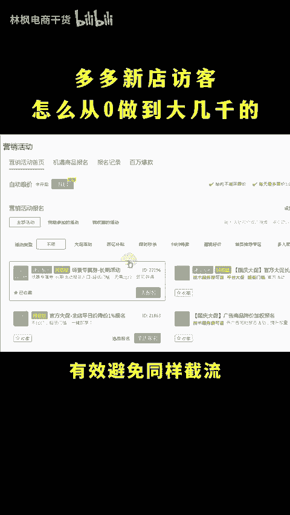
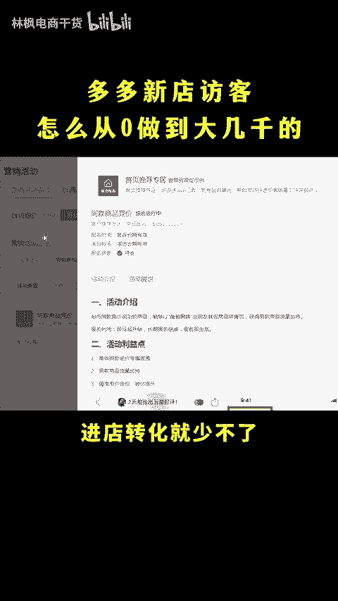
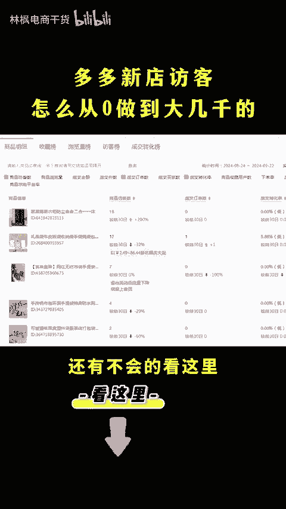

# 拼多多新店访客怎么从0做到大几千的？ - P1 - 林枫电商干货 - BV1XpsYeeEAu

拼多多新店访客怎么从这样做到这样的呢？找到爆款链接一比一复制下来，定价做低，然后开车拉一周，直接低价爆秒杀，访客就能够起飞了。你脑子进水了，你咋知道呢？多多新店访客，怎么从这样做到这样的呢？

只需要做好一件事情啊，就是把详情页底部的精选推荐换成自己店铺的商品，避免跳转到同行店铺跳出率降低了，权度提高，流量就能起飞了，30秒教会你点赞收藏一下，直接上实操。😡。

首先在后台打开商品列表，找到链接，点编辑，进来后下滑找到装修商详，在最底下加一张这样的图片，然后再添加5个一行两页的商品组件，并且呢都收置成自己的商品就可以了。这样不管买家怎么点。

都是跳转到我们自己的店铺，有效避免同行截流。记着在营销活动中啊搜索22029，不但会把你的商品展示在同款商详上方，还会获得平台首页的千万曝光啊，只要把你的主图做的高端一点，进店转化就少不了。有了访客后。

再去商品数据中啊，查看你的商品访客数据，有访客进来，也就10个访客补一单，20个访客补两单，控制转化率在10%，持续做一周保持转化在同行均值以上，流量订单呢就会爆发，还有不会的看这里。😊。

