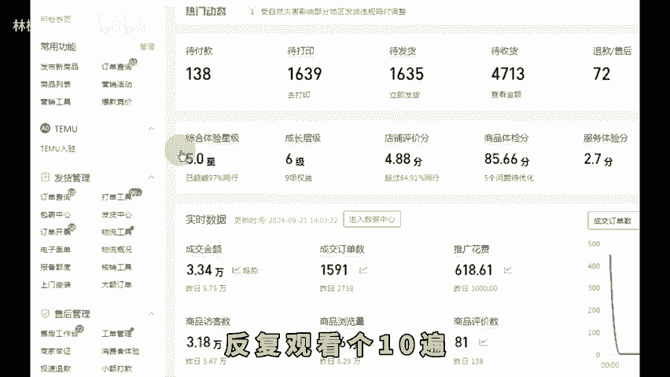
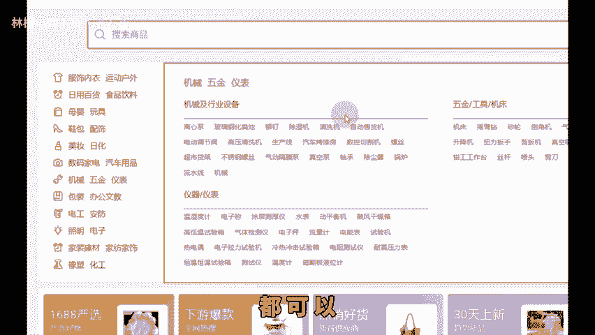
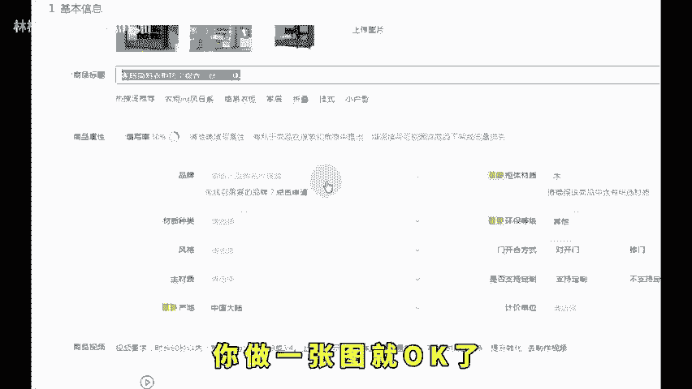
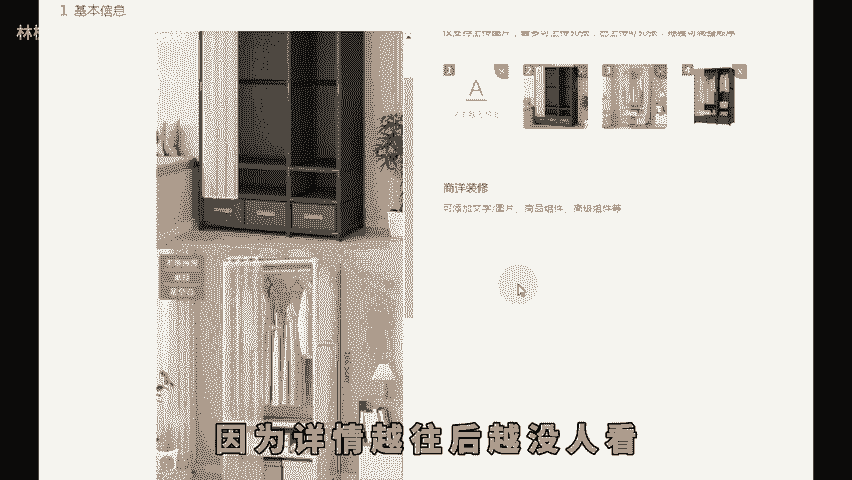
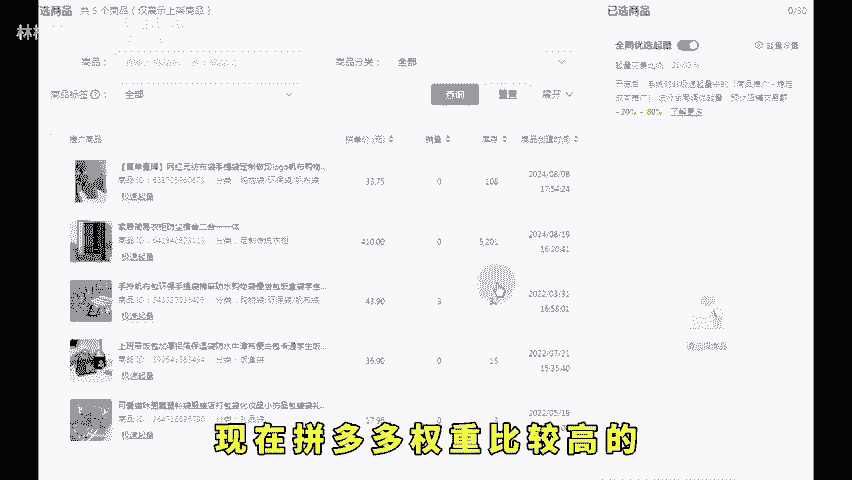
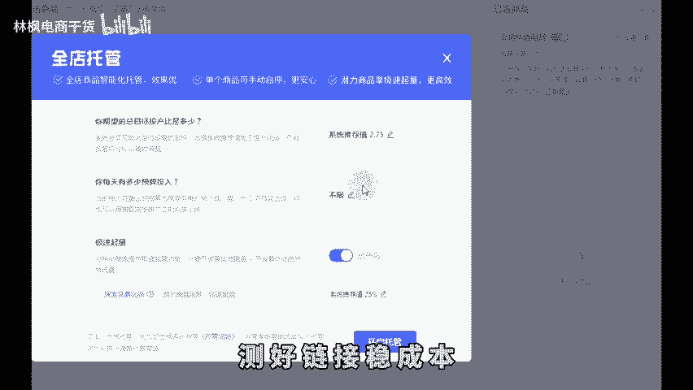
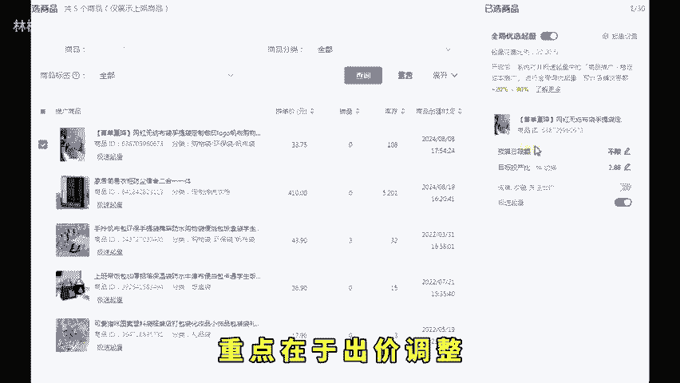

# 拼多多新手从0开店到日销百单运营起款全流程！ - P1 - 林枫电商干货 - BV1NDtzenESA

🎼现在想开拼多多店铺，不知道如何下手的就点赞收藏这个视频，反复观看的十0遍，那你基本就不会再迷茫。首先第一步先把店铺开起来，打开浏览器搜索拼多多商家后台，点击0元入住，然后跟着操作填写资料就可以。

那个人就做个人店铺，公司就做旗舰店，有商标的就做专营店，别听那些大师讲的什么旗舰店，有服饰啊，你是什么身份就做什么店铺。其次呢，不需要去装修店铺，这也不是线下店，你装的再好看没有用。第二个。

确定卖什么产品，不要一上来就做服饰鞋包，像这种类目大的，根本干不过，你要学会去看市场数据，再去筛选产品，新手要搞呢，就搞一些竞争小的产品。第三步，货源怎么找。如果你自己有工厂，有货源，有好的产品。

那么恭喜你你卡赢了，实在没有的呢。1688去找一件代发。这里基本已经涵盖了整个电商的代发货源，或者是你有其他的一些代发网站都可以，想找靠谱的就选发货地址，是产品产地的那些。第四步计划，产品怎么去卖。

最简单的方式啊，就是去看同行人家的定价是多少，包装品质怎么样，是。

🎼买一发二有没有赠品，要么你做的非常好，要么你就打出差异化。第五步，确定好了就上架产品。首先确认好产品所属类目，放错了，不仅限流还不精准。其次，标题满60个字符，也就是30个字，拼多多。

更多的还是推荐流量。所以关键词跟产品有关联就可以了。主图对标同行销量好的店铺啊，参考他们主图上的元素角度结构信息，网上找个20万的美工，你做一张图就O了。详情页呢把你产品最重要的一些。

想要展示给买家的放到最前面就可以。因为详情越往后越没人看，再者的就是S给 you的设置，还是一样参考同行定价以及低价引流的详细操作呢，想做仿比价可以看一下往期视频有详细操作。

最后这里还有一个非常重要的商品属性。产品是什么材质就填什么材质，每品牌千万不要去瞎填填错了官方抽检发到你怀疑人生这个东西呢我已经替你们体验过了，不建议尝试。第六步，提高产品转化率，改销量已经是最基本的。

这个基本不用讲了。做评价那更不用说了。这个你们自己去操作就可以了。不会的去网上找教程多的是。

🎼最难的其实就是第七步了。推广。这里说的推广的不是什么朋友圈发发广告，是系统化的产品运作方案。你需要根据市场的反馈来做持续的优化的。现在拼多多权重比较高的基本就是开车了。我一直没说补单哈。

是因为现在补单其实权重也不高。活动呢小的报了没流量，大的呢你也报不上，所以直接放弃这两个选择。开车的话这样开测价测链开托管托管测链成本低，测好链接稳成本，成交出价破零稳。

放量产品开投产定制高价开成交曝光高点击低，主图标题找原因，点击高曝光少，出价过低的问题，曝光低，转化高，出价拉高点击曝光不涨，花费涨，出价赶紧往下降，重点在于出价调整，成本八卖十8，利润时。

用售价除以利润等于1。8，初期按照这个投产去设置出价，然后保本投产除以签收率乘以1。4，比如20%的退货率，签收率就是一减20%等于80%。按这个公式算出来就是1。8除以80%乘以1。4%等于3。15。

🎼优化后开到这个投产赚钱最多，这就是一个完整的运营思路了。售后客服连带销售那些我就不讲了，你们可以把自己的店铺套入到这个流程去检索一下，哪一步有问题就优化哪里，千万不要再瞎去瞎干。还有不懂的左下角。

