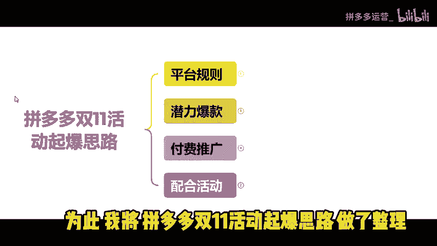
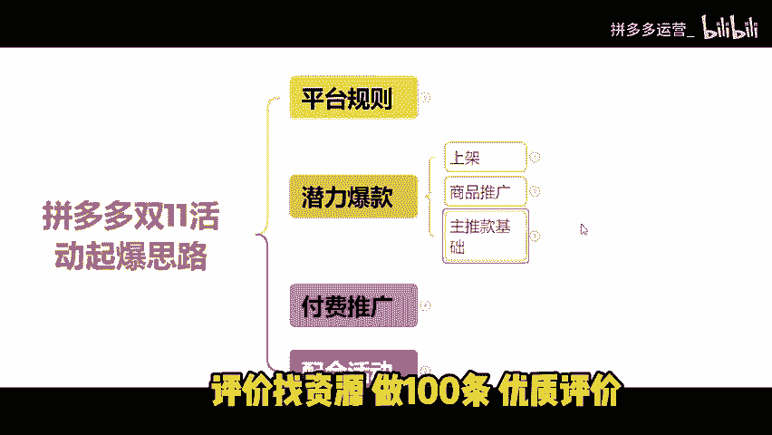
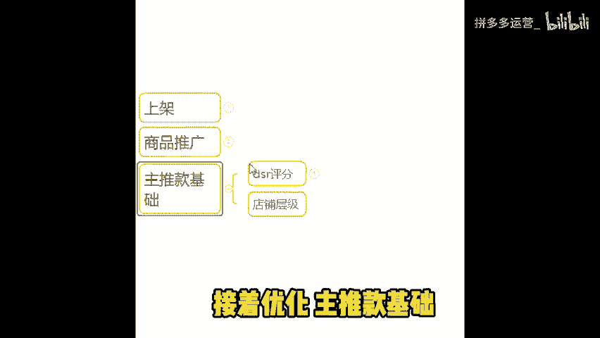
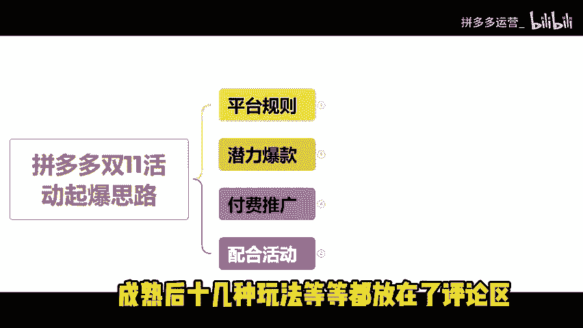

# 拼多多新手商家布局双十一必看-日发千单起店教程-店铺80%都是自然流 - P1 - 拼多多运营_ - BV1Hbm5YTE9c

还有不到一个月就要到双十一大促了。很多做拼多多的卖家都是新手小白。开店后往往不知道从何下手。有些花了很多时间和精力演示了各种方法。店铺还是做不起来。😡。

其实都是因为大家对拼多多的平台规则和运营模式不清楚。为此，我将拼多多双十一活动起报思路做了整理。

清测有效，这店铺是我9月下旬注册的。😡，昨天还只是日发300单的状态。今天就已经能做到日发签单访客破万的水平了。正是因为我掌握了这套。😡。

拼多多双十一活动起爆思路。希望可以让大家在双十一活动中弯道超车。如果你看完分享还是不太懂的话。😡，我也整理好了所有类目的拼多多运营实操文档。😡，大家可以去下方评论区领取。一平台规则，一客服规则。

客服直接影响转化。不管是售前还是售后服务。都要做好3分钟回复率，提升转化率和复购率。2、发货规则最好是在24小时内完成发货。发完货后要及时跟进物流轨迹。不然可能会被判定虚假发货。

3、店铺评分指标主要包含消费者服务体验评分。DS2评分退款率、物流服务异常率等等。如果店铺消费者服务评分很低。低于同行平均水平，可能会导致店铺降权。店铺的流量受限，进一步影响店铺订单。2、潜力爆款打造。

上架产品链接上架10到12条链接。非标品、服饰箱包、蓝牙耳机等。建议遵守多上链接，风格统一，价格段统一原则。标品、食品美妆百货等，建议多链接布局。我们的商品可以一样。但是一定要保证产品链接标题不一样。

主图不一样，SK5规格不一样，价格都要不一样。😡，上架完后什么都不用做。😡，接着把这些链接全放到商品推广里面。选择稳定成本推广进行测试，开3到5天车观察数据。看看哪个链接在车里面能够跑出来成交订单。

只有平台认可我们这个产品链接才会被曝光。接着才会有流量，有成交订单。这样是为了我们前期的产品基础销量。😡，评价不白做，不会浪费我们的时间精力和资源。将潜力爆款链接针对性操作。这样起电成功率就会大很多。

当我们找到潜力爆款链接后。在做基础销量，评价，销量做1万。不会改销量的小伙伴可以在评论区找我。😡，评价找资源做100条优质评价。

接着优化主推款基础。

EDS2评分店铺评价分30天内达到50条有效评价。有优质鱼塘资源的，直接找资源。也可以直接去多多进宝找资源。成本大概也就是几百到1000部等。店铺DSR评分显示出来。二、店铺层级新店铺。

你在第一层级不容易出单。拍大单突破层级，把层级提升到3到4层级。这样我们的店铺就有了基础权重。这里记住，没有DSR评分的你光有店铺层级是没用的。提升层级要把链接流量天花板提高。3、付费推广。

打开商品推广，选择稳定成本推广。出价按系统建议出价开3天。这里要注意询单、收藏、关注都关闭。月限额设置100。保证我们链接的点击率转化率没有问题的前提下。沉淀7天时间，只要你前面的环节都做好了。😡。

最少每天可以跑出50单以上的销量。这时，你可以通过观察数据来考虑是否切换投产品模式，扩大你订单流量，在盈利状态下日限额稍很快。能够在每天下午3点之前就烧完日限额。然后达到50单以上时。

我们晚上就不要去开车。😡，当我们达到50单时，下午和晚上靠免费流量。绝对可以出至少50单自然流量。4、配合活动来增加我们的营业额。我给那些刚开店的商家朋友们提醒下。前期你不要去盲目的上活动。

新品在前期没有营业额权重累计的情况。活动是没作用的，在付费推广没有问题的情况下。举报双十一大促上活动。报活动的目的不是让我们做大幅度的货损。大幅度降价上活动就算能够狠出很多蛋。因为价格跨度比较大。

下来之后的话转化会很差。就会接不住流量。所以尽量靠近成本架上活动就行。活动流量是很大的，只有当活动价跨度不大的时候。你去跑量，这样才能盈利。😡，报双十一活动是把店铺整体营业额销量权重都拉上去。

这样我们才能够稳住每天500单的销量。接着我们还要做好售后维护。稳住数据，很多人的活动数据。都是大起大落，我们要知道稳住流量才会赚钱。那如何才能够稳得住流量？😡。

流量下滑最根本的原因就是我们的店铺商品DSR领航员评分或者消费者服务体验分开始落后于同行流量和订单，也会不断下滑。所以我们起量之后一定要每天观察商品DSR领航员评分或者消费者服务体验分。

千万不要让他们下滑，下滑了就要赶紧优化调整。😡，只要这里能够稳得住，流量和订单也就能一直稳定。最后多练剑。多店发展，我们不要只靠这条单报款链接生存。😡，要记得给自己多留条路，不要在一棵树上吊死。😡。

如果这条链接出问题没了。😡，那从头再来又会浪费很多的时间。这是在给同行超越你的机会。当我们一个店铺起来后，要赶紧开下一个店铺。同时运营多家店铺。不断起新链接，不断起新店。

这样才是健康稳定不会中断的坐垫循环。一个链接死了，还有下一个链接。一个店铺挂了，还有下一个接住。那你在拼多多这个平台，我们就能够一直生存下去。好了，今天的分享就到此为止了。😊。

如果你看完分享还不知道怎么操作的。我也可以提供免费的一些运营建议。指导以及店铺诊断。同时，我还整理了拼多多玩法文档。主要有新店快速起电。原价上活动系列玩法，高客单高毛利产品打法。

低客单产品自然流起爆玩法以及店铺成熟后，十几种玩法等等都放在了评论区。

希望对小伙伴们有所帮助。