# 拼多多新手商家必看—20天从0到日发600单，最新顶级防比价玩法！ - P1 - 拼多多运营_ - BV1gysae8Ebu

拼多多顶级运营思路是怎样的？你的拼多多店铺是不是也是没流量，没订单？开直通车开不动，加出价还是开不动。参加活动折扣都低于9折以下。这就是因为你不懂拼多多顶级运营思路。不知道怎么做才能正确起变。😡。

今天就教大家遇到上面的情况，正确破局方法。新手商家如何从零访客零销量？

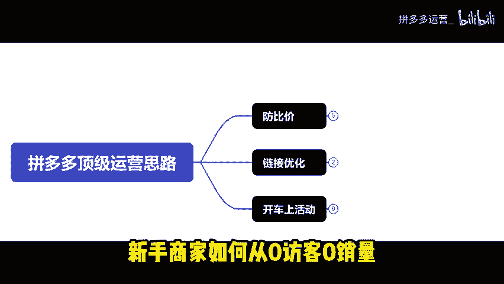

的纯新店突破到日发600单。这店铺是我8月底注册的。到现在已经日发600家访客破万。

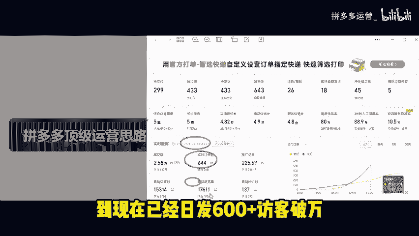

直通车花费才200多。如果你看完分享还是不太懂的话。

我也准备了各个类目的实操文档以及最新的玩法拆解步骤。

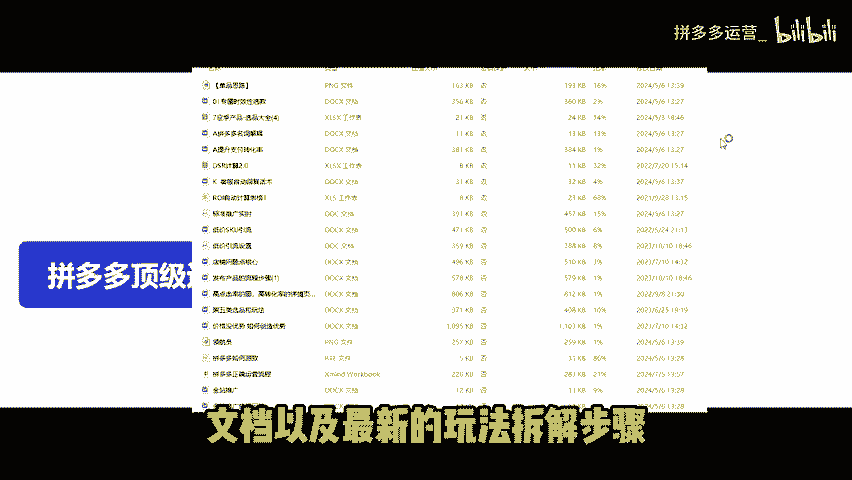

你也可以根据实操文档操作。我们没流量，开车开不动。

活动压价都是因为平台认为你的产品没有竞争力导致的平台是根据什么来判断你产品是否有竞争力的。

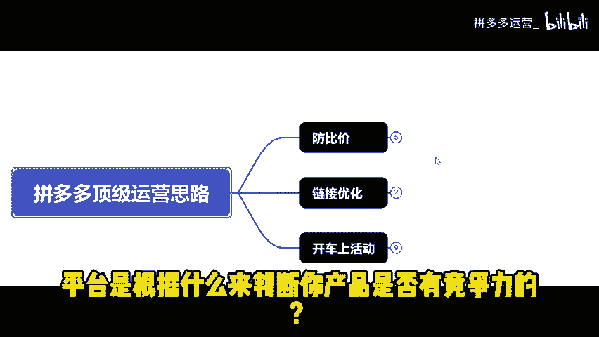

拼多多是根据比价系统来判断是否给你产品分配流量平台根据你产品的SKU图片和SKU形容词来进行全网比较价格比你低的同行。那么你的产品就会被显示为同款高价。

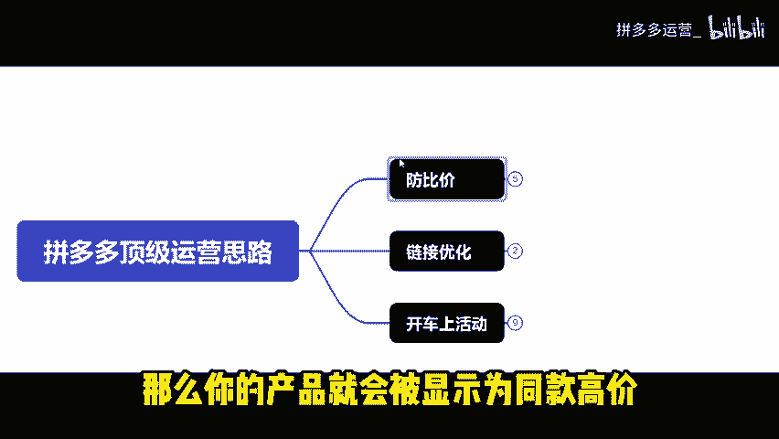

并且很难获取到平台自然流量。第一步给链接去做防比价，做防比价有两种方法。

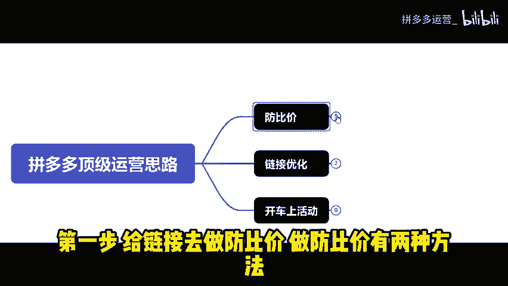

一种是SKU形容词防比价，另一种SKU图片防比价A形容词防比价。大家看这个图。

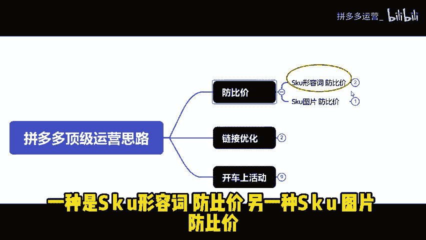

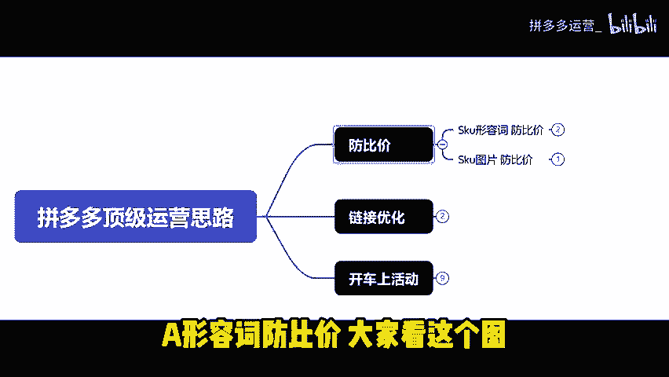

大家的产品SKU里面都会写规格或者尺寸，我们主要是不让系统去比较我们的规格词或者尺寸词，系统比价的规律，大概率是会比括号里面的形容词。我们最常见的SKU布局就是前长后短，或者说前短后长。

它是卖点词加规格词。再加括号，最后加自己编的词。系统大概率就不会比你的规格词。而是去比括号里面的词跟同行比价。那这就能起到防比价的作用。防比加2。0玩法双SKU防比价。

用热销款SKU配合另一个款式搭配着卖，也能起到防比价的作用。

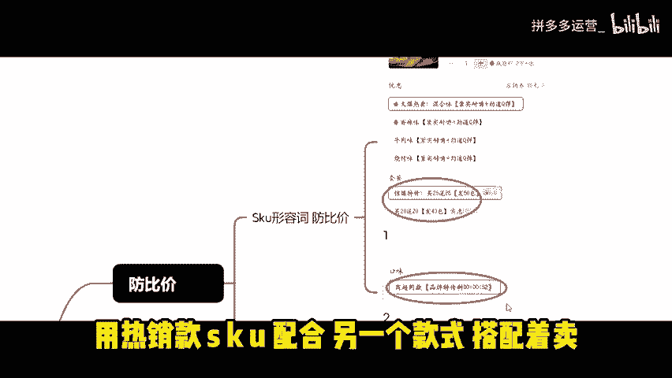

或者倒计时的方法，这个时间是手打上去的。

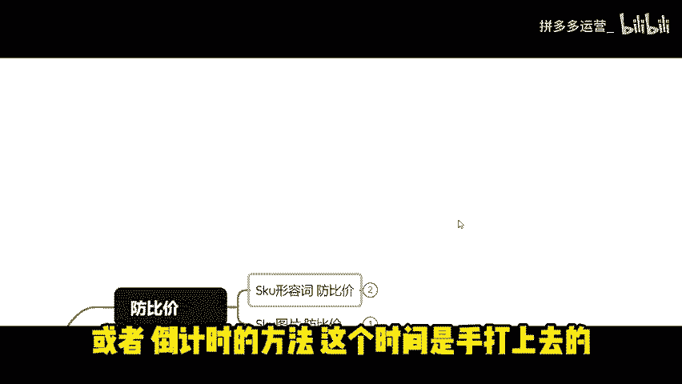

让系统去比价时间，它就识别不到同款。😡，也能起到防比加作用。B图片防比价图中图的玩法。比如你卖的是镜子，在主图中放两面镜子。让系统去识别两面镜子，这样就比不到同款。😡，那就是成功的。

而且这个方法也不违反规则。

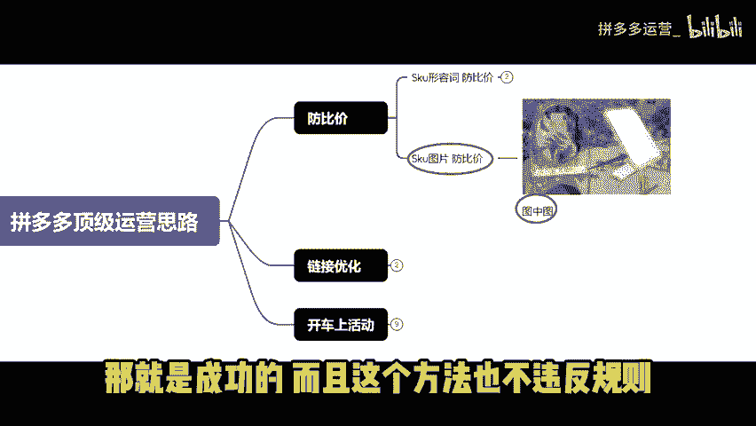

非易收货人的代发商家可以多次尝试。最后，纯文字图防比价也能起到防比价的作用。仿比价做完，我们要去看有没有成功。没有成功的话，就需要继续去修改。😡，怎么看有没有比较成功？

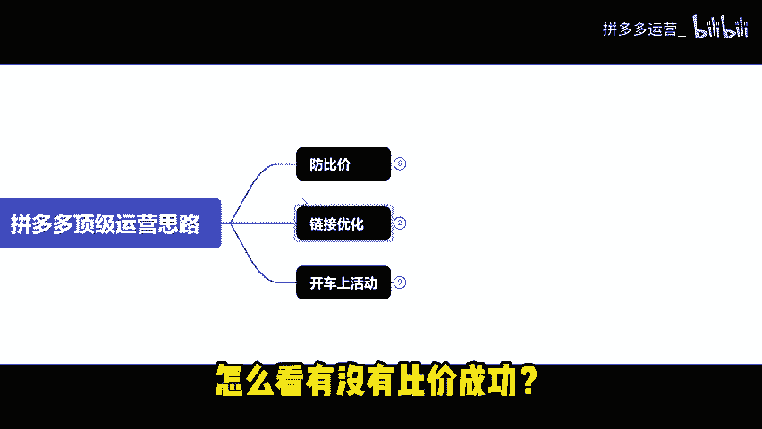

我们去报名活动，如果价格还是低于9折以下的话。

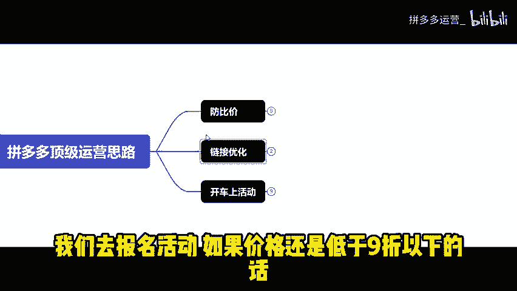

那就是没有成功，反之就是防比价成功。第二步链接，优化产品链接改1到2万基础销量。

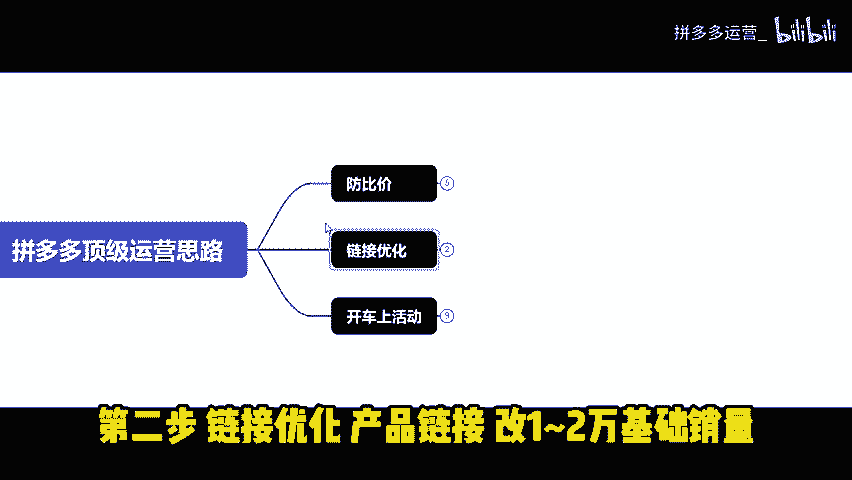

带图评价搭配做50到100条。为了让你的链接有基础数据，有助于提高转化率。

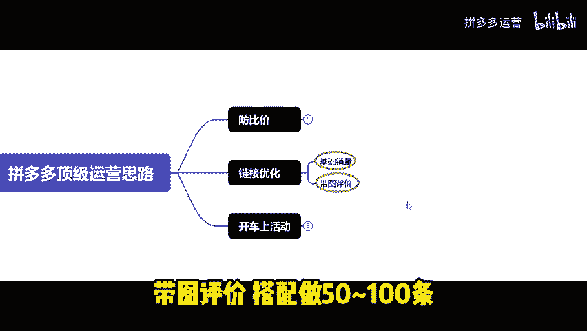

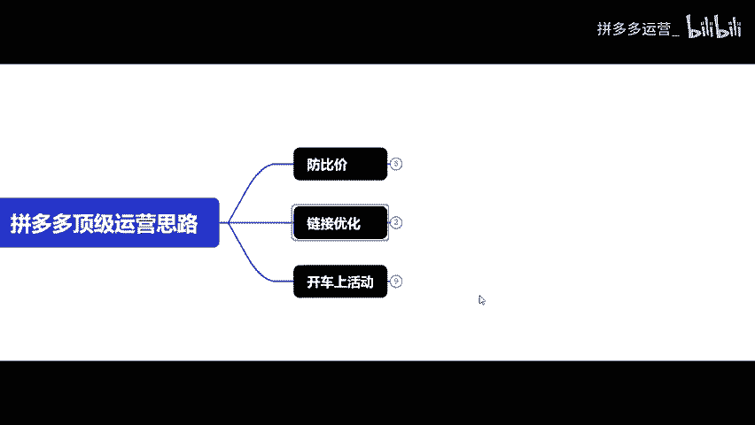

最后开车上活动。一般起流量都是靠直通车配合活动去操作的。那么，直通车应该怎么去开？100克单价以下，建议你按投产比去开车。100克单价以上，建议你用成交出价去开车前期，我们开直通车可以去限限额。

出价可以高一点。高出价是为了让直通车在一阶段跑出数据。很多新手商家朋友。二阶段断流大部分是因为一阶段的曝光不够。或者由于房比价失败造成的。直通车跑出数据后，我们只需要观察两个数据。

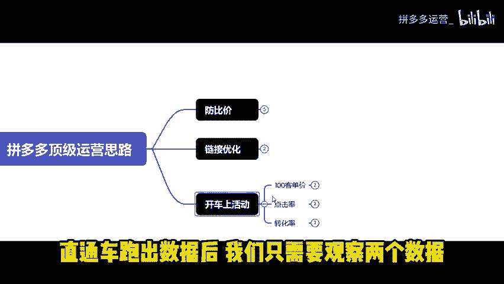

一点几率二转化率。点击率不行的话，就得想办法优化产品图片和低价SKU转化率不行的话，就看看评价详情页。

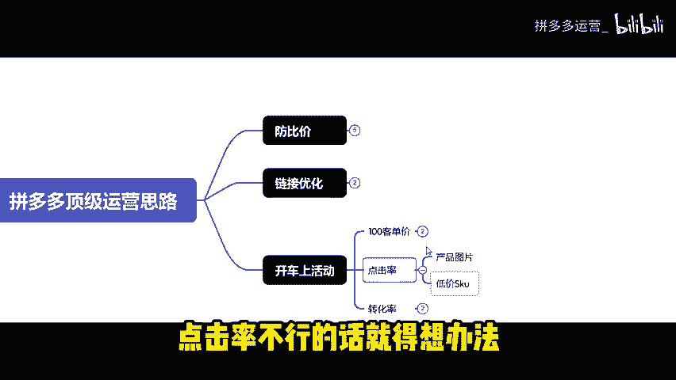

这些做好了没有？😡，也可以适当的去设置优惠券，多参加大促活动。利用直通车坑产拉升产品在活动里面的排名。

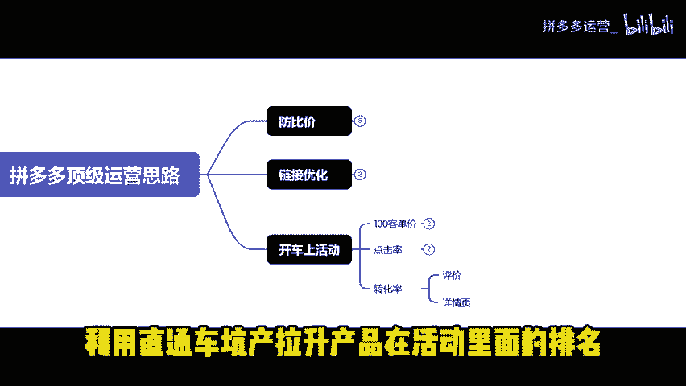

这样曝光才会越来越多，店铺订单流量就会越来越多。渐渐的就能做到日发600单了。现在做拼多多店铺，最重要的就是防比价。大家一定要把防比加做好。最后还有什么不懂的？😡。

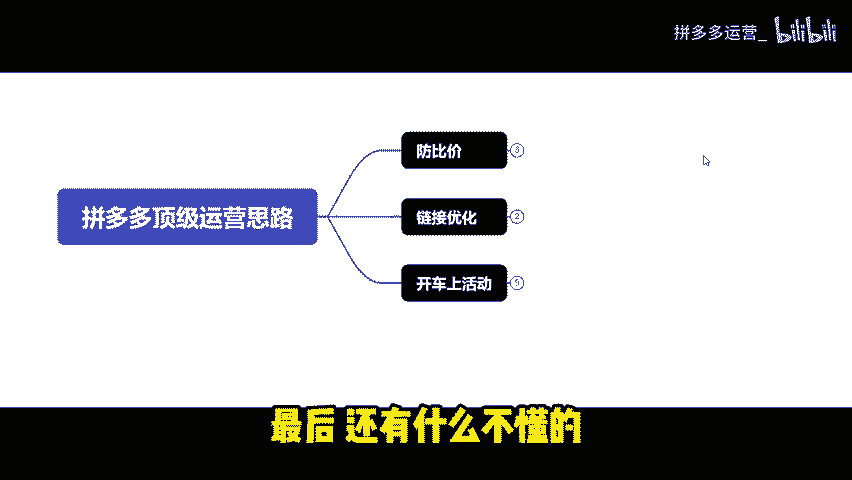

可以去评论区拿实操文档也可以私信提问。