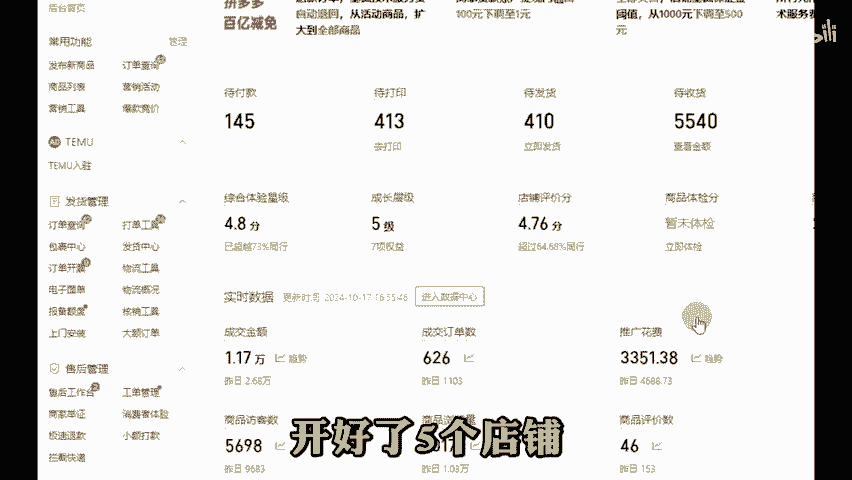
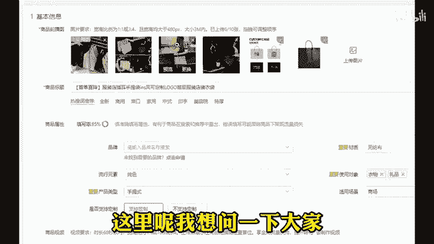
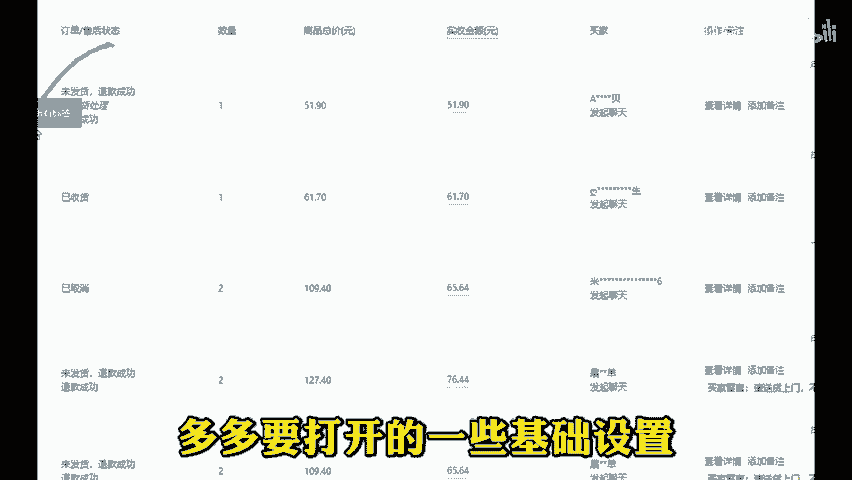
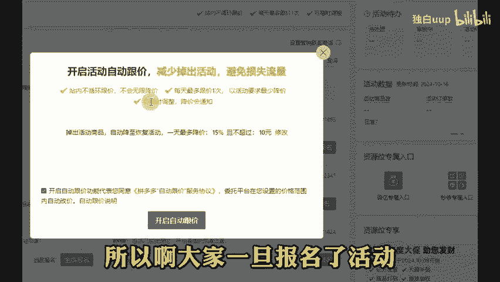
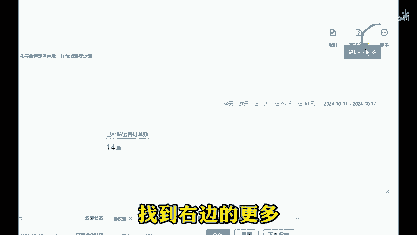
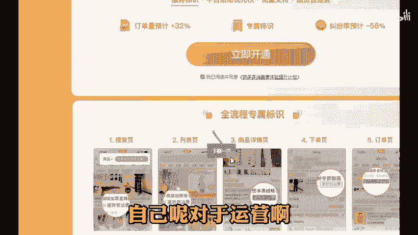

# 拼多多新手如何同时运营五个店铺？ - P1 - 独白uup - BV1TeyPYGEWi

🎼上一期视频我们讲到了怎么一根网线开10个店铺不被关联，以及一个手机啊接收多个验证码的辅助工具。那么前期的准备工作呢，我们已经做完了，接下来就是实操步骤了。好，假如现在我们已经开好了5个店铺。

那这5个店铺如何同时运营起来呢？首先啊要准备好5套商品图片，像主图详情图SQ图啊，这些都要准备好。这里呢千万不要投机取巧，重复使用相同图片，因为一旦有一张图片违规，那么你其他店铺的图片也会跟着违规。

到时候别怪我没提醒你啊，那么上架好之后呢，5个店铺5个不同的玩法，因为我们的图片都不一样，所以说平台啊不会判定这是同一个人开的店铺，就会把每个店铺都单独拉出来展示。这里呢我想问一下大家。

你有没有试过搜索一个商品关键词，下面出现的全部都是自己店铺的情况。那感觉啊真的是唯我独尊，太爽了。不过这些都。

🎼后话了啊，那做完了上面的操作之后呢，店铺就会慢慢的有流量有转化了。这个时候呢我们会面临新的问题。就是遇到一些不讲理的买家申请退款，但是不退货怎么办呢？所以接下来我要讲的就是多多要打开了一些基础设置。

能够给你解决不必一样的麻烦。那么在你遇到仅退款之前，我们只要打开了这个已发货仅退款，退货退款自动转拒收策略，买家呢在申请仅退款的第一时间啊就会被系统拒绝。另外如果说你报名活动之后。

发现自己的成交价格啊越来越低。那有可能是默认开通了自动比价，活动中的商品一旦开通了自动比价，那么平台可不管你利润有多少，它都会在你的活动基础上持有10%的降价空间。所以啊大家一旦报名的活动。

又同时呢参加了自动跟价，一定要去营销活动里面找到这个问号，点击进来关闭自动跟价。最后一个呢就是利润在2块钱以内的小商品啊，一定不要开通这个退货包运费。因为一旦你开通了，一单扣费。😡。

🎼比你利润还高，根本就没钱可赚。想要关闭的话，也可以在消费者体验里面找到右边的更多，点击直接提用消费者体验计划按钮。如果说你刚开店或者开了几个月，店铺。

总是东选选西看看自己呢对于运营啊没有一个完整的思路。后台发期，免费拿一个电商工具以及文档去用，我们下期再见。拜拜。😡。

