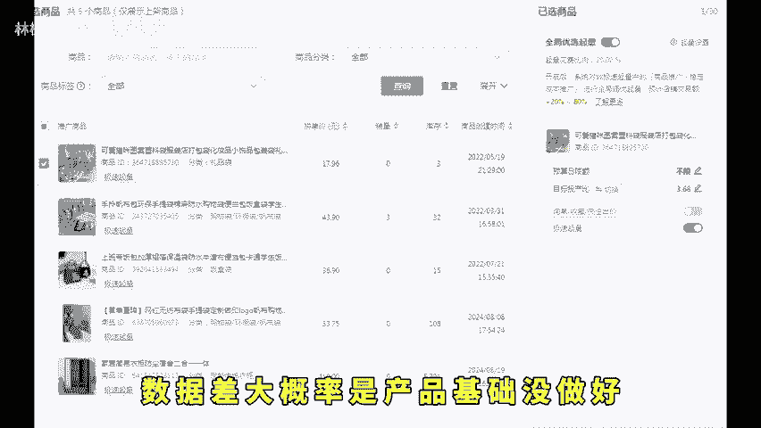
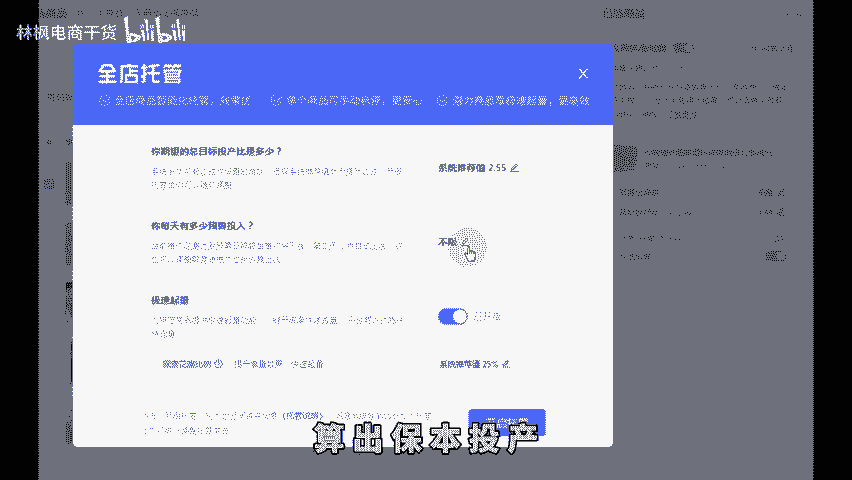

# 拼多多新手开店15天起店日销破千！ - P1 - 林枫电商干货 - BV1hLx5eJE2Y

🎼现在的拼多多已经没有什么技术可言，新手用我这套方法去做石头也能给你卖爆。现在还有很多卖家在用老方法去起链接，上来就是改销量做评价，然后特别着急去开车，这样去做链接根本没作用，开车投产极低。

钱就算烧出去也没得赚。今天分享一下当下最适合的新品的打造方法。点赞收藏起来，双十一前想起新店的一样，可以看这条视频来照做。首先第一部产品上架，不要上太多，一般有10到15个产品就行了。

前期产品比较多的话，可以每天上2到3款，持续上新会有流量推送。在观察数据2到3天，看哪个产品有自然流量就做哪个第二步做产品优化，提高产品点击和转化率的操作，包括图片。

销量评价SKU布局详情页等做多多都知道图片是影响点击率的重要因素之一，可以看爆款产品是怎么做的，然后跟着模仿就是了基础销量评价的话，做了比没做的，能解决80%的转化问题，那基础销量的话。

前期做500到1000评价做50到100就行。然后SKU布局。🎼就主要做低外路价，吸引点击率，通过限时限量加优惠券的方式突破区间价格倍数设置。第三步就是提升店铺权重了。

这里又分为店铺层级和DSR评分两个部分。首先，店铺层级的话，层级越高，获取流量的天花板也就越高，可以拿自己的小号去拍大单，把层级做到四层级以上就可以了。然后DSR评分的话。

需要90天内有50条有效好评才会显示出来，这也是店铺权重的展现。DSR低于4。5分，流量会下滑。那么第四步就是获取曝光了。前期基础做好的情况下去开直通车展现出来的数据都不会差。

数据差大概率是产品基础没做好新品开直通车可以按照这个流程，创建一个全店托管，进一步进行筛选，出价按保本投产去跑用衣除以毛利率算出保本投产预算200跑3天找出数据最好的做主推，然后去跑商品推广。

因为商品推广的展现位更全面更智能，数据会慢慢累计，商品推广的优化技巧如下，前期没曝光，降低目标投产比有曝光，点击低，优化产品主。

🎼图和低价Skuu有曝光转化低，优化产品营销和定价曝光高，点击转化低，提高目标投产比，投产比还行，想提高曝光就递增日限额，后面稳定之后有条件的可以把活动也打开，这样可以相辅相成，加大你直通车的曝光量。

让你的车子快速跑出数据模型，后面能给你匹配更优质的流量，这样去做，什么产品都应该爆了。还有不会的左下角。

