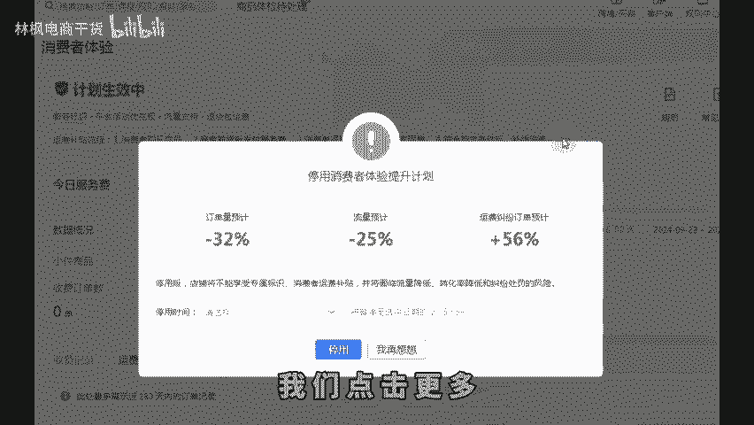
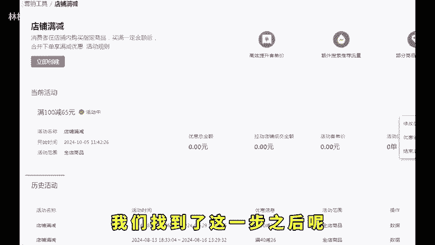
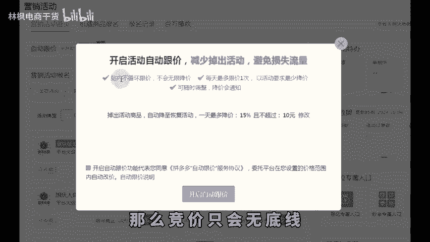
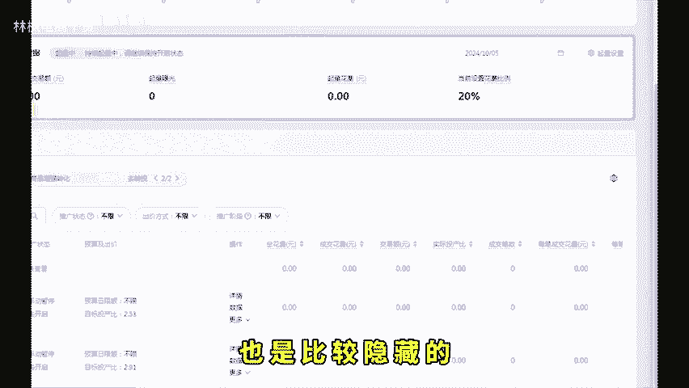
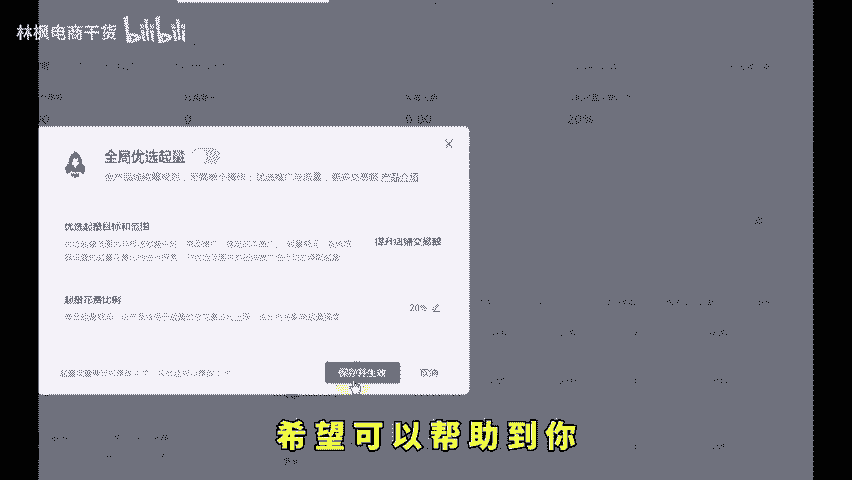

# 拼多多新手开店一个操作让你利润翻倍退款减半！ - P1 - 林枫电商干货 - BV1vY1XYcEfS

🎼拼多多最危险的几个设置一定要关闭。如果说你不关闭的话，你店铺后台钱什么时候没的，你都不知道。接下来这个视频点赞关注，转发给你身边，还不懂的朋友们来看实操，我来告诉你们哪些隐藏的功能是必须要关闭的。

首先第一步找到我们的售后管理，点击消费者体验消费者体验这个地方呢，有一个更多，我们点击更多再点击停用消费者体验计划。如果说你不暂停的话，每一笔都要扣个5到10块钱左右。

建议大家把这个隐藏的功能给它暂停掉，直接停用，点击暂停掉。第二个隐藏的工具，点击店铺营销，然后找到营销工具，在这个地方找到我们的店铺满减，打开店铺满减，它这个关闭的按钮呢，也是非常隐蔽的。

我们找到了这一步之后呢，点击这一个更多操作，然后有一个结束活动，直接下掉就可以了。第三个自动跟价，平台根据同行竞品价格自动比价，并且自动降价。如果你和同行都打开了。那么竞价只会无底线。

到时库衩都给你亏没，想要关闭就去打开营销活动，点击这个问号，自动跟价说明旁边就会出现关闭按钮，直接关闭就可以了。第四个。

🎼退款虽然不能直接关闭，但是创建ERP取消发货自动退和已发货仅退款。退货退款自动转拒收退款这两个策略可以减少90%的仅退款。再创建一个小金额自动退的策略，只要订单金额超过你设置的预期。

那么平台就不能介入自动同意退款了。需要申诉订单也就少了。就算被退款的订单，也可以通过订单申诉的售后申诉进行申诉追回，不会操作的这边整理了文档。第五个就是我们商品推广里面的全局优选起量和极速起量。

如果说你是新手商家，你不知道的情况下，系统它就会默认把你的全局优选起量打开。那么我们刚开始的时候不建议大家去开这个，那怎么去关闭呢？这个全局优选起量关闭的方法呢，也是比较隐藏的。大家可以看一下。

我们找到稳定成本推广，找到最右边这个地方有一个起量设置，鼠标点击这里点击确定关闭，然后保存并生效就可以关闭了，希望可以帮助到你。

