# 拼多多新手开店不开车不S单一周做到访客5000+！ - P1 - 林枫电商干货 - BV16v2dYJEyk

现在做拼多多店铺根本没有什么技术可言，平台规则更新的频率都已经快赶上了母鸡下单的频率了。而且我发现大部分新手商家起店的操作就是上架之后直接开车直接补单，然后直接去做评价。这三个操作，不仅花销比较大。

而且还不一定会有效果。如果说你学会了这个不用开车，也不用做单，获取流量的方法。那你才算是真正入门的拼多多，今天就花2分钟的时间，按照我要讲的这个操作，7天时间内能让你赶超同一时期的竞争对手。

大家也可以收藏起来反复去观看。如果说你看完这个视频还是不太懂的话，我也准备了各个类目的实操文档以及最新玩法的拆解步骤，留言666，你也可以根据实操文档来操作。首先第一步呢在商家后台里面找到这个商品列表。

在商品列表中找到发布机会商品，然后我们点击消费者正在搜的这个入口。这个是目前免费流量很大，并且知道这个入口的商家还不是很多的一个操作，在页面下方选择跟你商品相关的一个产品类目。

还需这里呢我们选择热度从高到低的商品，然后点击发布同款就可以了。这一步操作呢。😊。

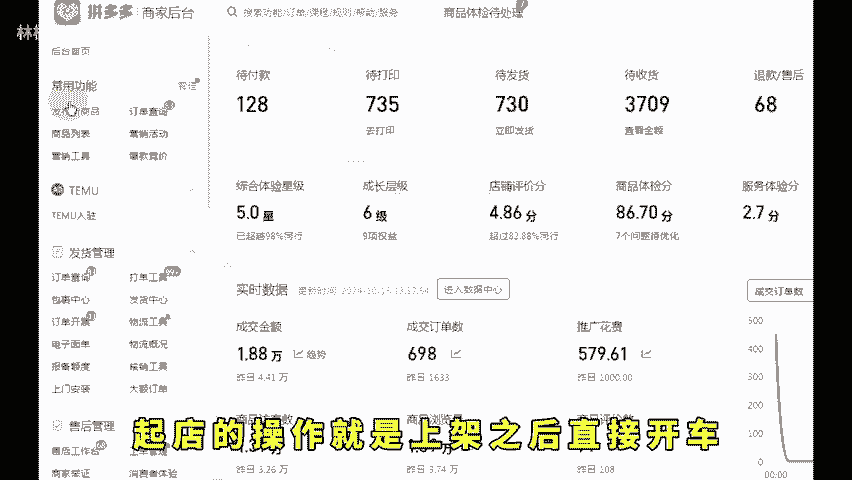

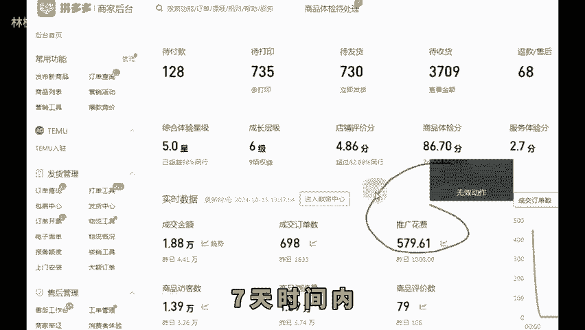

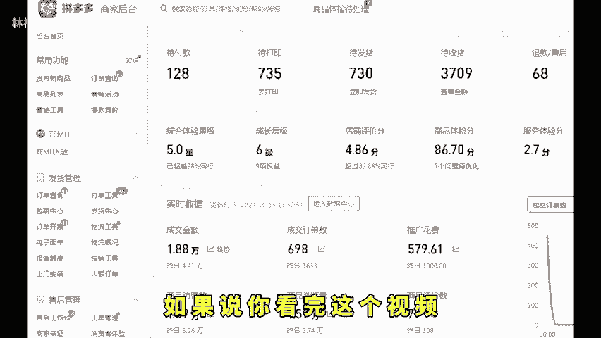

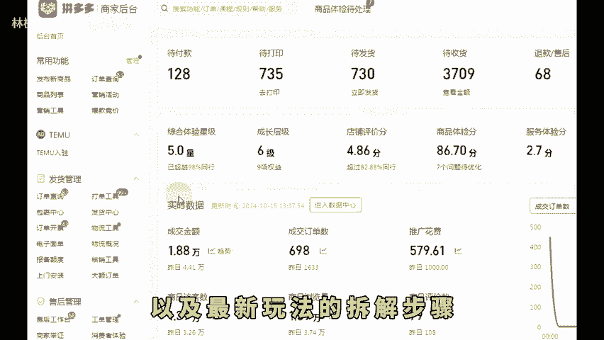

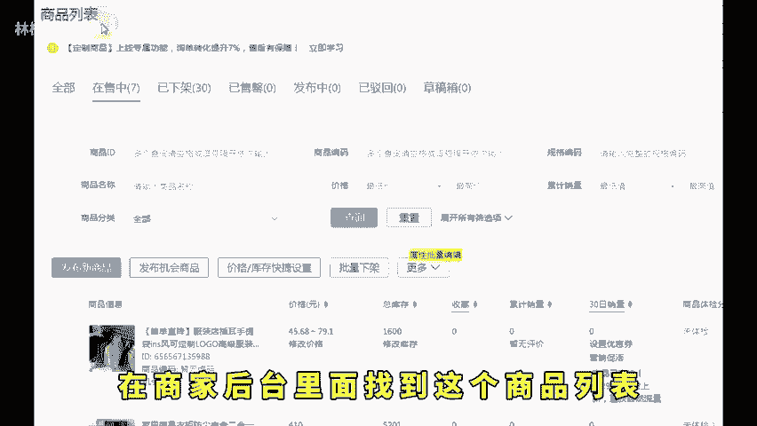

可以让你的链接打上机会商标，从而的获取到流量的加权。这一步，我们这里至少要准备3到5条链接。为什么要这样去做？因为万一出现哪一条链接失误了，限流了，那我们的店铺也不会出现空窗期，那么做完之后呢。

就到了我们的第二步，打开后台的营销工具，找到智能营销，我们看到这个新品破销助力，选择好要操作的产品，然后点击下一步设置立体金额。这里根据平台系统推荐即可。

这一步操作完之后可以获得平台给予的新品流量扶持以及分配给你的首页资源为推荐流量，并且这里面都是真实买家进店成交之后的权重，有多高，我这里就不过多赘述了。到这里可能会有很多新手小白想问。

就是我做完这两步之后，如果我的店铺还是没有非常可观的流量进来怎么办？只要打上这四个标签，你的店铺流量就会爆发。全网低价就去营销活动，搜索22084全网热销搜索22052，多少天低价搜索20303。

只要你打上这个标签啊，就能获得首页千万曝光，还有场景专属券22196，这是官方推出限时优惠的场景专属券，超低门槛，无需低。😊。

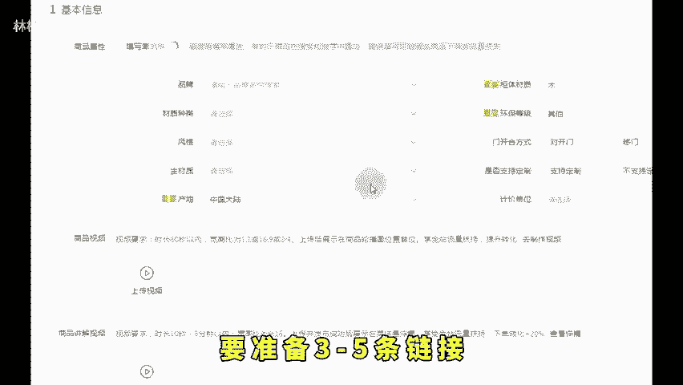

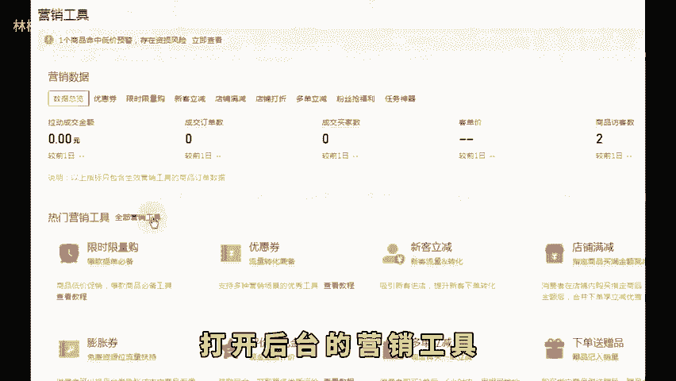

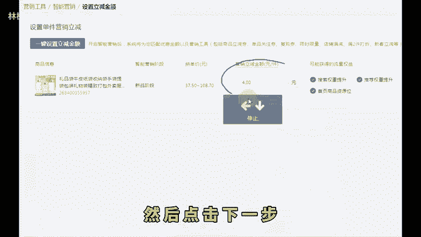

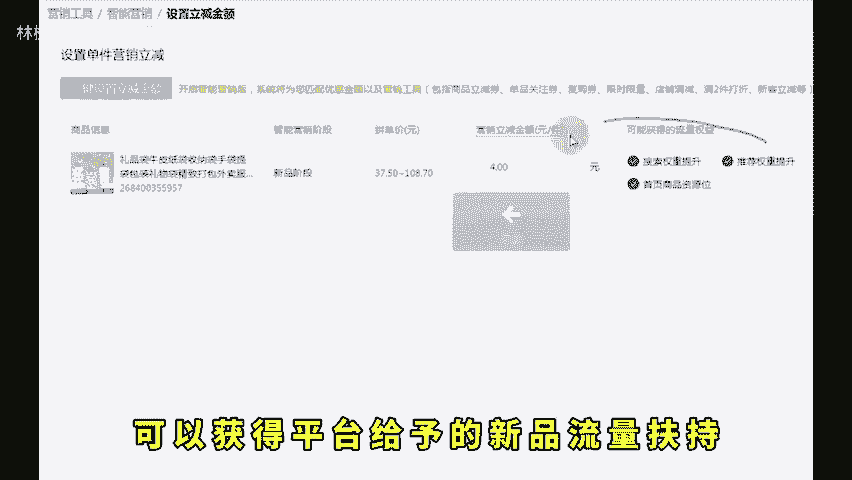

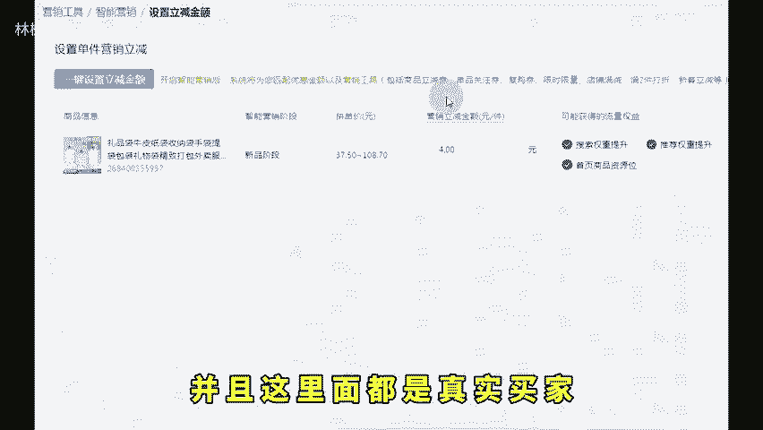

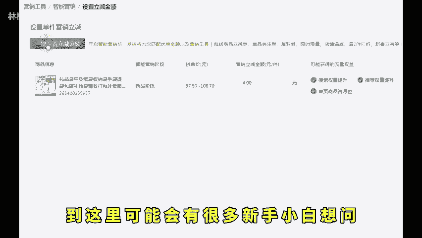

下还会有限时优惠黄条的倒计时，转化率超级加倍，学会的赶紧去操作试一下。最后关注我，学习更多实用的开店经验，咱们下期再见。

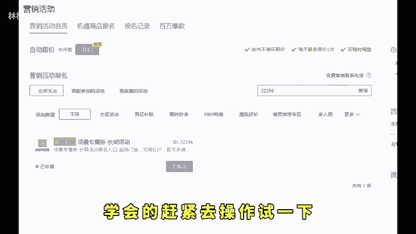