# 拼多多新手开店不补单不开车照做七天就能流量破千！ - P1 - 林枫电商干货 - BV1e9xNeaES1

🎼现在做拼多多，新店铺开车不补单，怎么7天做到自然流量破千啊？今天呢我就给大家去分享一下这个玩法啊。从产品上架到引流出单的全过程。老规矩点赞收藏好，直接开始上实操。首先第一步产品上架。

先打开店铺后台找到商品列表，在这里点击发布机会商品啊，然后选择消费者正在搜并且商品紧缺的一个选项啊，接着你能够看到这个类目里面其他的一些商品啊，你店铺是什么类目。

那这里它就只能够展示你这个类目对应的一个细分产品啊，选择你要上架的产品，然后呢点击发布同款就可以了。第二步，新品入池，新店新品刚上架肯定是没有机会进入到免费流量池的。那么我们就要学会使用营销工具。

快速去打开这个流量的开关，我们打开营销工具，点击全部营销工具，点击智能营销，选择新品破销助力啊，添加好你的产品，按建议设置好立减券，创建成功，就可以获得到搜索权重和推荐权重的一个提升。

以及首页商品的一个小资源位啊，让你的产品能够进入免费流量时，第三步新品快速去突破流量啊，新品入池基本3到5。

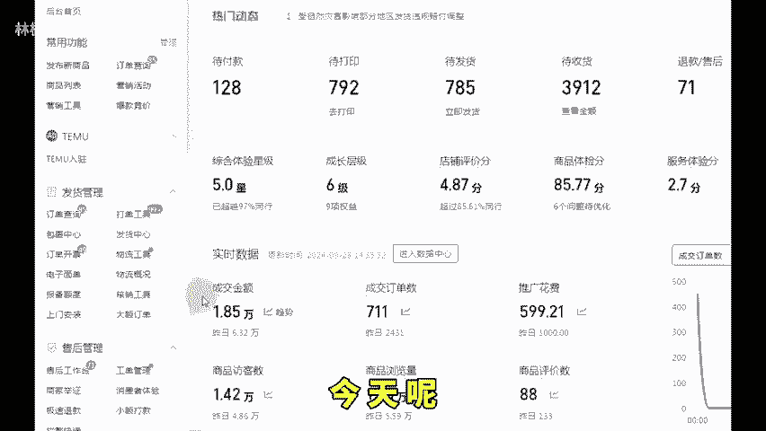

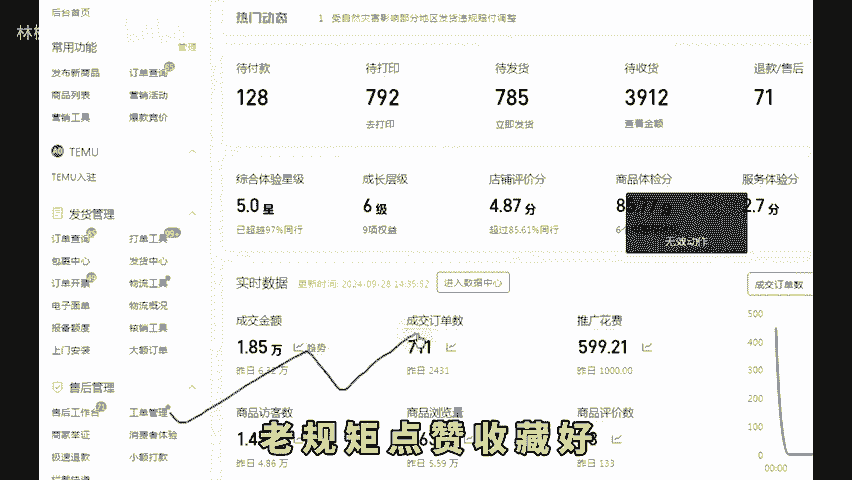

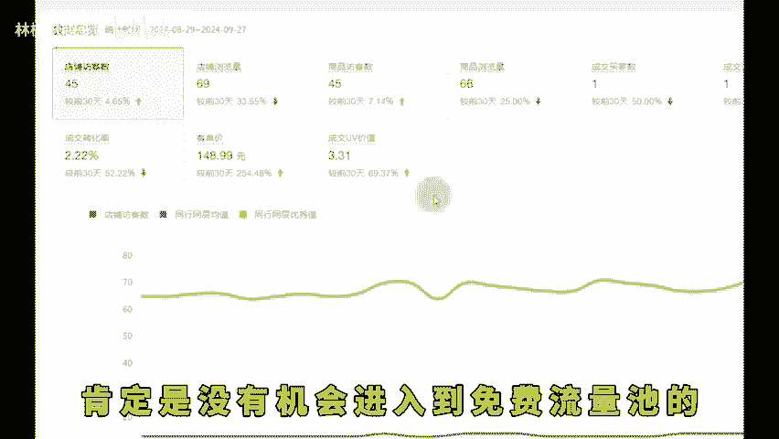

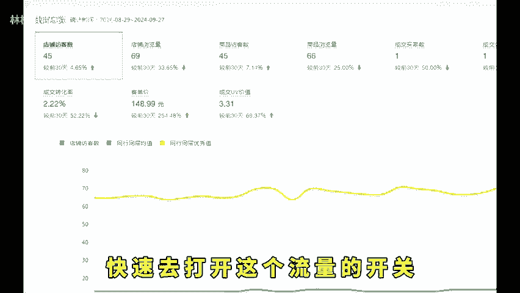

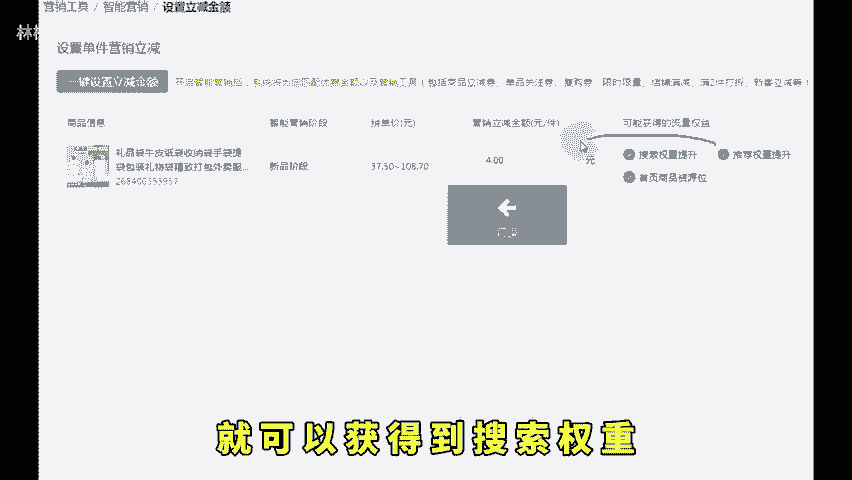

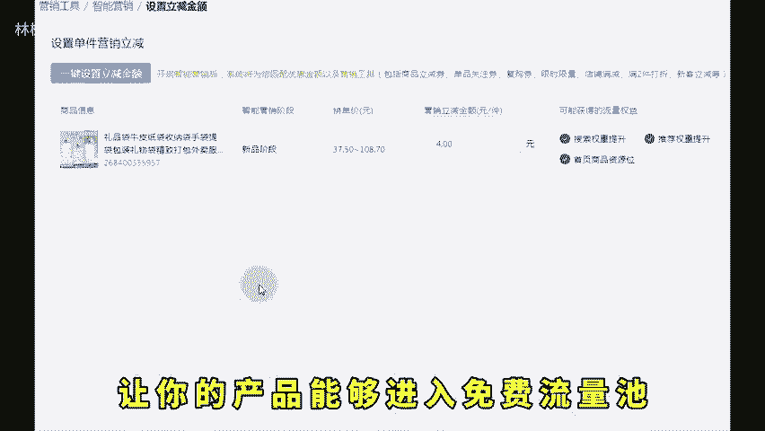

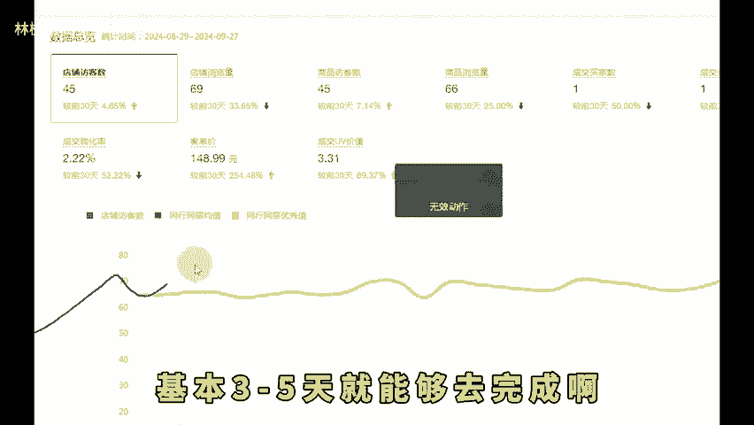

🎼天就能够去完成啊，接下来就可以通过一些新品活动来拿流量了，争取在新品期间之内让产品有更多的曝光和展现。我们打开营销活动，在这里搜索21365，点击立即报名，新品就可以直接去报的。最重要的是。

不计入历史最低价。这个活动呢只会给你跑100单，跑完就会恢复正价啊，然后可以打上这几个流量标签，加快流量爆发。

全网低价标签搜索22084全网热销标签搜索22052首页冲刺活动20303限时优惠22196，这些标签无需低价原价就能打上做完这三步之后呢，只需要你的产品正常啊。有市场随便都能够跑出自然流量。

后续如果大家想加大力度去推，那可以根据自身的一个情况去开直通车冲榜单等等，还有不会操作的左下角。

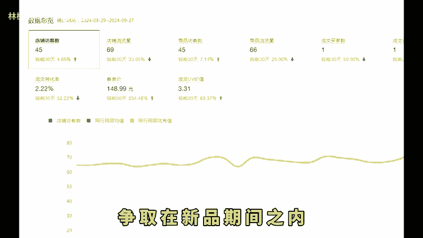

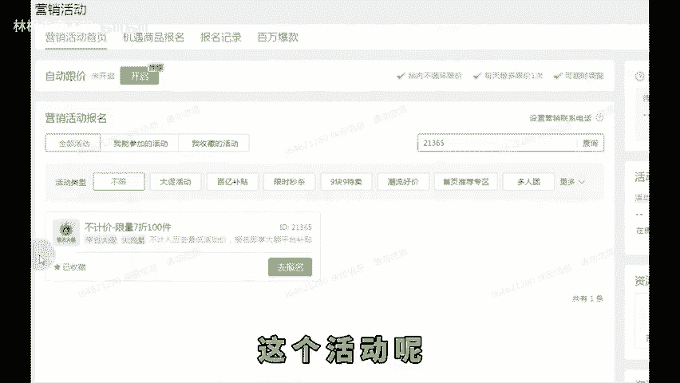

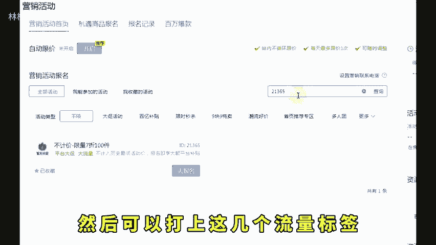

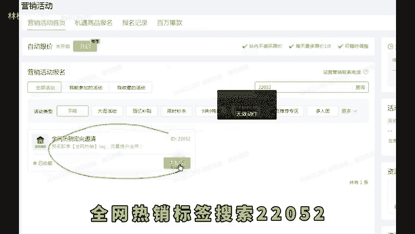

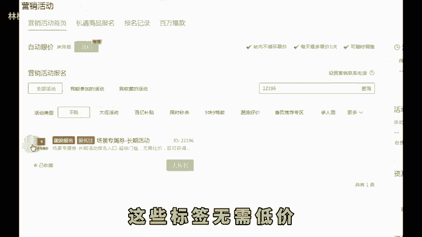

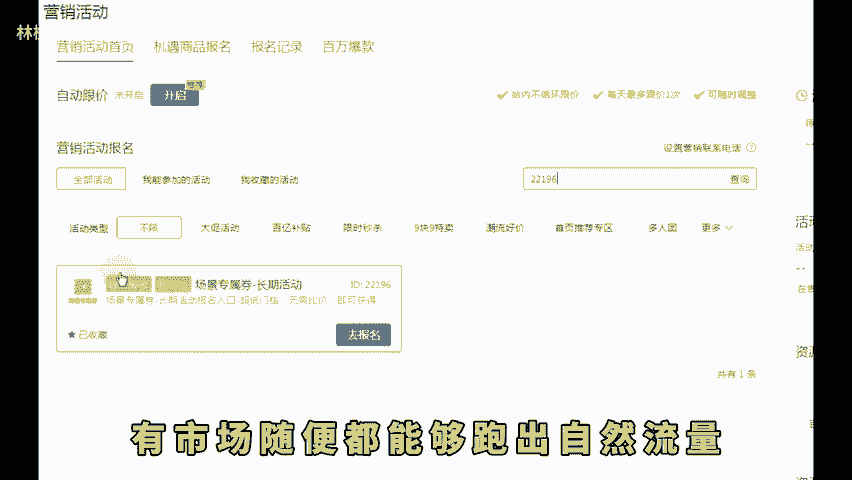

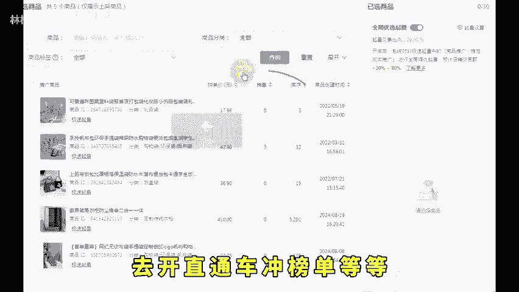