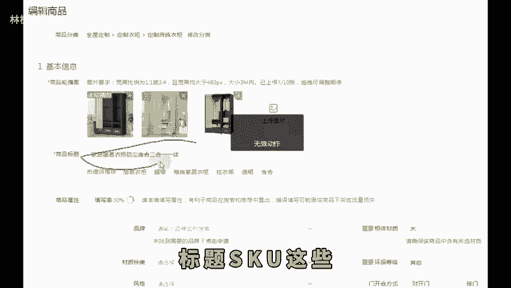
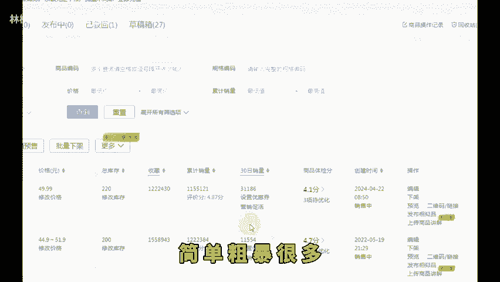
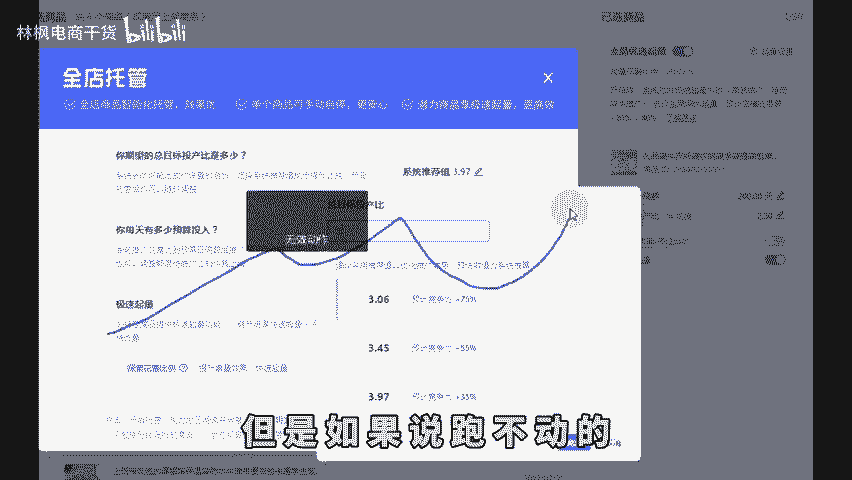

# 拼多多新手开店不要亏钱做了教你一招带利润起店！ - P1 - 林枫电商干货 - BV17jmPYvENC

现在做拼多多的店铺，只要你学会这一个直通车的技巧，可以让你直接在前期就进行盈利。现在真的没必要亏钱去洗一个拼多多的店铺啊。因为你前期亏的越多，后期起量肯定也会更难。很多商家都是一亏，就直接亏到底的。

很少有时候前期亏的很多，后续还赚了很多钱的，所以你们一定要学会前期盈利的一个方法去起店。我教你们一个简单的操作方法就可以实现。特别是新手小白，一定要认真学点个关注点个赞，我来教你们怎么去操作。

首先就是第一步啊，很多新手在刚上链接的时候，他做的链接布局就是不过关的那这种链接布局根本就做不起来，怎么推都不可能会有用的那你们就要学会了怎么去做一个过关的链接呢，我这里有一个非常简单的方法。

就是先去对标同行的链接，那你去搜索一个同行的链接，看他的链接的拼单数。如果显示一天有100单以上的链接，那么你就把他的链接抄下来，就是主图标题Sku这些还是老规矩改一个销量，然后上个几十个评价。

不用很多这种链接是更容易直接做起来出单的，比你自己去瞎搞的链接肯定要快很多。简单。😊。

步报很多。那么链接做完之后，第二步就是去开直通车了，直通车也不用着急的去开全店托管，先把商品推广打开就可以了。限额的200，然后目标投产比刚开始设的低一点。举个例子啊，比如你产品持平的投产比是3。

那你可以设置成2。5的样子，没有这个投产比计算表格的3个6拿走这种低投产才更容易跑得动，先把这200的限额烧完，烧完之后再去打开全店托管，那么这个时候你就可以把全店托管的目标投产比直接进行去翻一倍了。

比如说刚刚你商品推广设置投产比是2。5，那么全店托管直接设置成5就可以了。烧完这200，你再转身全店托管，它就可以直接跑得动。这个时候你五的投产比就可以直接盈利了。因为你保本是3嘛。

所以说全店托管就可以直接盈利。但是这个方法要注意的是，如果你第二天全力推广，它能够跑得动，你就不用怎么去转，就一直开这个计划就可以。但是如果说跑不动的，你必须先暂停全店托管，再去重新做商品推广。

也就是说在烧200的限额，商品推广烧完之后，你再转过去，你就会发现又好了。

直到第二天，全店托管，你还可以一直稳定的去保单量也比较稳定，就不用去管了，能够让他一直盈利，可以去重复这样的操作去做一个链接，操作起来真的非常的简单，学会的赶紧去操作试一下。

最后关注我学习更多实用的开店经验，咱们下期再见。😊。