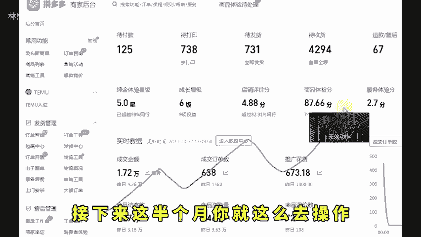
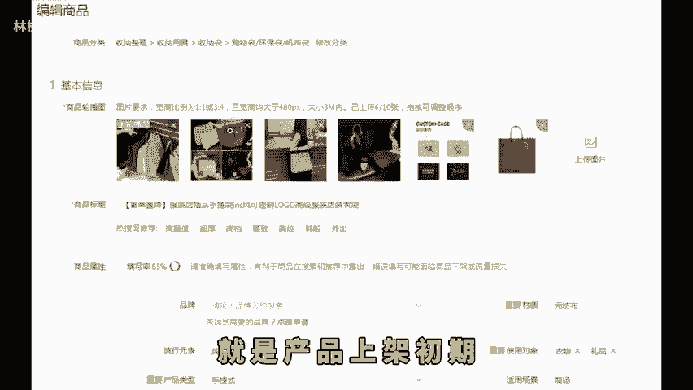
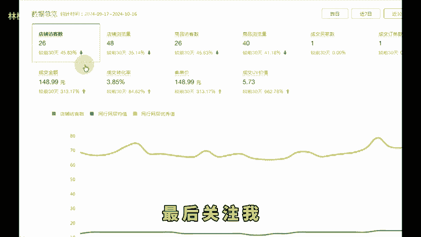

# 拼多多新手开店不要亏钱做了教你一招带利润起店！ - P1 - 林枫电商干货 - BV1XoywYmEaU

现在做拼多多起店，其实说难也不难。大部分新手做店，做不起来的原因就是因为学的东西太散了。运营思路也就是东学学西看看，没有具体的一个操作方法，所以做了几个月店铺还是没有流量，没有订单，其实只要方法正确。

基本上店铺半个月呢就能做起来。今天这个视频给你四个步骤，接下来这半个月你就这么去操作。只要你执行到位，至少让你的流量能翻一翻。首先呢第一步选品，你可以通过后台的一个爆款竞价去选品。

也可以通过店尊的一个蓝海行业找到你的一个二级类目，看见一天的一个销量高，商品数少，需求指数高的一个产品。然后第二步呢就是产品上架初期，一个款直接铺10条链接，不同的卖点，不同的主图，不同的定价。

直接去上架一条链接，做起来的一个概率呢，可能只有10%。但如果说你的店铺有10条这样的一个链接。那你店铺做起来的概率就无限的接近于100%。上架完十0条链接之后，首要任务就是确定我们的一个主推款。

我的建议是直接花点推广费，让平台去给你筛选链接，我们直接把这些链接都放到直通车。

里面去推广哪条链接能够烧出去钱。那这条链接就是我们店铺的一个主推款。现如今都是数据化运营，就是要用数据去确定产品，而不是你说是爆款就是爆款的。第三步呢就是确定好主推款之后，把店铺的1个DSR评分做出来。

在这个期间其他链接呢可以直接舍弃掉，目的呢就是不让其他链接跟你的一个主推款抢流量。那DSR评分怎么快速有效的做出来呢？不用你到处去找资源还担心不靠谱，我们可以直接用官方的工具借力打利。

也就是店铺营销的一个营销活动，有一个新品不计价活动。这个活动如果说你报名还有利润的话，不要犹豫，直接上，如果说是亏钱的，但是亏的不多呢，也可以上。因为现在市面上的资源多烂大街了，你报名这个活动不计价了。

100单不仅是真实订单，还记录有效权重，它不香嘛，对不对？而且呢他还不记录历史最低价的。你后期呢再去报名其他活动，它也是按照你的一个定价去打折。如果说你上了活动还是没有流量，那我们就要再做最后一步了。

就是把我们店铺的层级啊，拍几个大单给它提上来，层级上去。你的坑产排名就会更高。到这一步，如果说还是没有流量，听我的及时止损换链接去操作，选择比努力更重要，学会的赶紧去操作试一下。最后关注我。

学习更多实用的开店经验，咱们下期再见。

