# 拼多多新手开店学会这六个技巧访客蹭蹭涨！ - P1 - 林枫电商干货 - BV1yasheUEbB

🎼现在做拼多多店铺，你一定不能太老实啊，不然你的店铺很难做起来，多多少少的学会几个套路才行。因为呢在拼多多这个平台，只要你的套路玩的好，订单绝对少不了。现在直接给大家分享几种有效的套路。

可以点赞收藏好啊。首先第一个就是我们的那个产品主图，只要你的主图做的好。不管说你的直通车还是自带流量点击去呢都不会差。主图呢，可以做的简单粗暴一点也没有事，我们可以自己加文案就说0。

1堆1人30只每包仅0。1，这种夸张性质的文案，对用户来说是非常有吸引力的。不管怎么样，用户都会点击一下，这样呢就可以提高你的一个点击率，点击率越高，你的访客就会越多的，还可以在商品标题前面打个括号。

写首单直降，首单立减，今日特价超划算，也可以提高你的点击率。第二个呢就是我们的S把你的利润加上文字打一个括号也写上首单直降首单立减活动款仅剩3份。

然后呢其他的S的价格标题虚高一点衬托你的这个S确实是活动价格非常便宜，也就能够提高你的一个链接的转化率。😊。

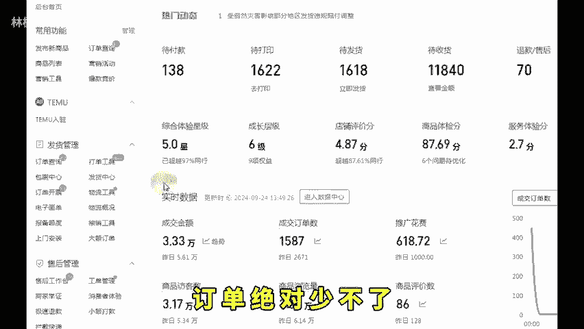

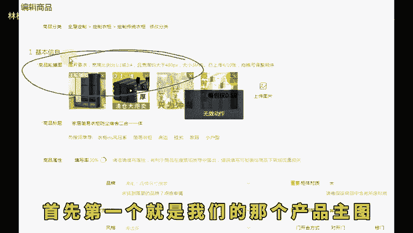

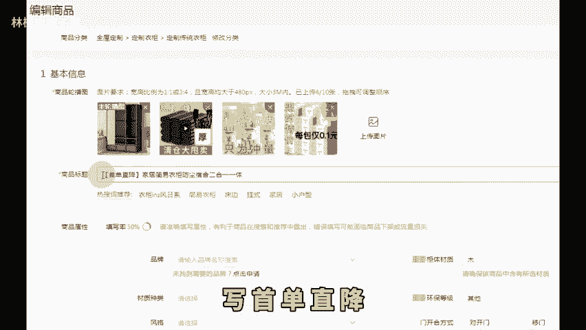

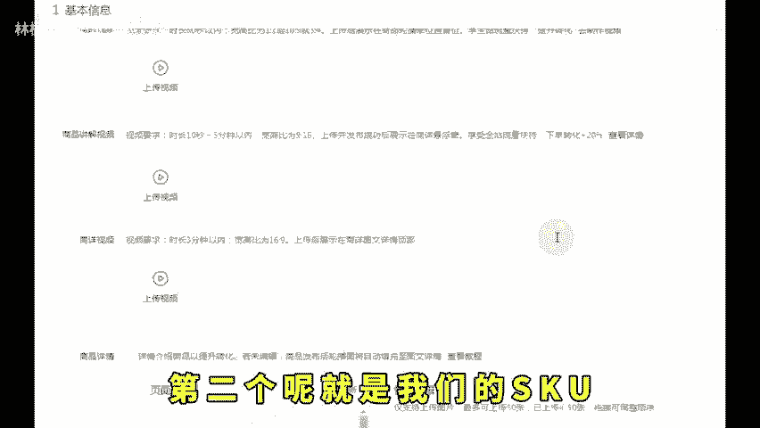

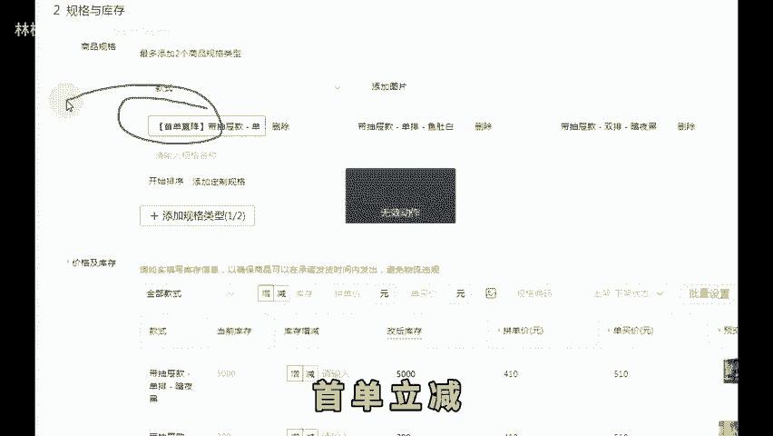

🎼虑好你的订单肯定越高。另外呢就是在定价的时候，不能直接去定你想卖的价格，你一定要先虚高，然后呢用限时限量购或者说新客立减优惠券，你要把它打折成你想要卖的正常价格。

这个呢是为了在投放的时候多一些喜欢用券，还有打折的人群。第三就是改销量，这个呢已经不是什么秘密了。如果说你还不知道怎么改的话呢，你可以找我拿一个文本，有具体的一个操作步骤，你自己呢就可以改。

基本上改个10万家就够了。第四个呢就是我们的评价，改完销量你必须要有评价，不然你卖个1000件2000件，没有一个评价就太假了。所以呢你可以通过批发或者说是多多进宝去做，最少呢要有50个评价。

一般的200左右就够了。第五个呢就做坑产提升权重，产品前期运营可以去补大单，每天补一到两个大单，可以通过搜索或者说果园去找你的产品链接，进行一次拍多件，每天操作1到2单，连续操作一个星期。

你的链接权重就会起来，毕竟拼多多它呢是坑产越高，权重就越高。所以你补大单是非常有帮助的基础权重上去了，还可以帮你。

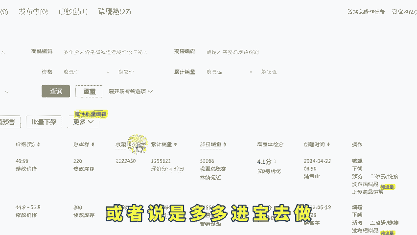

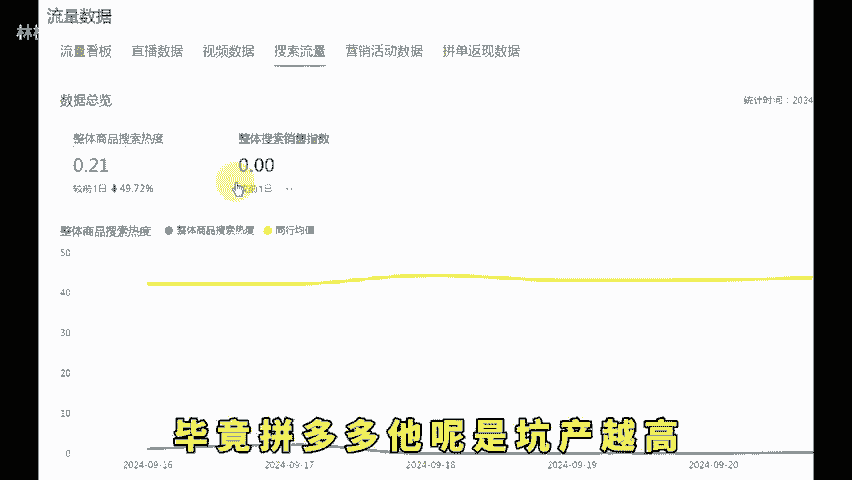

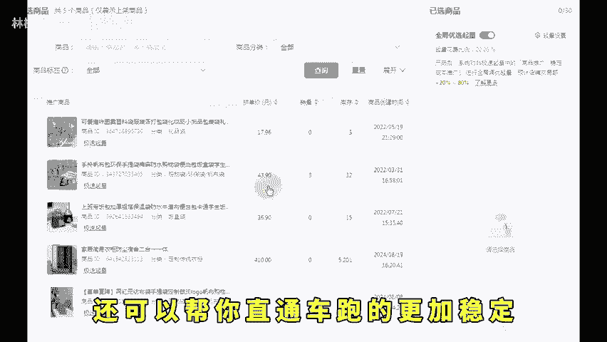

🎼通车跑得更加稳定，也能快速出单，甚至呢还有机会上长销榜，试到一些额外的榜单流量。而且当你的坑产够了，就去做第六个打上官方的这四个增长流量的标签，流量就能能疯长。后台打开营销活动，搜索22084报名。

打上全网低价标。搜索22052报名打上全网热销标。搜索20303报名，打上多少天低价标，这三个标签都是原价就能打上的。搜索22196报名，打上限时优惠闪电标，设置一个立减券就能获得商详黄条的倒计时标签。

产品打上这些活动标签，就能在后期放大付费的阶段能匹配到更多的人群。那你做完这些，你就可以进行我们的数据优化。这样的话，你的产品才能慢慢的走向成功。还有不懂的左下角。

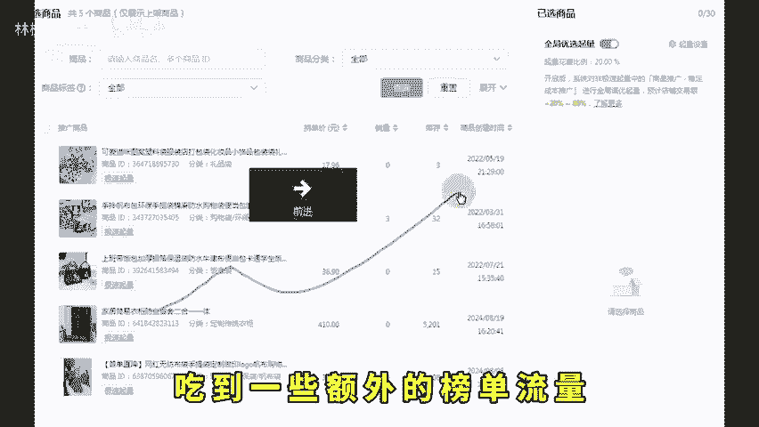

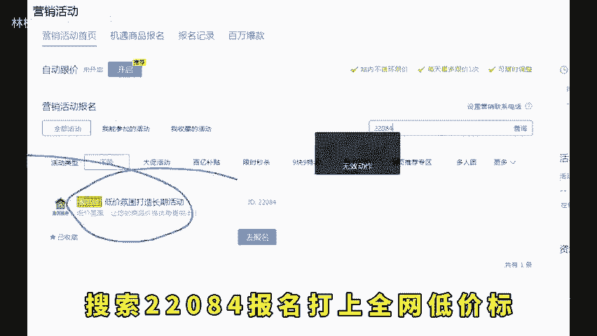

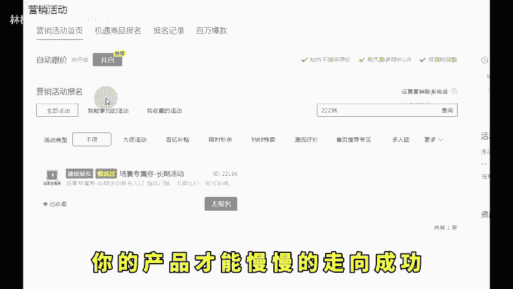