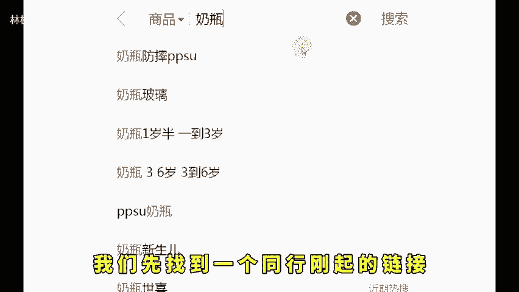
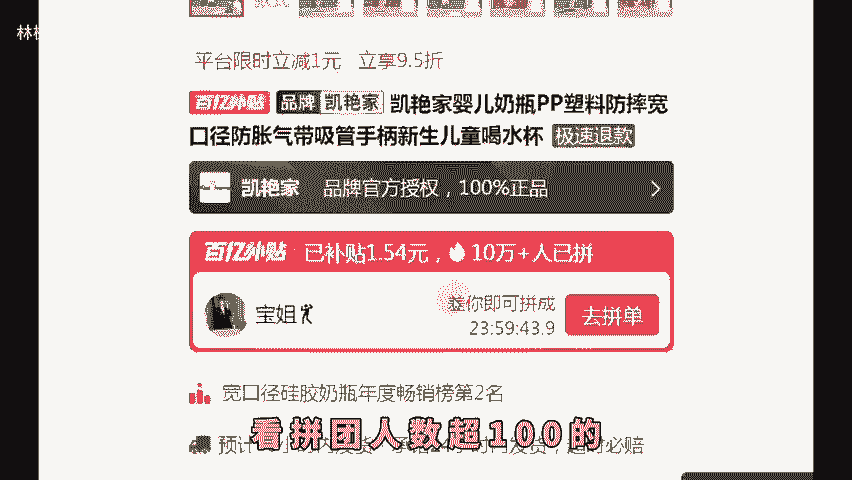
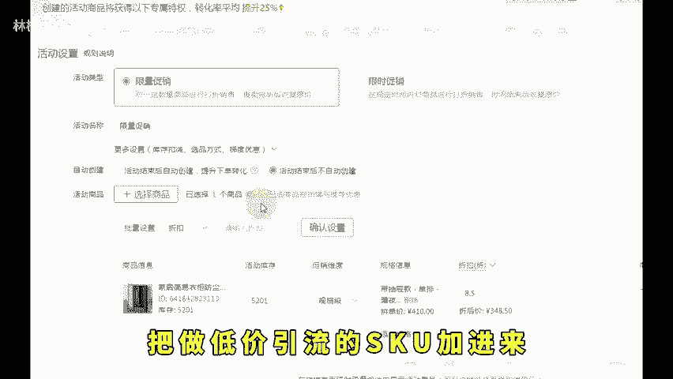
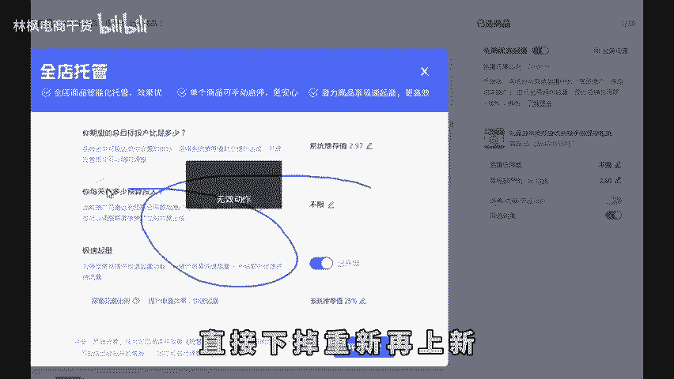
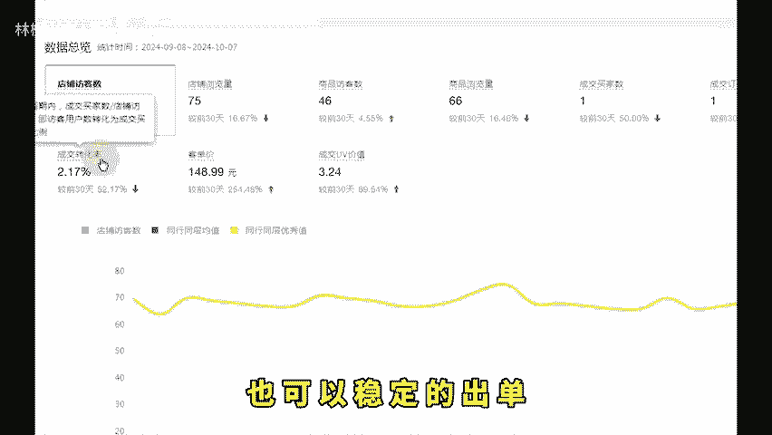

# 拼多多新手开店对标+活动+推广7-15天稳定日销1000！ - P1 - 林枫电商干货 - BV1Gt2nYME4W

拼多多10月想要快速起店，你一定要照着这个流程去做，能让你的一个新店铺新链接，在7到15天的时间快速做到1000单。今天这个视频呢我花3分钟的时间一一的给大家讲解清楚。这个视频一定要点赞关注，多看几遍。

肯定会对你有很大的帮助，我会边讲解边实操，一步一步分享给大家。这个方法呢也是非常简单的，我们先找到一个同行刚起的链接做对标，就是去买家端搜索一个个看看拼团人数超100的评价数量少的。

然后我们再去布局1条链接去对比它就可以了。这十条链接呢，我们都去操作哪些动作呢？第一步，该百万销量。第二步做一个外路价格，就是所谓的低价引流，能替我们的点击率，因为仅一年最核心的一个数据指标是点击率。

哪怕你的转化率低一点没有关系，只要是你的点击率能达到好的均值以上，你就可以爆发流量。链接布局好了之后呢，我们再去拿一个活动的资源位，后台打开营销活动，搜索21365这个活动所有的链接都去报名。

报名成功后再去营销活动，创建一个限时限量购，唯独弄规格级，把做低价引流的。😊。

加进来，然后再配合你的全店托管基本上都能有稳定的曝光。如果说你报了这个活动，它没有曝光量，跑不出来订单，那就说明这个链接不行，直接下掉，重新再上新。这也是我们为什么要去做十条链接呢？

因为今年考核的第一个是点击率，第二个是店铺的动销率。我们这十条链接，打个比方说，每一条链接都能出一单。我们这个店铺的动销率就是100，店铺的动销率越高，你的店铺权重就会越高。

如果说这十条链接最终能稳定5条链接，每天能出个20单30单，那你这个权重是非常高的。你后面再去上十条链接，每天坚持去做上新，你的直通车账户权重，你的全店托管账户权重，它不存在说烧不出去。

然后出高价也烧不出去，就是因为你的店铺没有权重。今年呢不要去做单品大爆款，一定是要用这种裂变活动配车的方法去操作。只有这样的话，你的店铺成功率才会更高，而且以这种思路去铺链接，打款的成本是非常低的。

成功率也是比较高的。你在操作的过程中，它就会有两三个链接会做到300单500单。然后你每天做的一个。

请就是不断的上新，不断的去做裂变就可以了。点击数据指标，把最近7天没有数据，数据不好的链接直接删掉，删掉了之后呢，我们再翻新去上架，以此类推上活动卡投产，改销量，每天这样去做筛选。

你这样去操作7到15天。哪怕你是一个新手小白，哪怕你是一个纯心的店铺，他也可以拿到结果也可以稳定的出单，听懂的抓紧时间去落地实操。如果说你不懂的话，直接问我。

