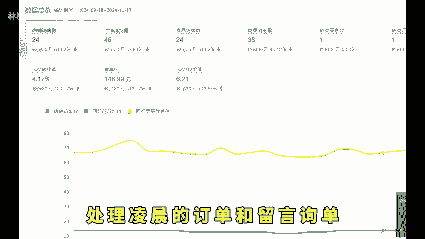
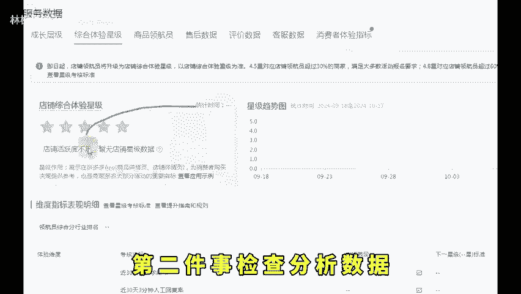
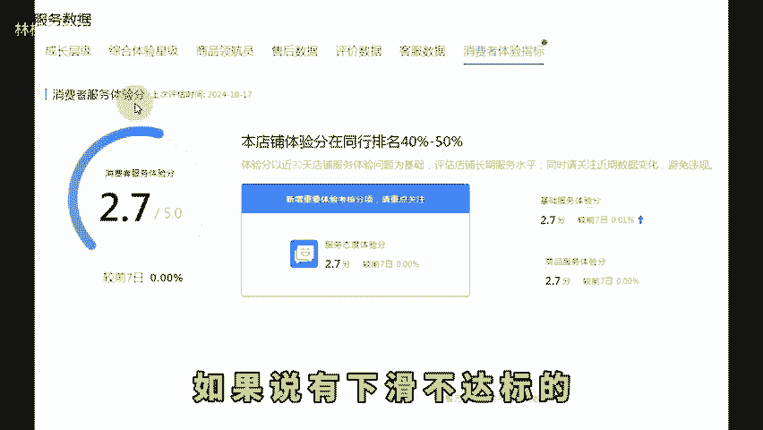
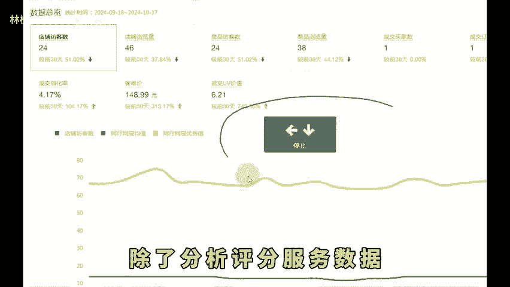

# 拼多多新手开店每天都要做的五件事运营不迷茫！ - P1 - 林枫电商干货 - BV17rC2YCEpJ

拼多多新手商家每天需要做什么，我发现现在很多商家开店了，但是呢不知道每天应该做什么，每天睡醒就看一下有多少单，没单就开个车，也不知道怎么去弄。该上班上班，全职的就是该溜达溜达，该刷抖音，刷抖音。

学习一些够不着的玩法，从来不去优化问题，记录数据，做好产品的规划。如果说你这个情况能够做起来，那就真的是奇怪了。今天我给大家去分析一下我们运营一天是怎么过的。新手小白认真的看完，点个关注，点个赞。

直接上实操。首先第一件事，处理凌晨的订单和留言询单，多关注售后问题和人工回复率。第二件事，检查分析数据，检查我们的领航员商品体验分DSR评分，消费者的服务体验分。如果说有下滑不达标的，去做针对的优化。

让我们下滑的评分回升上来，除了分析评分服务数据，还要去看我们的点击率转化率是不是有较大的波动。如果有请尽快的去分析出来问题，是推广的问题，还是产品的问题，还是比价的问题，要及时去进行优化。第三件是推广。

首先分析推广账户资金是不是正常。😊。

没有欠费，投产比例有没有波动，花费金额有没有波动，有时候数据突然上不去，这个时候也可以考虑适当的降低投产来扩大数据，或者很稳定的是不是要考虑提高我们的投产比，根据实际情况去优化。第四件是，查看营销活动。

根据自己的产品情况决定是否要报名平台的活动。因为新品做活动可以破局付费的一个冷启动，老品销量下滑了，可以通过活动增加标签，扩大咱们的销量。第五件是，所有情况正常的，我们还需要考虑怎么扩大店铺的营业额。

是做裂变还是上新品，根据自己的情况去决定现在裂变比较适合平台的一个动向。所以刚入局电商的商家，今天的分享希望能够帮助到你们，最后关注我学习更多实用的开店经验，咱们下期再见。

