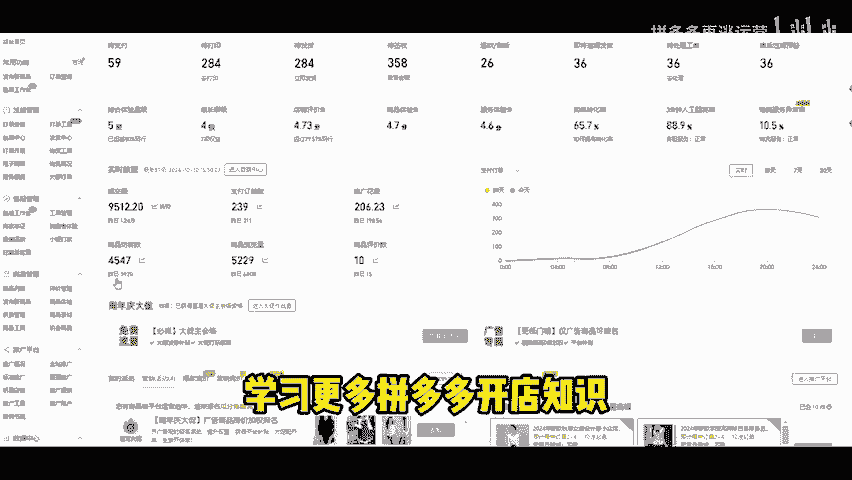

# 拼多多新手开店资源，56个正品可靠的拿货资源，打破你所知道的信息差！ - P1 - 拼多多再逃运营 - BV1QF2mY3Esd

新手在开拼多多网店之前就应该知道了拿货资源。今天就把我整合的56个拿货资源全部分享给大家。我已经把各类拿货资源进行了归类，方便大家知道每个资源主要是做什么产品的。第一个。

综合型批发网1688688是全国最大的B2B批发网站货源可以说是最广的货群价格也是低廉，尤其是阿琪系的背景可靠。第二个包人牛是专门做箱包货源批发的网站，汇聚河北广州数千家网购厂商。

主要是做新款箱包货源热卖包包货源等等。第三个，九一家纺网目前也是全国互联网家纺知名平台，有效聚集和整合行业资源。第四个，娜拉美妆网是全国知名的美妆采购批发网站。

包括面膜以及比睫毛膏美妆工具等美妆日化产品都是正品行货品类丰富，也比较低价。第五个，工帮帮低价正品的工业产品，主营32条产线一500万家的SKU主要覆盖五金工具劳保安防办公清洁等行业产品。第六个。

开商网是专门做女鞋货源批发的网站数千家女鞋生产厂家。😊。

为全国各地的电商卖家批发零售商提供稳定靠谱的女性货源。然后在此之前呢，如果有想开拼多店铺的朋友，或者说是开了店，但是没有一个明确运营思路的新手朋友，我也整理了更多的类目的实操文档。

包括从新手到精通的技巧，玩法模型和更高阶的玩法等等实操案例，你可以结合一起去学习，帮助你在电商的路上少走一点弯路。第7个，西域网专业自营电商提供36条产信，拥有百万SKU任你选择正品行货全网低价。

第8个，世纪星座网是一个专业货源批发网站，主打男女服装服饰类目，线下市场，包括多个电商基地服装类目货源比较多样化。第9个义乌购覆盖全国小商品产业，带有很多优质供应商一手货源、在线商品达500万。

然后第10个汽车人是全国最具有活力的汽车及配件专业网站主营汽车背景等第11个义乌百印网优选710多万家制造业覆盖云材料工业品劳保用品包装印刷化工、橡胶原材料等2000多个品类供应链产品。第12个买个网。

包括静材家居、家电、电器、家纺、家具、手机、电脑等上000个类别的产品。第13个马可波罗网主要是围绕机械工业、生活消费、工业、原料等三大类目的产品。

第14个华强电子网主要是做芯片定子云镜配件提供专业的服务。第15个生意网生意网已入驻七星家童装厂家为海量一手童装货源，一键起批，一键代发，面向全国童装提供云材料供应。好了，更多的拿货资源，我总结了起来。

一共56个，学习更多拼多多开店知识，可以点赞关注一下。

