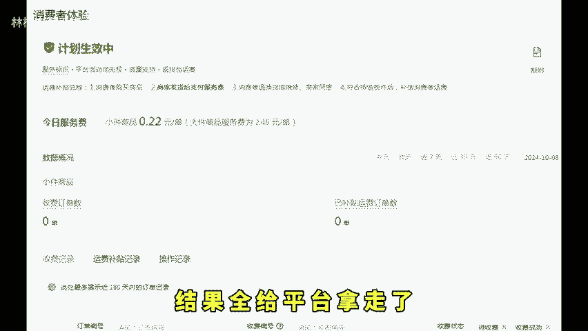
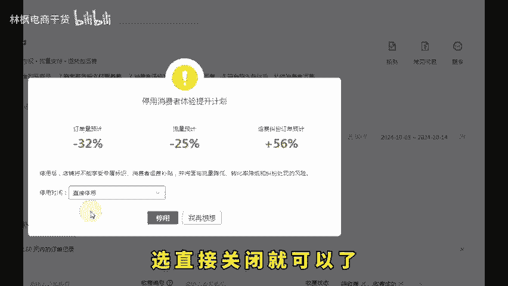
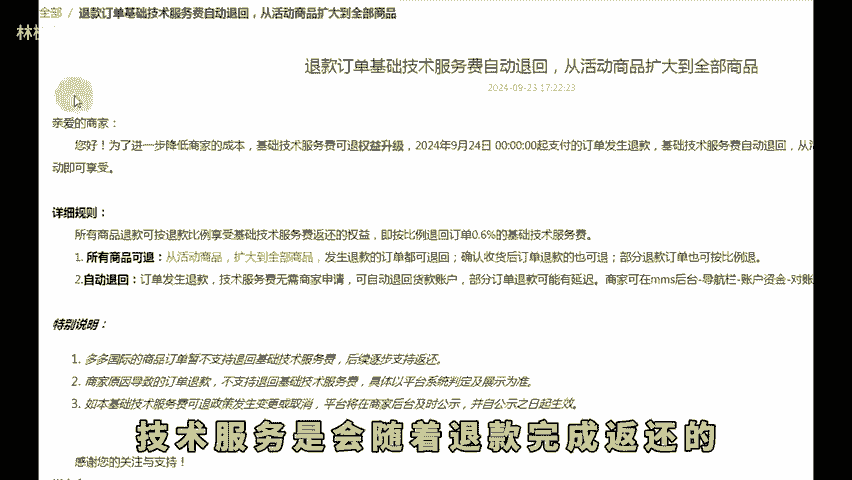

# 拼多多新手开店这七个事情一定要做少走弯路！ - P1 - 林枫电商干货 - BV1qjmLYPEBu

双十一马上来临了拼多多新品想运营好啊，那每天必须要做的就是这7件事情，大家就不要缺斤少量，一定要做到位。我最开始做到的时候就是因为少做了一件，导致我损失了好几千，都是花大价钱得出的经验。

首先第一个就是消费者体验。这个之前呢叫做退货包运费。那么这个设置啊如果说不及时关闭的话，每笔订单扣费都有几毛到几块不等高的有时甚至几十到几百，本来利润就没多少，结果全给平台拿走了，那怎么关闭呢？很简单。

就在售后管理的消费者体验里面，在右边我们找到更多，点击停用消费者体验计划，不用选择时间选直接关闭就可以了。第二个，店铺满减，店铺满减的话，新品需要开启这个设置能够带动全店的商品动销。

创建好指定商品利润较高的，满减额度就设置在5到10块就行。还有多单立减，下单送正品，评价有礼金。咱们也一并都设置了。这些都是打开就能够获取到流量的，增加复购率的营销工具，不用担心券多价格低问题。

平台的这些券是不能叠加使用的。然后我们还有一件事情就是开店一定要知道的。

那就是从现在开始啊，咱们活动中的商品如果被拍了秒退的平台是不会收取技术服务费的。因为新规出台后，明确说明了退款订单技术服务是会随着退款完成返还的。对咱们新手商家还是非常友好的。

那么最后一个也是最重要的就是我们的营销活动里面，右边看到这个自动跟价按钮。如果说你一旦开启的。那么产品想要利润就非常困难了。这个设置是平台，根据同款自动给你比价的。对标的也是行业最低价。

所以说咱们一定要去关闭它，关闭按钮呢是比较隐蔽的。我们鼠标呢放在这个小问号这里，然后再点击自动跟价说明的这个关闭按钮，直接关闭就可以了。关注我学习更多实用的开店经验，咱们下期再见。

