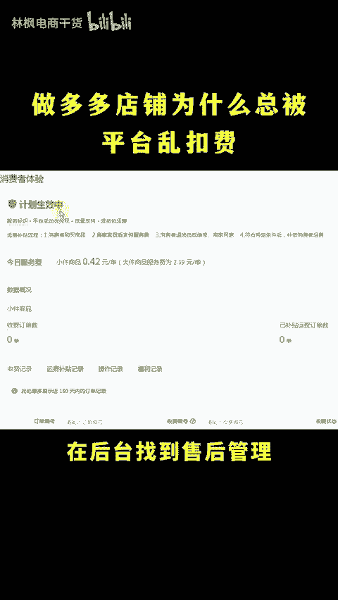
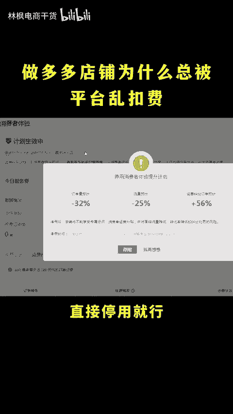
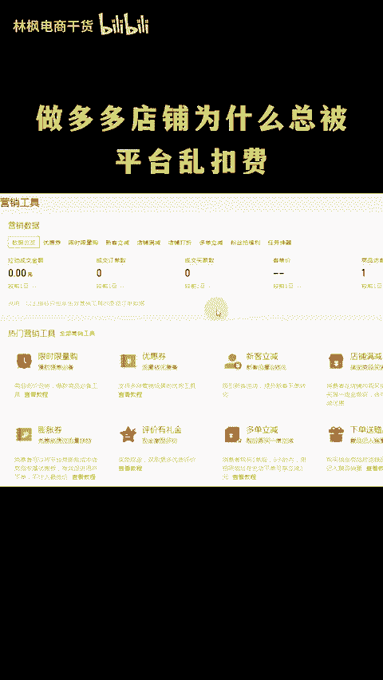
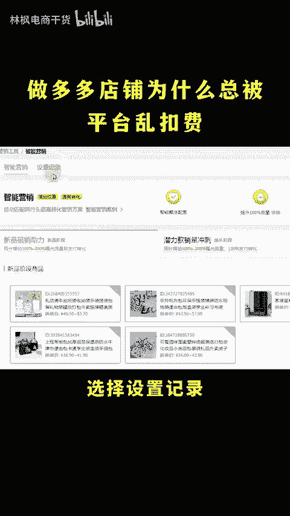
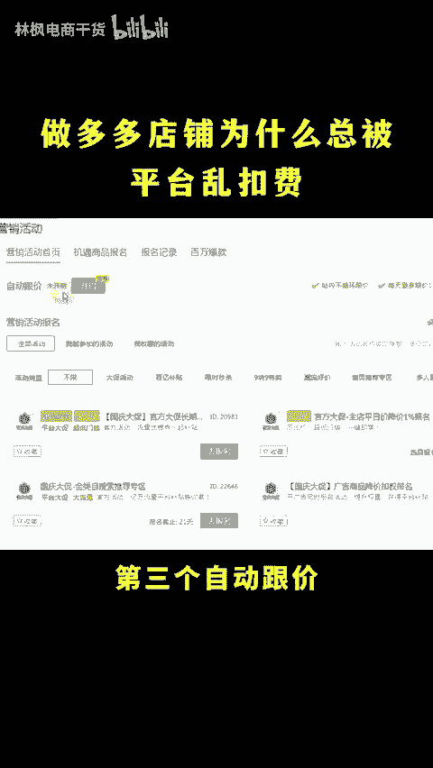
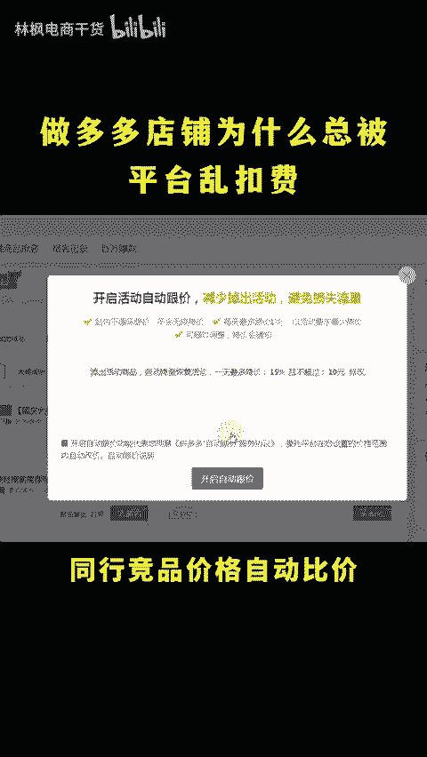
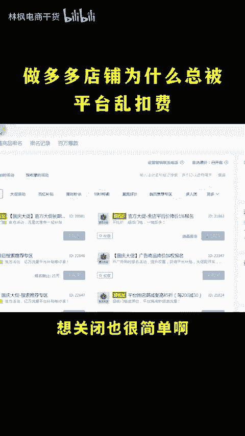
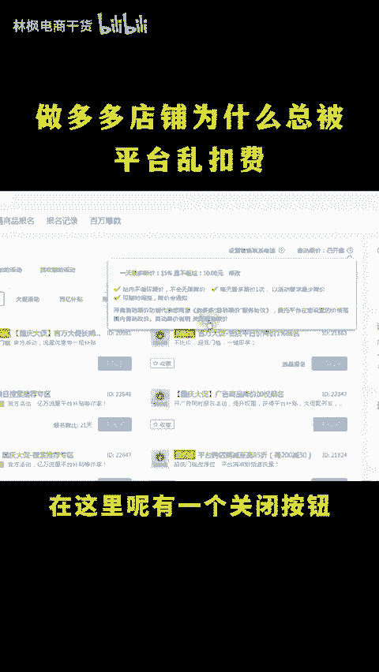
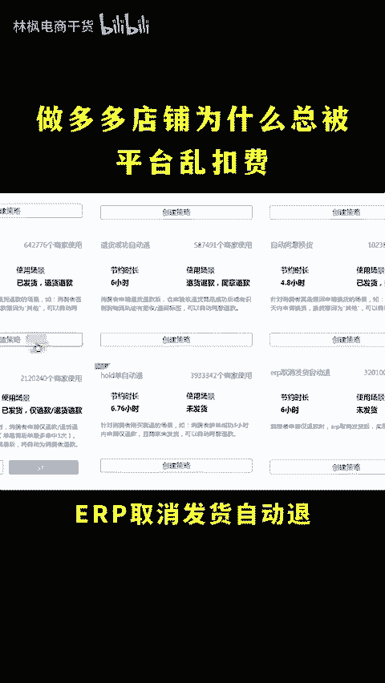
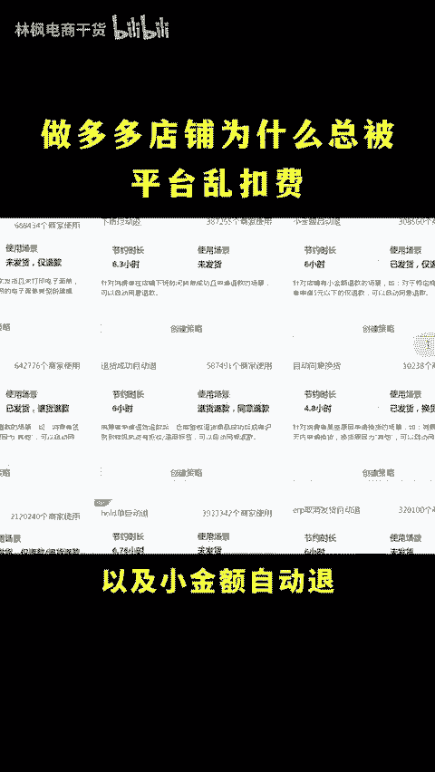

# 拼多多新手开店这四个设置不关掉裤衩都亏没！ - P1 - 林枫电商干货 - BV1zRxCeLEJJ

做拼多多，为什么总被平台乱扣费呀？那多半是因为平台的几个扣钱的设置你没有去关闭呀。我的天哪，哪些设置呀都有怎么关闭呢？消费者体验计划、智能营销自动更价，还有被人喷烂的仅退款，关闭的也很简单，点个关注。

点个赞，直接上实操。😡，🎼首先，消费者体验计划在后台找到售后管理，就能够看到消费者体验，打开之后呢，找到右上角的更多，直接停用就行。这个前期扣费呢几分几毛的，后面每笔订单都要扣好几块。第二个，智能营销。

在营销工具的全部营销工具里面点击进入后选择设置记录，然后呢点开链接后面的详情啊，点暂停，直接点结束就可以了。第三个自动跟价，这个设置呢，只要你稍不注意啊。

系统就会给你打开平台呢会根据同样竞品价格自动比价，同时降价。到时候你亏没了，你都不知道，想关闭也很简单啊，在营销活动里面的这个位置啊，点问号，找到自动更价说明，在这里呢有一个关闭按钮，直接关闭就可以了。

第四个仅退款，虽然这个是不能直接关闭的。但是你用这个办法可以减少90%的仅退款，你创建1个ERP取消发货自动退，可以发货仅退款，退货退款自动转拒收策略，以及小金额自动退，这三个策略创建好。

就能够有效减少仅退款。还有不会的看这里。

