# 拼多多新手开店，该如何布局双十一？手把手教你玩转拼多多！ - P1 - 普通人电商 - BV1d82mYDEYR

马上就到双十一了，很多做拼多多的卖家都是新手小白，开店后，往往不知道从何下手，有些则花了很多时间和精力，也是了各种方法，店铺还是做不起来，其实都是因为大家对拼多多的平台规则和运营模式不清楚。为此。

我将拼多多重点规则和店铺起报思路做了整理，都是干货分享，希望可以让大家少走弯路，首先是平台规则，第一点，客服规则，客服直接影响转化，不管是在售前还是售后都应该做好自己的本职工作，提升转化率和复购率。

第二点发货规则，常规发货时限为48小时，点击发货后24小时内要有物流的记录。48小时必须出分拨中心，不然可能会被判处虚假发货。第三点商品管理规则主要是违规发布商品时需要对SU的内容和价格进行合理设置。

价格区间不能相差太大，避免被平台判定为低价引流。导致商品被下架或者禁售。第四点，店铺评分指标，主要包含商品评分，纠纷退款笔数进入率退款率。😊。

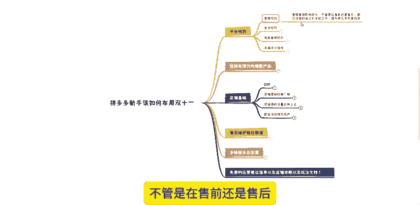

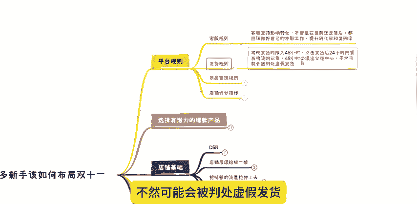

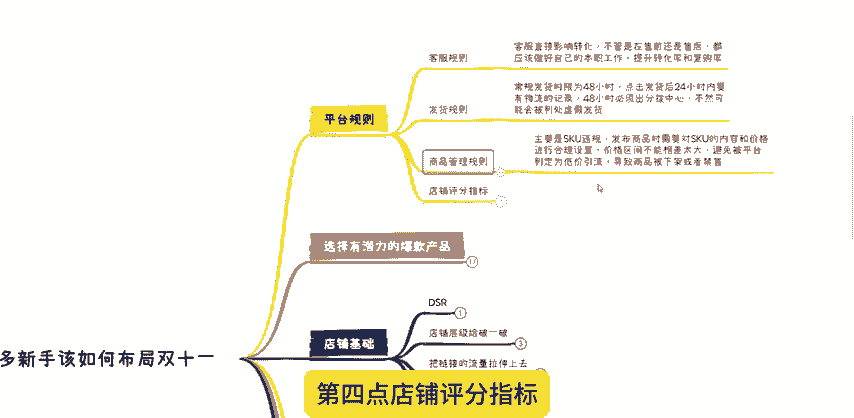

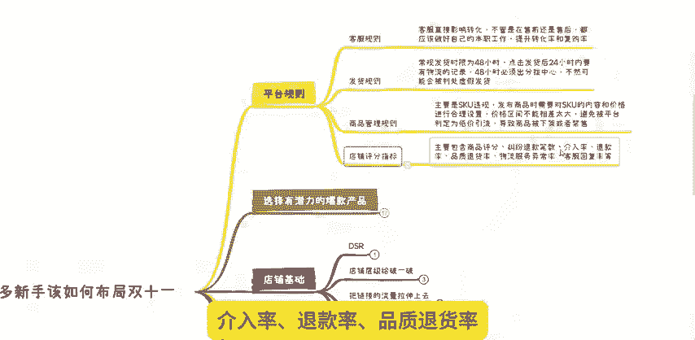

品质退货率、物流服务异常率、客服回复率等。如果店铺各项评分评很低低于同行平均水平，可能会导致全店被降权店铺的流量受限。从而影响店铺的发展，然后下一步选择有潜力的爆款产品。我们在上了链接之后。

继续上链接多上8到10个链接。如果产品是非标品，建议多上链接风格统一，价格段统一，如果说是标品，那我们就进行重复铺货，我们的商品可以一样，但是呢一定要保证链接的标题不一样主图不一样，不一样，价格不一样。

然后把这些链接全部丢到直通车计划里面选择稳定成本推广进行测试跑个几天观察数据看看哪个链接在车里面能够跑出来成交。我们要明白平台为什么会给我们曝光。只有平台认可我们这个产品的定价和内容才会给曝光。

反之的话就是没有曝光的。有些人为什么投入后完全没有回报，这是因为新链接一上架去闷头推广投资框框往里面砸到后面发现开车成本太高了，却没有成交，归根结底的原因就是平台根本不认可这。😊。

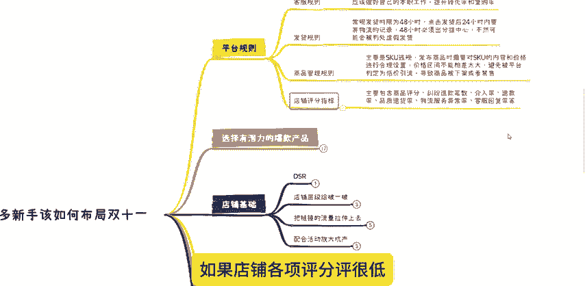

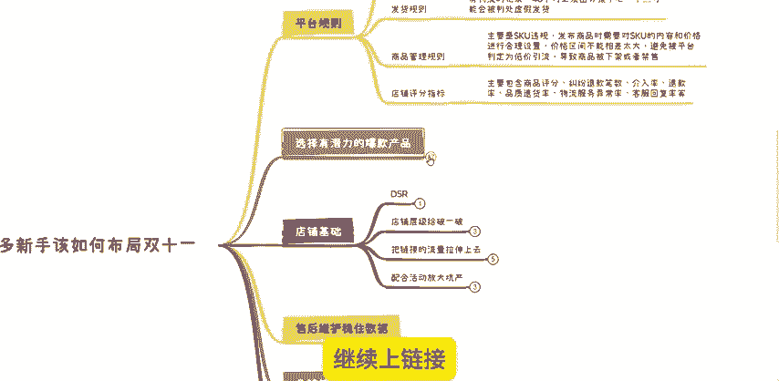

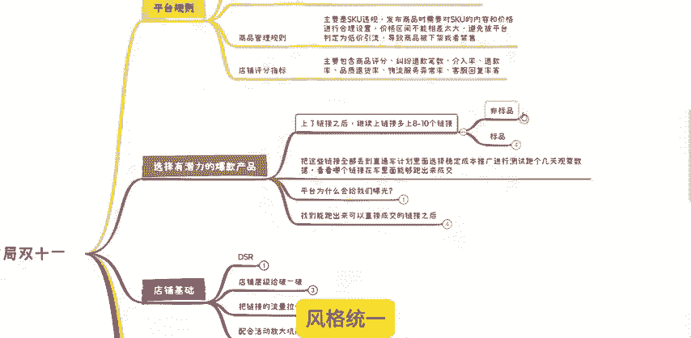

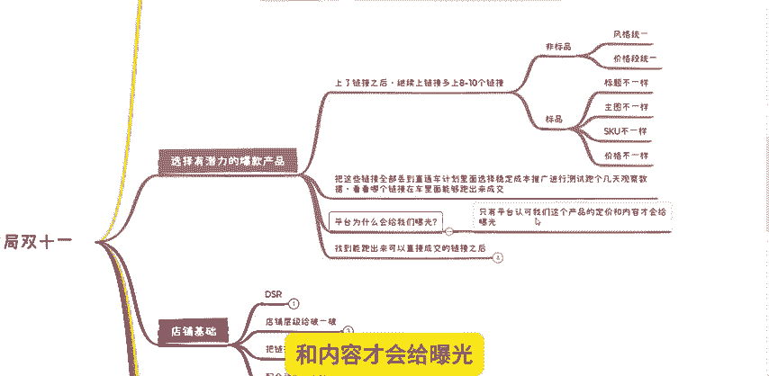

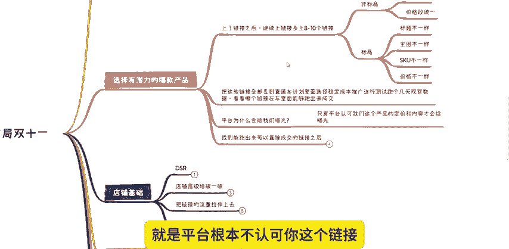

链接就算你的出价给到最高，他也不会给你流量。所以这个操作的目的呢也是为了我们前期的补单，评价不会白做，不会浪费我们的资源。然后我们就可以对有流量的链接进行针对性的操作，这样成功率就会大很多。

当我们找到能跑出来可以直接成交的链接之后呢，就是去做基础销量和基础评价他做一下不会改销量的小伙伴可以在评论区问我而评价可以找资源主推款做个100个评价就可以了。

然后我们店铺基础要做好第一个方向就是DSR也就是店铺评价分50个有效评价就可以了。有优质鱼塘资源的直接找资源就行，也可以直接去多多进宝找资源成本大概也就是几百到1000不等。店铺DSR评分显示出来。

第二个方向呢就是把店铺层级给破一破新店铺你在第一层级不容易出单，我们直接去拍大单把层级搞到3到4层级。这样我们的店铺就具备了基础权重。这里记住没有DSR评分的你光有店铺层级是没有价值的。

然后呢就是要把链接的流量拉伸上去。当你把主推款基础和店铺的基础权重。😊。

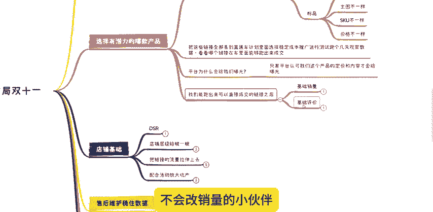

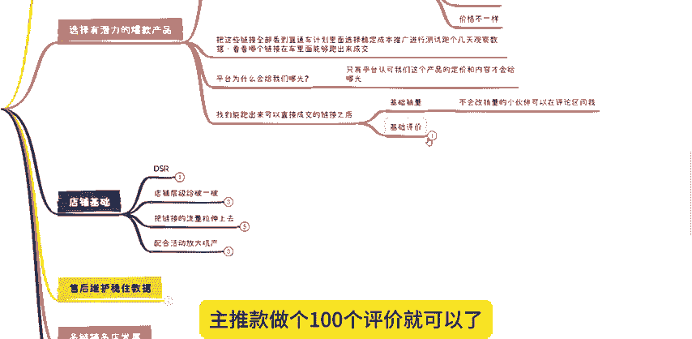

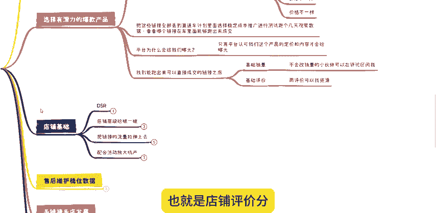

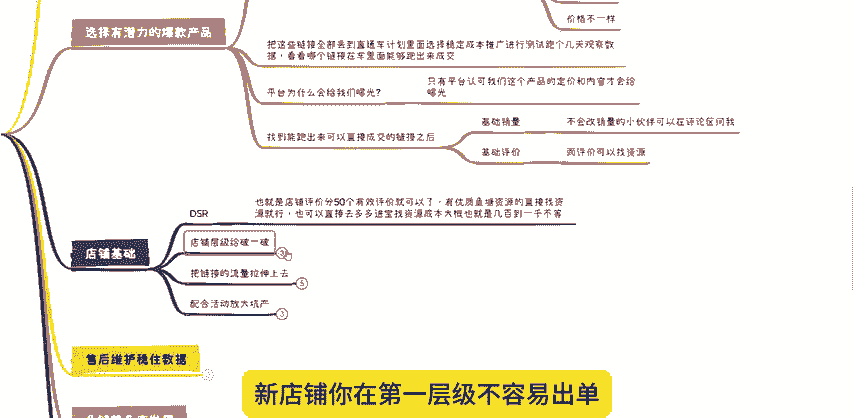

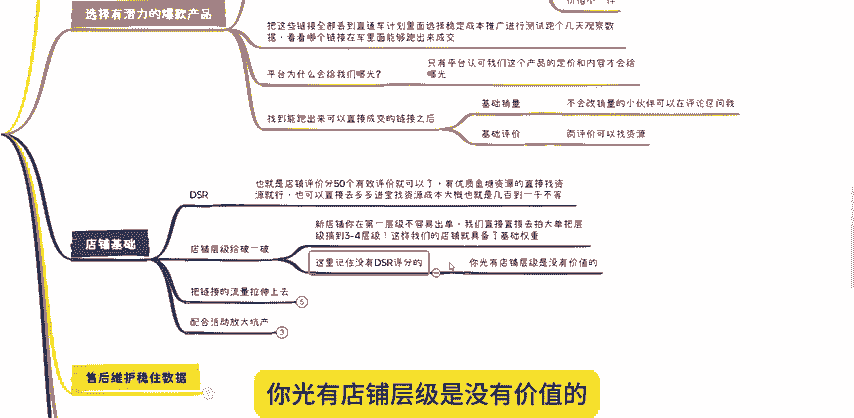

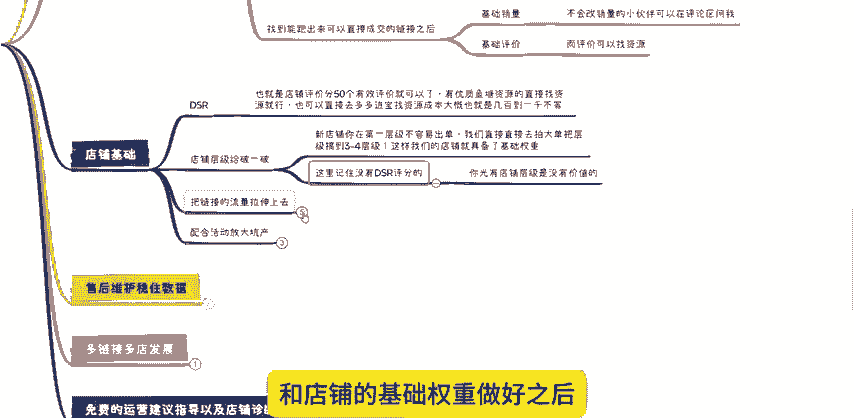

做好之后，那我们怎么把他的订单提高起来呢？现在多多起流量的方法，它发生一些改变。这里给大家分享一个商品推广的玩法。首先我们打开商品推广选择稳定成本推广选择出价，按照系统建议出价跑3天。

这里要注意询单收藏关注都要关闭，然后设置好日限额100保证我们链接的点击率转化率没有问题的前提下，你沉淀3到5天时间，只要你前面的环节都做好了，最少是可以跑出来，每天大吉时甚至上百单的销量。

这个时候你可以通过观察数据来考虑是否切换投产比来扩大你的数据。如果说盈利了日限额烧的很快，能够在每天早上或者说中午之前就烧完日限额达到100单，甚至更多单的时候，我们下午和晚上就不要去开车了。

当我们达到这个订单量，下午和晚上跑免费流量，绝对是可以跑出来至少三四十单自然流量的。到了这个时候，我们就要给自己去算一笔账。如果说是盈利的并且感觉还行挣的够了。那我们直接稳定住啊。

然后去配合活动放大更产上面的环节都O了，还想继续放大，那就直接配合活动来增。😊。

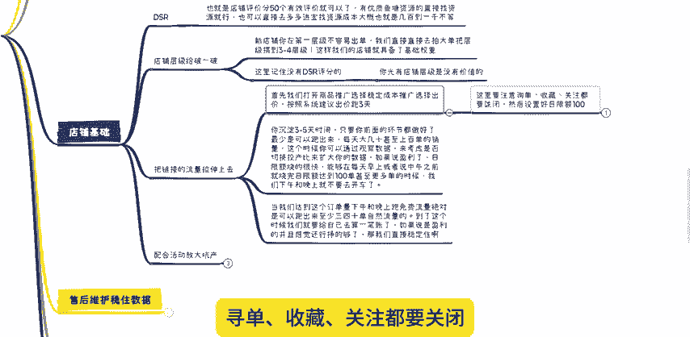

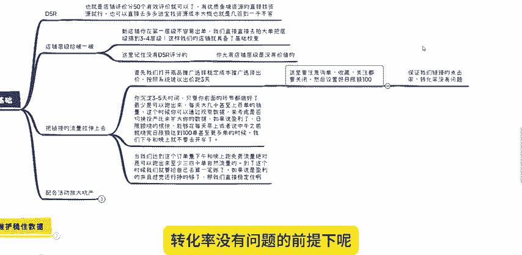

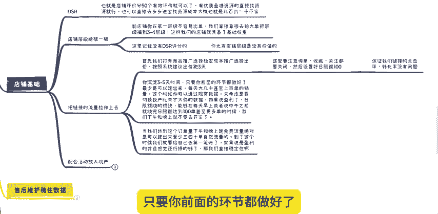

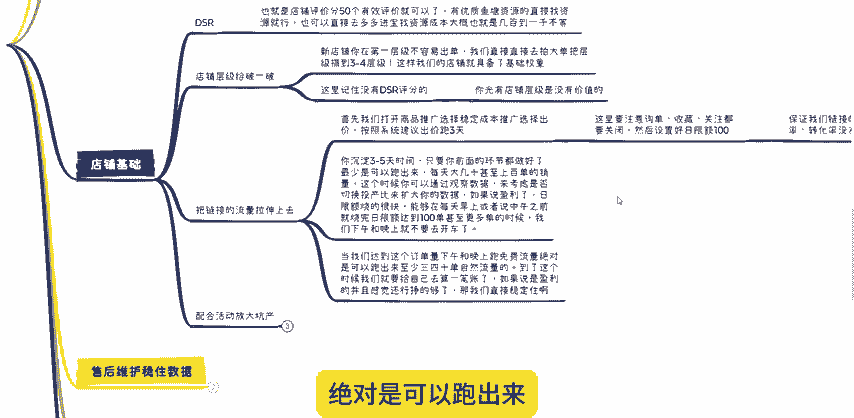

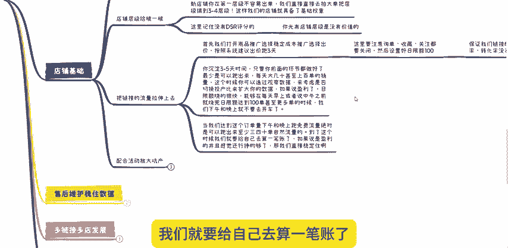

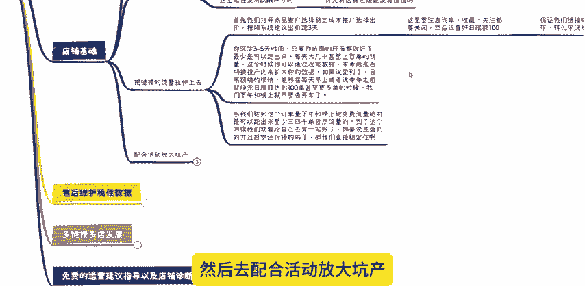

我们的坑产，这里呢有必要去给那些刚开店的商家朋友们提醒一下，前期你不要去盲目的上活动新品。在前期没有坑产权重累积的情况下，活动是起不到什么作用的。在付费推广没有问题的情况下，能报秒杀或者说9。

9块就报名这些活动，报名不了就去报大促商活动。我们的核心纲领就是不要去做大幅度的货损，大幅度货损上活动，就算能够狠出很多单。因为价格跨度比较大，下来之后的话转化会很差，就接不住流量的。

所以尽量靠近成本架上活动就行。活动流量是很大的，只有当回家跨度不大的时候去跑量。跑完一波下来才能够尽可能的去接触活动的流量。这样的一个操作的话，是把整体的坑产销量权重全部给拉上去，下来的时候呢。

我们才能够稳住，每天有几百单的销量，然后我们需要做好售后维护稳住数据，很多人只做到这一阶段，就如昙花一现了，开始出现下滑，我们要知道稳住流量才会赚钱。那如何才能够稳得住呢。销量下滑最根本的原因。

就是我们的店铺，或者说商品的DS2领航员开始落后于同行了。😊。

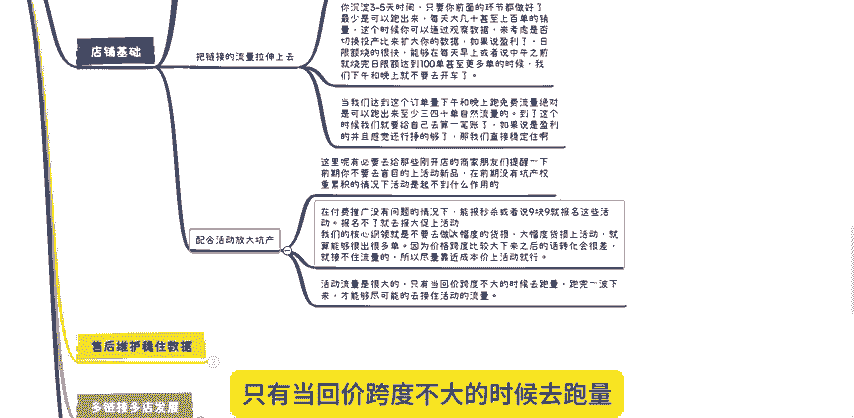

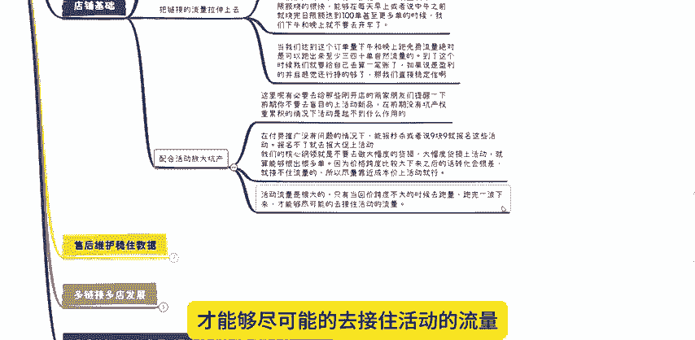

服务能力出现问题了，流量和订单它也就会不断的下滑，所以我们起量之后，一定要每天观察DS2领航员千万不要让它下滑，一旦发现它下滑了，就要赶紧去优化调整，只要这里能够稳得住。

流量和订单也就一定能够一直稳得住。最后以不多链接多店发展，我们不要只靠这条链接去生存，要记得给自己留一条退路啊，但不要放在同一个篮子里面。如果说这条链接出问题没了，那从头再来，又会浪费很多的时间。

所以当我们一个链接起来之后，要记得赶紧去起下一个链接，也可以同时多开一两个店铺，不断的起链接不断的起店，这样才是一个健康稳定不会中断的坐店循环。一个链接挂了，还有下一个链接，一个店铺挂了。

还有下一个店铺，那么在拼多多这个平台，我们就能够一直生存下去。好了。今天的分享呢就到此为止了。如果说你看完视频还不知道怎么操作的。我也可以提供免费的一些运营建议指导以及店铺诊断。

同时我还整理了拼多多玩法文档主要有新店快速起电原价上活动系列玩法。高客单高毛利产。😊。

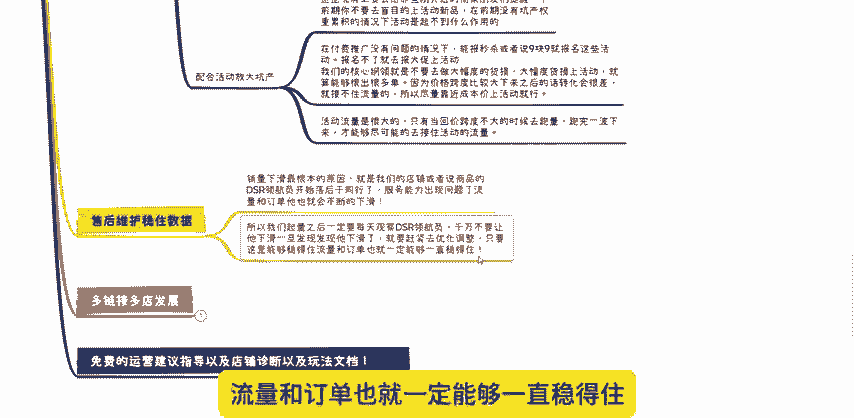

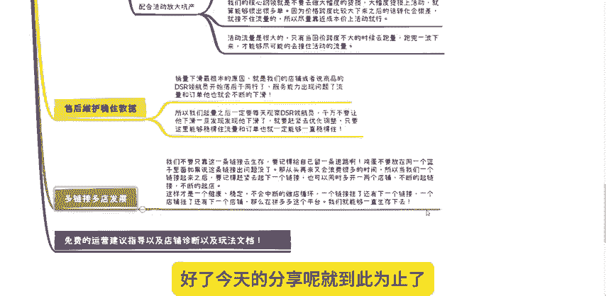

品打法第一客单产品自然流起爆玩法以及店铺成熟后施几种玩法等等都放在了评论区，希望对小伙伴们有所帮助。

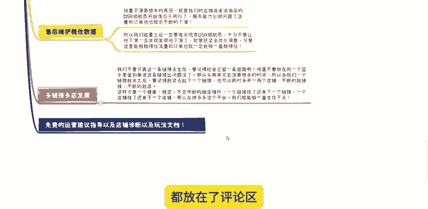