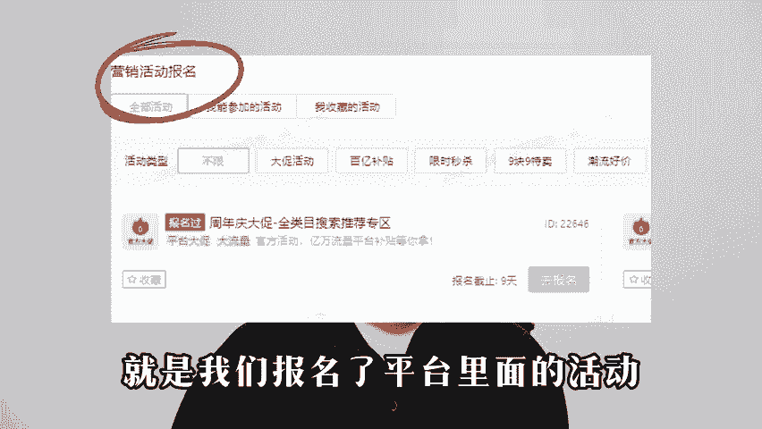

# 拼多多新手必备的正确起店思路，手把手教你高效起爆店铺，让你少走弯路，从0起步到爆单全流程分享 - P1 - 多多运营元元 - BV14D2mYTEXo

又到了电商人备战双十一的时期，现在还是有一些想做拼多多或者刚开始做的商家在问拼多多这个平台到底能不能做。大家要知道拼多多平台规则更新的平均是非常快的。有很多网上流传的玩法，可能月初还在用。

到月底就不行了。就很多人比较茫然，不知道这个店铺应该怎么去做。今天这个视频来给大家分享一套现阶段起店的方法，大家可以直接照搬这套模式，为什么很多新手商家在做店的时候没有什么效果呢？因为学的太乱了。

没有一个整体运营思路，很多商家都是跟着这个视频学改销量，跟着那个视频学怎么做评价，要跟着另外的视频学怎么开车，学到的知识是零散的，不连贯的，甚至很多教学视频的思路都是不一样的。所以你们东学一下西学一下。

这样去做链接效果反而不那么好。所以这期视频会从头到尾给大家想清楚，起一个新店的方法和知识点，希望能对你们有所帮助。但是觉得还不错的，可以一键三年。首先要知道，我们想要打造一个爆品，流量渠道有哪些。

拼多多上面获取流量的途径，分成这几种类目流量、搜索流量、活动流量、付费流量以及站外流量。第一个类目流量是什么？比如说你卖服装，但是你把男装女装童装这三个不同的类目，放到一个店铺里面去卖。有一个消费者。

他想买一件男装，他进了你的店铺，大概率他是不会去买里面的女装和童装的。所以说你店铺的整体转换率就会比较低。前期想提高店铺转换率一个核心点，就是要把店铺的标签打好，类目做垂直做精准。

最好一个产品就是加店铺，什么是搜索流量，就是消费者通过产品关键词找到了我们的产品或者店铺，比如说大家都知道的品牌效应，好比卖鞋子，我们把一些品牌关键词放在标题里面，消费者搜索品牌词找到了我们的产品。

并且点进来了，我们就会获得一部分的搜索流量，核心词也是一样的道理。第三个活动流量，就是我们报名的平台里面的活动。比如说大促9。9块先是秒杀消费者通过活动页面。

点击进我们的产品或者店铺，这样带来的流量就是活动流量。第四个付费流量。店铺在后台开了稳定成本推广或者全店托管之后产生的流量就是付费流量。最后站位流量是什么？当商家或者消费者把产品链接分享给了其他人。

然后他们通过点击链接进到了你产品页面或者进到店铺，这就属于是单位流量。那么在清楚的流量渠道之后，我们应该怎么去做好链接呢？首先要知道一条链接需要做哪些地方，主要就是标题图片标签基础权重，标题一定要做好。

首先要满足30个字，并且保证它是通顺的，在这30个字里面需要包含热卖关键词和核心关键词，图片包括主图和详情页，这两个地方要保证和同行做出差异化。主图要是高点经阅的图。

然后需要围绕着主图和详情页展示产品的细节和卖点。标签也就指的人群标签，对于我们的内幕流量，我们的内幕一定要统一人群要精准基础权重里面包括基础。

销量、基础评价、店铺层级DSR基础销量和评价这两个是很好做的，可以去找亲朋好友，也可以找资源。销量的话还可以直接改销量。店铺层级可以自己开大单。我们在店铺后台首页可以看到有一个店铺层级。

如果你是新开的店铺就是第一层级，想把店做起来的话，至少要做到第三层级。因为店铺层级的高低是决定了流量天花板在哪。在同样的情况下，你的店铺层级越高，获得流量的能力越强。店铺DSR也是一样的。

可以去找朋友做，也可以通过多多进宝去做。只要把这几个方面做到位了，基础权重基本上就是手到擒来。然后我们前期做链接的时候，一定要注意把差异化做好。可能有商家朋友想说，网上能用的图片就那些怎么做差异化。

或者说有什么必要去做差异化呢？首先我们要知道，拼多多是一个比较的平台。它会通过你图片规格描述这三点来确定你的产品和你同行卖的是不是同一个。如果你这三点和你的同行都做到大差不差。

但是它的价格比你低，那么它能获得的流量肯定是比你多的。所以我们一定要把差异化做好，像图片可以加上一些文字或者图中图这一类的手段去做规格的话可以加上比如开业特惠新店立减一类的字眼。

还可以围绕你的产品加一些描述的词汇。比如说你卖水果就可以说科科大果超级甜这样的词。不过这里要注意你的产品实际情况不能和描述的词汇差距太大，不然可能会导致比较高的催货率。当我们加上这些字眼之后。

平台就会认为你的产品和同行是有区别的。在这种情况下，你的价格卖的稍微高一点，也能够获得流量。

差异化做好之后，第二步测试链接。首先可以通过报名大促去看我们的链接有没有做好。如果说这个链接报大促变压价了，证明链接有问题，需要重新再去做一下，但是没有变压价，你的价格没有问题，甚至可以原价上活动。

就证明你的链接是可以的，就可以继续去做链接，因为一个店铺里面只有一条链接肯定是不行的。我们需要多做几个链接，一个产品做5到10个链接，这些链接的标题图片SQU规格也是要做出差异化的。

这样才不会被判定为重复铺货。这一步做完之后就可以正式的去测链接，找到表现比较好的链接做你的主推款。我们把做好的这些链接全部放到直通车里面，新建一个推广计划，把链接都添加进来，然后去把日限额出价设置好。

日限额统一设置成100块，出价只需要出成交出价，成交出价怎么出。如果你产品客单价在50以内，就按照中销SQ的客单价去出价。如果客单价在50以上，就按照卖一单的利润出价。一般按照这两种。情况去出价就行。

这两个点设置完之后就可以开始推广，跑三天观察数据，主要看消耗曝光量点击量和转化。这四个数据，看哪一个数据能烧出去钱能够消耗多少。哪个数据的曝光量点击量转化量比较好，就优先操作哪个链接链接表现好。

证明这个链接被平台认可。平台认可了才会给你更多的流量。当我们做完这一步，找到主推链接之后，需要把销量评价说一下，做好之后再去考虑开车，然后就是付费推广，现在还是有一些商家知道商品推广怎么开其实很简单。

如果你原来开全站投产品出价还不错，就开商品推广的投产比出价。如果你原来开标准推广升级之后，开商品推广的成交出价就可以。如果你是新链接搜索属性想的商品选择成交售价，推荐属性想的商品选择投产品出价。

没有标准之后，做直通车能启动，可以用全年托管设置二头产加极速行量限额100等链接有自然流量之后丢到全年托广里面去打开之后再切回高投产一直跑。

就行，只要产品的点击率和转化率优化到位了，投产比肯定差不了。直通车出来的数据也不会差。如果利润高也可以去参加活动，慢慢给产品累积数据，后续就能做起来了。当我们开车每天能做到50单以后就可以去报名活动。

因为报名活动都是有门槛的。如果说你的店铺每天连订单都没有，或者这有很少的订单，那么很多活动你是上不了的。因为你没有达到那个门槛。当我们能够稳定出30到50单之后，就可以去报名一些简单的入门级活动。

比如说上首页或者9。9块先是秒杀这些，报名完之后，通过活动加推广就可以达到一个爆发的效果。这个时候店铺的出单情况基本上就非常稳定了。如果你看到这里还是比较迷茫，不知道应该怎么去做店。

可以看一下评论区领取一份我给大家整理的拼多多全套语音资料。