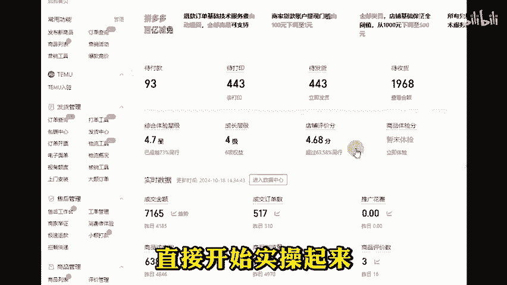
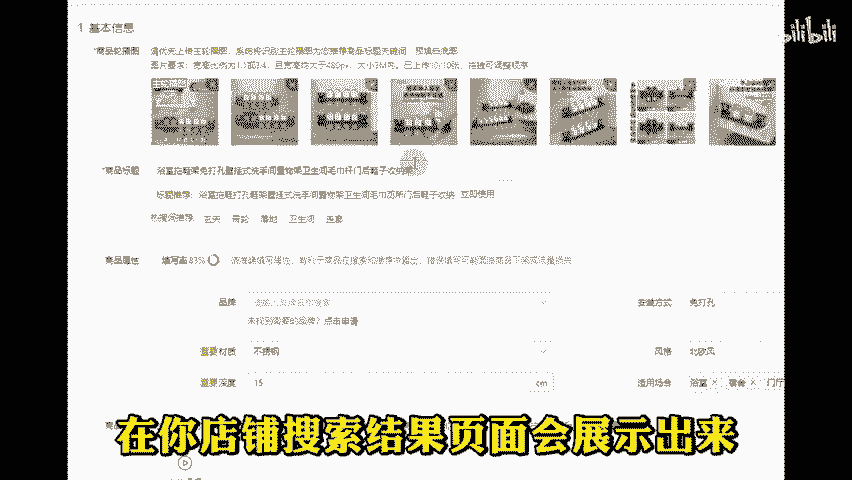
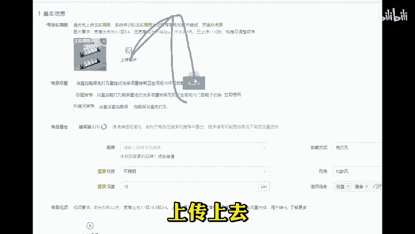
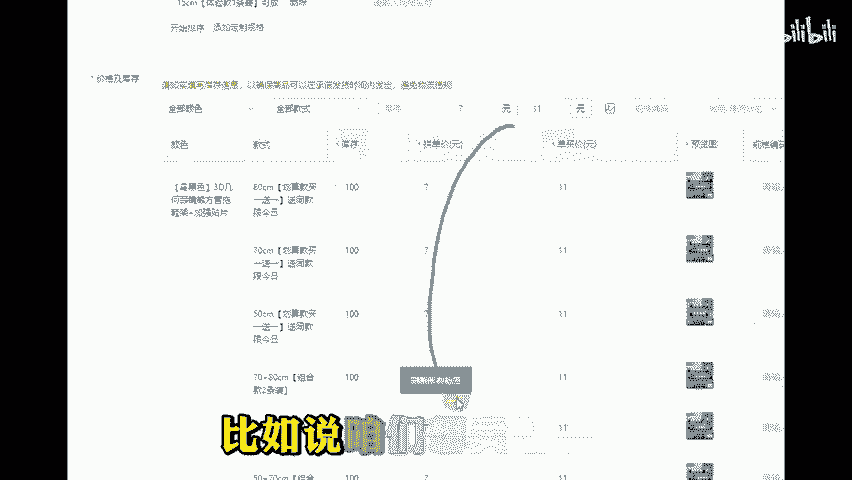
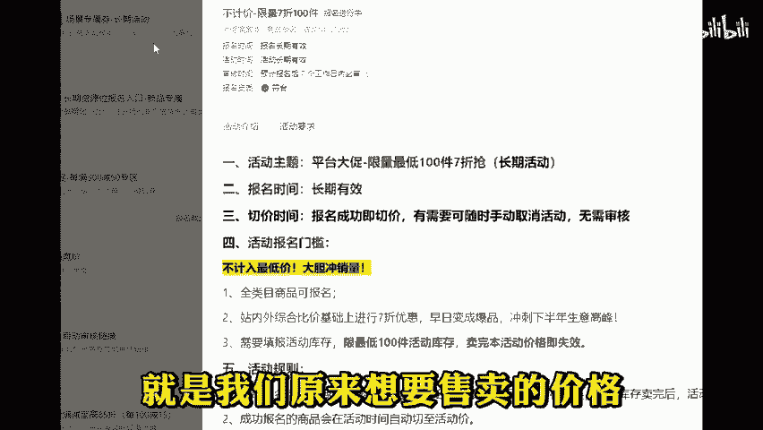
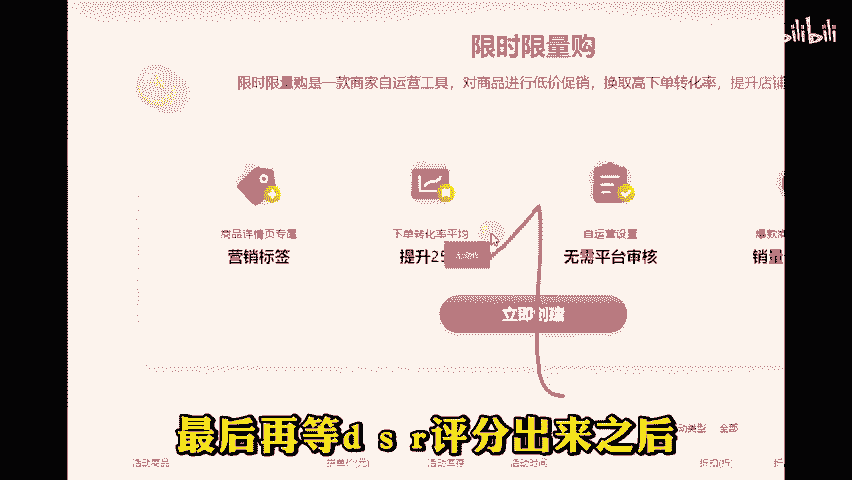
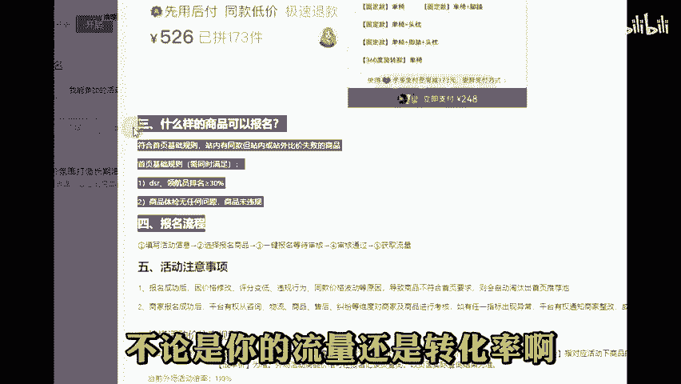
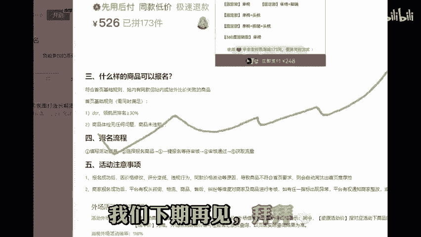

# 拼多多新手零花费如何日销百单！ - P1 - 独白uup - BV1eKC2YqEzE

🎼前面两期视频我们讲到了如何同时运营5个店铺，感觉大部分朋友啊听完之后还是一脸懵圈。那么本期视频就来教大家一个简单获取自然流量的方法，这也是我自己起店的一个底牌，可以说只要你所有步骤都做到位了。

每天做到个三五百单啊，是没有一点问题的。好了，咱们废话不多说，直接开始实操起来。那首先第一步就是通过机会商品啊去发布一个产品。通过这里发布的产品呢，会默认打上机会商品标签。

在你店铺搜索结果页面会展示出来。那来到我们机会商品编辑页面之后呢，只需要留下一张机会商品默认的图片就行。然后再把我们自己的商品主图啊上传上去，在标题前面呢加上同款低价这四个字，最后定价呢。

比如说咱们想卖7块钱。那么我们就先定到10块钱的价格，然后我们再去报名这个21365新品不计价7折活动，打7折之后，就是我们原来想要售卖的价格。那如果不上活动，我们就去设置一张7折的限时限量购的优惠。

😊。

🎼券保证我们折扣价啊是原来想要售卖的7块钱就可以了。最后再等DSR评分出来之后，再去报名这个22084同款低价活动，拿上低价氛围活动标签这么一套流程下来啊，我们就有了全网低价标。

同款低价个性标题以及呢机柜商品标签三重加持。不论是你的流量还是转化率啊，都会有明显的提升。这就是我一个月三五百单的操作细节。如果说看完视频还是有不明白的，可以后台发7做电商的工具和文档都拿去用。

我们下期再见。拜拜。😡。

