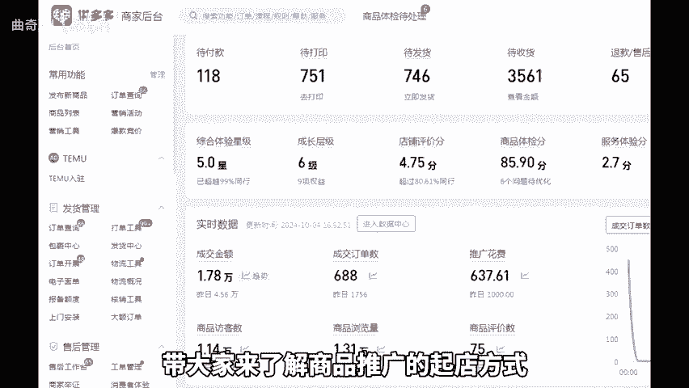
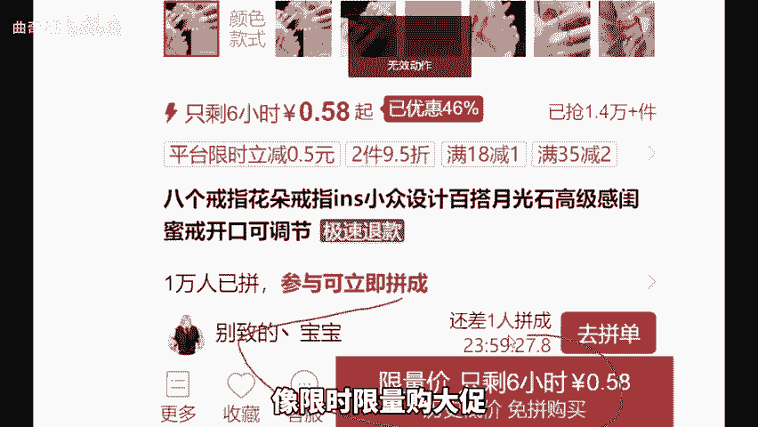
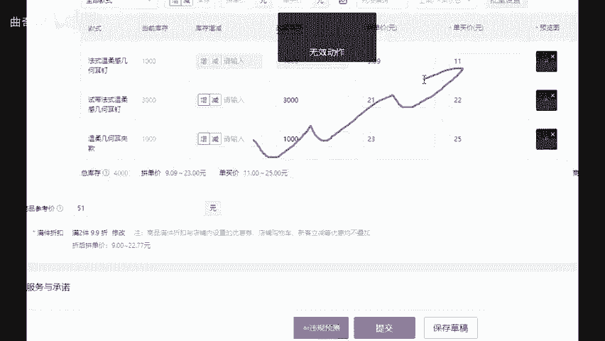
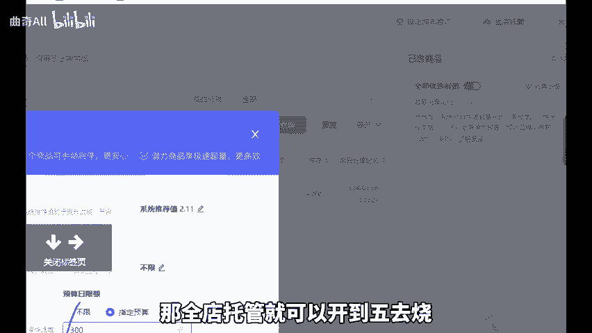
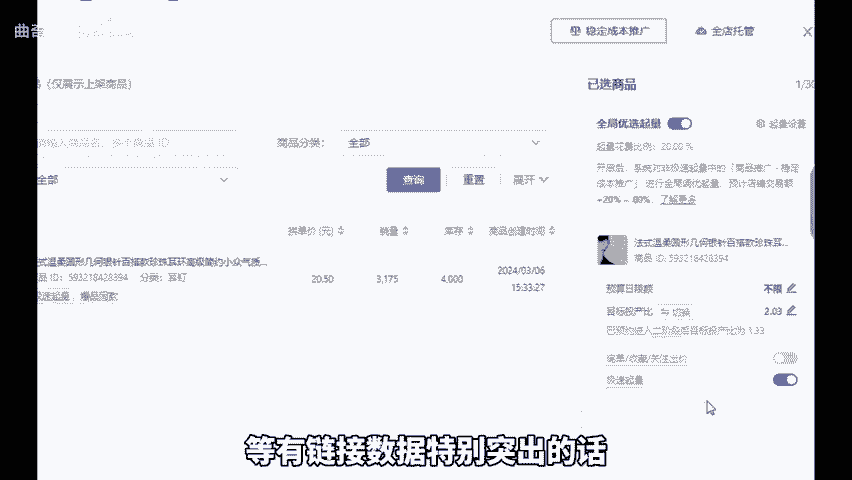
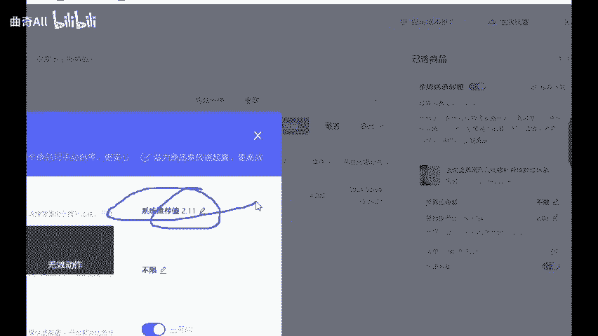
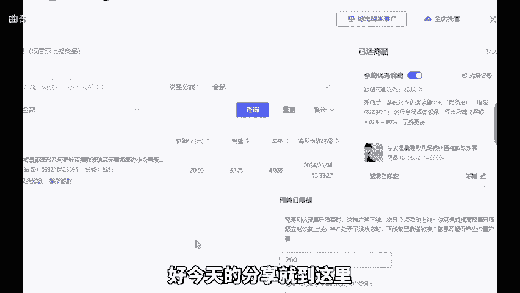

# 拼多多新老店铺没有价格优势如何靠直通车起量扩量？ - P1 - 曲奇All - BV1Ug2SYGEnm

现在做拼多多想靠自然流量起店你没有加个优势，几乎是不可能的。除非换种方式用直通车带动自然流气包。那新店和老店的起店思路全然不同。今天这期视频花2分钟左右时间带大家来了解商品推广的起点方式。

点个关注点个赞，直接上实操。首先，新店新链接想通过商品推广，快速起爆，需要做好以下这几件事。第一，做好基础的营销氛围，像限时限量购大促活动页面，优惠券等都可以用上。第二，链接上架后要有破零动作。

可以是搜索指数单，也可以是分享的递增破0。第三，创建推广计划，商品推广的成交出价模式，投产比模式都可以创建一个保本计划，单链接快速上到20到30单。如果保本都烧不动就换一个链接。第四。

单链接能跑出几十单时，可以直接进行单品裂变或上架新品，然后转全店托管日线额设置300，保本投产比是3，那全店托管就可以开到5去烧这个思路稳定且有利润，能有链接数据特别突。

出的话再单独拉出来走成交出价或投产比模式。接着是老店。对于那些订单不上不下的店铺，如果想利用商品推广扩大体量，此时一定要用好全店托管，老店是有稳定标签的，只需要通过全店托管去拉量就行。

投产比可以设置为保本稍高一点。每天多拉些流量进来，流量进来后就可以单品多链接上架或多品多链接上架。这里新品上架的定价可以提高至同行的10%到15%。老品拉来的流量全部会给到新品做承接。新链接曝光越多。

就再单独拉出来走商品推广的稳定成本投放。不管是投产比还是成交出价模式，每天都可以去卡100到200的日线额，稍完即可多重复操作，用多链接去打体量就一定能拉上来。好，今天的分享就到这里。

还有不懂的可以后台找我，不知为你解答，还给你分享一份。我整理的店铺综合运包。

