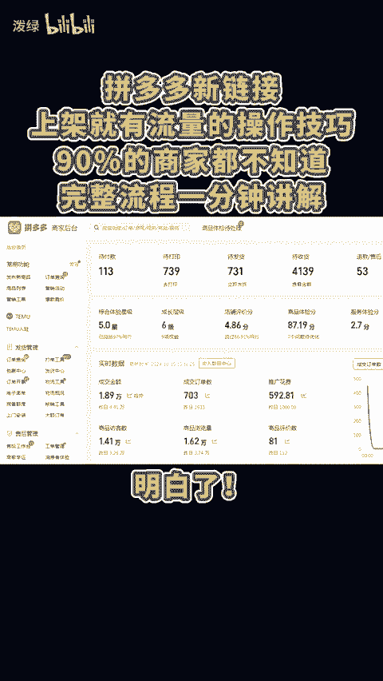
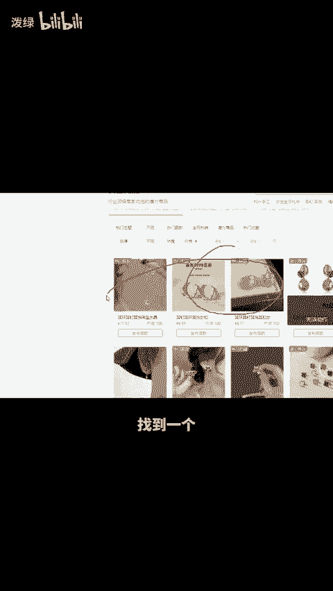
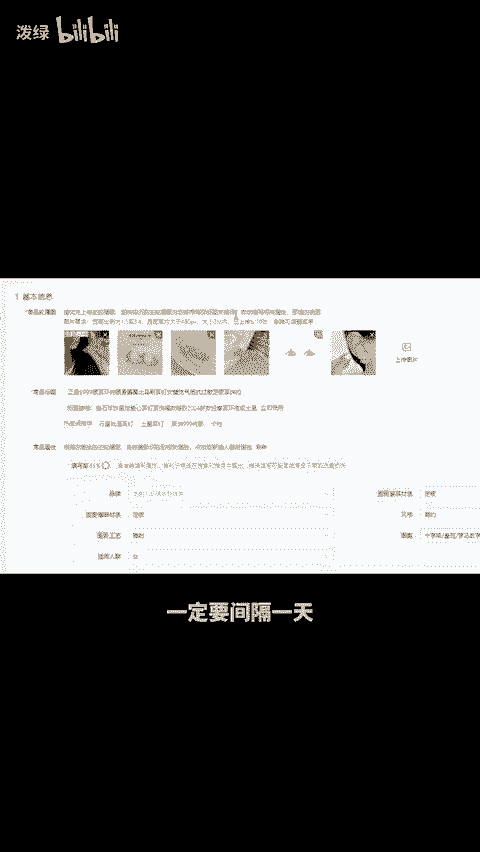
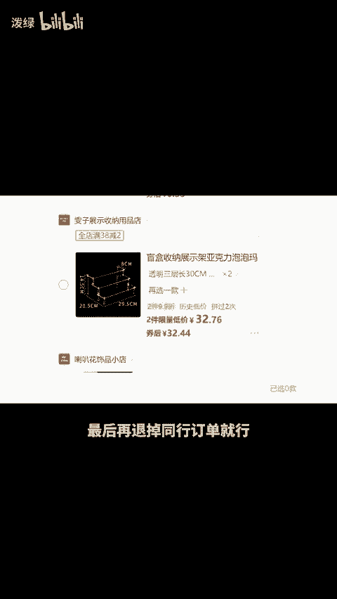
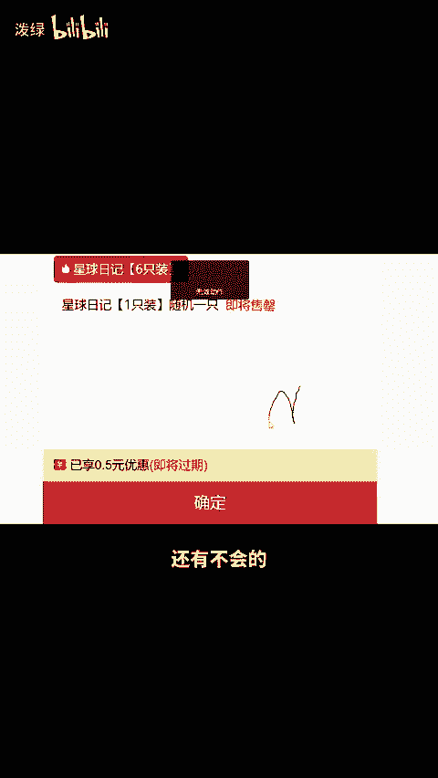

# 拼多多新链接上架就有流量的操作技巧，90%的商家都不知道 - P1 - 泼绿 - BV1Vr2bYhET9

拼多多新链接上架就有流量的操作技巧，90%的商家都不知道，完整流程一分钟讲解明白。😊。

首先我们发布商品的时候，点击会商品，找到一个跟我们产品相似的进行发布。在这里我们上传好主图详情肉，要把官方的主图保留下来，放在我们链接的最后，发布成功后，也不要直接操作，一定要间隔一天，找朋友搜索标题。

找到产品，点一下收藏，然后返回去找同款的其他链接，浏览几条后下一单，然后在收藏的产品，这里找到我们自己的链接下单，最后再退掉同行订单就行。这样做的链接标签精准，流量还高，还有不会的或想学习更多运营技巧。

点我头像。😡。

