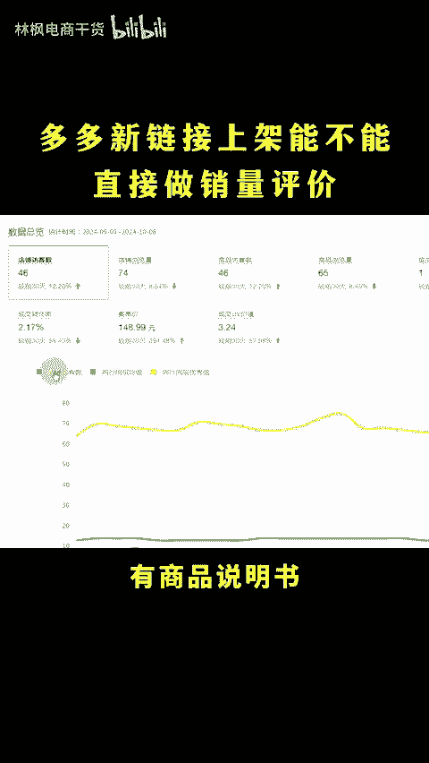
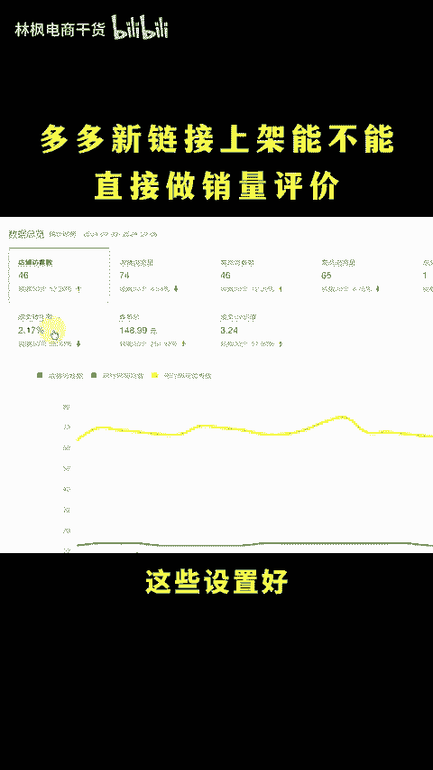
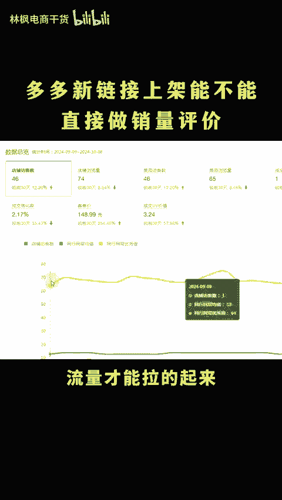
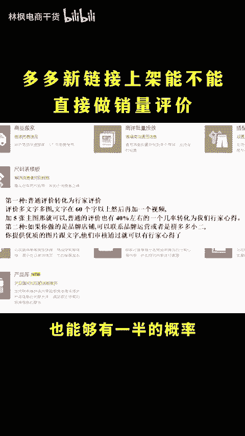
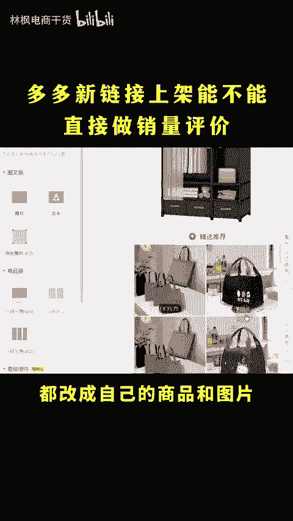
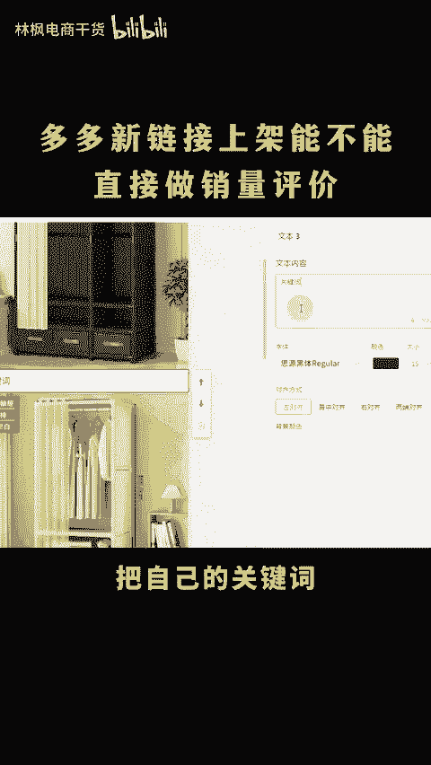
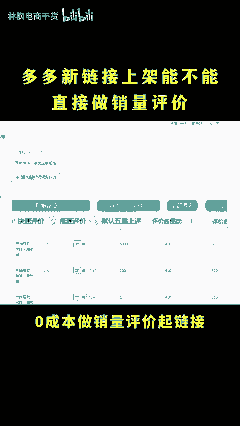

# 拼多多新链接上架能不能直接做销量评价？ - P1 - 林枫电商干货 - BV1gE2GYGEh6

🎼拼多多为什么新链接不能直接做销量评价呢？当然是链接太多，做的话成本比较高，所以不建议做oh my god。😡，ああ？

为什么新链接不能直接上销量评价，然后开车呢？直接做销量上评价。开车的链接10个里面8个配件啊，剩下的两个直接限流，一定要先做好几波基础配置，点个关注，点个赞，一步步实操教学。

基础配置必座的有商品说明书、商品答疑、行价心得防节流配置、矩证关键词，这些设置好，从流量获取到提高转化到避免买家流失，都做好了流量才能拉了起来。商品说明书和商品答疑啊，直接在商品工具中按照提示设置即可。

行家心得呢找行假号去做就是了。没有行假号的，就用我这个方法操作。普通账号也能够有一半的概率升级成行价评价，凡截流配置啊，就在详情页最下方添加一张精选推荐的图片，添加商品类标签，一行两列。

添加母行都改成自己的商品和图片，然后矩证关键词就在详情页中间添加一个文本组件，然后呢把自己的关键词和同行热搜词啊都给它添加进来，然后颜色改成白色隐藏起来，就能够获取到流量，同时呢截取同行的流量。

做好这些，通过这个工具啊，零成本做销量评价。其链接才能够事半功倍。更多运营技巧看这里。

