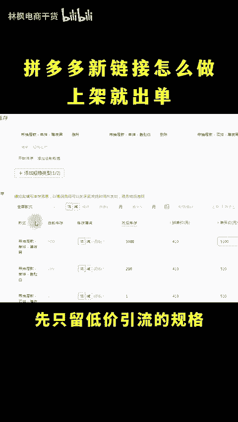
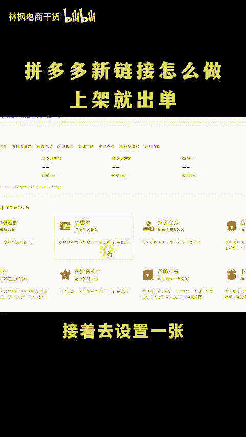
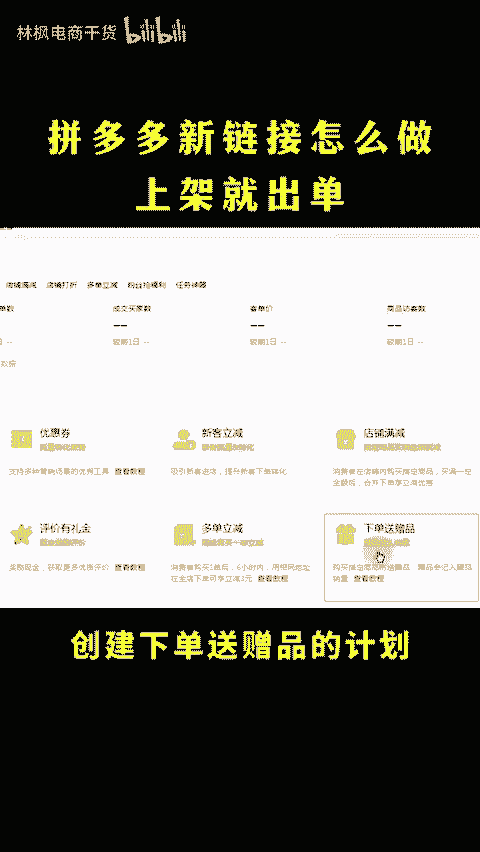
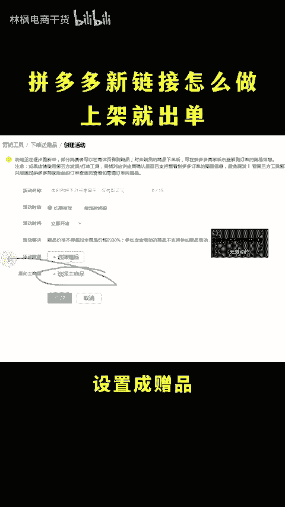
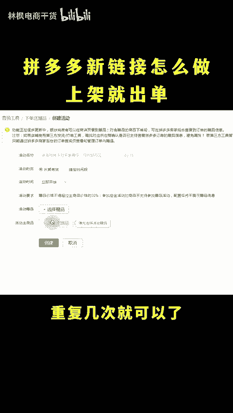
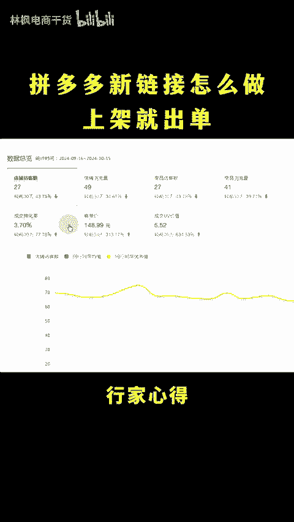
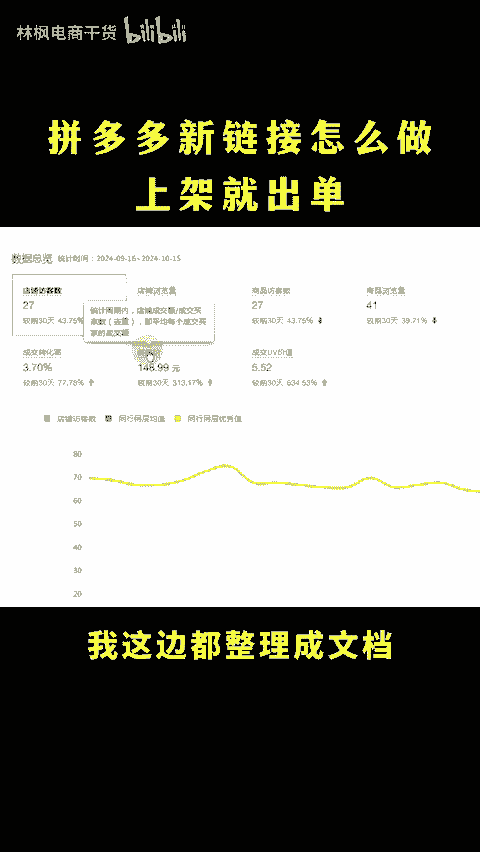

# 拼多多新链接怎么做上架就出单！ - P1 - 林枫电商干货 - BV12LyNYVEHR

🎼多多多，你的店铺怎么上来就能出单呀？因为我价格低，还每天都高价开车啊，当然主要还是因为我长得比较帅新链接怎么做商家就能出单呀。用我这个方法，链接上架自带几十万的销量。

再按照我这个投产规划表去开车就好了。点个关注点个赞，直接上市操。首先销量的话不需要去找人做，按照这个流程自己就能做新链接上架先只留低价引流的规格，上传一个定制类目的炮灰链接，定价的4000。

记着去设置一张2000元的优惠券，设置好之后，用小号去买家端都领取掉。然后呢穿建下单送赠品的计划，把定制炮灰链接啊设置成主商品，新品链接呢设置成赠品，然后再把炮灰链接改价到0。01。

这样下单20万件是一分钱重复几次就可以了。但自主做好有了流量不转化也不行啊，你还得把商品说明书喊他心得商品答疑以及最重要的优质带图好评都给他做好，不会做的也没关系，我这边都整理成文档打包好了。

留言666拿走。😊。

