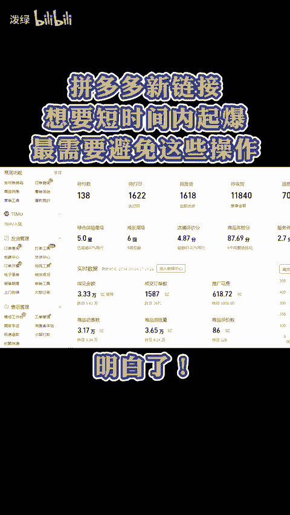
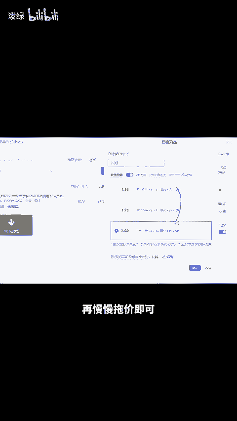

# 拼多多新链接想要短时间内起爆，最需要避免这些操作！ - P1 - 泼绿 - BV1Yz4ceJEsP

拼多多新链接想要短时间内起爆，最需要避免这些操作。😡。

明白，其中之一便是开车破铃，特别是开不动还加价的情况。要知道，新链接刚开始推广，通常需要放置一两天才可能跑得动，即便开起来了，推广费也可能永远降不下来，倘若倾向于做自然流链接，可先定价2900拍下一单。

次日降至1900再拍一单，第三天定价900。第四天一两倍售价操作。第五天报大促后降到正常售价，按照利润设置成交出价限为100，快速花完，两三天后，链接就可以起来了。那如果要正常做付费推广，就去同时上架。

十条链接做好防比价，假设利润为20%，可在商品推广中开几十0的投产比，第一天让人每个链接下单一件。第二天找两个人每人下单一件，第三天下完单后把投产比降至5，再慢慢托价即可，链接很快就能起爆。

还有不会的点左下角。😊。

