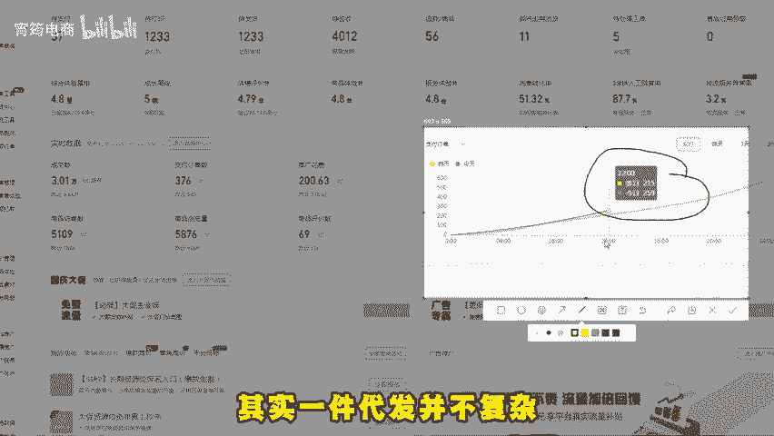
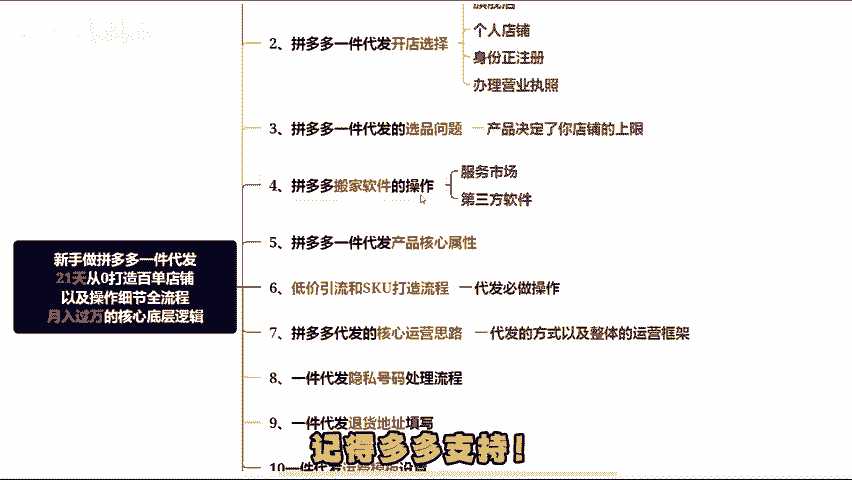

# 拼多多无货源一件代发还没弄清楚的，了解这13点，也能做到日销300单（拼多多开店｜拼多多运营｜拼多多实操｜拼多多新手） - P1 - 宵筠电商 - BV1WZsaeDEYJ

今天为大家带来一套新手入门拼多多一件代发的21天实操全流程，助力大家从零起步迈向热销百单。掌握这套方法，月入3万并非遥不可及。这一节呢主要给大家介绍一下整套课程的内容构成。其实一键代发并不复杂。

这里直接分为13个细节。首先第一个是拼多多一件代发的操作模式与基础步骤，这部分会为大家清晰阐述什么是一键代发，毕竟可能很多新手朋友还不太清楚其具体含义。其次，第二个是关于开店的选择。有些人可能会纠结。

到底是开旗舰店个人店铺还是仅用身份证直接注册，亦或是去办理营业执照呢，这里会详细说明他们之间的关系与差异。再者第三个是选品环节，很多人在做代发时，常常不知如何选品，甚至在这一步就遭遇困境。

但实际上选品并不难。接着第四个是拼多多搬家软件的使用。这个在服务市场或者是第三方软件中都能找到操作起来也非常的简单。

第五个是产品的核心属性。当我们上传产品时，一定要认真填写属性词，填好了之后就能获得更多自然流量推荐，否则可能会损失大量流量。第六个是低价引流和SKU的打造流程，这可以说是做代发必须掌握的操作。

会以导图加实操的方式为大家展示其具体做法。第七个是拼多多代发的核心运营思路，也就是明确做代发的方式以及整体运营框架。第8个，这部分是根据大家咨询反馈得出的几个问题点。比如隐私号码如何设置。

在后台其实就能找到答案，一键代发的退货地址该怎么填写，这通常是新手且没做多久的朋友会关注的问题，而退货地址虽只能默认用一个，但也有解决方案，还有运费模板的设置，虽然简单，但会从零开始为大家一一罗列清楚。

最后三个就是第11个第12个和第13个，都是大家非常关注的点，包括如何自己做评价，如何操作DSR评分，以及如何改销量。这道课程。会将这些内容全部清晰罗列之后，还会更新一套更全面的实操流程。

涵盖会员商家和做代发的商家。如果这里没有涉及你想要的知持，没关系，欢迎在评论区留言，收到大家的反馈数据后，在下一套全流程课程中会重点列出大家关心的支识点，并给出解决方案。大家有什么问题也可以随时私信我。

或者在评论区交流。本期内容就分享到这里了。同时我还整理了更多商品选款方法细节，各个类目的店铺玩法，直通车数据观测优化案例以及实操视频，还有无偿的店铺诊断和运营方向的建议，有需要的小伙伴自行领取。

记得多多支持。

