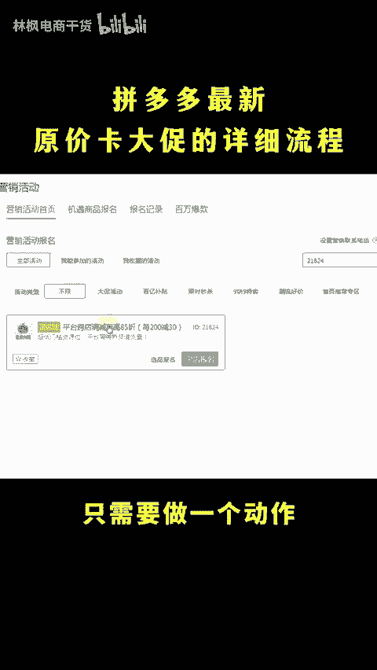
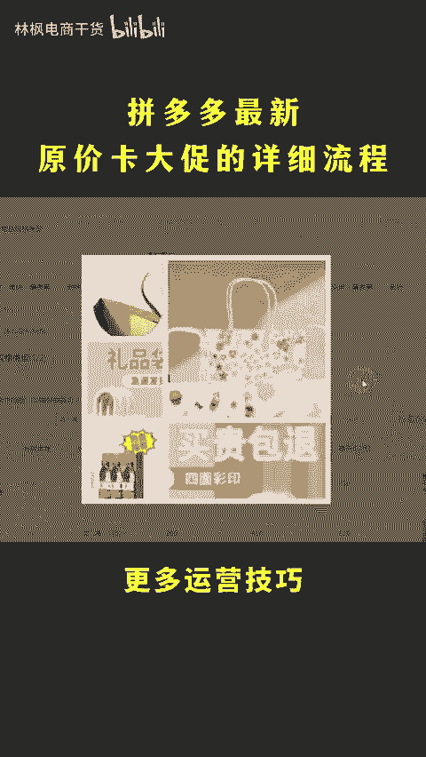

# 拼多多最新原价卡大促详细流程！ - P1 - 林枫电商干货 - BV1fdC1Y5E1n

多多活动又被比价了，又坚在继续上吗？链捷在活动中被比价了，千万不要直接降价，不然等你活动下架恢复到正常售价呢，就会直接断流。到时候你后悔都来不及，又开始了都。😡，这没完了嘛，那应该怎么办呢？

今天我告诉你一个方法，既不用降价，也不用下活动，99%的内幕都可以操作，并且呢设置好之后再也不会被比较了，直接上实操。😡。

打开后台营销活动，搜索找到活动21824这个超级满点的活动，它的新品原价就能报名，先报名占一个自优位，然后呢，打开你想要报名的活动，活动价格一键批量设置0。5去提报，只要报名成功就能够打上大数横幅。

但是显示的价格却是你上了2184的活动价格，既能吃到活动的流量，还不用降价去卖。但是如果活动中对比价，不需要你去降价，只需要做一个动作，就是做一下反比价就能够解决。把SQ添加文字数字去规避比价。

同时更换一下SQ图啊，成这种宫格拼图，让平台识别不出同款，更多运营技巧和做图的流程啊都打包好了。回复666拿去。😊。

