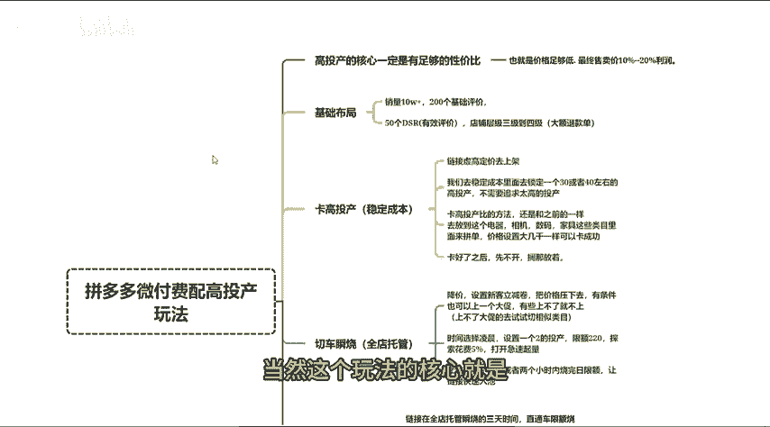
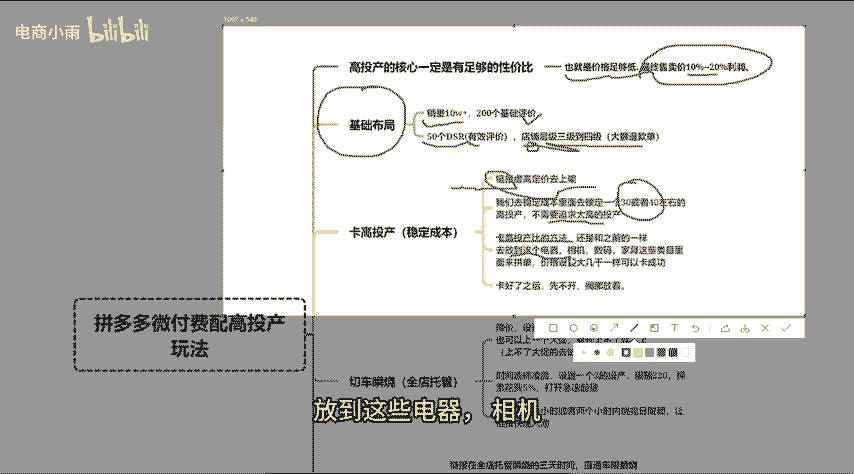
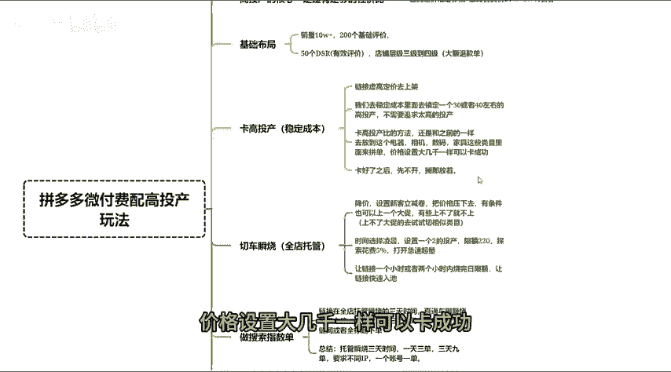
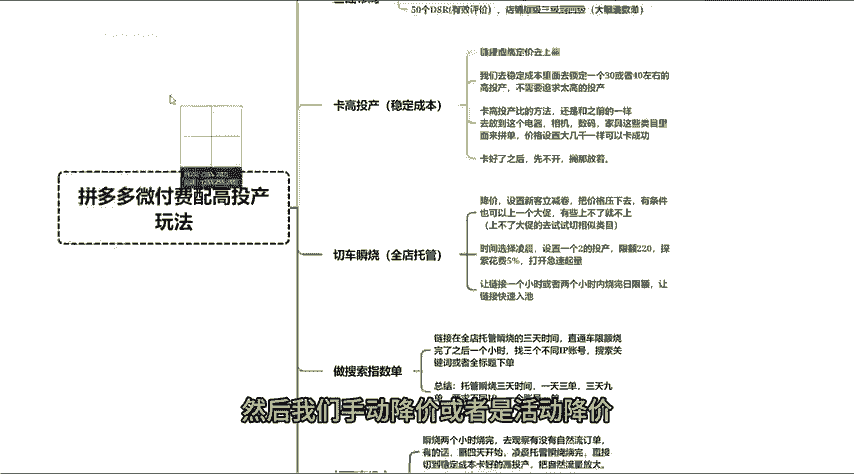
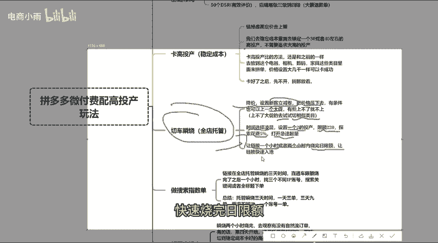
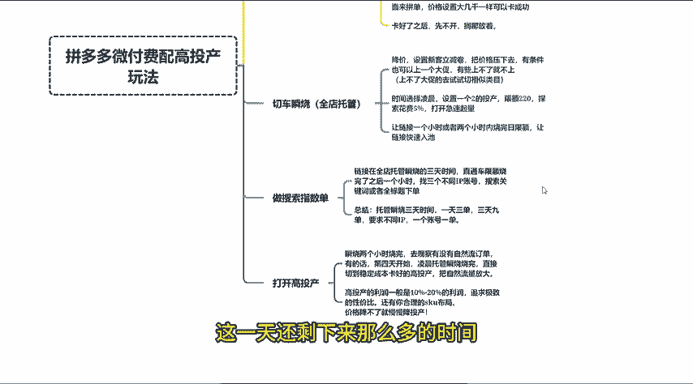
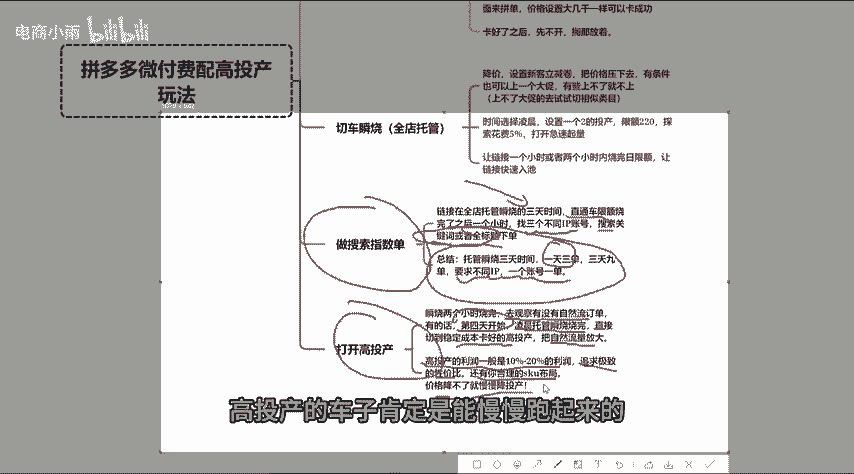
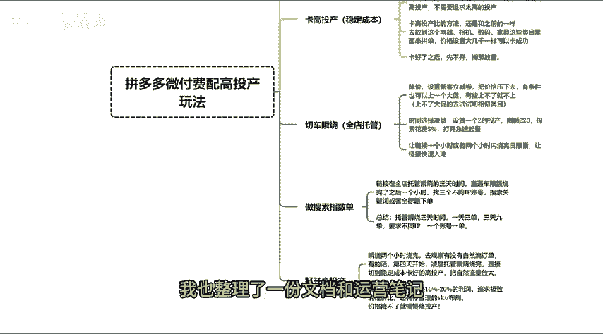

# 拼多多最新微付费配高投产玩法！切车瞬烧操作思路！ - P1 - 电商小雨 - BV1MfmNYRE4Q

今天来分享一下最近比较火的一个微付费配高头产的一个玩法。这个玩法呢就是用比较低的推广费用去获取一个比较高的营业额。当然这个玩法的核心就是一定要有足够的性价比，也就是你的价格要足够的低。

你最终售卖价的利润一定是在10%到20%左右。然后我们来讲一下整个链接的基础布局。首先是销量正常改个10万加销量，200个基础评价，50个DSR出店铺评价分，店铺成绩要拍到三级或者是4级。

这些基础是你一定要去完善好的。那么下一步呢就是要去卡我们的高头产链接虚高定价上架以后，我们去稳定成本卡一个30到40的高头产，不用追求特别高的投产，卡高投产比的方法呢还是和之前一样。

放到这些电器相机数码家具这些类目来拼单价格设置大几千，一样可以卡成功。卡好了之后呢，这个稳定成本的车子，我们先不动搁那放着。然后。

我们手动降价或者是活动降价，设置一个新客立减券，把价格给它压下去。有条件的也可以尽量是去上一个大促。如果说大促上不了的，那么你就得切到34类目去上。

接下来我们要去打开全店托管时间尽量是选择凌晨或者白天也可以设置一个二的投产限额220探索开5%开极速起量。这样是为了链接一个小时或者两个小时之内快速烧完日限额，让链接快速入职。那烧完了日限额之后呢。

这一天还剩下来那么多的时间就要配合我们的指数单去进行操作链接在全店托管，顺烧的3天时间，直通车限额烧完之后过一个小时，找三个不同IP的账号，没有浏览过这个店铺的账号搜索关键词或者是搜索全标题进店铺下单。

托管顺烧3天时间烧完之后操作指数单，一天操作三单，三天操作9单。

要求不同IP1个账号一单。这三天时间，你稳定成本的高投产是不用打开的。托管顺烧两个小时烧完，去观察有没有自然流订单，大概率是有的。因为你的利润控的相对比较低，而且还配合了指数单。

那么第四天开始凌晨托管顺烧烧完之后，直接切到稳定成本卡好的高投产，去把自然流量放大就可以了。最后讲一下重点，高投产的利润一定是10%到20%的利润去追求一个极致的性价比，还有你合理的SKU布局。

高投产的车子肯定是能慢慢跑起来的，跑不起来就慢慢降头产。好了，还有什么不懂的，我也整理了一份文档和运营笔记，有需要的评论区找我拿。

