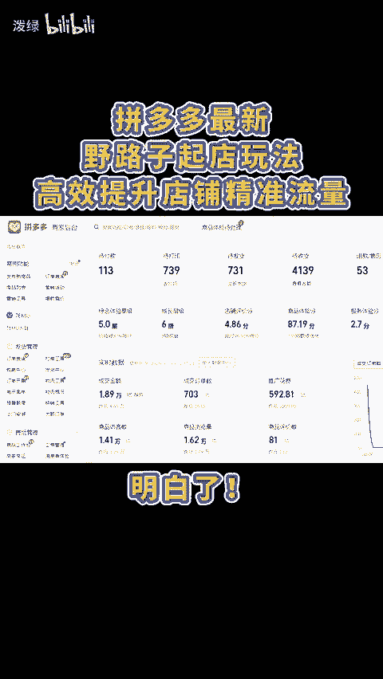
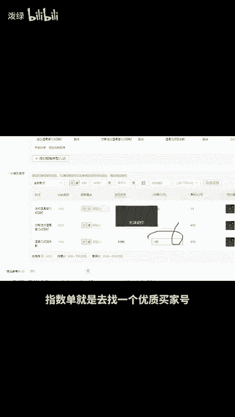
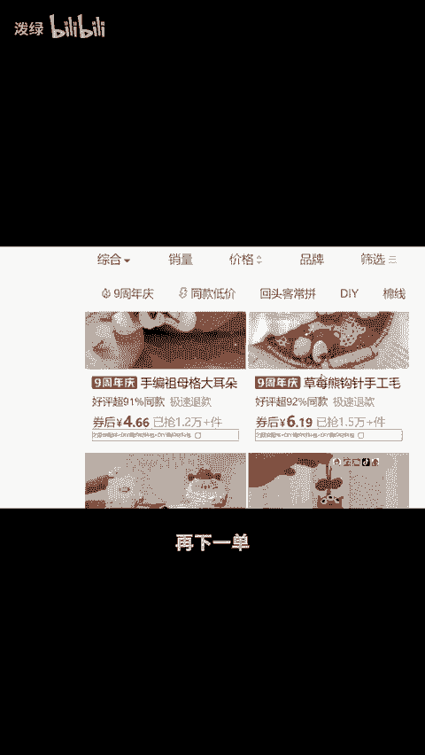
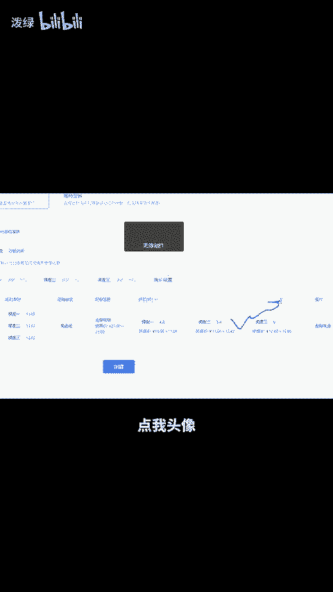

# 拼多多最新野路子起店玩法，高效提升店铺精准流量！ - P1 - 泼绿 - BV1hz2mYyEyM

拼多多最新也路丝起电玩法，高效提升店铺精准流量。明白，首先上个单价800并报名活动20981之后操作一单指数单，过一天价格降到700，操作两单，第三天降到600，操作三单，第四天降到三倍售价，做五单。

第五天降到正常售价，做十单指数单就是去找一个优质买交号，先货比3家，随便下一单，然后找到自己的链接再下一单，再退掉同行的订单，正常就能计入指数，接着打开直通车，流量会起来的非常快。

但流量进来后一定要学会做好流量承接，可以去创建限时限量购，设置三个梯度。第一梯度为亏。第二梯度保本。第三梯度赚钱，每当流量成翻倍上涨的时候，就可以直接结束当前梯度，跳到下一梯度。

这样既能借助流量还能有利润，还有不会的或想学习更多运营技巧，点我头像。😊。

