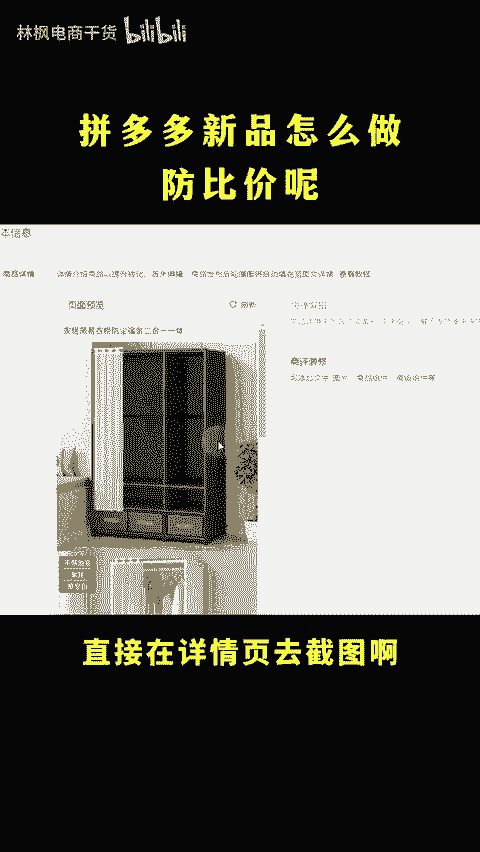
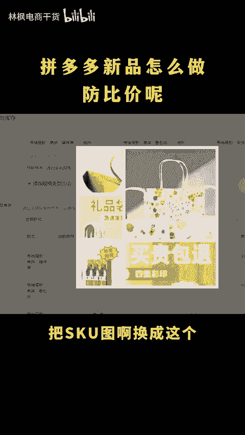
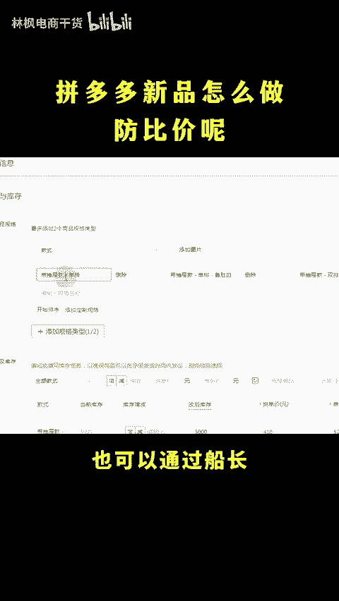
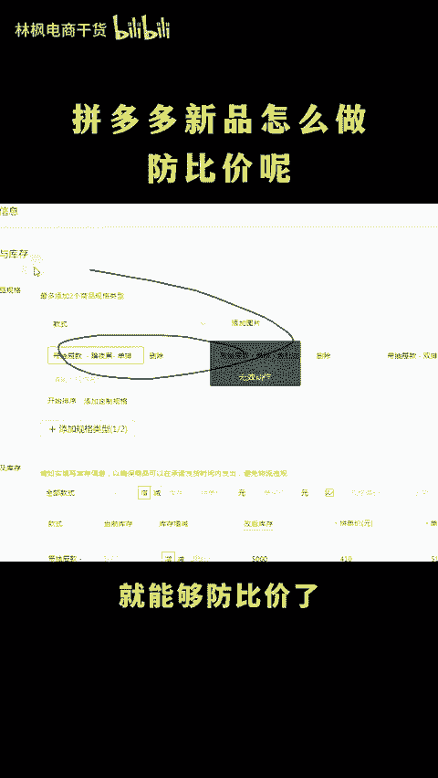
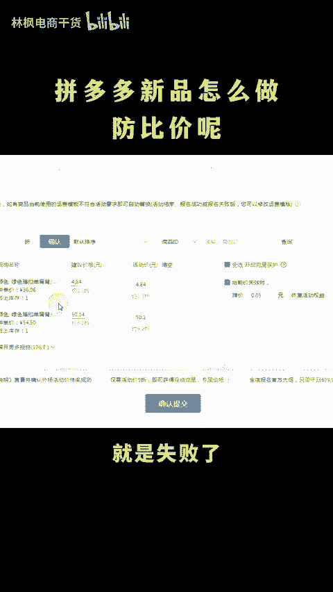
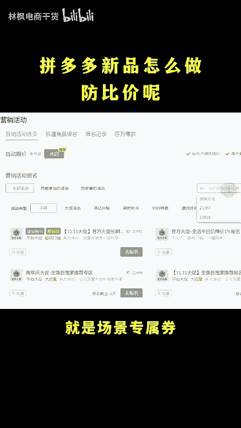
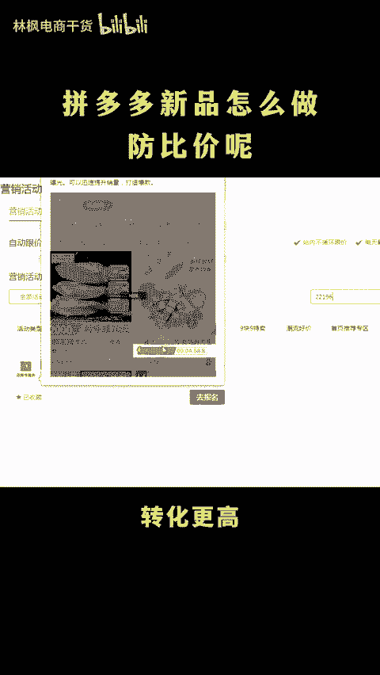
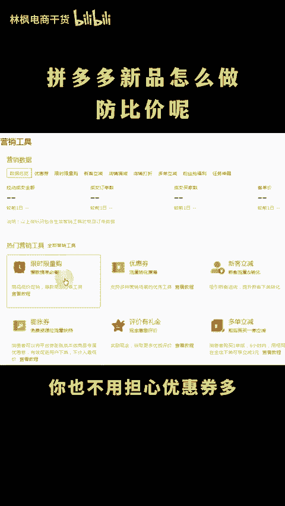
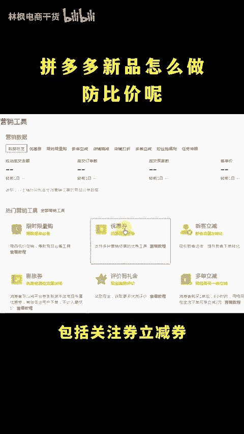
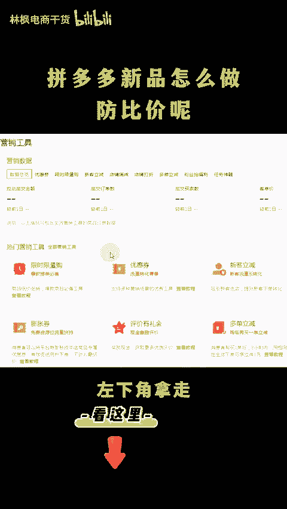

# 拼多多最新防比价技巧是什么？ - P1 - 林枫电商干货 - BV1Av22YbEba

拼多多新品怎么做防比架呢？防比架还不简单吗？比价不就是比的定价嘛，你把价格做到极市，就不怕被比价啦。😡，怎么正确做仿比价呢？随着比价技术更新啊，只调着SQ文字没有用了。你要把SQ图片也替换掉，点个关注。

点个赞，直接看实操。😡，直接在详情页去截图啊，凑5张，然后呢通过做图软件拼成这种拼图，把SQ图啊换成这个，再把SQ名称里面的符号轻微的调换一下就行。也可以通过传展把字符突破一下限制，多加形容词。

数字进量单位更换就能够反比价了。想要知道有没有反比价成功也很简单。你随便报个活动进去看一下价格显示活动要求多少折，这就是反比价成功了。如果显示同管最低价就是失败了，就再去重新调整一下，想要做低价引料啊。

也可以试试这个活动就是产品专属券22196长期活动不仅有这种闪电的限时优惠标志，转化更高，还有专属的搜索推荐权益，比你做限时限量更好用。你也不用担心优惠券多，导致没有利润。因为绝大部分优惠券都不会叠加。

包括关注券立减券，哪个金额大就算哪一个亏不了的，更多运营技巧整理成文档了，左下角拿走。😊。

