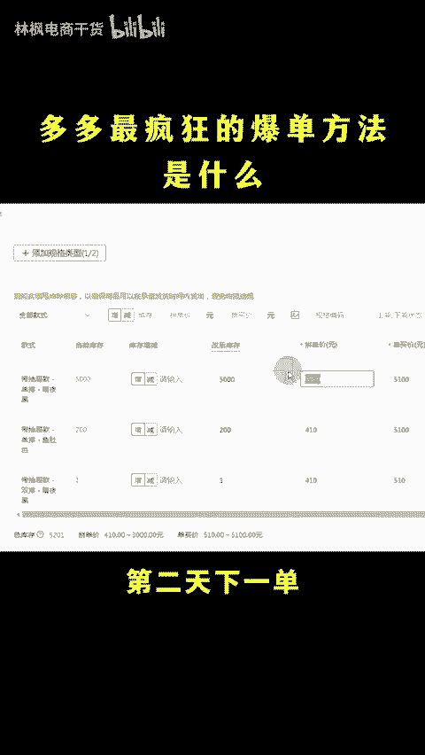
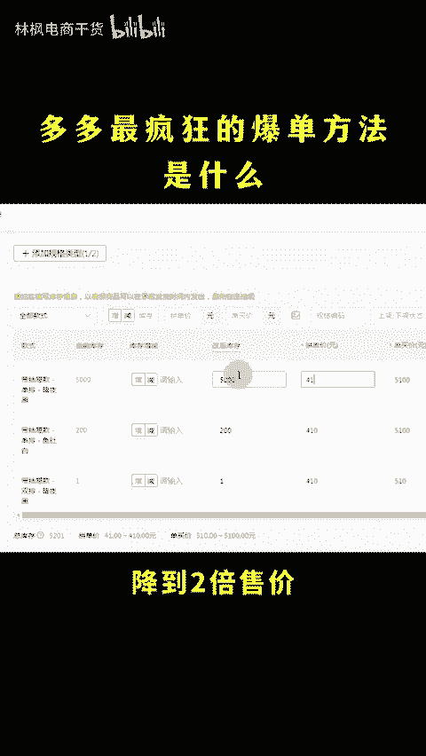
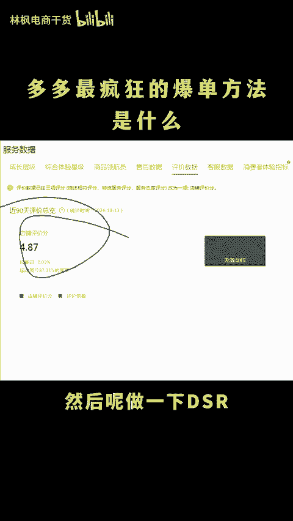
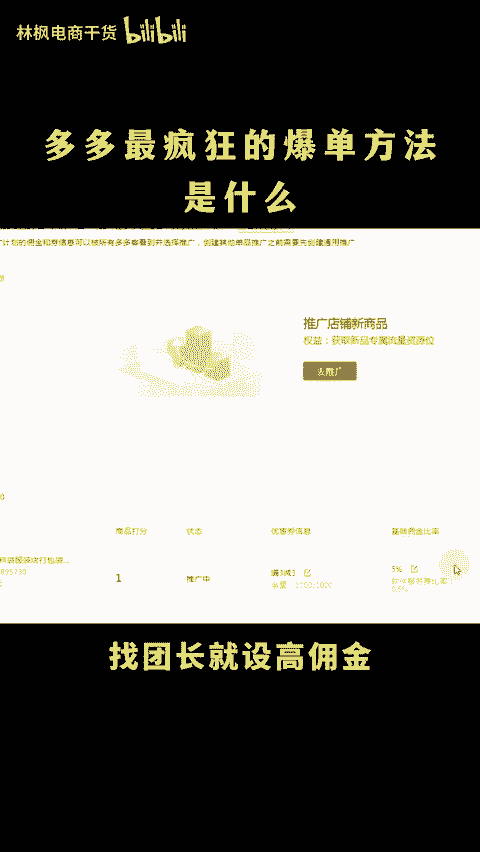
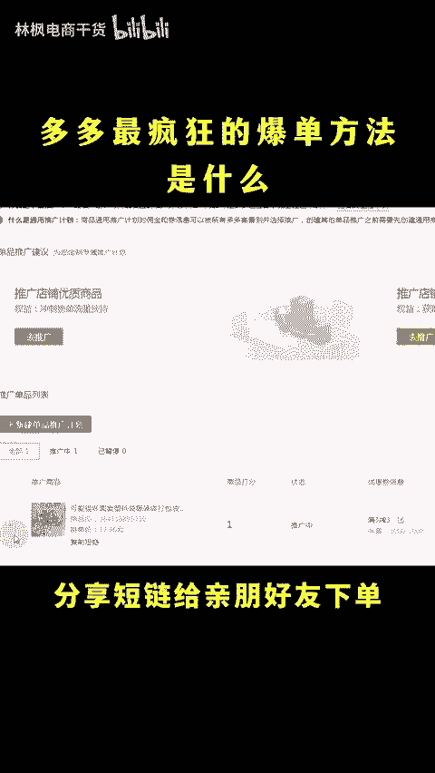
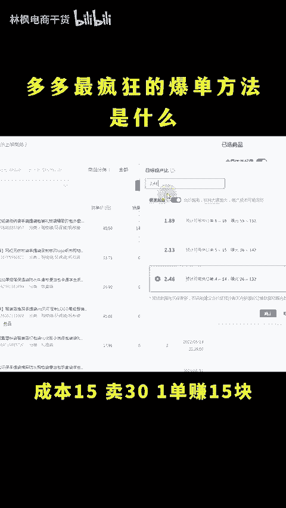
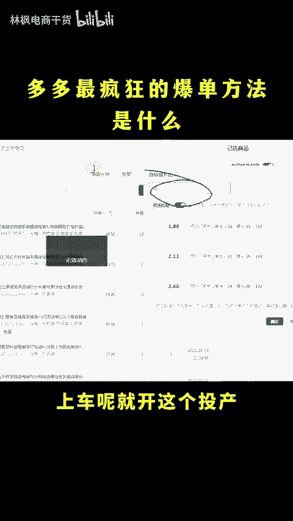
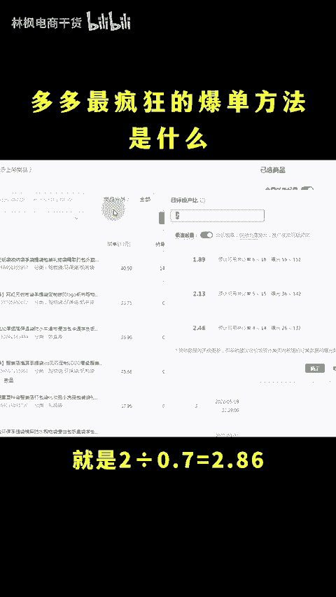
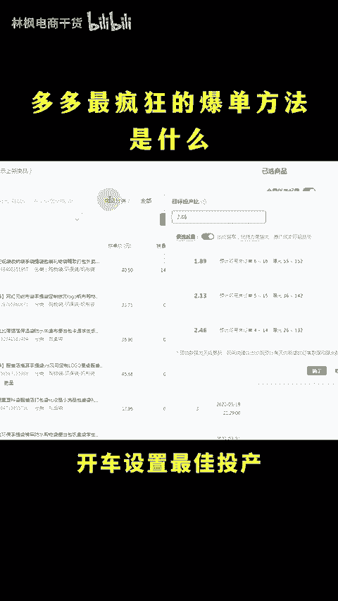
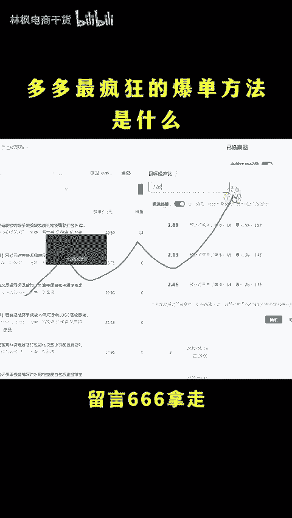

# 拼多多最疯狂的爆单方法是什么？ - P1 - 林枫电商干货 - BV1Mz2RYZEPQ

拼多多最疯狂的蹦店方法是什么呀？先摸摸你的口袋，资金多的，每天限额一两千跑直通车，资金少的低价跑活动，持续一个周期，石头也能给你卖爆了。😡，🎼Oh my god。ああ。怎么快速起播单品。

做多多想做的就得让平台认为你在持续降价，只有跟着平台的接着去操作，跟着风口走才能够起飞。具体流程看操作。😊，这个玩法的核心啊还是产品定价，不管你想卖多少，都先定价3000，然后呢报个大促。

第二天下一单降到2000，第三天下两单降到1000，第四天下四单降到两倍售价，第五天下8单，用限时限段购降到正常售价。然后呢做一下DSR打开直通说流量就能够涨得飞快了。DNR不会做的，直接走进榜。

找团长就售高佣金，自己分享就低佣金，分享短链给新朋好友下单，出50条有效好评啊，就能够出DNR直通车可以这样去开成本15卖30，一单赚15块。保本通常呢就是30除以15等于2上周呢就开这个头场。

然后再统计签收率，比如说有30%的退货。进头脑呢就是2除以0。7等于2。86再乘以1。4就能够算出最佳投场，开车售的最佳投场，赚钱最多，更多运营技巧和计算公式我都打包好了，留言666拿走。😊。

