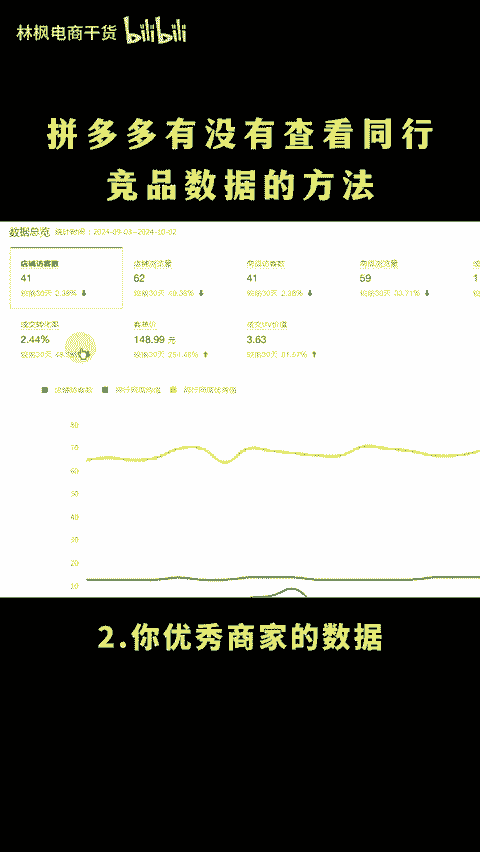
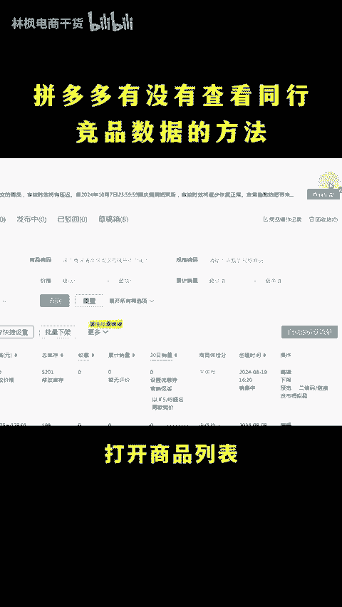
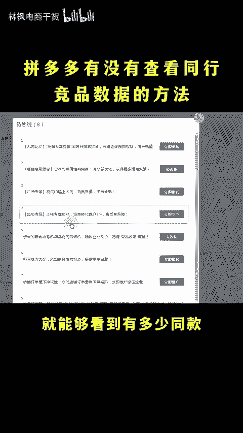
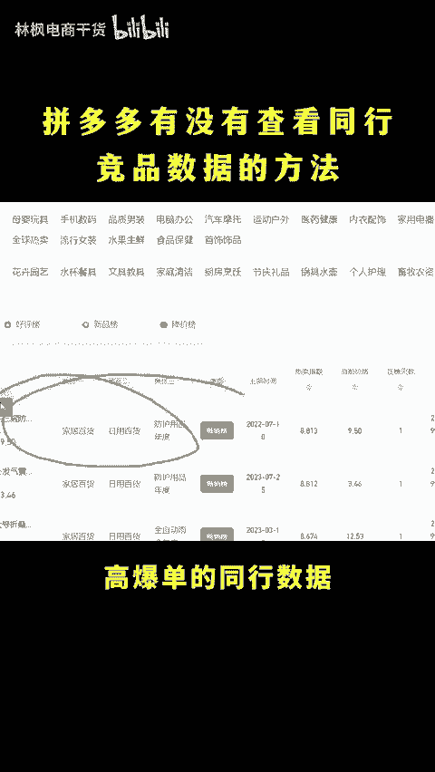
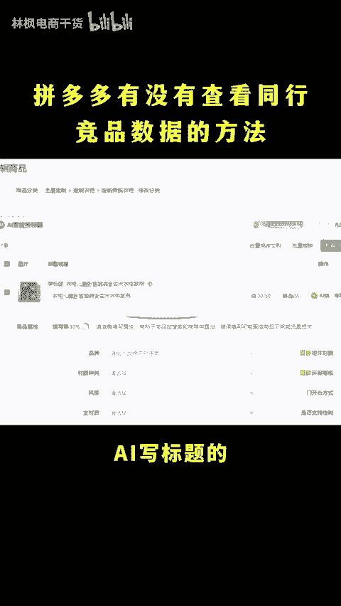
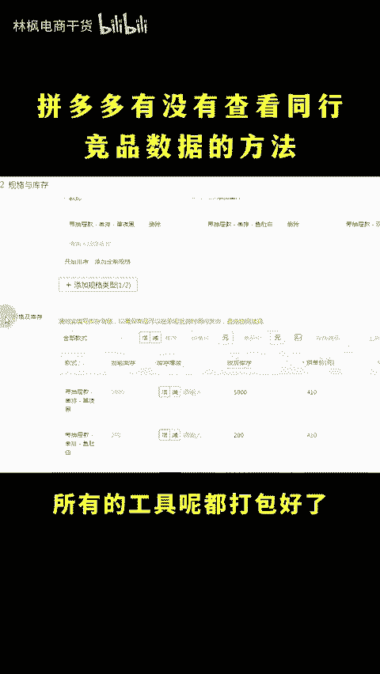

# 拼多多有没有查看同行竞品数据的方法啊？ - P1 - 林枫电商干货 - BV1oM4FeQEHc

做多多有没有查看同行产品数据的方法呢？请同行戳一顿，让他给你看一看就是了。商场不一定要打打杀杀，还有人情世故。

nice，怎么查看同上数据呢？我这里有三个渠道，用好了，直接抢光头道的流量，大家可以点赞收藏一下，直接上1送啊。🎼这三个渠道分别是一可以查看和你比价抢流量的同款。2、你优秀商家的数据。

3、你内目干爆账的数据。第一个可以直接在后台打开商品列表，点击右上角的这个查看全部看这小通知，打开呢就能够看到有多少同款在和你比价抢流量。第二个。

在流量数据的流量看板中就可以查看同样同城优秀的商家的数据。第三个，店主打开你的类目版单。在这里可以查看高爆单的同样数据，最后再教大家一个不用降价就能反比价的技巧，就是学会使用这3个AI反比价的工具。

就能解决AI做主头的AI写标题的，还有AI写SQU反比价的，不知道怎么操作的，扣6问我，所有的工具呢我都打包好了，想要的看这里。

