# 拼多多标题前加四个字新品也能7天访客破千！ - P1 - 林枫电商干货 - BV1w1sZeREy6

🎼现在做拼多多上的新链接啊，你只要标题前面加上这四个字，链接就能直接起飞。当然这里呢不是让你加什么拍一发二支视景退款这种无下限的手段。今天我们要讲的内容呢，只要你的标题搭配好营销手段。

就能够获得平台的免费推流。新店想吃到今年电商的红利啊。那么接下来的操作一定要仔细听，认真学新手一次听不懂不理解的建议，点赞收藏起来，多看几遍。接下来上实操，首先打开店铺后台，在发布产品的时候。

不要直接点击发布新商品，这里去发布。我们要先找到商品列表。然后呢从这个机会商品入口这里去发布同款商品进来之后我们再点击消费者正在搜并商品景需的入口，这个是目前热度高，但做的人很少的一个流量入口。

选择好你的二级类目，然后排序，这里按照热度去排序，然后我们要选择热度高的产品去发布。这样新品就能够获得新品标以及机会商品标，点击发布同款的时候，一定要手动去编辑修改你的主图标题和S这三个地方。

首先主图我们可以看到这里只会默认一张同款图片，想要曝光点击更多呢我们就要。

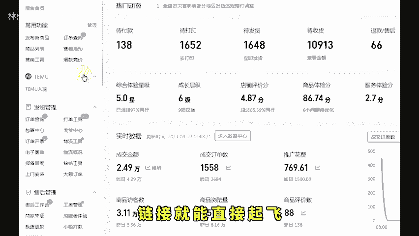

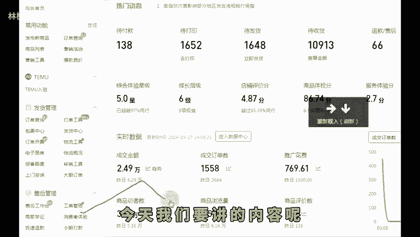

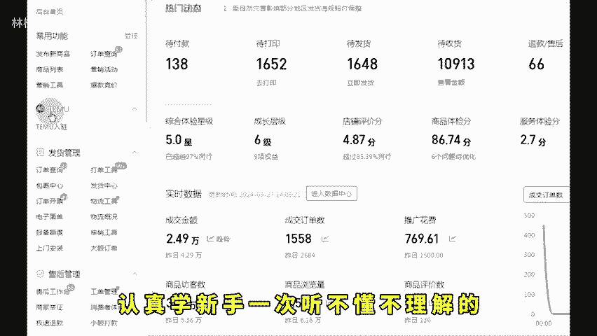

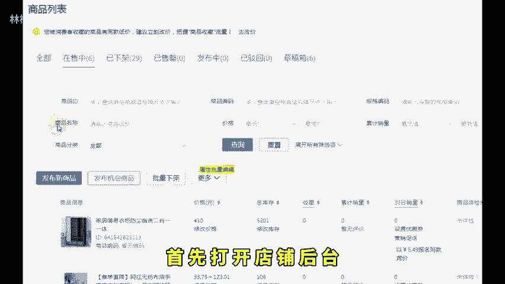

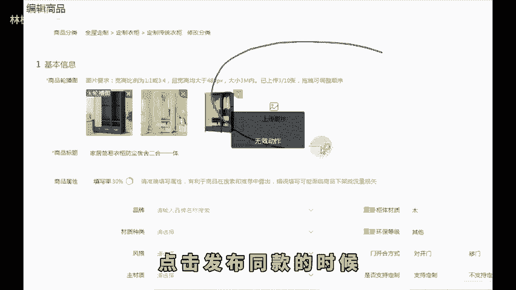

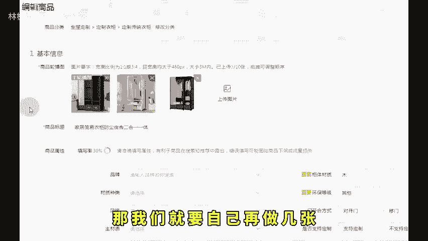

🎼再做几张码点图片上去，然后进行第二步操作。这一步啊非常关键，做好这一步，你的自然流量才能跟同行拉开差距。就是在我们的标题前面加上新客立减这四个字，我们通过这四个字呢再配合接下来的操作。

在后台的店铺营销里面找到营销工具。然后再点击新客立减。我们看到这里啊有个自定义创建，点进来之后呢，选择好你刚才上架的产品，然后优惠券设置成3块钱，点击创建就可以了。创建成功之后呢，这个链接有三重加持。

机会商品标新客立减营销文案，再加上新客立减券，既有权重，还能提高转化。当然了，到这里呢还没有结束。最后一步防比价Sku咱们只要把这一步做完，就能够与同行错开类目流量，能更好的把店铺运营起来了。

仿比价就不做过多叙述了。大家可以直接利用这个爱的仿比价工具，只要把这套Sku全部导入进来，点击生成系统呢就会自动生成防比价的规格，然后我们再搬运到链接里面去就行了。还有不会操作的左下角。

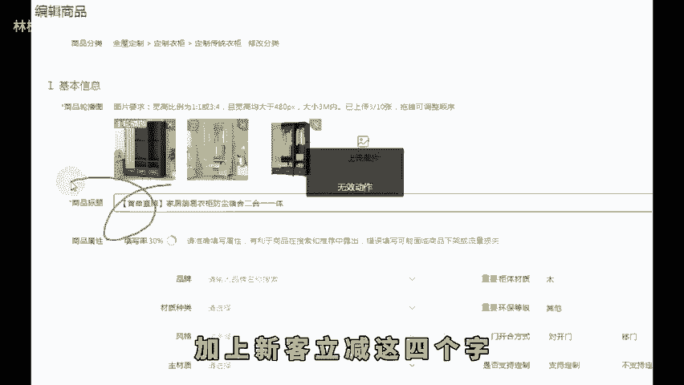

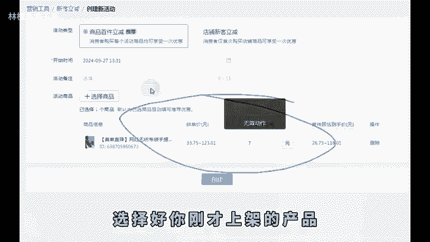

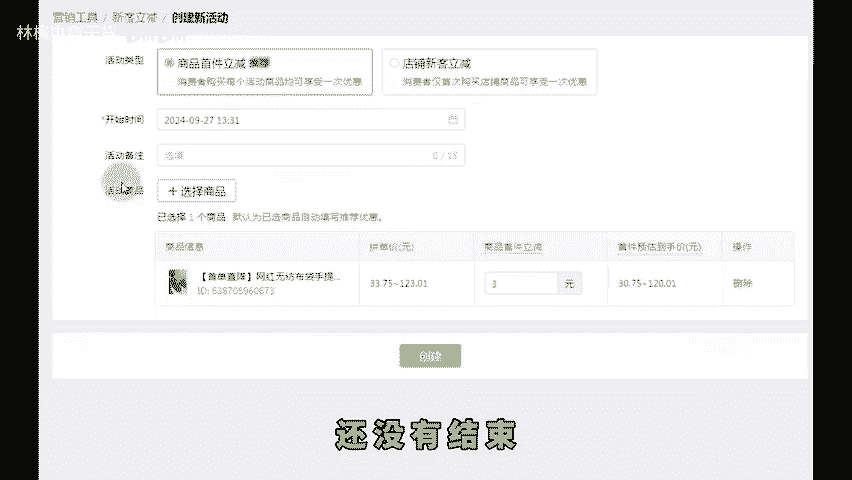

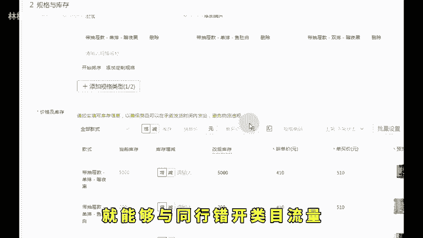

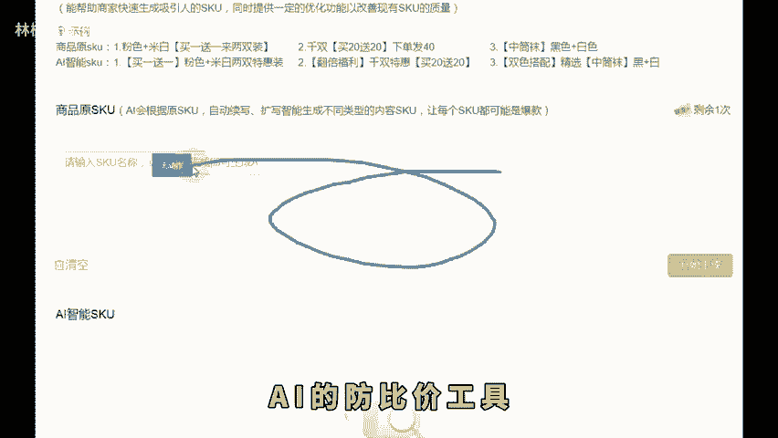

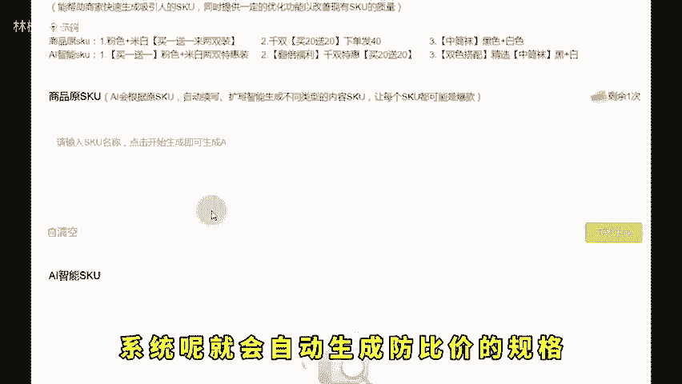