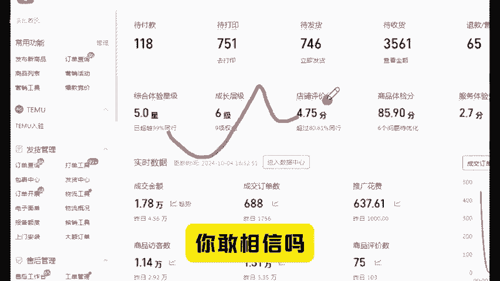
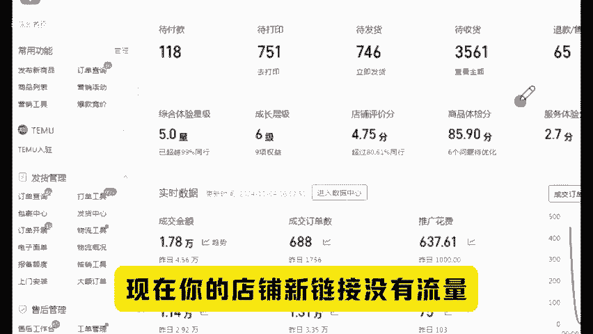
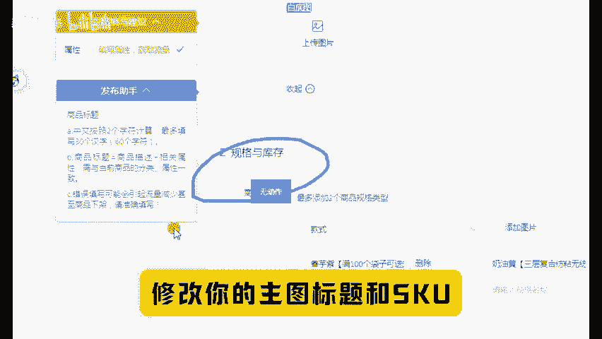
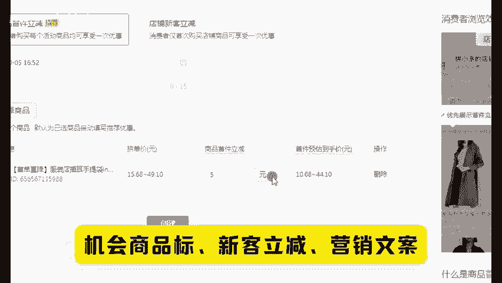
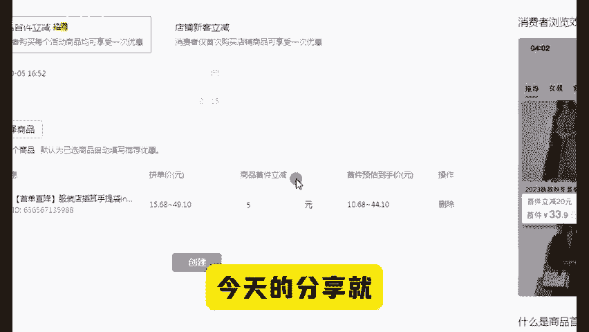

# 拼多多标题前面+4个字，新品快速爆发流量 - P1 - 森森2906 - BV1kx1RYCEMz

现在做拼多多只需要标题，前面加几个字，新品就能快速爆发流量，你敢相信吗？只要你的标题搭配好营销手段，就能够获得平台的免费推流。现在你的店铺新链接没有流量，就是没有权重所导致的。

所以我们想要新链接短期内起爆，并且呢吃到今年电商的红利啊。那么接下来的操作一定要仔细听，建议点赞收藏起来慢慢看。首先我们先打开店铺后台在发布产品的时候，从机会商品入口，点击消费者正在搜。

选择热度高的产品去发布，这样呢就能够获得机会商品标，一定要手动去编辑修改你的主图标题和SKU这三个地方，主图保留一张，其他可以自己做几张码扁图片上去。我整理了一份为码扁文案合集，有需要的后台扣一。

我们的标题怎么写呢？一般我们都是按照这个三个万能标题组合公式写的，下拉框词是核心词加长尾词加冷门词。品牌词加类目词加核心词加属性词，热搜词加核心词加营销词加产品卖点标题写好之后进行第二步操作。😊。

这个是制作一个神级标题的关键。有了这一步，我们才能和同行流量拉开差距。就是在我们的标题前面加上新客立减或者首单持项这四个字，消费者一般都会认为这是官方打上的标签，最后再搭配一个新客立减券。

面额看情况设置，这样操作完，这个链接有三重加值机会。商品标新客立减营销文案，再加上新客立减券，既有权重，还能提高转化。今天的分享就到这里了。还有什么不懂的点赞关注，找我领取一份运营文档。😡。

