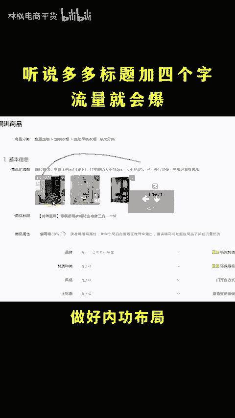
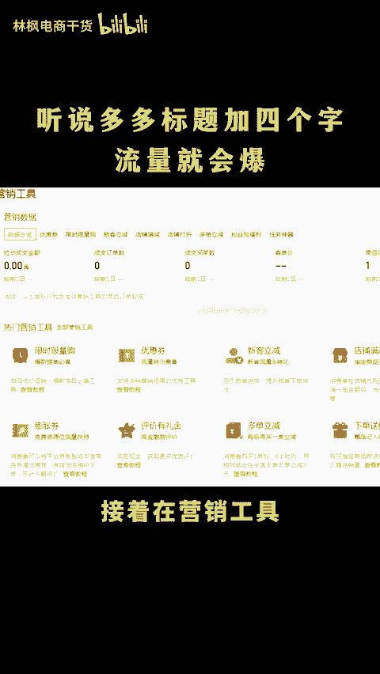
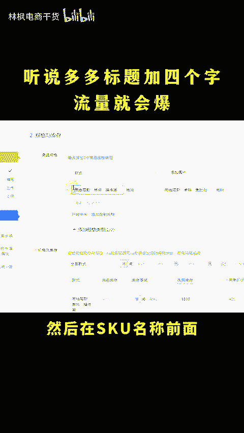
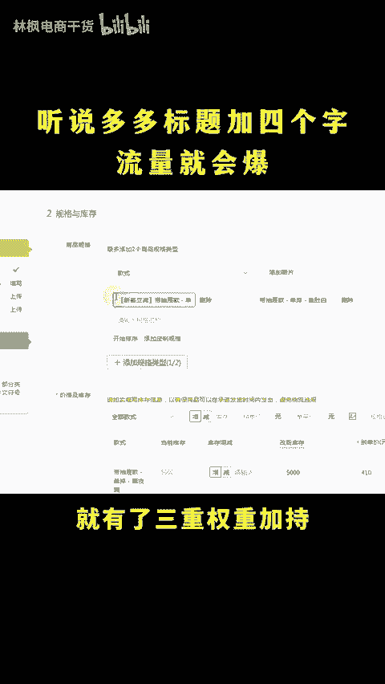
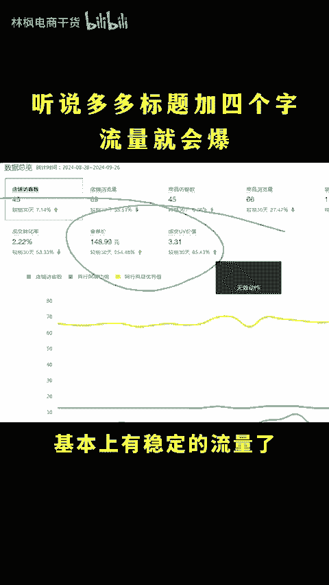
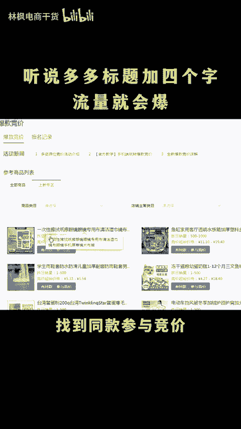
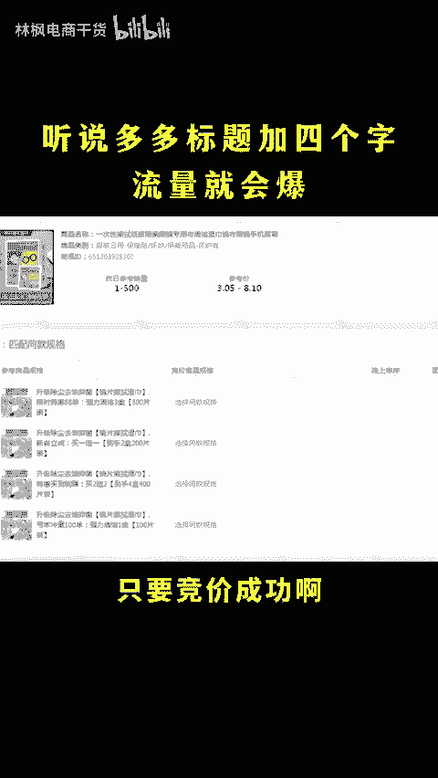
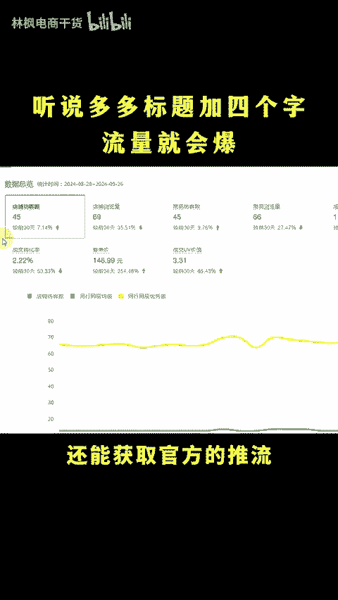

# 拼多多标题前面加上这四个字新品也能引爆流量！ - P1 - 林枫电商干货 - BV1Wwxue9EQN

听说做多多只要标题前面加上四个字，流量就会爆发，是哪四个字呢？当然是买一送一，支是请侣款呢。🎼my god拼多多标题前加几个字就能爆发流量，是真的吗？记住这个操作，就在标题前面啊加上4个字。

90%的链接都能够引爆流量。大家可以点赞关注一下，直接上实操。首先发布产品啊，从机会商品入口去发布，做好内功布局，重点在标题这里，直接在标题前面加上首段折量或者新客立减，记着在营销工具。

设置一个新客粒减券，面额呢设置5块钱左右，然后在SQ名字前面也加上新客立减文案，上价提交就可以了。这样新品呢就有了三重权都加持机会商品标新客立减以及营销文案，权重直接拉满。这个时候基本上有稳定的流量了。

记着我们打开后台找到爆款进价，在这里选择上新专区，找到同款参与进价，找到同款热销规格，选择三个进行比价。只要进价成功啊，就能够一键进成竞品的销量评价，提升产品的转化，还能获取官方的推流。

还有不会的左下角。😊。

