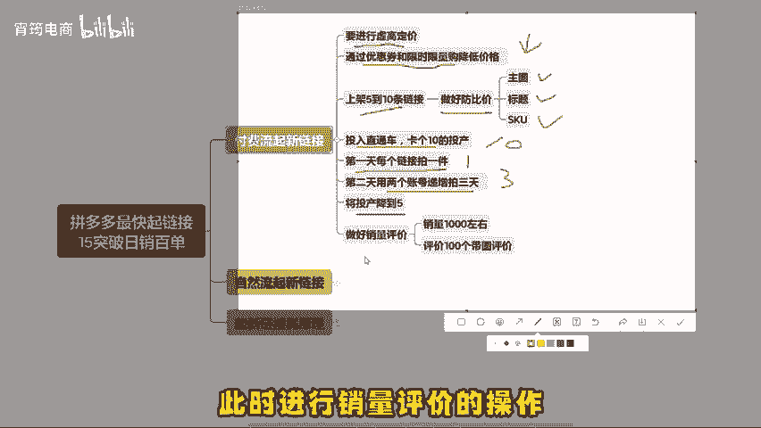
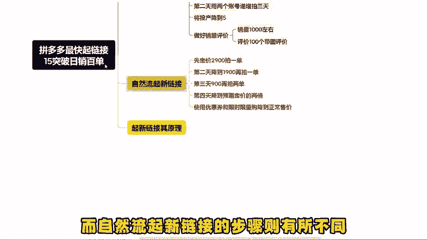
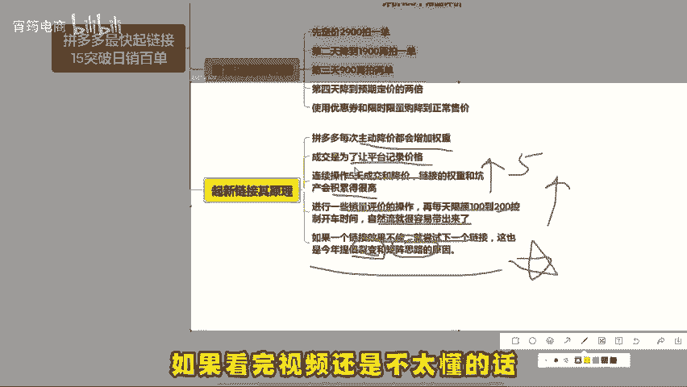
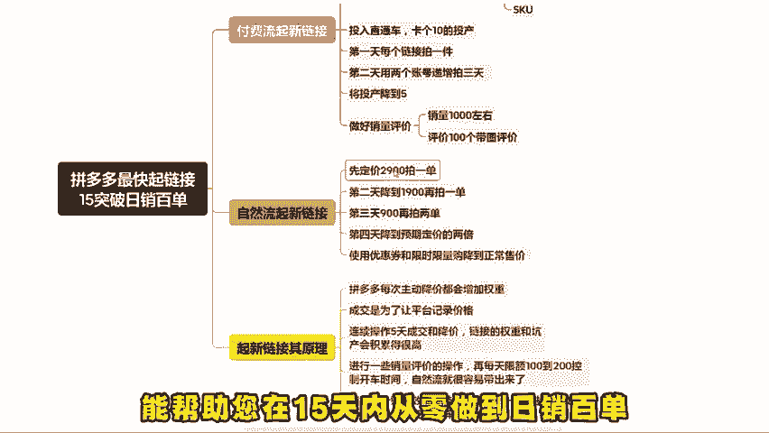

# 拼多多没流量没单量，最快起链接的方式，15天实现日销百单（拼多多开店｜拼多多新手｜拼多多运营｜拼多多实操） - P1 - 宵筠电商 - BV1CrxrejEdY

在拼多多平台上起新链接，需要有明确的思路和正确的操作方法。无论是选择付费流量还是免费流量，都要有清晰的方向。如果说你看完这个视频还是不太懂的话，我准备了各个类目的实操文档以及最新玩法的拆解步骤。

你也可以根据实操文档来操作。对于付费流起新链接，首先要进行虚高定价，然后通过优惠券和限时限量购，将价格降至预期售价，同时上架5到10条链接，注意做好防比价工作，设计差异化的主图，标题和SKU。

并将这些链接全部投入直通车卡个石头投产。接下来找买家号下单，第一天每个链接拍一件。第二天用两个账号递增拍3天，将投产降到5。此时进行销量评价的操作，再去开直通车会容易许多。

而自然流起新链接的步骤则有所不同，先定价2900拍一单，第二天降到1900再拍一单。第三天900再拍两单，第四天降到预期定价的两倍，然后使用优惠券和限时限量购降。

到正常售价，其背后的原理包括拼多多每次主动降价都会增加权重，成交是为了让平台记录价格，连续操作5天成交和降价，链接的权重和坑产会积累的很高。这个时候呢，进行一些销量评价的操作。

在每天限额100到200控制开车时间，自然流就很容易带出来了。如果一个链接效果不佳，就尝试下一个链接，这也是今年提倡裂变和举证思路的原因。总之，真实的起链接过程中。

从定价防比价、SKU规划到测链接等步骤缺一不可。好了，今天就分享到这，如果看完这个视频还是不太懂的话，可以找我领取实操文档也可以提问。或者说你需要我去给你做店铺诊断的，也可以来找我。

最后希望这些操作流程能帮助您在15天内从零做到日销百单。

