# 拼多多王者终极起店玩法-自然流量起爆900单，完整精细化运营流程！ - P1 - 白羊说电商 - BV1YcxKeoEWY

拼多多商家朋友大家好。最近有粉丝朋友问我。😡，他的店铺没有流量，没有订单，问我应该怎么办？😡，这期我给大家分享拼多多王者终极起垫玩法。这店铺是我9月初注册的，昨天还只是300单左右。

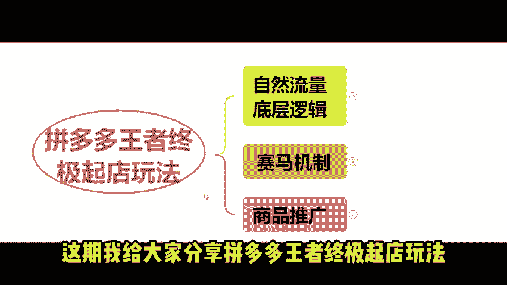

今天订单量飙升到900单。直接涨了3倍，流量访客都已突破2万。

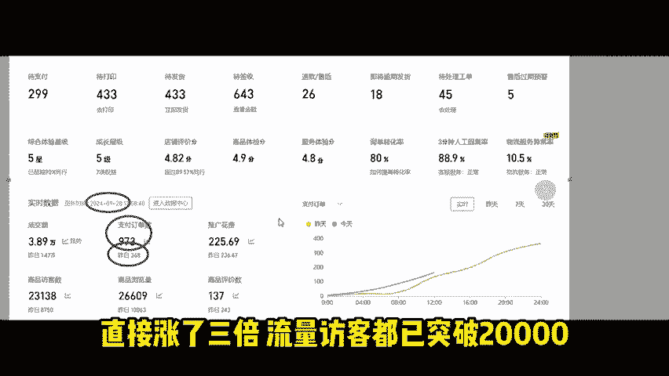

下面我就将这套拼多多起垫思路分享给大家。这玩法有三步，每步都是相互关联的。只要你每步都落实好了。😡，店铺就能轻松做到日发百单都是小问题。做拼多多店铺没你想的那么复杂。😡。

同时我也为大家准备了与视频配套的实操文档学习，放在下方评论区。

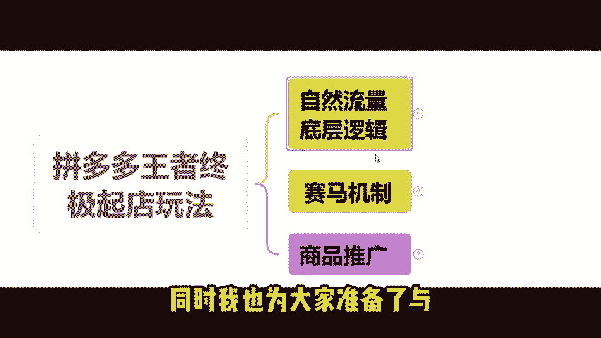

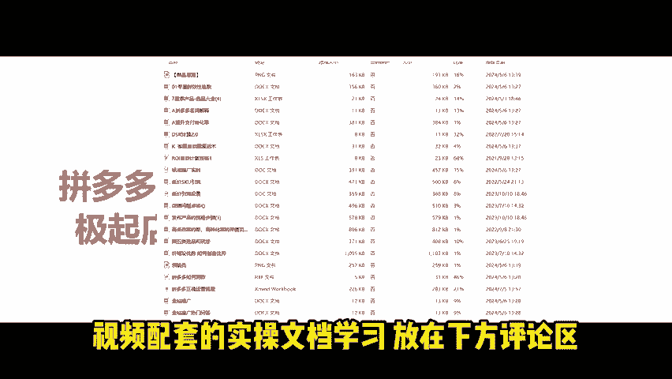

大家可以结合实操文档一起学习，效果肯定更好。现在很多拼多多店铺基本说都是靠强付费在维持流量。拼多多的流量都是平台花钱维护的。比如砍一刀领100元现金。砍一刀免费拿以及拉新平台注册商家。

拼多多是非常注重性价比的平台。买家买东西也追求性价比。如果所有的商家他都去做强付费，没有自然流量。拼多多平台的产品价格，它就会越卖越贵。拼多多上的有些产品卖的比淘宝还要贵。这样下去。

拼多多的消费人群就会急剧减少。平台需要一部分商家去做一些极致的性价比。去维护平台的客户。加强与拼多多消费者的用户粘性。

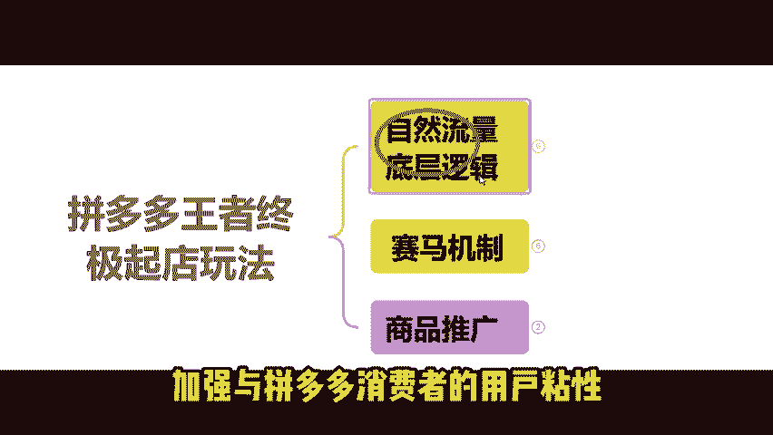

第一点，我们要从系统自然流量底层逻辑分析。系统首先考察你的店铺承接流量能力。

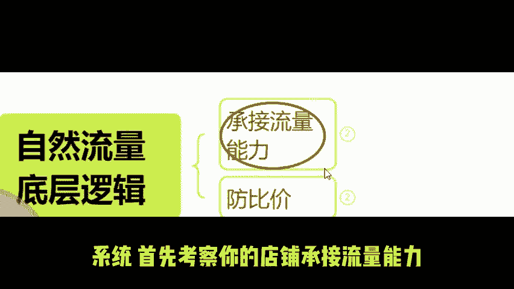

系统给你分配免费曝光。你能吸引多少流量进店，进而产生多少订单？在拼多多全网最低价的产品链接。拿到的免费流量肯定是最多的。但大部分卖家其实是做不到这个全网最低价。那我们可以做同款低价。

比如这款全网低价充电宝已经有10万家销量。再加上全网低价的标签。平台会对这种优秀产品大量流量扶持。当我们链接上架以后，防比价一定是要第一步去做系统给你的曝光。

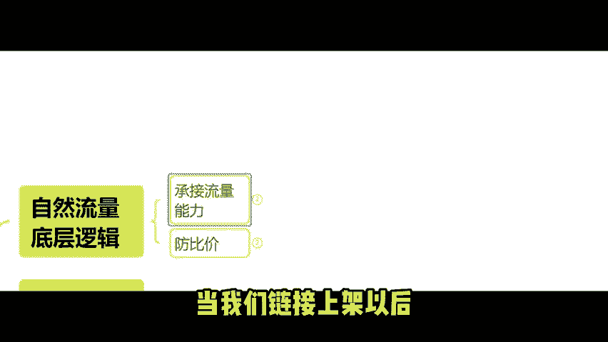

你的产品要有足够的吸引力，才会有流量进电。SKU规格外漏价一定要设置低价。SKU。

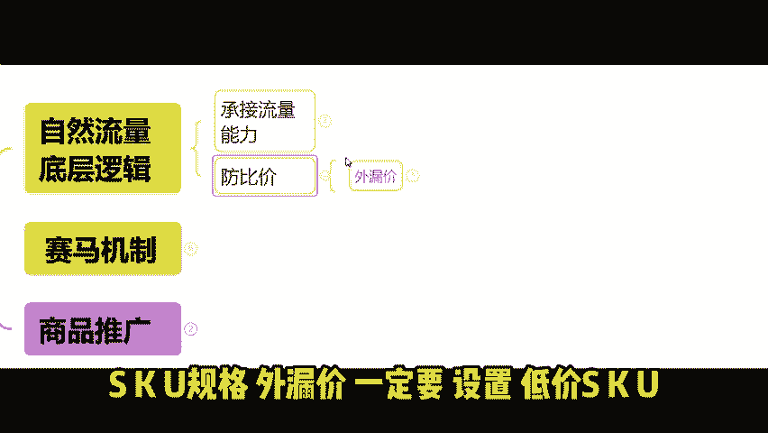

吸引消费者点击跟他们的价格一样。产品实物可以用试用装或者小样代替。

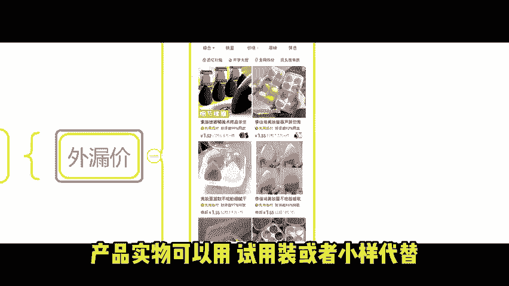

进店后的免费流量，你要能够有循单转化率。这是获取更多免费流量的前提。

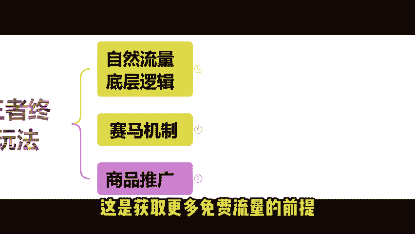

所以你的链接承接流量能力决定了你的流量获取上限。第二点，拼多多本身的赛马机制。

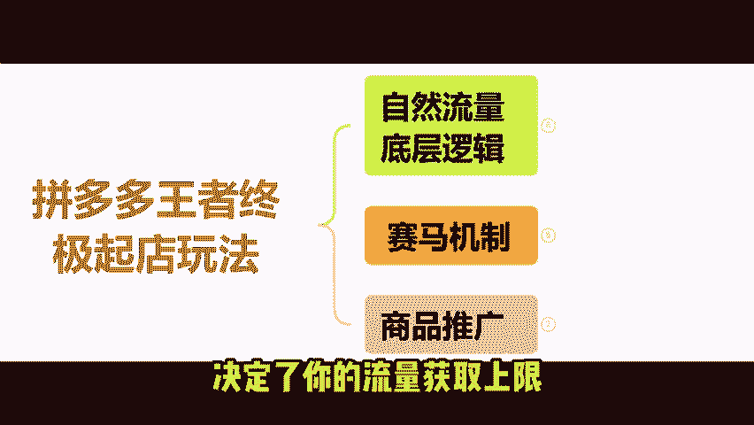

你想要更多自然流量，就需要你有更强的数据表现。😡，产品点击率、转化率这两大板块都要做好。

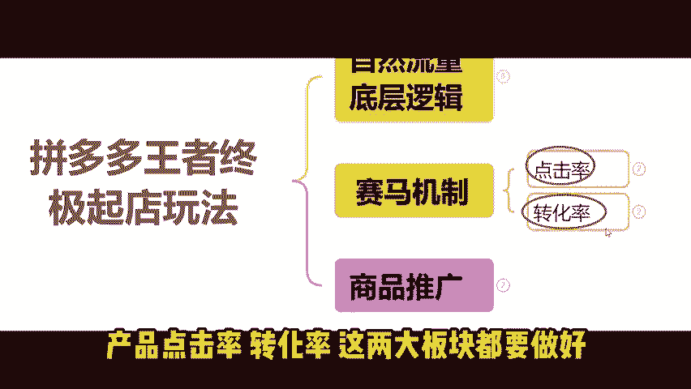

你的店铺转化率决定了你的自然免费流量上限。系统拿你店铺的GMV日销额跟你的同层级。同行业同产品进行对比。你各方面的数据都比同行好。平台肯定会给你分配更多流量订单。有新手卖家就会问我可以去补单吗？

理论上是可以的，通过找一些真实的客户去搜。产品关键词进入店铺买东西。确实是可以提高我们免费渠道的转化操作。搜不到产品的话，可以试下分享链接成交的方式。刷单平台不会抓你，而且也没有什么实质性的效果。😡。

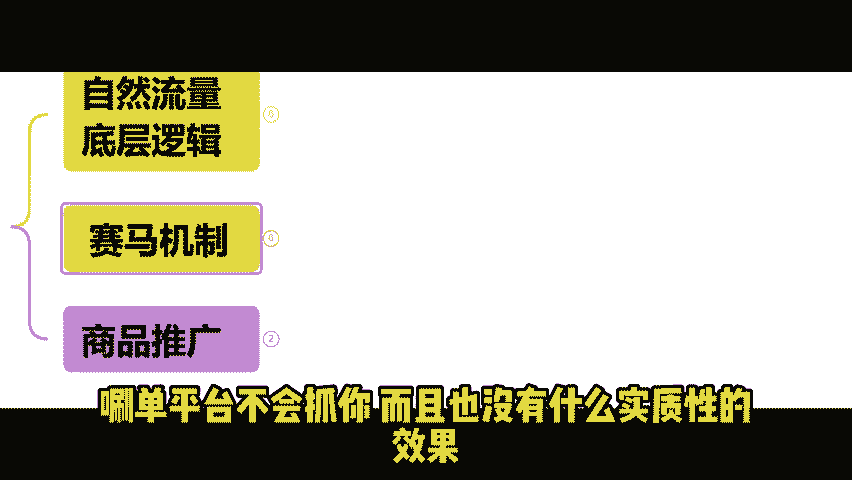

只不过是给你前期的产品做点真实销量评价。😡，刷单不能弄多了，多了会弄乱人群标签。😡，我们要知道现阶段平台自然流量的分配方式。平台的自然流量。现在都是由直通车商品推广去带动。

所以现在想做纯自然流量还是很有难度的。现阶段新链接上架。如果说不推广几乎是没有曝光的。没有曝光就不会有点击，不会有成交，不会有权重。😡，系统自然就不会给你分配自然流量了。😡，你开了商品推广，有了曝光。

有了点击。也有了成交，有了一定权重。就能够带来免费的曝光。付费流量和免费流量。他们是独立的付费的高转化。可以提高我们链接推广的免费流量。第三点，为什么你的商品推广带不动自然流量？😡。

因为智能计划有智能抓取客户的能力。如果智能计划认为这个客户他能够转化。那么高出价去抢这个客户的曝光。同一个客户只要有转化的概率。就大概率会被付费渠道出价抢走。免费流量渠道剩下的。

都是智能计划判定为无转化概率的客户。只要你开了付费推广。自然流量渠道里能转化的客户全部被付费、高出价转变成了付费的成交订单。从而不增加免费流量渠道的转化权重。所以我们就要控制我们的付费推广时间比例。

这里是重点。我每天先用3小时的时间去开直通车。产生交易权重在停车。

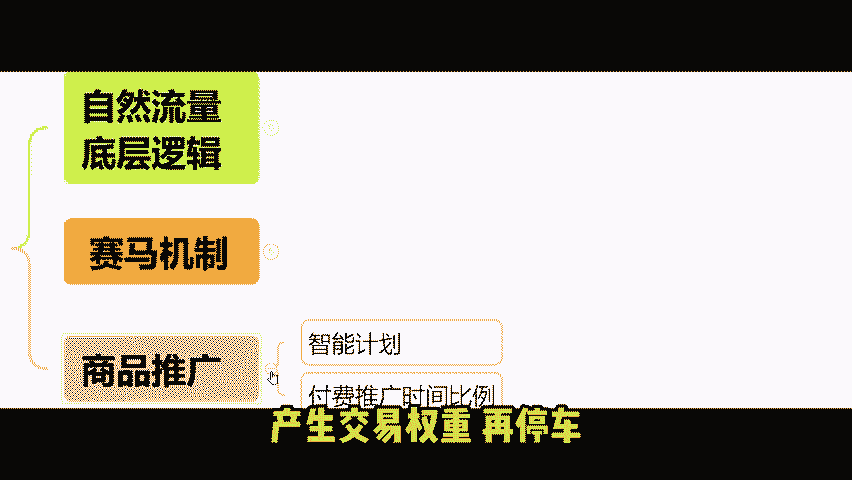

这不是王者起垫玩法的核心。先让自然流量不受干扰的去转化客户。积累我们免费渠道的成交额。让系统看到自然流量的转化能力。获取后续的更多的自然流量。办付费速度就要足够的快。所以我们需要提高我们日限额的速度。

提高我们推广成交的速度。因为你每天只有一部分的时间给你积累推广交易额。如果说你一天都花不完100，还谈什么自然流量。😡，拼多多的商品推广直通车，很多卖家升级后。

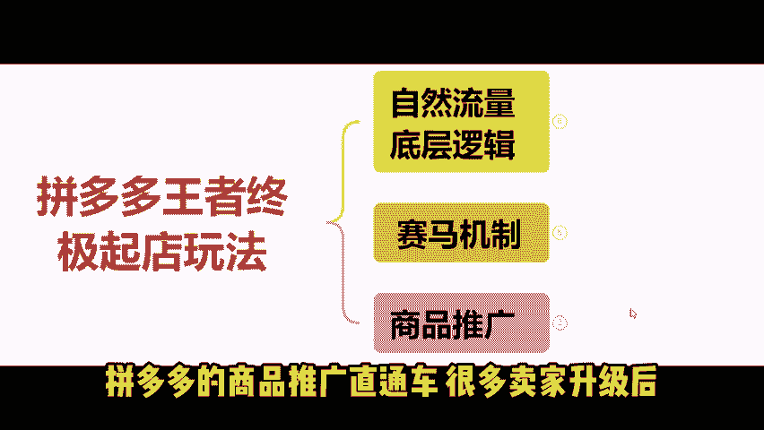

就遇到很多的问题，针对大家常见的拼多多店铺问题和直通车推广优化方法，我都有相关总结，大家可以去评论区领取。

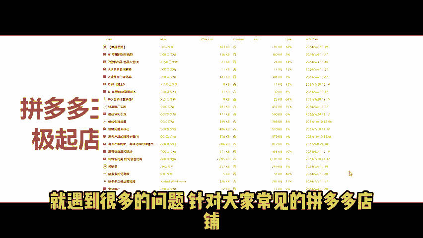

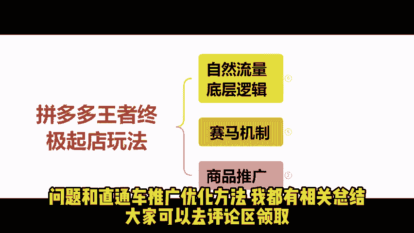