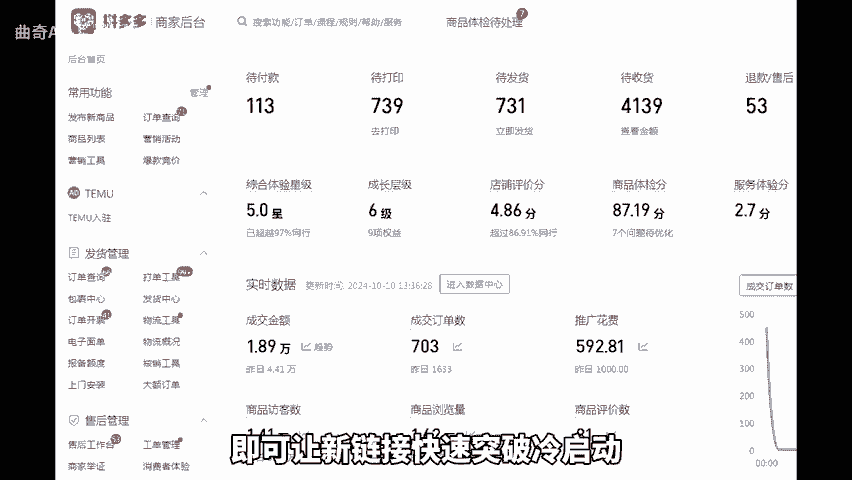
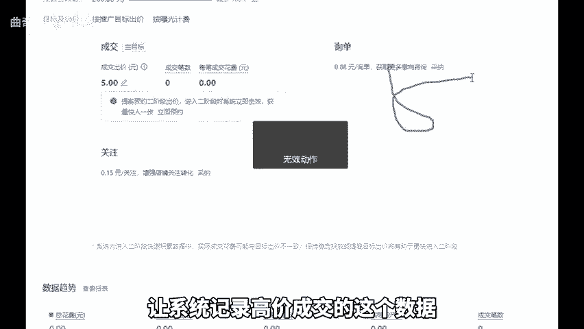
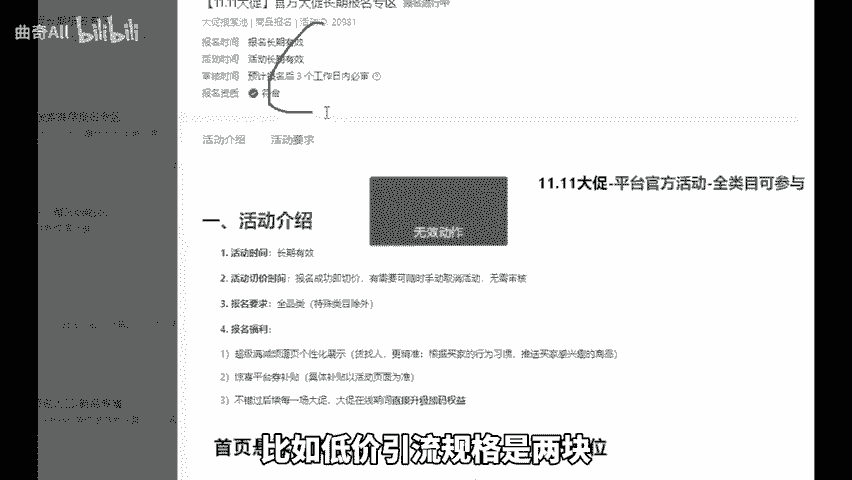

# 拼多多目前新手起链接最简易的方法，仅需这三个步骤 - P1 - 曲奇All - BV1JVmPYqEC7

拼多多目前其链接最简易的方法，请需三个步骤，即可让新链接快速突破冷启动完成起步。首先第一步，链接上架好后，先用另一个买家号搜索标题扫的产品，下一个大单，依次拍多件，金额超过5000就可以了。

这样能使新链接获得基础的坑产权重，提升出单概率。其实第二步定高价，并通过付费成交。预计售价10块的话，就将拼单价设为15到20块，然后开启直通车出价高一些，利用付费流量成交3到5单。

让系统记录高价成交的这个数据，然后第三步去卡一个活动，低价卡大促活动，价格越低越好。比如低价引流规格是2块，就把大促价格卡成2块，再用9折的活动，实现原价上大促，这样就能快速获得系统认可和推牛。

实现新品流量爆发。如果不会卡大促或卡不上去，卡上去，没有活动标的，可以翻翻前面的视频，有详细的步骤教程。好，今天的分享就到这里。还有不懂的，可以后台找我。

