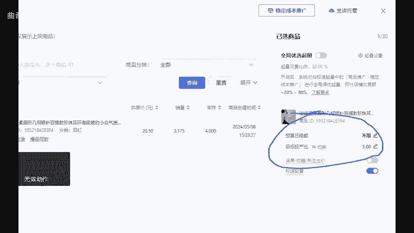

# 拼多多直通车全局优选不要盲目去开！避免血本无归 - P1 - 曲奇All - BV1qXxNeAET4

最近，拼多多开车的全局优选一定不要随意去开启。如果使用得当效果显著，不会使用就会血本无归，别把它当成傻瓜工具，否则容易被套路。那如何设置才能避免亏损前出单曝光效果好呢，点个关注点个赞直接上实操。首先。

全局优选适合在二阶段开尤其是二阶段出现断流的情况，效果定会让你满意。开启时需要调整体量花费比例。也就是假如原本打算花费100，加上这个比例后，相当于要花120%算到投产上。

比如设置为四的投产开启全局优选20%的比例，那最后真实投产就会直接下降约20%左右变为3。2左右的投产，这样很可能就亏了，并且引流效果也很差。如果你在稳定成本推广到二阶段时，感觉有点乏力。

比如你预设投产13，这个时候可先将投产上调10%，再把全局优选打开10%的比例。如此一来，一进一出实际投产不会相差太多。全局优选的功能就是在你罚利时为你助力。所以在保。

投产不亏的情况下，可以这样去操作，切勿在一阶段创建计划时，不注意就开启这个功能。一阶段使用纯粹是有钱没地花的做法。好，今天的分享就到这里，还有不懂的可以后台找我，不是为你解答。

还给你分享一份我整理的店铺综合营包。

