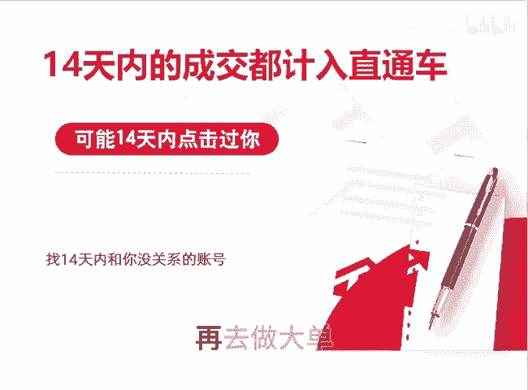

# 拼多多直通车是如何扣费的 - P1 - 千优电商教育 - BV13dC2YPEGu

很多朋友呢被扣了高额的推广费，却不知道为什么，就是自己做了一个大单，结果呢一扣好几百块。那为什么呢？就是你必须知道拼多多还有一个规则，就是14天内点击过直通车产生的成交都会记录到里面。如果你要做大单。

那你应该找一个14天内没有进店和你没有关系的账号，或者说呢你把它改成成交出价，因为投产比扣费比较高嘛，成交出价是相对固定，这时候再去做大单。我是讲师大牙，欢迎大家扫码添加我的微信。

不方便扫码的朋友可以添加我的微信号，80221430，在这里给大家准备到了一套新手运营入门的大礼包，希望能够帮助大家。😊。

