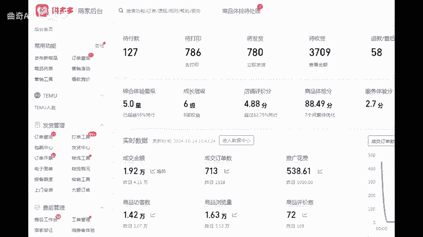
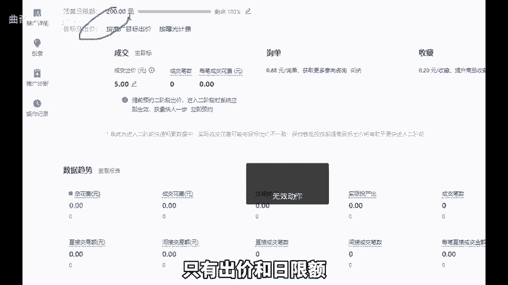
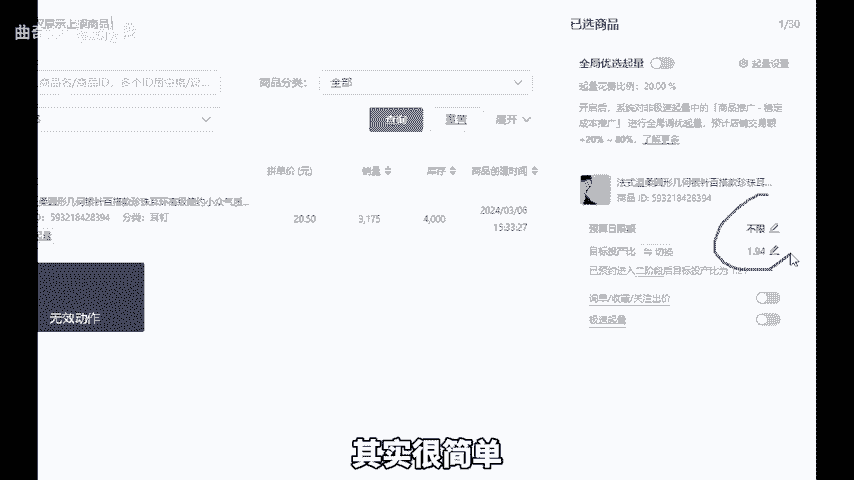
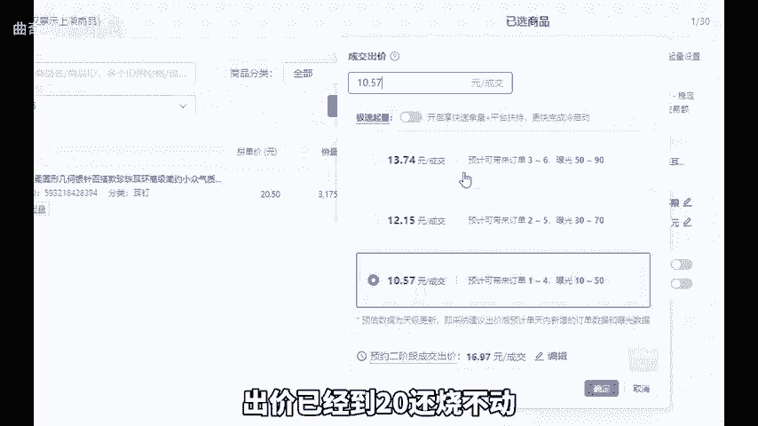
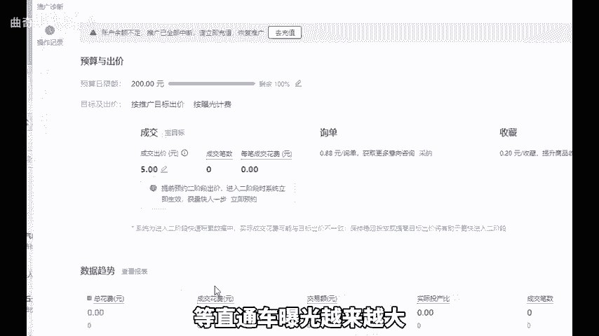
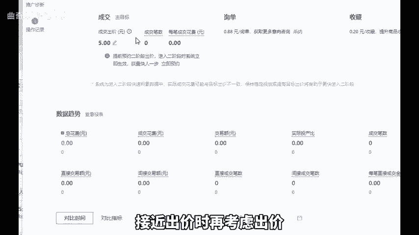
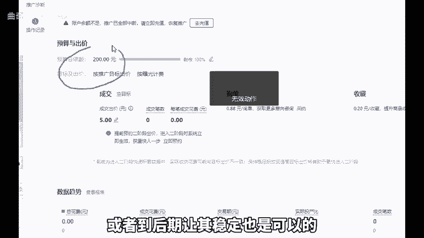

# 拼多多直通车有且只需专注这两个操作即可突破流量爆发！ - P1 - 曲奇All - BV1Ru2dYTEwM

现在还有很多拼多多商家朋友热衷于天天钻研直通车。实际上，直通车最没技术含量，学习完我这个视频，你无需再去探究其他直通车推广的各种玩法。直通车实际上只有一种玩法。首先，目前直通车可调整的只有出价和日线额。

像急速起量和全局优选起量都是让你提高出价，如果玩不好就直接不开，专注研究出价和日现额就可以了。那出价该怎么出呢？其实很简单，我建议大家采用猥琐出价法，就是先出低价，如果烧不动就提高出价。

如果投产比高则先出高价，如果烧不动再降低，每次降低幅度5%到10%，逐步提高出价直至烧动为止。倘如果出价已经很高，却仍然烧不动。比如说利润只有10块，出价已经到20还烧不动，那我建议你重新上链接。

如果只有到20才能烧动，那后期也很难优化到盈利状态，所以前期要低出价，然后逐步提高，等直通车曝光越来越大，出单越来越稳定，且烧出来的投产比接近出价时再考虑。

托价也就是前面我所讲的前期低出逐步增高，后期降低，这被称为托价。再来说说日限额，日限额只能逐步增加，不能降低，这是什么意思呢？如果要获得稳定的流量，就得源源不断的给拼多多增加余额。一旦降低余额。

流量也会随之降低。原则上日线额只增不降，或者到后期让其稳定也是可以的。好，今天的分享就到这里，还有不懂的，可以后台找我。

