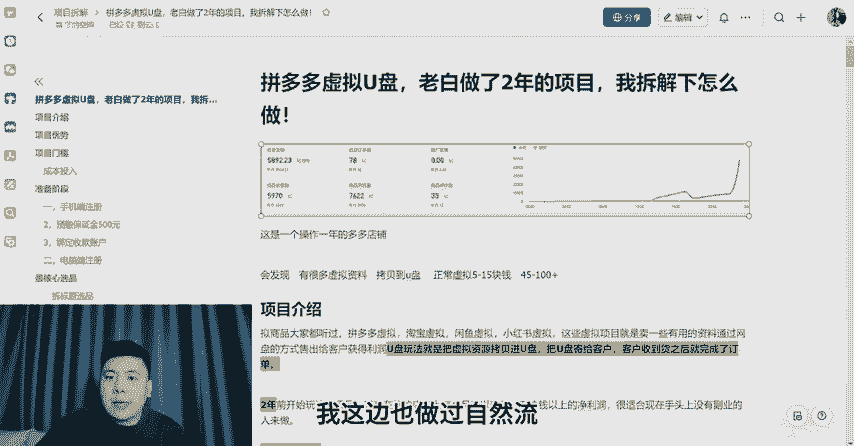
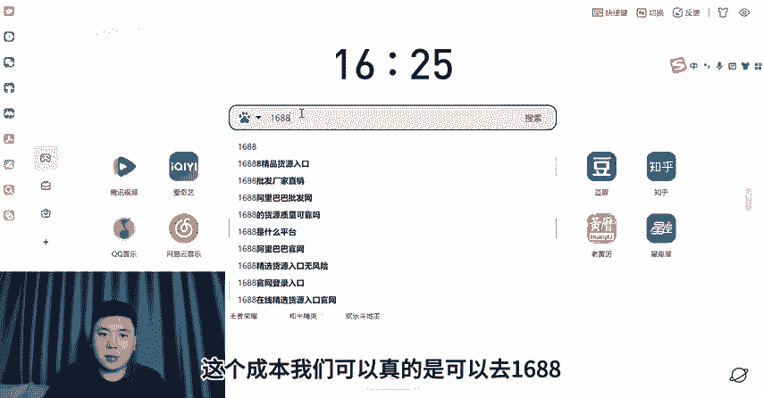
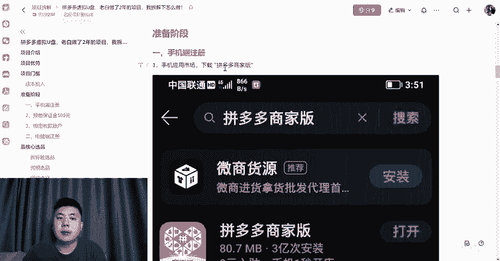
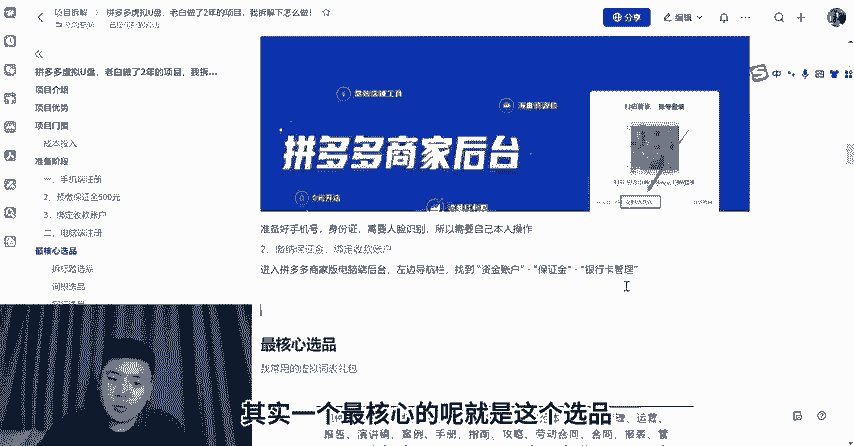
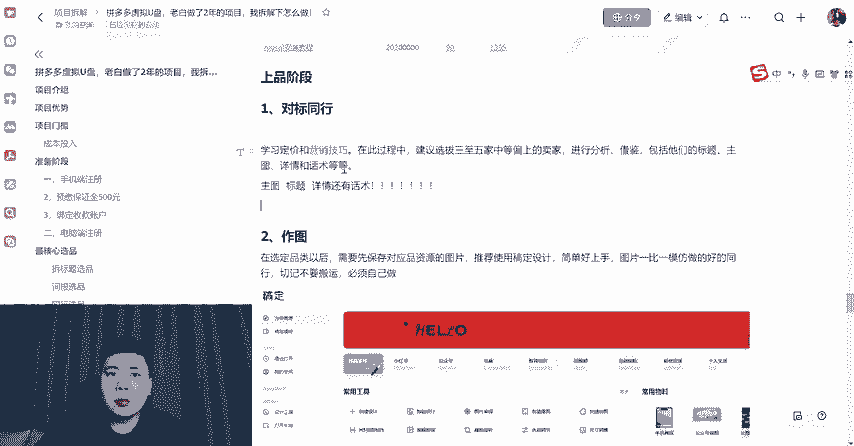
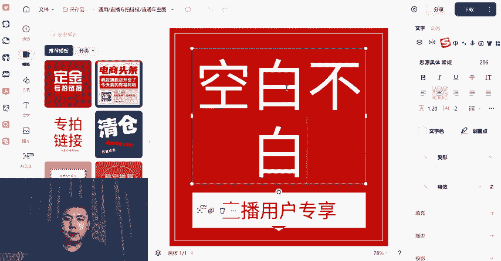
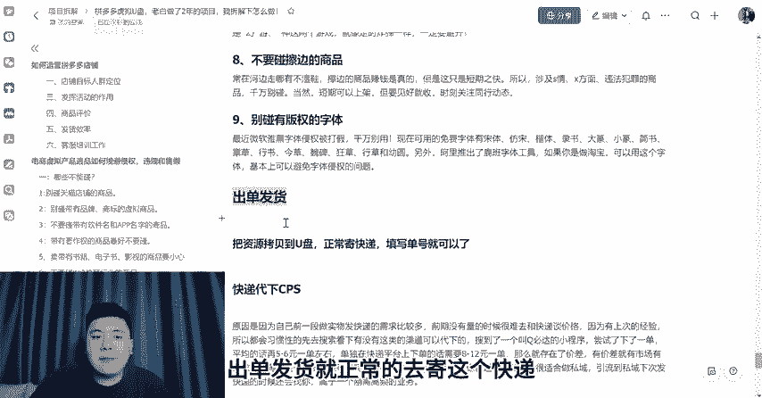

# 拼多多虚拟u盘，从开店选品运营一条视频讲清楚！ - P1 - 老白干货up - BV19V2GY1EVS

啊，兄弟们好，我是老白。今天这个视频我给大家拆解一下这个我们如何在拼多多来做这个虚拟U盘啊，我这个项目做了真的是将近两年了哈，我拆解一下这个项目怎么做。拼多多虚拟电商，我相信我们大家都知道。

但是我们可能是在这个拼多多里面。会发现什么？它有很多就是虚拟资料。他拷贝到这个U盘里面了。而这个客单价呢，它是从呃就是我们一个正常的这个虚拟资料。但拼多多它这个价格可能是5到15块钱。

但是我们拷贝到U盘，我们是可以卖45到100多的。哦，我这个项目我做了将近两年，呃，我这边也做过自然流和这个清覆费的一个模式，整体上跑下来是就是真的非常香。这个项目的人群是什么呢？基本上啊。

基本上就是。呃，40岁以上的。40岁以上的这个人群，他们就是对这个互联网，就是可能那种百呃网盘、百度云啊什么，他们可能不会下载。我们就是呃人群是。我们所针对的人群就是40岁以上。呃。

就是我们要想做这个项目，那肯定是我们先确定我们的一个目标人群之后，再根据这个目标人群。再选品哈这个项目的优势是真的就是我个人感觉还挺不错的。呃，出这个项目的门槛呢。

它这个成本的投入哈呃你像我们就现在开拼多多店铺的话，就是开店保证金就是现在是500块钱，从之从之前的1000，然后降到现在的呃这个500块钱，然后U盘的这个成本呢哈。

其实呃U盘U盘这个成本我们可以真的是可以去1688，甚至是去这个拼多多直接去买一些这种空的这个U盘。这个U盘呢它基本上就是根据这个储存的一个大小，16个G32个G，它基本上就是在这个几块钱。

然后快递成本呢是这2块。

到5块。左右因为我们刚开始要做的话，那肯定单量是不会很大的哈。呃，我们刚开始做和这个快递点合作呢，一单是3块多钱。然后随着我们单量多了，现在我们一单也就是2块钱。然后设备的一个投入呢，就是电脑。

我们跟那肯定是呃基本上现在人人人都有哈，然后是集成器。这个不需要配置很高哈，就是可以装这个外置硬盘。然后这个读写速度一定要快。就是我们要把这个虚拟资料批量的制作，拷贝到这个U盘里面。

然后我们主要是来卖这个U盘，然后针对的这个人群就是40岁以上的。

然后开店呢就是。🎼，🎼，我们打开这个之后，就是填上我们的个人信息。然后呢，就是交500块钱的押金。开店呢是非常这个简单哈。其实一个最核心的呢就是这个选品。这个是我给大家整理了呃。

我这边常用的一个虚拟呃词表。然后选品呢，它其实这个选品的方式有很多哈，我们可以呃拆分标题，你就比方说哈这个这个这个虚拟品是直播运营活动策划手册。那么我们就单单直播这一个词，我们就能给它拆分出N个品。

这个啊也是我经常使用的这个呃选品方式哈。另外呢就是这个池根。就是我们真的是可以从国学中医这种大类目哈，然后。主要是什么啊？没有版权的。这些领域对中老年具有吸引力的。

我们真的是可以深入分析去寻找这种潜在的。另外我们也可以同行进行这个选品。同行同行选品怎么选哈？就是可以在这个淘宝和拼多多。就专门去。专门去找。呃，卖虚拟。U盘的这个同行。就是我们去看哈。他这个点破。

哪一款就是虚拟U盘。出兰多。就是近期3个月吧。我们直接跟着卖。就OK了。另外，选品呢也可以是在这个5118叉车。我们打开5118的哈，这里选择行业词库。呃，其实这个5118创业项目库。

还有短视频创业项目库，就是可以重点看这两个，也可以看这个农产品创业项目库。因为我们这个U盘的人群，他基本上真的是在40岁以上，他并不懂这个电脑。那么呃我们在选品的时候呢。

是否就是可以去呃拷贝那种呃水稻种植。这种全程的一个没有版权的虚拟资料呢。大麦的、燕麦的、高粱的、玉米的、小麦的等等就是。针对。选品呢就是我们确定好了人群，然后。刚开始哈。可以不用那么稀粉不用那么稀粉。

呃，哪个同行出单多，哪个品出单多，我们直接模仿，我们直接跟跟着卖。后面我们这种经验足了，就真的是可以打一个细分。你就比如我刚才给大家就看的那个水稻种植，高粱种植，就是针对一定的。

更细分的人群来进行这个选品啊。这个呢就是1个5118。就是我们选完品之后哈，就是学习定价和这个营销呢哈在我们上架的时候哈，就是选3到5家。中等偏上的这个同行呢，就是我们去分析什么哈。

就是尤尤其是它的主图。标题。详情。还有话术还有话术的哈。就去分析这4个。

作图呢我们真的是可以使用这种呃搞定设计。这种打开之后啊，这里就选择这个呃这里就选择这个电商，然后商品主图我们呢就直接选一个就是类似的哈，就直接套用。

好。做图哈真的很简单。你无论是搞定设计还是这个美头秀秀啊，它都有很多的这种模板，我们就直接套用。咁么。做完图之后啊，这个店铺的一个设置呢，它其实呃我们就是只需要设置一个我们自己的发货地址啊。还有什么？

还有退货地址。因为我们是发的是虚拟U盘实物啊，这个发货地址和退货地址呢肯定是填。我们自己的啊。另外。呃，最好呢就是开个什么开个店铺。优惠券。可以调呃开到5啊，也可以开到6啊等等。哦，我这里忘了说哈。

就是这个商品标题怎么起哈，其实我们可以就是找两个找两个就同一同一个品销量好的。销亮。好的，同行。然后。提炼哈他们双方。不同核心关键是。上面哈我们设置完成之后哈，就是如何运营这个拼多多店铺呢？呃。

从这个店铺目标人群，然后商品这个标题。呃，还有这个该报的活动就报。另外呢呃我们可以找身边的朋友，那个就稍微一补一下啊之类。还有就是发货这个效率。另外呢。就是刚开始哈我们真的是可以尝试。清祝费。就是稍微。

进行这个推广。目前这个拼多多推广还是比较这个简单。我们刚开始可以开这个全站这个推广目标投产比呢哈就。刚开始哈我们可以开这个全散推广。就是卡跟目标投团比呢4到6。就O。呃，等到第二阶段。啊。

我这里就不过多说哈，如果说你做这你做这个项目，你的第一阶段完成之后就出了十几单，20多单之后，我们第二阶段这个付费怎么设置，你可以来找我哦，我来教你啊。然后下面啊是我给大家整理的，就是。

我们做这个哈啊有九大不能碰的。它再是一个实物，它毕竟也是一个虚拟呀。这个啊是我给大家整理了九袋不能碰的哈。你们看我整理的这个就行。后面呢就是这个呃出单发货，就正常的去寄这个快递，填这个单号啊等等。

