# 拼多多运营全套视频教程 深入浅出  匠心之作  好评如潮 - P2：1.1-拼多多运营01~1 - 达内教育-课程开源 - BV1uwtteWE35

好，同学们好啊。那今天呢我们开始分享。那今天我们分享的内容上是主题叫拼多多。希望大家能够了解一个新的平台，对吧？呃，作为电商平台来讲，目前的主流的对吧？大家都知道现在的主流电商平台大概就是几家三家。

一个是谁呢？阿里系，另外一个是谁呢？是京东系，对吧？另外一个就是我们现在的拼多多，他们三个平台，每个平台都会不一样。比如像阿里，它更注重的是一个什么呢？叫平台化。在平台化里边。

它整体的这个效果来讲都是不一样的。他针对着所有的客户，所以他有个自己的C to C的平台是什么呢？是是淘宝。还有呢有一个叫天猫，对吧？注意要于B to C平台。所以淘宝里面它是一个什么呢？

相当于一个百宝箱，就什么都有，而且呢相对来讲价格会比较呃有优势啊，相对来讲会比较有优势的。而天猫呢它更重的是品牌和品质的宣传。所以这里边它的产品整个的这个。价值点也会更高，服务效果也会更好啊。

但是我就知道了，注重了品牌和品质，那它的价格也会怎么样？也会相对来讲会比较高一点啊，价格也会比较高。对吧这是目前的这个阿里系的平台，主要做的是淘宝和天猫。啊，那京东话呢，它更多的就是两个店。

也是店铺类型的，一个是京东的这个叫自营店。对吧另外一个就是它的泡泡店。那泡泡店自营店铺呢，它就相当于自己自主经营啊自主经营。所有的这些大部分的产品品牌在都有自营店铺啊，好处什么？我们之前给大家说说过了。

还有一个就是泡泡店。这个时候呢京东相当于什么呢？相当于平台化。这才是有在平台化里面，它有分为了什么这个再去做的时候啊，它有分为了我们说过的惊喜，对吧？啊，惊喜店铺还有分为了刚才咱们看到的这些主战业务。

对吧？啊，还有一些什么优创商家，那所针对的人人群呢又不一样了啊又不一样了。惊喜店铺更多的做的是什么呢？是拼购。所以拼购里面他再去做的时候呢，那客户想要拼购，那就靠的是什么？靠的是利益点。利益点就是价格。

所以价格相对来要比较低一点，对吧？但是呢他也需要一定的什么呢？一定的品牌化或者叫品质化，就是品质化吧。

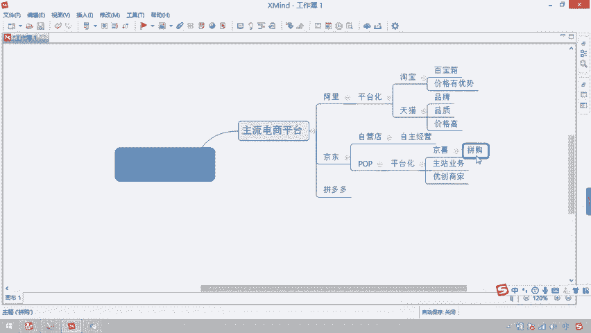

对于产品的质量还是有要求的那主站业务呢拼的就是什么呢？就是跟淘呃天猫一样，品牌和品质。

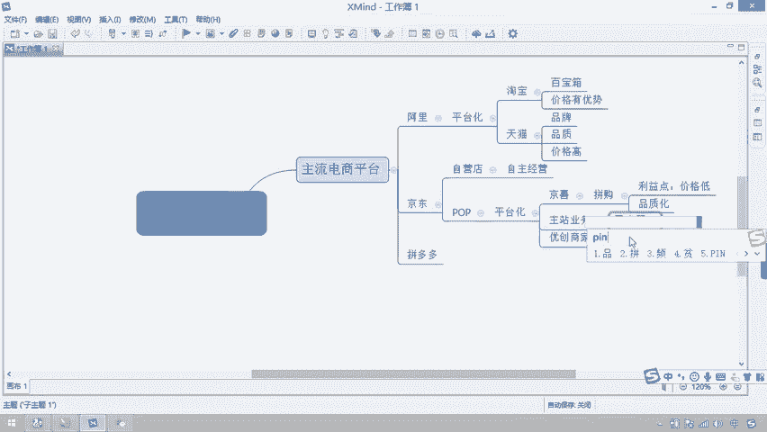

对吧那优创商家呢主要是为了扶贫，对不对？找那些我们的一些特色产品，这些是在这样去做的。啊，而拼多多呢大家会发现再去做的时候，拼多多它也相当于一个什么呢百宝箱。

对吧什么产品其实目前在拼多多里面卖的都有啊都有。但是这个百宝箱有一个特点就是什么呢？它在去做的过程中，高价百货产品很低。所以拼多多目前做的什么呢？是低价产品，对吧？

目的就是给客户传递一个信息或者叫价值是什么呢？便宜。对吧所以我们都知道在拼拼拼多多上买东西，可能9。9块包邮的产品太多了，我们都可以买到。那9。9块包的产品我们怎么样去做去应用呢？对。

这是我们需要考虑到的这几点啊，所以这是第一个它的特点便宜。第二个就是当我们在这个做这个拼多多的过程当中，它除了便宜便宜以外，还有就是它的一个什么购物方式是什么呢？也是拼团的。

所以我就知道目前能够跟拼多多产生竞争的那就是其中一个是谁呢？啊，跟拼多多产生竞争的。第一个就是我们的惊喜平台拼购。

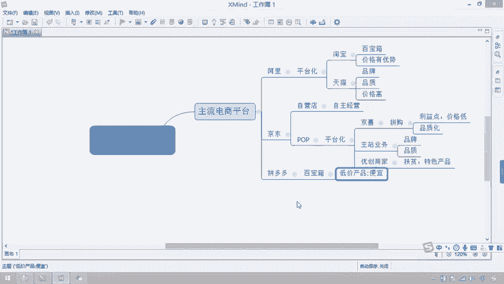

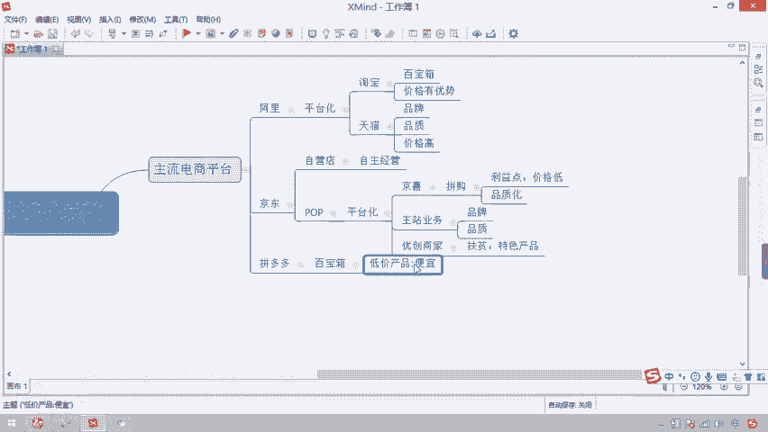

对吧因为整个的购物形式和利益链条以及流量渠道都是一样的，都是以微信为主的。而阿里里面是谁呢？就是淘宝。所以目前拼多多想要达到的一个效果，他想做做的一个效果是什么呢？就是超越。

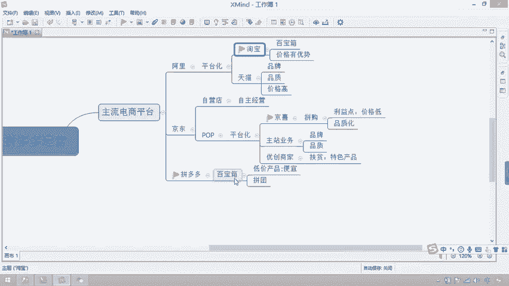

淘宝，但我们知道这个很难，对吧？他在努力，但现在他增长速度和增量也相对来讲会比较。呃，相对来讲会比较快一点。啊，比较快一点。所以拼多多的目标竞争对手就是淘宝。那会发现，当你再去做经营拼多多的时候。

经营拼多多的时候，那他们在去进行什么呢？活动报名的时候都会需要你做到这样一几点。如果是大促。

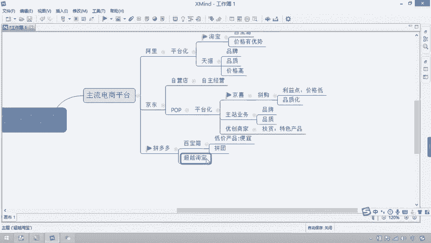

活动他会让你。

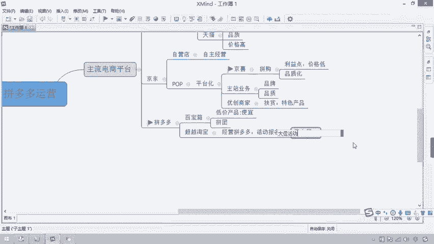

二选一。然后呢，如果是平台活动，它会让你怎么样全网。最低价尤其是要低于谁呢？要低于。淘宝。好吧，什么大促活动2选一呢？比如双十一双十一咱们在做活动的时候。好，那如果你在淘宝上做活动，就不要在拼多多做。

理解吧？如果在平台活动里边呢，你在做的时候，你的产品的这个活动价就要比淘宝的正常销售价格要低。所以这时候你的审核通过才会高。

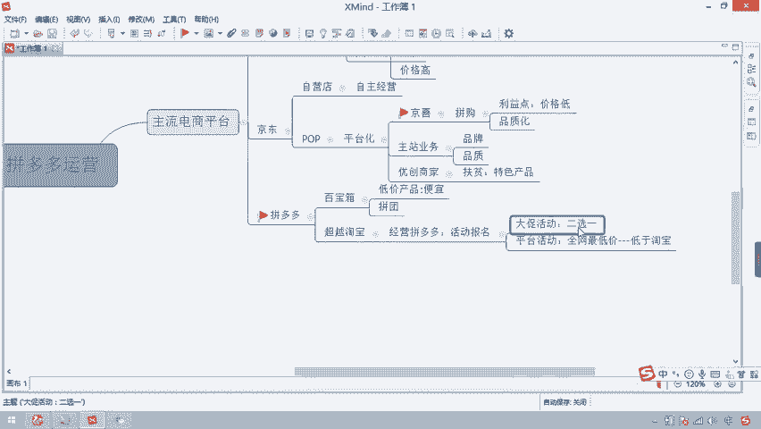

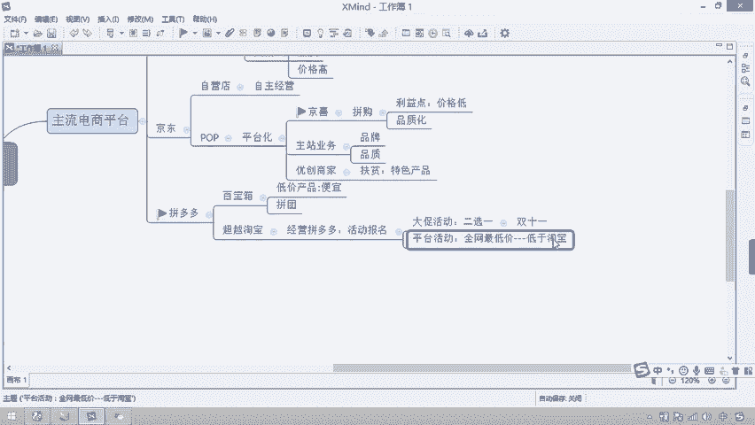

啊，这是现在目前拼多多这个平台，现在整个主流电商平台里面三种能够跟拼多多产生竞争的那就是淘宝和惊喜啊，淘宝和惊喜。所以我们以后做对标店铺的时候，你也可以去淘宝和惊喜里面找到同款产品去进行呃竞争调整。

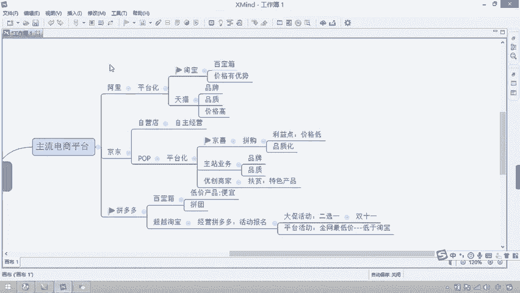

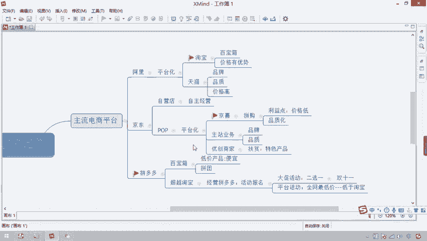

好吧，去进行进行调整啊，这是一个咱们再去做这个店铺的时候，希望大家能够呃记住的啊。现在的主流电商平台。那今天呢我们给大家分享的是呃在这里边具有独特形式的一个店铺啊，一个平台叫拼多多。好吧。

那在去讲分析拼多多之前呢，其实大家对于整个拼多多的认识还是比较丰富的啊，还是比较丰富的。所以对于这种情况来讲啊，这种情况来讲，我们想要在拼多多里边有更好的这个呃应营效果。

那你就需要对这个平台能够有一个什么有一个基础的了解。所以我们首先给大家分享。第一个就是它的平台。

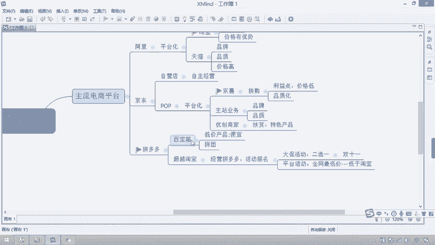

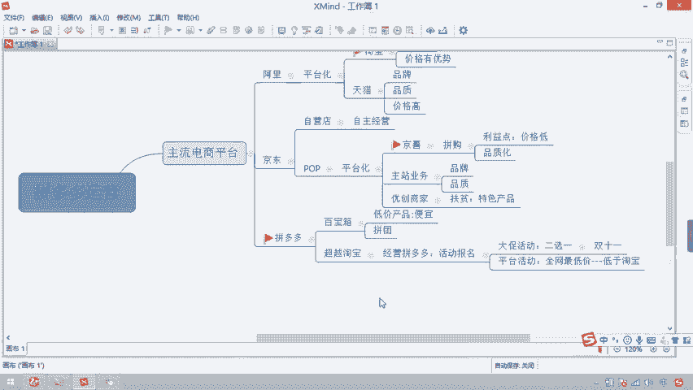

特点是什么样子的？跟淘宝和惊喜有什么不同，它为什么能够有一个好的销售效果，对吧？所以平台特点里面我们先了解一下。第一点，就是我们要在这平台里面销售。那未来产品是不给谁的，是给客户的对吧？

所以我们要了解一下第一个点就是。客户特点。所以大家想一想，对于现在的拼多多里边的客户，他是什么样子的呢？对吧。有同学说，可能我不是特别了解，但我要给大说一下，我们把拼多多里面的客户总结为叫五环外客户。

把淘宝京东里面叫什么五环内啊，当然不是北京的五环，它泛指的是什么呢？指的那些。下沉市场啊下沉市场就是现在淘宝和京东在拼命竞争的市场叫下沉市场。比如在哪呢？在三四线城市对吧？甚至是农村市场，大家都知道。

我们在中国下面，农村户口人口才是占到人均比例最大的。

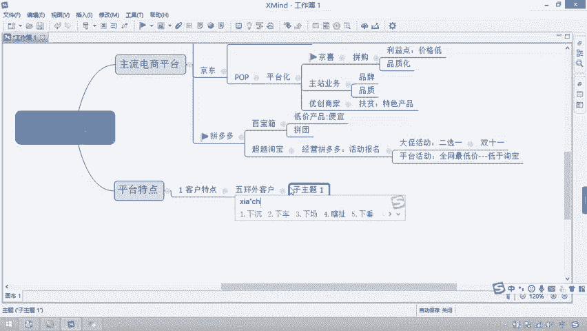

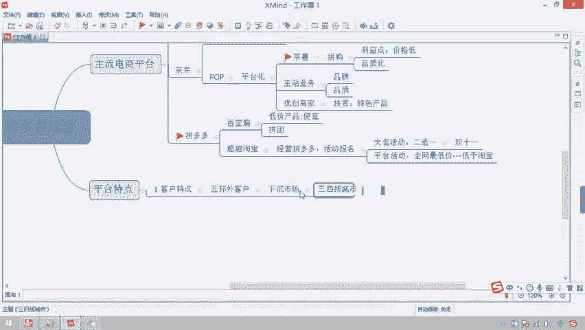

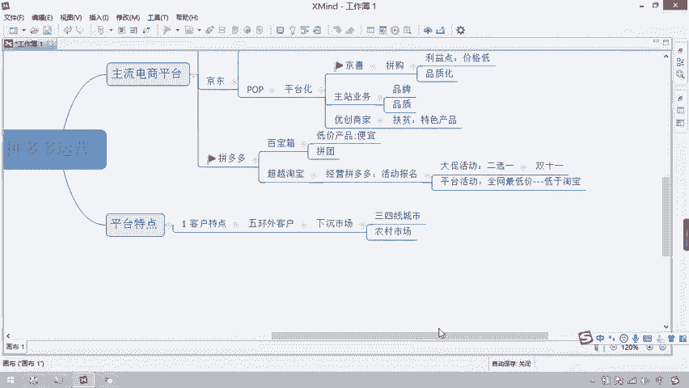

对吗？而我们在北京、上海，你想一下才有多少人？北京有2000多万人。对吧上海呢也按照两三千0万人去算，加在一起，一线城市加在一起可能1亿，对不对？但中国有多少人？13亿人口。

所以大部分的人群还都是在五环外，所以它能够符合到很多的三四线城市和农村市场的客户。所以它的客户增长量来讲还是。比较高的啊还是比较高的。好吧，好，所以这一点。那所以大家想一下。

对于这一类的客户人群需求来讲。

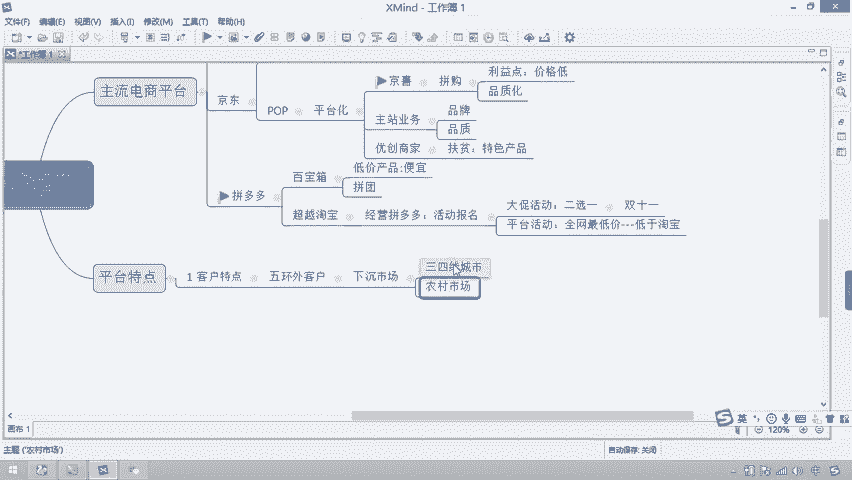

他的市场。增量确实会怎么样？市场增量。确实会比较。

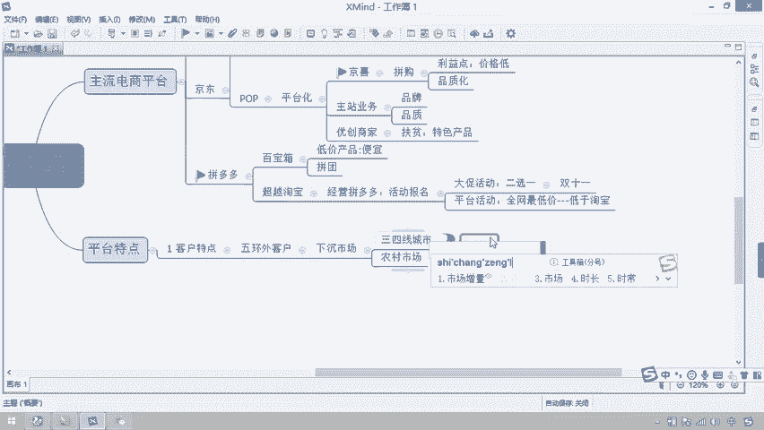

大，但是有一个问题就是市场增量变大了。那大家想一想，作为客户来讲，为什么要选择在拼多多上去购物呢？

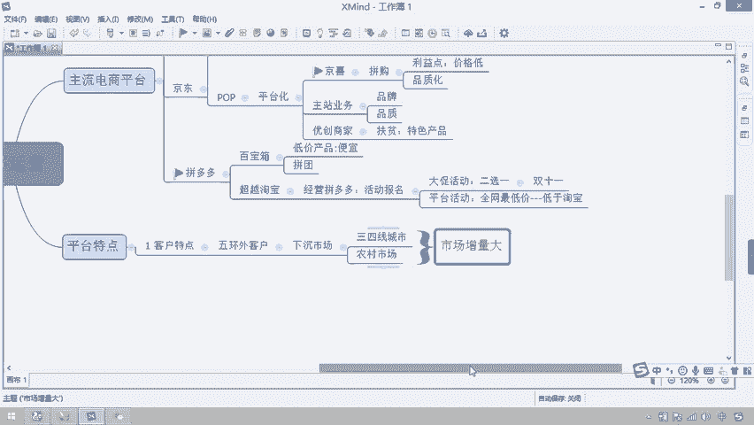

对吧所以对于这些人来讲，他们喜好的是什么呢？所以大家就知道他们对于产品的需求。我问一下，是那些高端的奢侈品吗？

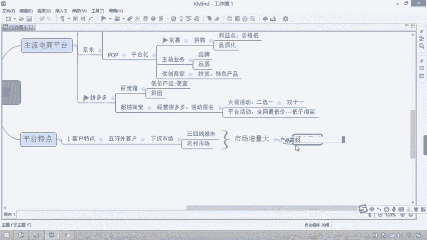

是奢侈品吗？对吧？

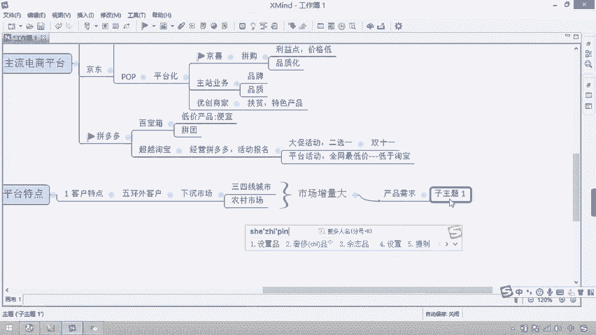

我买一个产品啊，我要去买了个，比如说我买了1个LV对吧？然后用LV包着去干什么呢？去买菜。你说这时候符合他的身份调性吗？不符合吧。

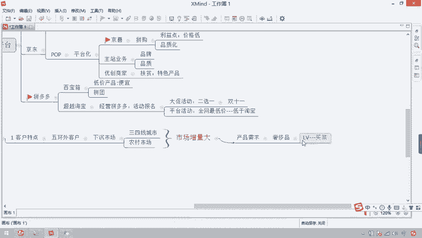

所以我就会发现他们对于产品来讲。奢侈品。对于他们来讲还是怎么样？是不需求的。所以他们需求的是什么？是实惠对吧？是实惠。所以大家就会发现在这些城市的下面，客户购买什么样的产会会比较居多一点。对吧你比如说。

那一些虚假品牌的。啊，你比如说那康师傅，有很多叫康帅傅，对不对？然后还有什么6个核桃，还有16个核桃，对不对？这些产品有没有市场，有没有销量？我们可以到任何的一个乡镇企业里面。

你去看它的超市里面大部分的情况下都会出现这些呃，也不能说虚假品牌，就这些擦边球的品牌都可以去做。但为什么就是因为那些品牌怎么样，口感没有问题，还比较。还比较怎么样实惠，所以客户就会买嘛，对吧？

因为他是自己怎么样，自己自就是自己需求，又不是送礼。如果送礼的话，他肯定要考虑到品牌的价品牌的价值了，对吗？啊，所以同学们这就记住他对于产品的需求就是实惠。所以你在拼多多里边给我提供的产品。

只要怎么样就可以。这怎么样可以。价格低对吧？价格低，它就有什么有市场。这个时候客户的销售量就会买。对不对？你比如说我卖9。9块。包邮的这个运动鞋。所以这时候你会发现。

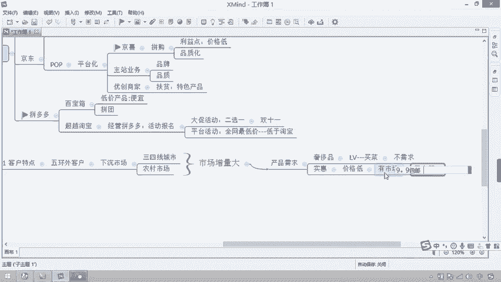

我把这9。9块包邮的运动鞋分享给你，你会买吗？😡。

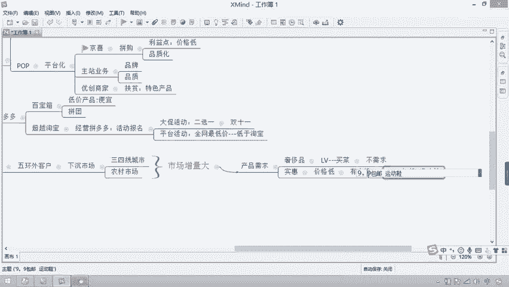

哎，你说。我买的机会会比较小。为什？