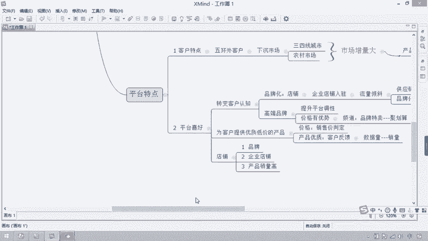

# 拼多多运营全套视频教程 深入浅出  匠心之作  好评如潮 - P3：1.1-拼多多运营01~2 - 达内教育-课程开源 - BV1uwtteWE35

因为我不相信他的产品这么好，对不对？但是对于这类客户来讲呢，他们想的是什么？哎，我花9。9块就能买到一双运动鞋，能理解我的意思吗？所以他认为这些特别的直。啊，特别值。

对吧但现在很多的产品缺了以后也能用掉时间啊，所以他们对产品的需求就是实惠。所以未来当我们在去做这个市场的过程当中，大家要考虑这一点，我们能够给客户提供的就是价格优势，这是必须要明显的。

所以对于现在对于价格来讲，对于我们商家的什么一比较考有考验呢？对于上家什么是比较有考验的？大家思考一下。对，上下什么是有比较大的考验的，这些叫供应链。所以对于供应链的要求会比较高一点。那大家想一下。

这时候供应链怎么去进行调整呢？供应链怎么去调整？对吧所以我们要有一个完善的供应链，你的供应链有优势，那你的价格就会怎么样就会比较低。你比如说举个例子，同样的进货成本，对吧？那么进货成本呢，你3元。

和9元。那这时候你卖的价格能一样吗？3元我可以9。9块怎么样？包邮对吧？而这时候你敢做9。9块包邮吗？你就不能，你只能卖13。9块或者是呃19。9块，对吧？去进行包邮销售去。

所以这时候大家想想同样的产品，我买我买谁？那客户一定会优先的买9。9块包邮的，为什么便宜啊？同样的产品，那我为什么不买9。9块了呢？所以这就是我们在去做的时候。

现在拼多多里边更加拼的是你的整体的供应链的效果。好吧，如果你还是在那个你比如说一个随便找一个市场，拿了货，在拼多里去卖。那这时候你的增长性来讲，和可职业性来讲还是。呃。

比较小的那不建议大家利用这种方式去进行操作。好吧，不建议大家利用这种方式进行操作啊。好，那在这时候大家就会分享一个问题，老师哎，价格低是不是就一定会有销售好的销售市场呢？也不一定，为什么呢？

因为如果你给他买这个999。9块的一双运动鞋，对吧？他买了买了以后就。怎么样穿了一天啪底儿断了。你说这时候客户还会干什么，是不是会找你麻烦？对吧，申请售后等等问题都有。所以呢除了实惠以外。

大家记住他还要考虑的是什么是质量。所以现在对于拼多多平台来讲，他也更专注的什么产品质量。为什么呢？因为大家思考一下，如果说我们在分享拼多多之前，我问你，你对拼多多的印象是什么？你会发现便宜假货质量差。

对不对？所以我们有很多人现在客户的一个什么负面情绪还是比较大的？所以如果我们想把客户的负负面情绪进行什么进行转变。你就需要给他提供什么优质的。产品所以慢慢的去做什么去做产品调整。

所以呢拼多多本身就一个平台化的地这个这个呃这个这个平台，对吧？他没有自己的产品，所以怎么只能靠控制商家的客户产品质量来去转变客户对于平台的认知。所以这时候他怎么办？这个说他怎么办？

对吗我应该怎么样去进行相应的这个市场调整呢？怎样去做这一点。所以大家就会发现质量再去做的时候，主要体现在你的什么售后数据。所以你的售后数据比较好，比如说你的评价。对好评高，你的物流服物流快，对吧？

然后还有你的客服回复速度快，热情。那这些评分都高，那这些我的评分。数据都比较高。这几方面。那你会发现是不是侧面在体现着客户对你产品的认知比较高，那是不是证明你产品比较质量比较好？

所以这时候你的排名比较靠前。所以大家记住一点，做拼多多的时候，一个核心的数据就是售后指标。你的售后指标越强。那你在这个平台下面所获得的流量机会也会更大。啊，所获得流量机会也会更大一点。

要不然你的平台下面获得流量的这个效果就会很难。就在下面获得一个效果就会很难。好吧。好，这是我们再去做这个店铺的时候，希望大家能够了解现在这个平台下面的客户特点是这样子的。

他们在下沉市场更加喜欢价格优惠的产品。所以你的供应链如果足够完善的话，大家是可以选择拼多多这个平台去进行呃销售的。好吧，第二个呢就是各位同学，我们要做的这个产品来讲，第二个类的产品。

就是我们要除了了解客户喜好以外，还要了解什么呢？要有这个平台喜好。因为客户写好以后，啊平台会推荐。那平台写好的产品也会推荐客户。所以平台喜好什么样的产品呢？就刚才我们说过，他需要转变。转变什么？

转变客户的认知，就希望让淘宝让那些客户认为拼多多上面不只有低价产品，它还有很多优质的相对来比较实惠的产品。所以这时候呢你会发现它更注重的是什么？更注重的是品牌化。所以如果你再去进行产品的时候，你有品牌。

你的店铺啊，或者你的企业有品牌。那这时候呢，你用什么呢？用企业店铺进行什么进行入驻，对吧？这时候他给你带来的什么流量倾斜会比较强啊会比较强一点。第二个呢，他也喜欢我们的一些什么呢？高端。

品牌因为高端品牌它能够提升它的什么，提升平台的调性。实际让平台对他认知对吧？我们这个平台下面也有更多的品牌啊，比如说什么苹果什么五粮液等等是吧？都在我们拼多多里边有。所以你说我拼多多里边还只是便宜的吗？

不是了，是因为你没有去买品牌的商品，所以你想花买花了一个低价，买到这个产品，质量很差，那很很正常。对吧一分钱一分货。所以在这时候呢，你可以选择品牌商进行什么进行购买。但是品牌商里面它有一个好处是什么呢？

虽然高端品牌，但是价格也是有。优势的就是比别的平台一定相对来讲价格会更低一点。啊，所以在这个品牌化产品里面，它再去进行前行。所以这个时候呢，拼多多里面提出了一个频道，这个频道叫什么呢？叫品牌。

特卖啊叫品牌特卖，其实就相当于聚划算是一样的。包括我们京东一样的秒杀是一样的。在这里面闪购是一样的，只是做品牌营销。啊，做品牌营销。所以它对于高端品牌来讲是有流量倾斜的。好吧，流量倾斜的啊。

但然对于企业来讲，但是对于企业来讲，他为什么也愿意喜欢去做这样的平台的，什么呢？叫流量倾斜呢？对于企业店铺来讲也是有良心节的。为什么？就是因为企业店铺，我们说它有一个好处。第一。

供应链会比较供应链会比较怎么样，完善，对吧？第二个呢就是有一定的品牌化。品牌化的话，它的质量怎么样有保障。所以刚才我们说过了，你的产品只要供应链完善，并且能够质量有保障。那这时候客户是不是就喜欢。

所以客户喜欢平台就会推荐。理解吧？所以这是平台喜好的这一点。但是当你在去做的过程中过程当中，有很多人会说，老师我做的是品牌店铺，我也有完成供应链，为什么我质量没有那么好？咱倾斜了但没有那么高呢？

就是因为平台化里边，除了他转变客户的认知以外，他还要再去做的过程中，你要知道拼le如何要做的一件事情是什么？就是为。客户。提供。优质。低价的产品。所以他怎么样去评判你这个产品价格低呢？

那我就知道销售价是可以影响的。但是呢这个价格我都知道可以通过你的销售价判定，对不对？那他怎么样知道你这个产品是产品是优质的呢？他怎么知道，所以我没有办法知道的，所以他只能通过什么呢？

通过客户的反馈给你带来。所以客户反馈的话。客户反馈的话，大家想一想，如果说。他只有一个人买了，给了一个好评。你说这个数据有多大的这个参考性呢？叫个。最后反现是不是很难？啊，就很难。

因以当咱们再去做这个店铺的过程当中，你会发现他考虑的还有一个数据量。所以数据上主要考的什么？就是销量。所以说白了京东呃这个拼多多平台，他喜欢第一有品牌的对吧？客户企欢对于产品来讲，对于店铺来讲啊。

它有这样的一个喜好。第一，它需要你是有品牌的。第二，希望你是企业店铺。对吧第三，他希望你的产品销量是比较高的。所以这个时候你所获得的资源倾斜也是最强的。啊，所以当你再去做店铺的时候，如果你想要有一个。

呃，更好的效果。那同学们，你看一下在这部分内容里边，我们能不能达到相应的平台的需求和客户的喜好，从而给我们店铺带来更好的一个是么展现效果。啊，给我们带来更好的展现效果，它有浏览效果以及成交效果。好吧。

啊，所以当你如果满足这些需求以后，你的成交机会还是比较大的。你比如说咱们到这个平台下面。

啊，到这个平台下面，我们找到一个平台叫什么呢？叫拼多多，对吧？