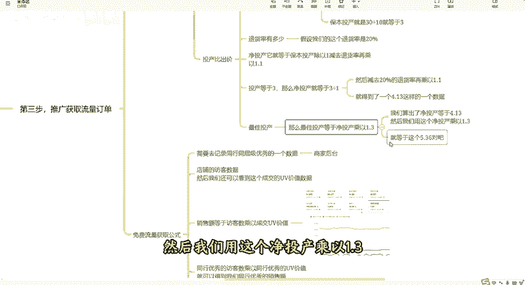
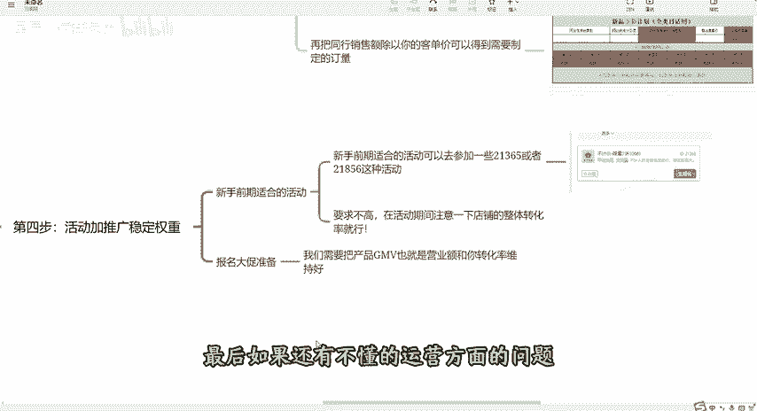

# 拼多多运营如何备战双十一，从零教你一步步打造店铺，获取大量平台免费访客流量！ - P1 - 星辰の运营玩法 - BV1bFsreHEi6

现在已经是拼多多的黄金时期了，我们想要做好店铺，获取下半年的平台流量和大促订单。那么我建议大家根据我这个流程去操作玩法适合新老商家，我会从产品上架到如何打造爆款，最后如何报名大促，做到不会被大幅度压价。

一一交给大家。我也提前准备好了整体的运营流程资料，有需要，也可以三连后找我拿。接下来看实操。首先第一步产品前期基本功。产品主图，大部分消费者都是先看图片，再考虑点不点击产品的。

那么第一张图片必须要突出产品的卖点，或者说通过营销词去吸引点击。比如大家看这个图，这个图就是畅销榜卖的稍微好的产品，主图就是靠营销词来吸引点击率的，标题直接借鉴优质同行的就可以了。但不建议直接复制。

因为产品是根据词的权重来，一般优质的同行都会把好的词想到，就不用我们自己去找，然后标题这里有一个技巧，大家看这个图，你可以在标题前面打个括号，加上产品的核心卖点。比如这个凸显正品。😊，这个呢就凸显加厚。

对吧？你自己产品的核心卖点是什么？你就添加上去就可以了。最好是四个字，价格不建议一上来就设置为我们预期的售卖价。我建议可以把预期价格提升，后续我们通过优惠券和限时限量购去降低到我们的售卖价。

这样我们既可以提升我们的产品权重，也可以让买家看到优惠，从而提升转化率。SKU呢多多的外漏价是显示你产品链接里价格最低的SKU比如我们是卖橙子，对吧？

规格是一35斤我们就可以用一斤的来做低价SkuU这个低价SKU的定价呢，我们可以稍微亏本一点，这里就有人会说了，这个低价SKU是亏本的，但是我又不想大家都拍这个规格怎么办？

这里我们就可以用形容词来让消费者不下单这个低价SkuU比如整箱一斤小果试吃运费贵。😊，你想买水果，谁会去买小果呢？而且运费还贵，这样就降低了这个SKU亏本的可能性。最后还需要做好防比价。

这个比较长我以前的视频有讲解，这里就不再重复了。第二步，产品基础权重模型搭建，基础销量评价。评价的话呢，我们可以找别人给主推款，做100至200个带图评价，可以去优质的同行下面到好的评论图以及评率。

因为90%的消费者都会先看评论，再决定要不要下单的，销量很多新手商家都不知道是可以改的。我以前也有制作详细的改销量方法可以关注我后去学习DSR评分在我们做评价期间就做好这个评分店铺有50%的有效评价就可以做出来了。

一般保持在行业60%以上就可以稳定住店铺流量，如果低于50%就得再去做一些好评，把评分重新提升上去了。店铺层级，我们新店一般前期做到3到4层级就行了。每个层级层级流量的水平都有不同。

然后你点到层级后就能看到店铺到下个等级，需要做到的营业额。这个时候我们。😊，拍一个大单，把营业额突破一下就行了。第三步，推广获取流量订单，直通车推广设置技巧。首先是成交的出价。因为我们在开直通车的时候。

出价其实是有两种的。第一种呢是这个成交出价，那么第二种呢是按投产比的一个出价，首先成交出价，我们在设置出价的时候，会系统会给到我们这个推荐的一个出价，我们不要按照系统推荐的这个出价去设置成交出价。

你按照我这个公式来，首先我们先分析一下，我们的这个产品的客单价是多少。如果说你的这个产品客单价是在50块钱以内的，那么你就按照自己热卖的这个SKU的价格去设置这个成交出价就可以了。

然后如果说你的产品的客单价是在50块钱以上的。那你就根据自己卖一单的这个利润空间去设置这个出价就可以了。比如说你的一个客单价是100块钱，那么你卖一单的利润呢有40块钱，你的这个最终的成交出价。

最高就可以设置到40块钱啊。那么你们就根据这两种情况去设置这个成交出价就可以了。然后按照投产比。😊，出价的话呢，首先你们要知道啊，这个投产比它的几种这种投产的计算的公式啊。首先第一个是保本的投产。

保本投产呢，它等于售价除以利润。那比如说我们的产品成本是20块钱，那我们卖30块钱，利润呢一单就是10块钱。那这个时候你的保本投产就是30除以10就等于3。

也就是你的这个ROI要达到三才是保本的一个状态，这个就是保本的一个投产。那么前期我们如果说按照投产比去出价。在这个地方啊切换一下目标投产比啊，前期的话我们可以先按照刚才我们说的这个保本的投产去出价。

先按照这个保本的这个投产，先把直通车给它开起来，那么有了一定的数据之后，就是我们积累了一定的成交之后呢，我们就会知道这个产品啊。它的实际的退货率有多少了。那假设我们的这个退货率是20%啊。

我们按照前面的我们算出来的这个保本投产是3，我们就可以去得出我们的净投产是多少了。净投产它就等于保本投产除以一减去退货率再乘以1。1%。😡，那按照前面我们算出的保本投产等于3，那么净投产就等于3除以1。

然后减去20%的退货率，再乘以1。1，就得到了1个4。13这样的一个数据。为什么呢？因为这个平台啊是经常会罚款，然后会有一些退款的，然后耗材又比较多。而且比如说要扣一些什么扣点呢？

所以说我们把这个数值乘以1。1是一点也不过分的，也就是说什么呢？你的这个直通车这个投产，最少要开到4。13以上，你才不会赔钱，知道吧？这个呢就是净投产的一个公式啊。😊，那么有了权重之后啊。

我们要开到多少投产才会烧得又快又挣钱呢？这个时候我们就需要去算出一个叫做最佳投产的一个这个数据啊。😡，那么最佳投产等于净投产乘以1。3，这个就是我们的一个最佳投产。拿前面这个举例子啊。

我们算出了净投产等于4。13。然后我们用这个净投产乘以1。3就等于这个5。36，对吧？那所以说我们的这个直通车能够开到5。36的情况下，是一个最好的一个数据啊，是一个最佳投产的一个数据。

那所以说我们假设一下，按照前面这种情况，对吧？我的成本20，我卖30，然后在退货率是20%的情况下，前期的推广出下是保本投产是3，然后拉数据以后，得到了这个投产，你最少要拉到4。13至5。36之间。

那么你拉到了这个范围之内啊，你的这个直通车开的才是有意义的。不然的话，你都是亏钱的。这个呢就是开车的一个公式，免费流量获取公式，做单。如果说你想要有效果的话，那么你就要按照这个公式来。

首先它的一个核心呢，就是你需要去记录同行同层及优秀的一个数据。然后我给大家看一下，我们打开商家后台，然后在这个地方呢，我们可以看到店铺的。😊。

访客数据。然后我们还可以看到这个成交的UV价值数据，这两个地方看到没有？有三条线，一条线你是我们店铺自己的一个访客数据。绿色的呢是同行同城的平均数值，然后黄色的呢是同行同城的优秀数值。

然后包括这个成交UV价值，这个地方也是一样的，有三条线有同行同层平均的，有同行同层优秀的。那在这两个数据当中呢，我们就需要去把同行同层级优秀的数值，把这个数据给记录下来。然后我们运用公式。

销售额等于访客数乘以成交UV价值。那我们拿同行优秀的访客数乘以同行优秀的UV价值就可以得到我们同行优秀的销售额再把同行销售额除以你的客单价可以得到需要制定的定量。

通过关键磁金店成交就可以提升我们店铺的自然流量了。第四步，活动加推广稳定权重。新手前期适合的活动可以去参加一些21365或者21856这种活动，要求不高，在活动期间注意一下店铺的整体转化率就行。这样既。

😊，提升我们店铺权重，也可以让我们未来报名大促打下良好的基础。报名大促前，我们需要把产品GMV也就是营业额和你转化率维持好。后续活动报名时，平台才不会使劲压你的产品单价，导致你活动。

就算报名上了也赚不到钱。最后如果还有不懂的运营方面的问题，也可以三连后找我领取一份拼多多的运营实操文档。😡。

