# 拼多多运营学习开直通车，你看懂这一篇就行了，别去学什么“黑车白车”24年真没有黑科技了！ - P1 - 星辰の运营玩法 - BV1rMmLYzErz

很多做拼多多的商家朋友喜欢天天研究直通车，其实直通车呢，他最没技术，学习完我这个视频，你不用再研究关于其他的直通车推广的各种玩法。我会从前期准备到如何托价盈利，一步步教会你。如果还有不懂。

也可以三连找我拿全套资料。首先开车前的基础，一主图开车前一定要注意主图的点击率，多多上面的点击率，一般都是在主图上的营销词来决定，所以我们可以参考同行优质的主图去制作，注意不要去直接搬运，做好主图后。

可以先随便开一个计划，看一下主图点击如何。如果达到行业平均，那我们就可以开始正式开启推广了。2价格价格要给推广留下利润空间。第一步，我们要把预期的售卖价提高10%左右。第二步。

通过优惠券或者限时限量购去降下来，最后我们可以通过调整优惠力度去给直通车留下运营空间。3、销量评价销量的话，前期建议有5000至1万就差不多了。以前我也做过改销量的教程。

可以找到看看评价做到销量的百分之。😊。

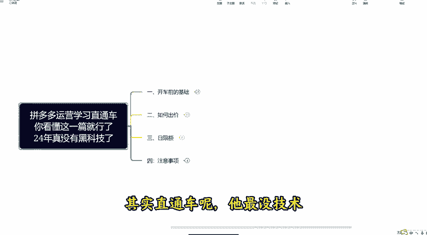

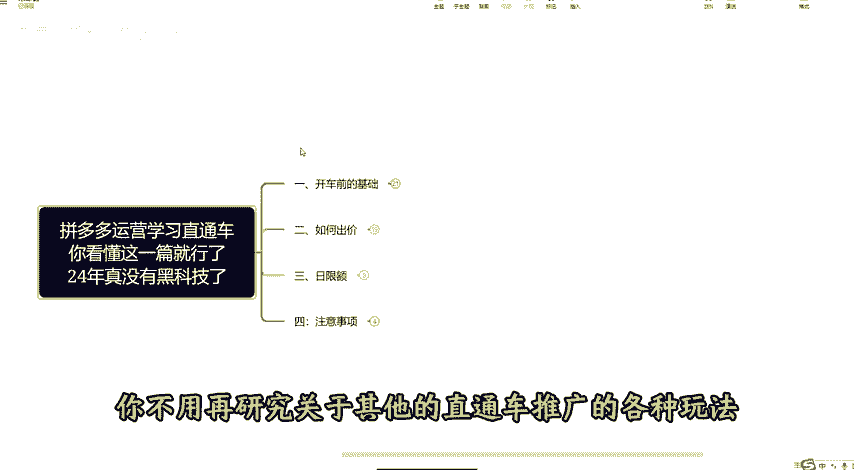

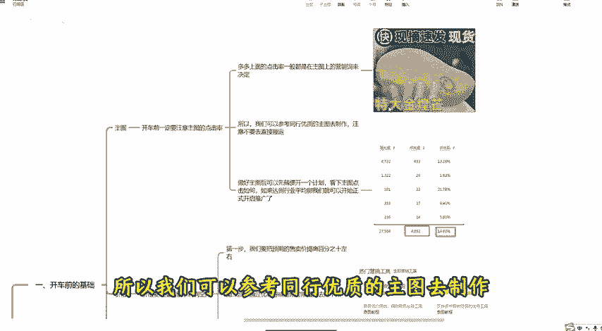

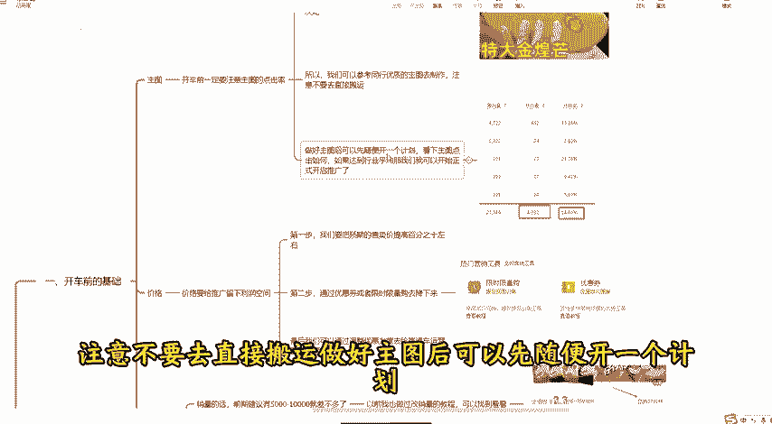

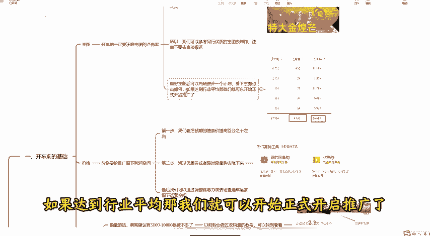

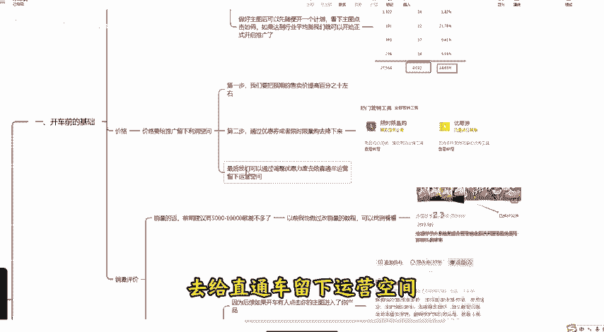

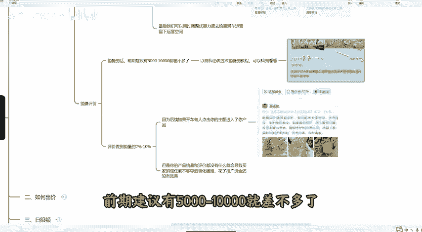

7至10，因为后续如果开车有人点击你的直通车进入了你产品，但是你的产品销量和评价都没有什么，就会导致买家的信任度不够，导致转化困难，花了推广资金还没有效果。直通车呢？它现在可以调整的。

只有出价和日限额向急速起量和全局优先起量，它都是让你提高出价嘛？这个如果你玩不好，可以直接不开就研究出价和日限额就可以了。那出价该怎么出，其实很简单，我建议大家呀猥琐出价，什么叫猥琐出价呢？

就是先出低烧不动再提高，如果投产比呢，你先高出，如果烧不动再降低，每次降低5%至10%逐步提高，直到烧动为止。如果你出价已经很高，还是烧不动。比如说你利润就10块，你已经出到20还烧不动。

我建议你重新上链接。如果呢你二0才能烧动。而你的利润只有10元，到后期你很难优化到盈利。前期就按照我说的低出，然后呢你逐步提高逐步提高等。😡。

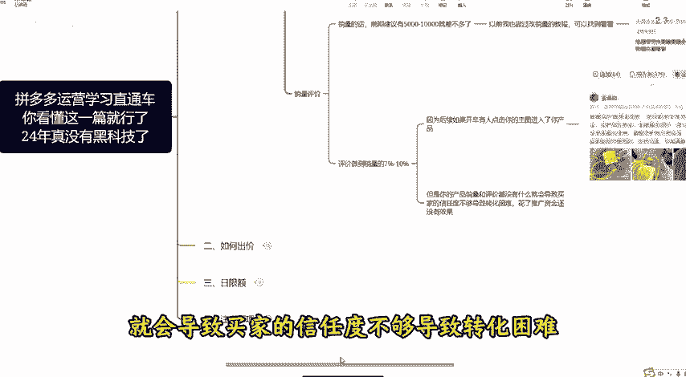

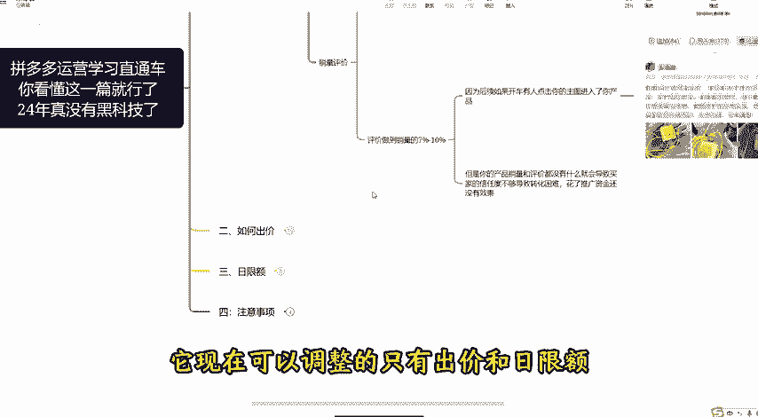

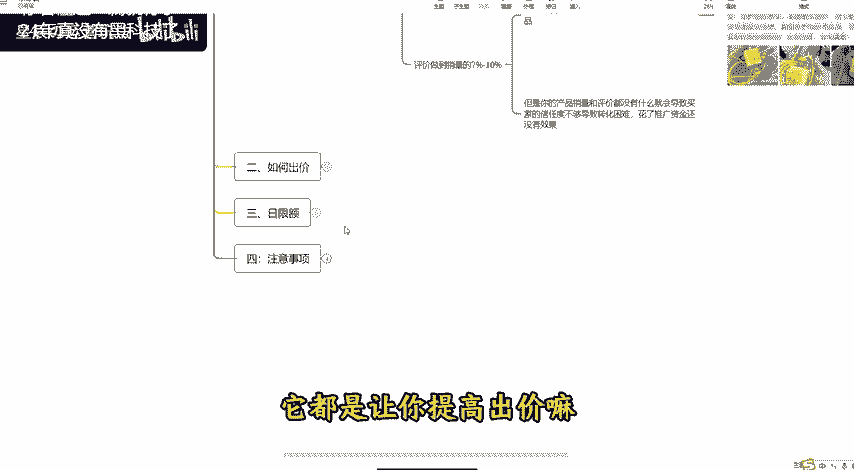

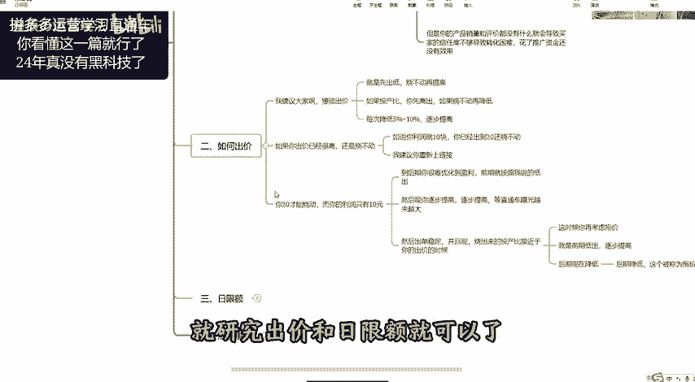

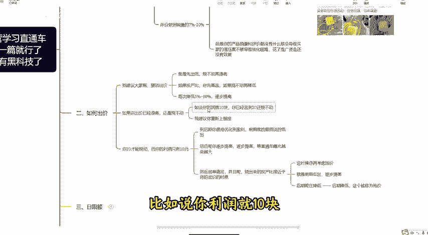

直通车曝光越来越大，然后出单稳定，并且呢烧出来的投产比接近于你的出价的时候，这时候你在考虑托价就是前期低出逐步提高，后期呢在降低，后期降低这个被称为托价，怎么拖，后面我有表格，然后呢失日限额。

它是只能逐步增加，只价不降什么意思呢？就是你如果要获得稳定的流量，你要源源不断的给拼多多增加余额。如果呢你降低了你的余额，你的流量也会降低，原则上日限额是指增加不降低，或者到后期你让它稳定也是可以的。

稳定下来后，我们按照上面的出价思路去调整出价就能出现。我们日限额慢慢可以跑完全天，并且流量一直在提升，注意事项。我们在开车期间，如果发现产品转化不行，就要按照第一步里去调整产品的售卖价。

看是不是价格方面有问题。然后维持住产品的DSR评分，不要让它调到行业的50%以下，不然流量将会下滑。最后我也总结了多多的全套运营玩法资料，有需要可以3。😊。

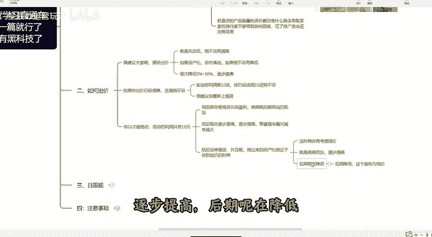

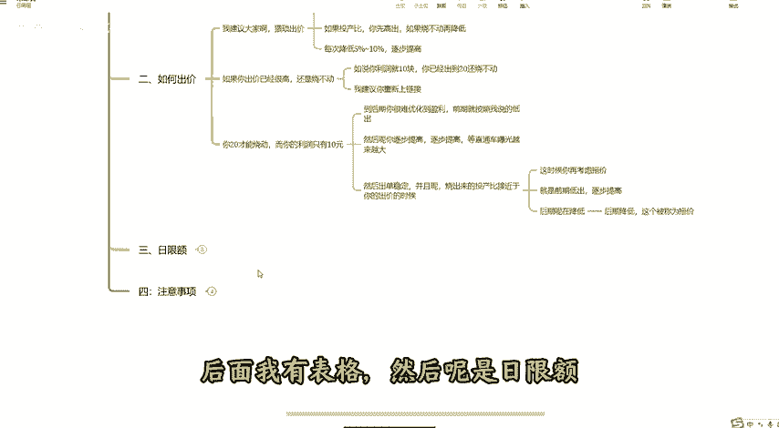

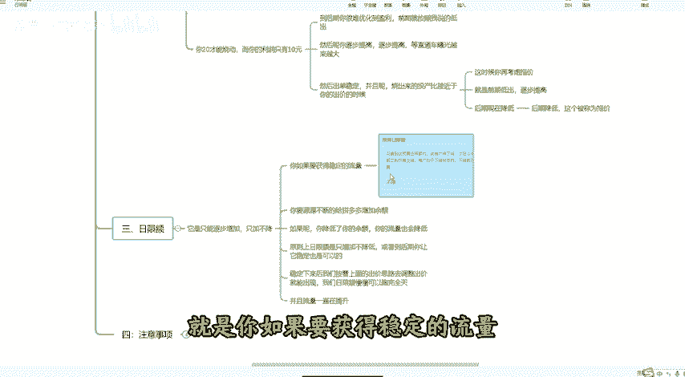

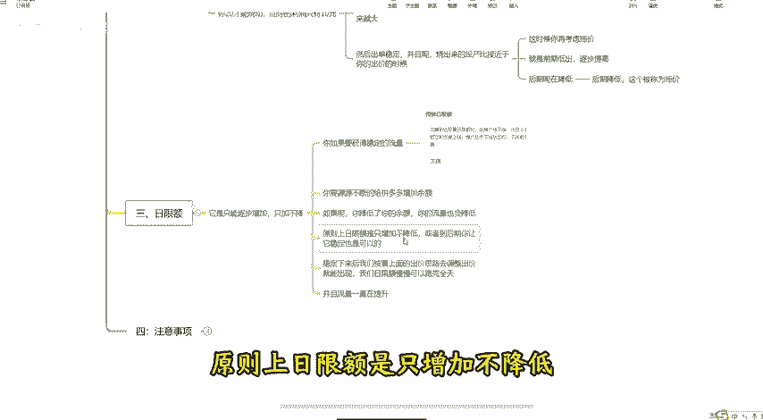

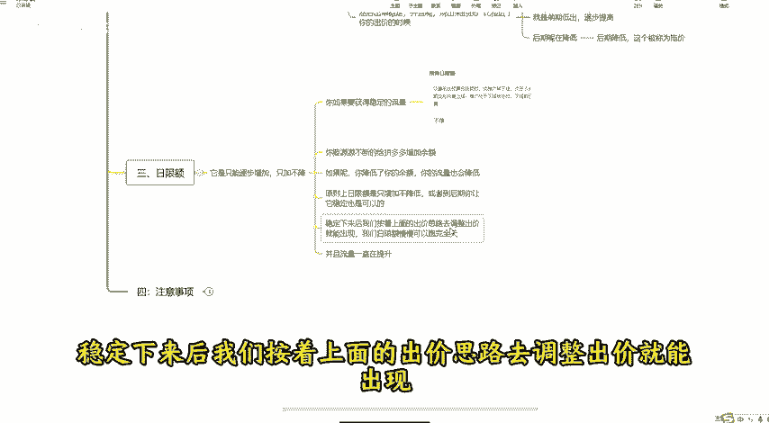

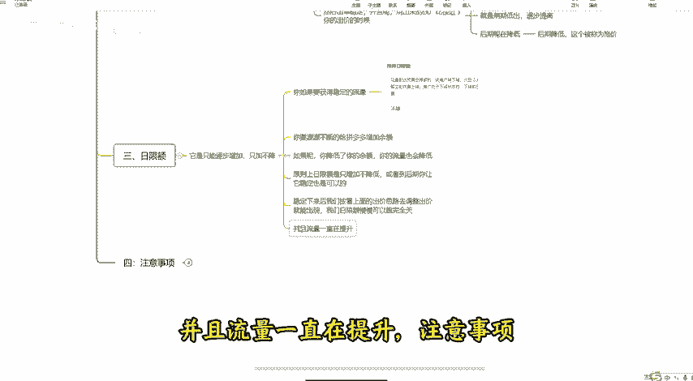

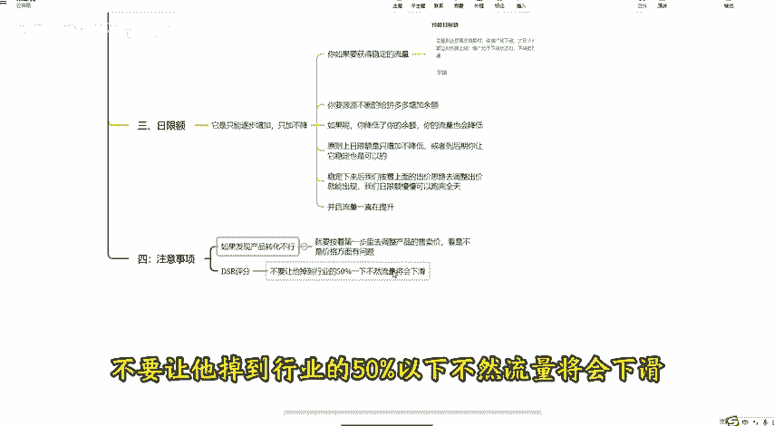

年后找我呢。