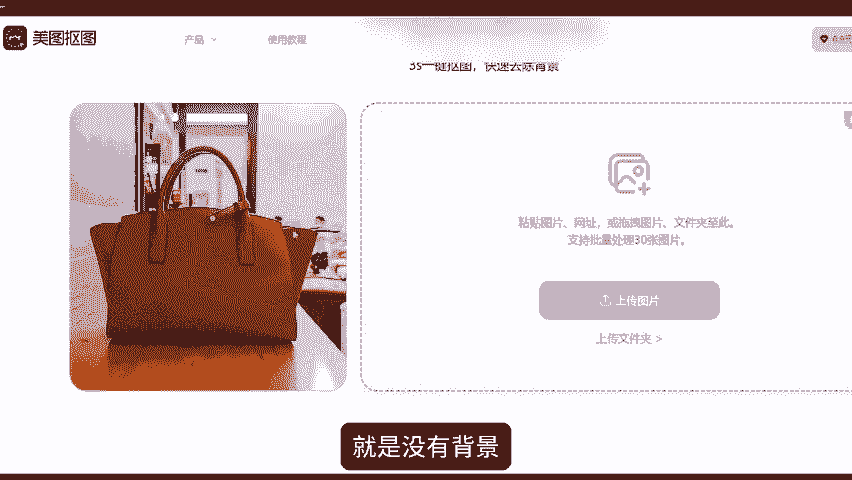
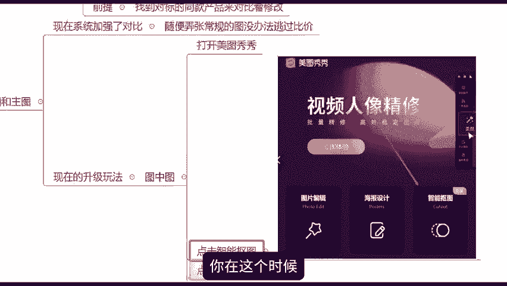
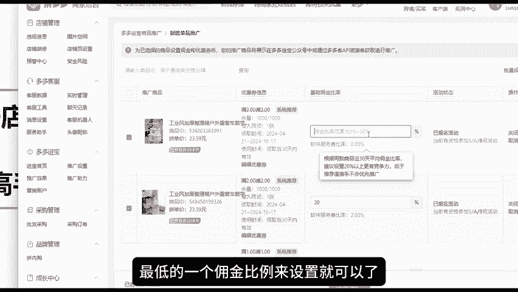
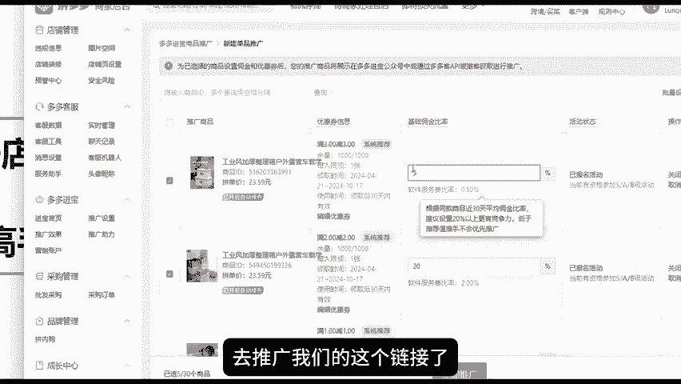
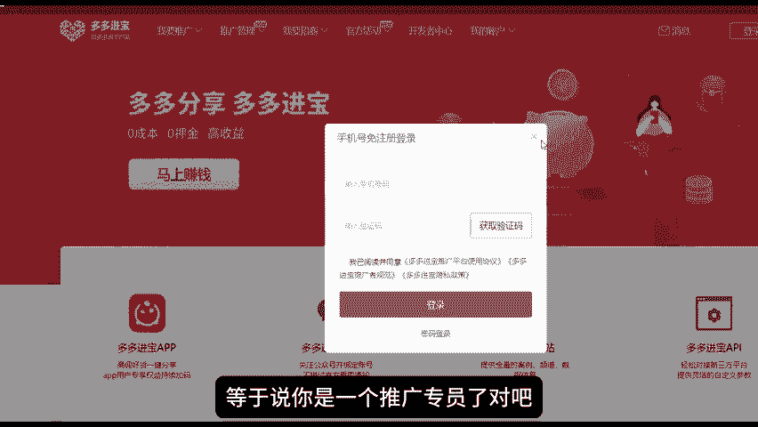
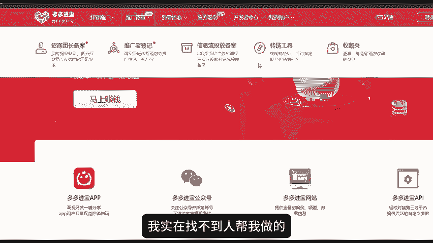

# 拼多多运营干货：新手拼多多开店实操教程，一次搞懂爆款SKU防比价套路，以及DSR评分拉升方案！自学电商不迷茫 - P1 - 拼多多-运营 - BV1ekyNYREHm

🎼Yeah。这个防比价到底是什么东西，以及我们怎么去做这个防比价啊。那么由于现在呢就是我们这个拼多多平台啊，它的一个仿比价的系统啊是一次又一次的去升级的。所以说现在的这个仿比价系统啊。

比以前啊会更加的变态，知道吧？现在比以前更变态了。以前是什么呢？以前是就是平台它是怎么去做比价呢？就是可能说我们的SQ的名称跟其他的同行的产品SQ名称一样完全一样的话，这种情况下呢才会触发这个比价。

但是现在啊它升级完之后是什么样的？就是。SQ的名称会通过一个检测，那么图片它还会进行一个检测，就是检测的一个东西更多了。然后如果说你的这个SQ的名称，跟别人的是一样的。然后图片如果说名称不一样。

如果说图片一样的话，也有可能会进行比价。所以说现在呢大家SQ的名称和图片都要去做调整，知道吧？所以现在呢我们要做更多的一些骚操作才可以啊，那做仿比价的一个好处啊，大家都清楚啊。

就是我可以避免跟同行去做这个价格上的一个对比。所以说我能够有机会啊，可能说能原价的去上活动。因为上活动这个东西大家都知道一旦跟同行比较，那么同行的价格很低。那我我如果说再想要上活动。

我就可能要跟它一样的价格，甚至说价格比它更低。但是这种情况下呢，我的成本啊，我的供应链啊，这些没有优势的话，我的这个价格呢就是很难。很难做到那么低的就导致我上不了活动了，对吧？

所以说我如果说我能够去做到仿比价呢，我就有机会能够原价的去上活动。那么第二个呢，就是在我的产品在能够卖高价的同时啊，还能够不比那些低价产品流量更少。因为拼多多平台啊，它是这样的。

就是平台它会优先的把流量去分配给那些呃销量比较高的权重比较高的这是一部分。另外呢它会比就是多分配给那些性价比高的，也就是价格更低的那种产品，它会多分配。所以说我做了防比价之后呢，我就会能够避开这一个点。

知道吧？然后呃我也能够长期的去获取更多的这个自然流量，所以说这就是我去做防比价的一个好处啊。那么呃还有很多的小伙伴呢，其实就是不知道这个防比价这个问题的。然后也没有去做仿比价。

所以说我希望这一部分小伙伴呢能够认真的去看今天的这一期视频啊，然后你就知道该怎么去做了，好吧，今天呢我就跟大家详细的讲解一下到底怎么去做。然后。房比价呢有两个板块啊两个板块，一个是SQ的规格描述。

一个是SQ的规格的图片啊，分为这两个板块来跟大家讲。第一个SQ的这个规格描述，一般呢是分为三类。第一个呢就是用软件突破字符限制啊？因为一般来讲我们的一个SQ的个规格字数呢。

它是有限制的那么我们可以通过一些啊软件来突破它的字符限制，这个字符的一个限制，我就可以打很长很长的字。那我的字数比同行多了。那我是不是就能避开跟同行去啊比价的这样的一个这个情况，对吧？那第二种呢。

第二种呢就是我的组合方式啊，我的SQ的组合方式给大家举个例子啊，比如说像这种啊一种是款式加套餐的，一种是质量加型号的款式加套餐的是什么意思呢？比如说像这种上面啊我的款式我可能写五年质保啊。

加厚双翼三重集水，这是一个款式，然后下面加套餐套餐是什么？比如说28厘米固定杆拖把一整套，还有什么升级款直杆28共两个棉头，升级款直杆28共一个棉头，还有什么豪华款伸缩杆28厘米，共一个头。

你们觉得它真的是有这么多个款式，有这么多个东西吗？对吧？其实大部分的它都是一样的一个东西，只是我把里面的东西换一下。比如说这个啊升级款直杆28公分，这个都是一样的对吧？而这个SQ呢，我我给你送两个棉头。

这个SQ我给你送一个棉头这个。SQU我给你送三个棉头，对吧？我通过棉头棉头的这个数量的不同，我就能做出三个SQU来。那么这三个SQU是不是可以帮我去做到这个避免同行比价的，因为同行它可能写什么？

它可能只写啊这个杆子，对吧？可能写一个直杆28公分，它没有写到什么棉头，那我就跟它区分开了，对吧？我的价格跟它的价格就不会进行一个比价了，包括下面的什么豪华款也是一样的。然后什么加大至尊款啊。

都是一样的原理，知道吧？那这个呢就是一个款式加套餐的一个组合SQ的一个方式，那么下面还有比如说什么质量加型号的一个组合方式，质量比如说啊什么特特级特大跟铁棍5斤啊，多少公分。

然后精品大跟铁棍5斤多少公分优质啊，对吧？不同的质量不同的等级啊，这这个就叫做质量，然后下面啊一个。型号自己型号随便打一下，这个就叫做质量加型号的1个SQ的一个组合，知道吧？这种啊。

其实他们的产品的东西啊都是一样的，只是他们的规格描述不一样，知道吧？有些比如说我们称重量的一些东西，比如说我们卖一些吃的啊，对吧？卖一些啊用的东西，只要是跟重量有关的那像上面上面这个山药对吧？

山药它大部分的是5斤嘛。那这个时候我们如果说也做的是山药，也做的是5斤，我可以怎么办？我可以去做一个5。02斤嘛，对吧？我可以比如说5。015。025。03都可以。那这种情况下呢，我就可以怎么。

我就可以规避开那些。设置的整数5斤的，我可以规避跟它去比价。因为它是5斤，我是5。02斤。在这个重量上我们是不一样的，所以说不能够拿来做同样的比价，知道吧？还有比如比如说我们做抹布的啊，做抹布的。

大家可以看到像这个什么15条装，10条装5条装三条装一条装，还有什么颜色随机，然后什么升级，加大一条装三条装5条装，对吧？其实产品啊都是一样的，只是说具体的这个SQ的描述的参数。

它是有区别的那这样的话我就可以去避开啊，避开他们的一个相互竞争，这个就叫做规避两个去做相互的竞争。呃，但是呢这种SQ的一个调整方式啊，它是没有一个标准答案的，知道吧？

所以说你们就根据你们自己的产品去判断你的产品适合哪一种，你就按照哪一种方式去做就可以了。你是适合这种质量加型号的，你就按照这个方式去做。你是适合这种做款式，做套餐的，你就按照这个去做。好吧。

根据你们自己的产品去选择。然后文字啊内容啊，这个你们自己去编辑就可以了。但是这个地方有一个前提啊，就是你一定要先去找到一个你对标的同款的产品，然后你来对比着去修改啊，比如说你是做这个抹布的啊。

你可以比如说你找到这个这个是你的同款啊，你的对标产品，你就按照它的这个去修改就可以了。比如说它是做15条装，你就做20条装嘛，他做1条装，你可以做12条装嘛，对吧？它5条装，你可以做6条装嘛。

你可以跟他避开啊，在它的基础上做一下修改。那么这个呢就可以规避开跟它去比较了，知道吧？这就是这这个就是这个点啊，然后第三个点呢，就是我们的这个SQ的图片啊，规格图片和这个主图啊，那么现在呢。

这两个啊系统已经加强了对比。你如果说自己啊随便的去弄弄张像以前一样那种常规的SQ的图片的话，是没有办法逃过比价的，知道吧？它是没有办法逃过比价的。现在升级之后的一个玩法，就是什么？就是有个叫做图中图啊。

这个玩法教一下大家图中图呢？大家什么意思呢？大家可以参考我教给大家的这个方法去操作一下。我我们可以先选择我们的这一个呃产品的这个。图片对吧？产品的图片，然后我在网站上，我去打开美。

打开这个叫做美图秀秀啊。我去打开美图秀秀。然后点击进入这个官官方网站啊，然后这个地方大家有没有看到有一个叫做智能抠图的，我们点击一下，然后在这个地方上传你的这个产品的图片。

然后它就会把你的这个产品看到没有？像这样抠出抠成这样的一个抠成这样的一个产品，就是没有背景，把你的背景去掉了，那么把背景去掉了之后呢，你在这个时候啊，你就可以再去网上去随便找一张其他的图片啊。

然后把它添加到你的这个产品，把它作为你这个产品的一个背景，比如说我是做一个包包的对吧？那么我把我的包包的这个图片抠出来，抠出来之后，我再去找一张比如说什么洗衣机呀，或者说一些其他产品的图片。

我把它作为我的背景。然后我把我的包包缩稍微的缩小一点点。那么系统比价的时候呢，就会误认为你的这个产品，它是洗衣机，而不是包包，它就不会拿你这个包去跟别的包进行这个比价。

进行对比了，知道吧？这样的话呢，你就可以实现这个迷惑系统的一个行为啊，狸猫换太子对吧？规避比价。那么做好以上这两个操作呢。基本上啊你的这个新品啊。就能够快速的获取到自然流量，知道吧？

一个是SQSQU的规格描述，一个是SQ的这个图片。好吧，那么看到这里啊，还有什么不不懂的地方啊，大家还有什么不了解的呢，或者说需要一些运营表格资源的呢，大家可以在评论区找到我啊。

然后找我领取一下关于我们新老店铺DSR评分的一个拉升技巧，呃，有很多做拼多多的小伙伴啊，你们的店铺DSR评分会发现很低很低啊。那么我们应该要怎么样合理的去把这个评分给拉上来了？

其实现在有很多的卖家朋友啊都已经知道了要怎么去拉升DSR了，因为大家都知道，其实DSR评分这个东西啊，它就是一个分值嘛，对吧？他他的一个评评价的一个标准是我们店铺最近90天内啊，对吧？

然后产生的这些订单的评价的一个分数，所以说想要去把这个DSR评分。拉高的话，无非就是通过比如说我们做一些补单啊，然后或者一些其他各种各样的一些操作啊，然后让我们的总订单的数量变多了。

那么自然而然我们的DSR评分就提高上去了，对吧？但是当我们自己啊真正的去实行操作的时候，就会发现有一些东西啊，它其实是不好做的那我给大家举个例子啊，比如说有的人讲，哎，我通过补单吧？我通过补单。

我去把我的DSR评分拉起来。但是呢就会发现唉我补个十单可能只有一两单被平台给收入了，即为有效的这个订单评价了，其他的全都被记为无效的评价了。那这个是大家会经常遇到的一个情况。

那如果说你们通过这样的一个DSR的一个操作去提升的话，你们的这个成本啊就会变相的放大了。所以说今天我要跟大家讲一个就是市面上虽然说很多人在玩，但是我们现在自己就可以去做的一个操作，就是利用。

我们店铺的后台的一个多多进宝啊，多多进宝这一个渠道呢去提升我们的1个DSR。那，在我们的一个店铺后台啊，大家可以看到，然后我给大家看一下在哪里啊，在这个地方看到没有？有一个多多进宝，就是通过这个东西。

去提升我们的1个DSR。然后这个用这个操作呢，它有一个最大的好处啊，就是它是区别于补单的。就是你今天操作的每一笔订单啊，它都是官方有效的渠道。因为这个就是我们店铺后台的一个渠道嘛，对吧？

他它当然呢他这种是属于智能推广的啊，就属于这个呃团长的，或者你可以把自己理解为啊，你就是一个团长，然后你自己去帮你自己去推广这个链接，然后让别人啊通过你推广的这个链接去下单。

这样的话你的这个订单呢就会被官方记录为有效的一个订单了。但是啊你只要不被他判定为虚假补单，那就没有什么关系。为什么很多人去补单会被这个记为无效的订单呢？就是因为啊很多人啊。在你操作的时候。

比如说你这是一个新品啊，对吧？那么你新品，你通过关键词去搜索的话，是很难很难找到你的产品的那这个时候啊你就只能去搜索什么，搜索全标题或者说去去搜索半标题，那么你才可能找得到你的产品。

那这样的话你可能说你通过这样的操作，你可能说前一二十单你做的还有效。但是你要做多一点的话啊，那么对你的这个单品就有影响了。因为平台它肯定就知道你是在刷单了，那就直接把你这些订单给判定为无效虚假的订单了。

知道吧？所以说我们现在呀想要去拉升这个DSR评分的话，可以告诉各位啊，多多进宝，它一定是最可取的一个方式。那么这个东西呢它是怎么做的呢？来，我教一下大家啊。

首先第一步在后台找到我们的多多进宝多多进宝首页，先去把你们的多多进宝这个地方给开通了，开通完之后啊，然后有一个这个地方有一个单品推广啊，单品推广点击立即开通，在这个地方呢就会显示我们店铺的一些产品。

知道吧？然后我们需要去给它设置一个佣金，那么这个佣金呢你就可以按照最低的一个佣金比例来设置就可以了。比如说我们最低的5%啊，你设置好就可以了。这个地方不用管它啊，不用管它，然后设置好之后呢。

点击下面有一个立即推广啊，立即推广。这样你就可以呃去设置好了啊，设置好了之后呢，你去点击看一下，它会显示这个正在推广中啊，正在推广中，那么设置好了，来到了第二。

第二步是最重要的。因因为很多小伙伴呢第一步你们都会做。那么这个时候啊，如果说你们的这个商品设置的这个力度不是，比如说因为我这个地方我的佣金是设置的最低嘛，对吧？5%。

然后包括可能说我设置的一些其他的优惠券的力度啊，又不是特别的大。那么像这种情况下，你的产品又本身没有什么太大的销量太大的人气，那么是没有哪一位团长啊会直接的去帮你推你这个产品的。

所以这个时候呢我们就要把自己把自己定义为是一个团长，那么我们就可以单独的啊去推广我们的这个链接了，怎么推广呢来？我们可以在我们的这个啊百度上面直接搜索多多进宝，然后进入到这样的一个页面。

这个就是多多进宝的一个官方官网平台啊，然后这个时候呢你需要去注册一个账号，注册完了之后呢，你就是一个等于说你是一个推广专员了，对吧？简单来说你就是一个多多客了。

然后呢，你注册完了之后啊，你到时候你就去你的后台啊，你的后台把你创建好的这个链接复制一下。复制完了之后呢，在这个地方。推广管理有一个转链工具啊，在这个地方啊，因为我这个这会儿还没有登录啊。

你们自己去点击一下转链工具，然后把那个链接复制上去，然后让它生成一个推广链接，那么这个推广链接生成完之后啊，这个时候啊就是隶属于比如说你作为一个多多客，你就可以去进行推广的。那么推广的每一笔成交。

每一笔这个订单啊都是在你这个推广账户里面的啊，就相当于说你你把你的商家进行推广的那然后这个商家呢其实也是等于说是你自己对吧？你搞清楚了。这个之后呢，它就形成了一个这个叫什么闭环成交，对吧？

推广的人也是你然后成交的这个商家呢也是你他就是一个闭环成交，然后这个推广链接生成完之后呢，你可以什么，你可以把它呃分享给像什么群里面啊，或者说分享给你的一些亲朋好友啊，就是帮你去做成交的这些。这些人啊。

你去把这个链接分享给他，然后然后让他去下单，对吧？呃，这个呢就是说你等于说把这个当成一个补单的形式去做了。但是这种这种形式呢就是不需要呃再去搜索关键词，知道吧？但是呢你也不要直接去发商品链接啊。

你要记住去发这个生成的这个推广链接啊，一定要发这个推广链接，知道吧？然后发完了之后呢，到时候让呃这些帮你做成交的人直接去拍一下去下单就可以了，好吧？当然你身边所有的你能够找到的人啊，你都是可以去做的啊。

如果说没有这样的一个资源的，对吧？找不到人，你说哎呀我实在找不到人帮我做的呢，大家也可以在评论区啊找到我，然后联系我，我也可以给你分享一下这方面的一些资源，好吧？然后因为这个多多啊。

它是没有什么人群关联的，所以说这个官方是允许的啊，然后这这个时候产生的这个成交啊，它就属于推广成交了，知道吧？推广成交他在。

平台当中呢是被判定为有效的订单是非常非常多的。它不像你通过这个什么通过搜索关键词。如果说你是通过搜索关键词的话，你的这个订单呢就可能说会被过滤的非常非常多啊。这个订单会被过滤很多。然后做完之后啊。

你的这个DSR评分，你的有效订单越多，你这个DSR评分提升的呢就会越快。那么这个DSR评分啊，我给大家一个建议就是。至少要能要保证是在4点7分以上啊，因为4点7分以下的话。

就会对店铺的流量啊、权重啊有一个很大的影响的。好吧，至少要做到4点7分以上。那么保证在4。9分以上是非常非常健康的一个分数，好吧，那么这就是最保险的一个提升DSR的评分的一个做法啊。

如果说有需要的小伙伴呢，大家可以去尝试一下。