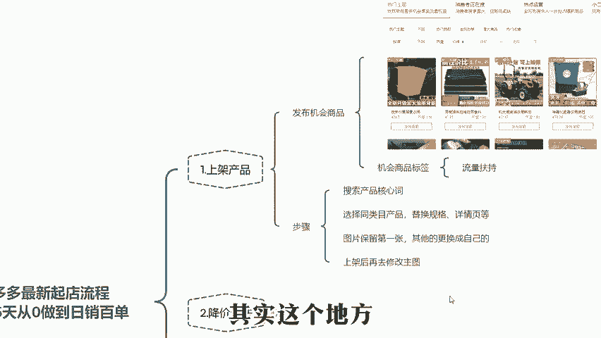
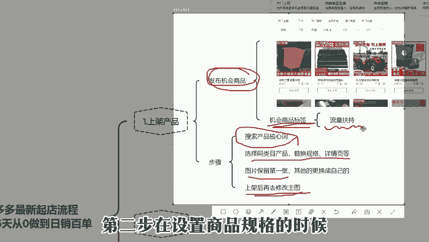
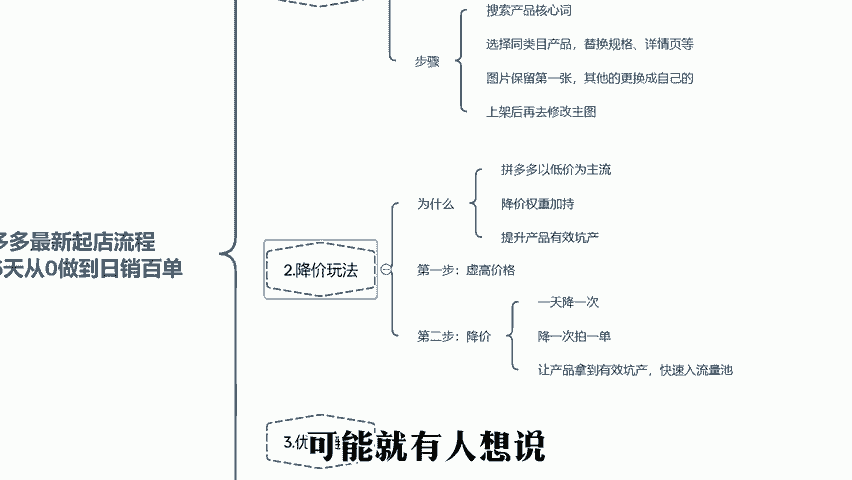
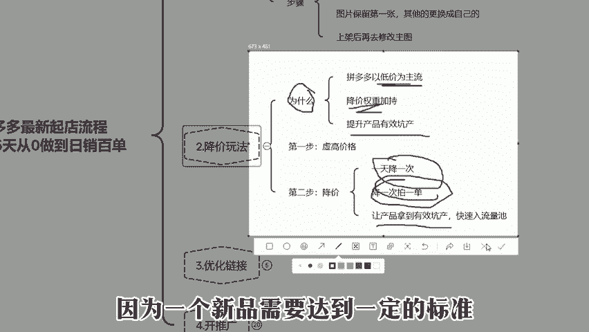
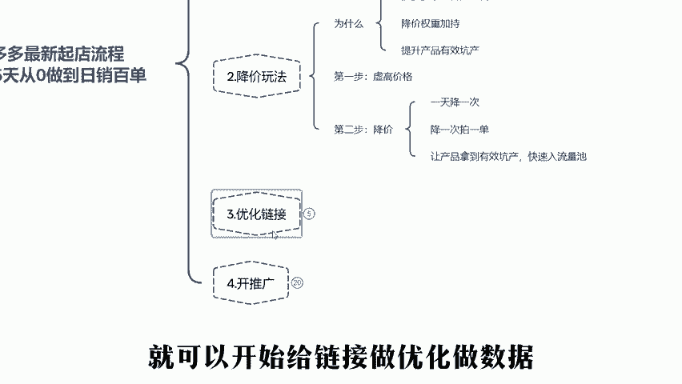
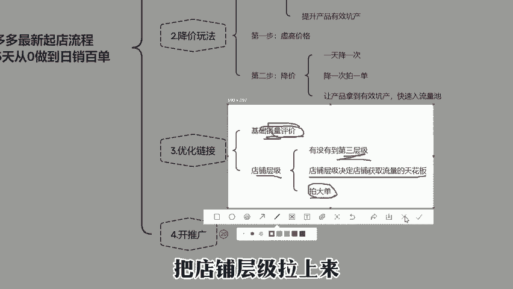
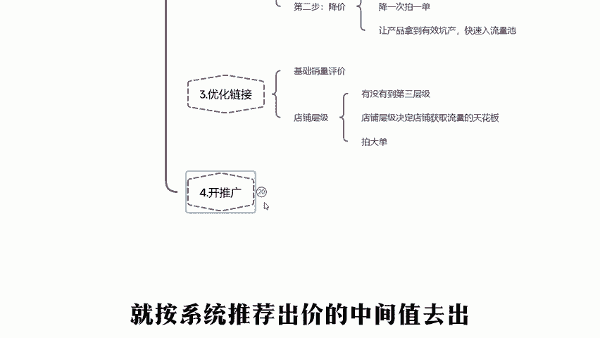

# 拼多多运营店铺，最新0基础起店流程，新手也能做到15天快速突破日销百单，提前布局稳定流量，备战双十一 - P1 - 刹那运营 - BV1vqxKeAEKf

🎼为什么很多商家做拼多多店铺没流量，没单量，但是同一个产品，别人做却能做到日销几百单呢。其实这就是因为你自己没有一个完整的运营思路。首先给大家看一个我带的学员店铺，做到儿童玩具，自己线下有货源。

跟同类型的产品相比，也没有什么价格优势。但是为什么能不靠低价把店铺做起来呢？今天这个视频我就把做一个店铺的运营思路教给大家，如果你做到位了，你的店铺是肯定能有一个明显的提升的。

要是大家看完这个视频有什么不明白的地方，可以看看评论区，我整理了拼多多全套运营资料，可以自行领取。首先就是上架产品怎么做，能够获取基础的权重呢。很多商家在上架产品的时候。

就是正常的通过发布新商品这个渠道去直接上架。其实这个地方我们有一个能让商品上架就有自然流量的运营玩法，就是通过发布机会商品这个渠道去操作我们的产品，可以让产品打上一个机会商品的标签。

我们只需要进去搜索自己产品的核心词，选择一个同类目的产品，把里面的规格。

🎼详情页什么的都换成自己的产品，图片就保留这个产品的第一张，其他的更换成你自己产品的图片，然后提交上架。上架之后，我们就可以看到机会商品的标签了。这个时候再去修改，把主图换成自己的产品就行。

当我们打上机会商品标的时候，会得到平台的一波流量扶持的。第二步，在设置商品规格的时候，把价格定的高一点。比如说可以定个2000，可能就有人想说定这么高有什么用呢？肯定没人愿意买。

🎼能有流量吗？要知道拼多多平台是一个以低价为主流的平台，它有一个降价的权重加持，假设你降的越多，那么是会获取到流量复制的。而且这个操作做好了，还能提升产品的有效坑产，比如说定价是2000上架之后。

我们拿自己的小号去拍一单。第二天降价到1500找朋友拍一单。第三天降到1000再去拍一单。第四天的时候，我们就去把链接所有的SkuU正常设置好。这样操作可以让产品拿到有效坑产，快速入流量池。

因为一个新品需要达到一定的标准，平台才会给他记录流量池。那么我们在这里有一个降价权重，一个有效坑产的权重，再加上机会商品标。这个链接的基础权重就很完善了。在上架好SkuU之后就可以开始给链接做优化。

做数据，销量做个几千到1万就行，不要一下做太多，还不会改销量的，可以找我拿文档，然后再给链接做50到100的带徒好评。这样操作好之后，你的链接就有了基本的转化能力。接着我们再去看看店铺。

🎼层级有没有到第三层级，店铺层级决定你店铺获取流量的天花板，如果还是一二层级，可以去找个朋友或者用自己的小号去派个大单，把店铺层级拉上来。上面这几个步骤做完之后，等评价出来，我们就可以去开商品推广。

第一天就按系统推荐出价的中间值去出日限额设置100看曝光量能不能跑得动，一般来说前面的权重操作没什么问题的话，这个时候都是能跑得动的。如果说直通车数据跑得动。第二天我们的出价不变，日限额递增到200。

这200能烧完就在递增到300，这个递增的过程就是提升曝光的一个操作，曝光越多代表这个链接在直通车里面的权重也越高。如果说你平时直通车200可以烧到12点，但是有一天9点就烧完了。

就代表这个链接在直通车里面的权重再上升。这个时候我们就可以去降低出价了。比如说你原本的成交出价时时，就可以降到8去跑。因为系统推荐出价普遍是偏高的，我们就没什么利润，只能等数据稳定之后再去降价。

🎼如果在你的链接还没有什么曝光，直通车还不稳定的情况下就去降出价，这个链接是很难启动起来的。所以说会出现，比如跑不动断流这一系列的问题。所以前期我们一定要给链接跑出来曝光之后再去降价。

这就是我们所说的托价的过程。在你链接有权重的情况下再去降价跑数据是不会掉的。链接跑出来之后，就看你产品的点击率和转化率，哪里不行，就对应的去优化产品，等产品权重起来之后就可以去上活动，为什么前期不上呢？

因为平台活动也是看你产品链接的权重来判定你的活动价格。比如说同一个活动，权重高的产品可能只用打个9折，新链接上这个活动可能就是给的7折，所以说上活动之前，一定要先让产品有基本的权重。

能稳定出坑产之后再去上大型的活动，在这里可以用584万人团给大家举个例子。如果你是第一次上这个活动，没做出什么销量来。那么你下次上的时候，它的压价就会压的比较狠。但是如果你第一次上这个活动打的9折。

你的销量特别。

🎼高那么下一次就可能是9。5折，还有大量的曝光推送。最后总结一下视频内容。首先我们上架显卡机会商品标。第二步做降价玩法，获取有效坑产。第三步，开直通车拉曝光，第四步上活动去获取自然流量。

要是大家还有什么不明白的地方，可以看一下评论区领取我分享的全套多多资料。

