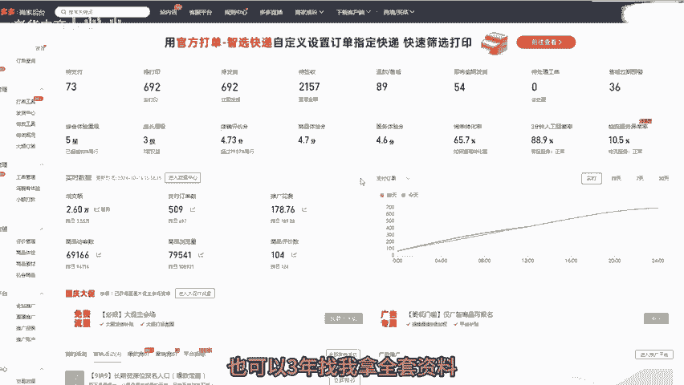
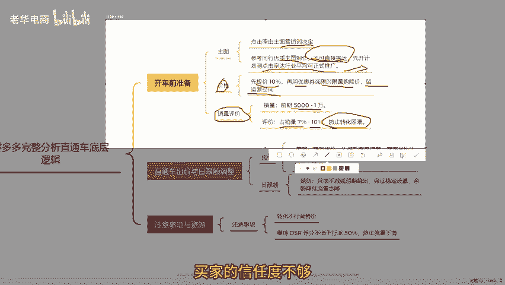
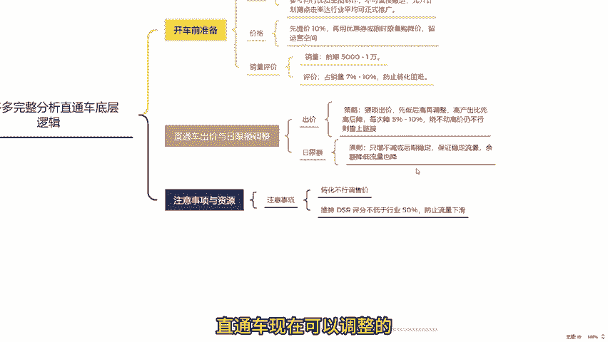
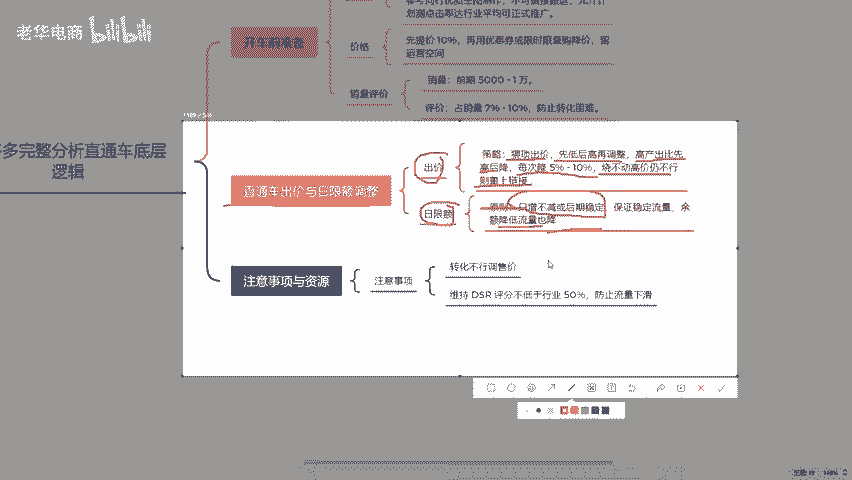

# 拼多多运营直通车95%都不知道的底层逻辑 拼多多运营 拼多多小白 拼多多新手开店 拼多多干货 拼多多商家 拼多多学习 拼多多店铺 拼多多玩法 拼多多教学 - P1 - 老华电商 - BV1gRmNYtEQx

很多拼多多的朋友啊喜欢研究直通车。其实呢直通车没有太多的技术含量。学习完我这个视频，你不用再研究其他关于直通车推广的各种玩法，我会从前期准备到如何拖价盈利，一步步教会你。如果还有不懂的地方呢。

也可以三年找我拿全套资料。首先，开车前的基础之一是主图开车前一定要注意主图的点击率。在拼多多上点击率一般是由主图上的营销词来决定的。所以我们可以参考同行优质的主图去制作。但注意不要直接搬预。

做好主图后呢，可以先随便开一个计划，看一下主图点击情况如何。如果能达到行业平均水平，我们就可以开启正式推广。

其次是价格，价格要给推广留下利润空间。第一步，把预期售价提高10%左右。第二步，通过优惠券或者限时限量购把价格降下来。最后我们可以通过调整优惠力度给直通车留下运营空间，或者是销量评价，销量方面。

前期建议5000到1万就差不多了。以前我也做过销量评价的教程，可以来找一下看看。评价做到销量的70%到10%。因为后续如果开车有人点击你的直通车进入你的产品页面。但你的产品销量和评价都很少。就会导致。

买家的信任度不够，从而转化困难，这样花了推广资金还没有效果。直通车现在可以调整的只有出价和日限额，像极速起量和全局优先起量，都是让你提高出价。如果你玩不好，可以直接不开，就研究出价和日限额就可以了。

那出价怎么出呢？其实很简单，我建议大家猥琐出价。什么叫猥琐出价呢？就是先出价，如果烧不动，再提高价格。比如图产比高，可以先高出价，如果烧不动再降低，每次降低呢5%到10%逐步提高，直到能烧动为止。

如果你出价已经很高，还是烧不动。比如说你的利润只有10块，你已经出价到了20还烧不动，我建议你重新上个链接。如果20才能烧动。而你利润就10块，到后期你很难优化到盈利，前期就按照我说的低出价。

然后逐步提高，等直通车曝光越来越大，出单稳定，并且烧出来的投闪比呢。接近你的出价的时候，这个时候再考虑脱价，也就是前期低出逐步提高，后期再降低，怎么脱价呢？后面为表格。然后是日线额，它只能逐步增加。

最好不要降低。什么意思呢？如果你要获得稳定的流量，就要源源不断的给拼多多增加余额。如果降低了余额，流量就会降低，实则呢日限额只增加不降低，或者到后期让它稳定也是可以的。稳定下来。

我们按照上面的出价思路去调整出价。

就能出现日限额慢慢可以跑完全天，并且流量一直在提升的状况。最后看完还有不懂的也可以提问或者评论三个6，领取一份。我整理了多多店铺综合运营包。好了，咱们下期再见。

