# 拼多多运营，拼多多新手开店必学，亲测有效的六种防比价玩法，如何从同行手里轻松拿走流量 - P1 - 拼多多枫叶 - BV1L325YRE3e

最近有很多的拼多多商家朋友经常会碰到直通车跑着跑着就断流量了，以及一些小白商家朋友们一上活动就被系统提示优化出价，不然就给你限流。本期视频的话给大家聊一聊拼多多的比较机制原理，以及被比较之后。

我们到底该如何去正确的处理，同时我还整理了拼多多全套的运营笔记。包括选品选款基础内功付费直通车玩法，平台营销活动玩法流量拉升起盘玩法以及更多的高阶爆款的打造玩法等实操的案例文档教程放在了评论区。

希望对我们的小伙伴们有所帮助进入正题。这里大家要明白，再去做仿比价之前，首先要明白比价机制原理到底是什么。它是在赛道内去进行比较的。比如说你的链接在A赛道和ABCD进行比，比不过他们。

所以说这个时候你要通过洗链接或者说仿比价的操作，让系统帮你去放到B赛道去跟da夫进行比较。你就有可能会比价不失败。那系统是怎么样去。

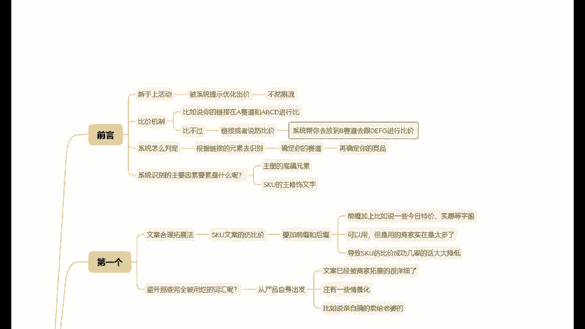

判定的呢。首先它会根据你链接的元素去识别，然后确定你的赛道，再进一步才会确定你的一个竞品。所以说这个时候你要解决识别问题，你就能够解决比价失败的问题。系统识别的主要因素要素是什么呢？

第一个就是主图的底稿元素。第二个是SKU的主修饰文字。知道了原理之后，我们就可以去通过原理做一些比较的措施和玩法。第一个方法，文案合理拓展法。一提到SkuU文万的防比价。那很多商家都知道要加前缀和后缀。

很多商家还是SKU的前缀，加上比如说一些今日特价实惠等字眼，其实这些都是没错的，问题在于这么做的商家实在是太多了，基本上每一个商家都知道要加上这些字，导致SKU防比价成功几率的话，大大降低。

那么我们一定要懂得创新，想要真正赚到钱，思维是一定不能够被固化的。如何说在防比价时，离开那些完全被用烂的词汇呢？就是从你的。😡。

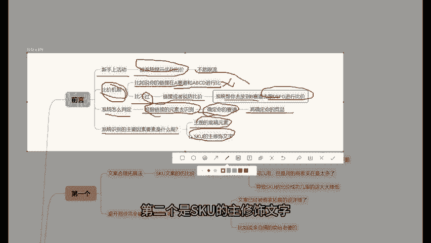

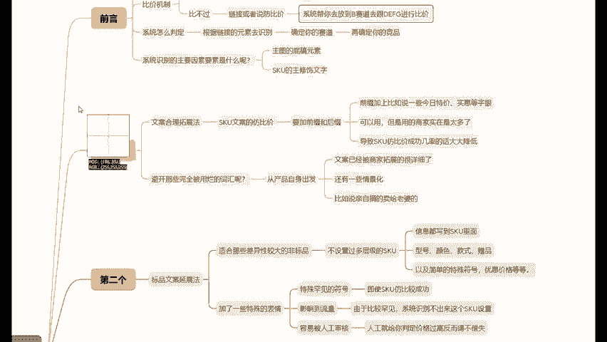

产品自身出发，以卖水果为例，大家可以看一下这张图有多少颗是什么样的品质。再围绕水果在SKU后面写上一小句话，这种就不用担心会被比价。因为这个文案已经被商家拓展的很详细了，甚至还有一些情景化。

比如说亲自摘的卖给老婆的。第二个方法，标品文案延展法上面给大家分享的是第一种方法，通常适合那些差异性较大的非标品，假如说你是一个电饭锅，一把剪刀，这个时候就不能用第一个方法去做SKU防比价了。

有一些标品类的商家，他可能也习惯明明已经到网上说的这些SKU文案里面加了一些特殊的表情，例如一些特殊罕见的符号之类的，还是没有用过于罕见的特殊符号，其实SKU防比较成功的，但是反而有可能影响到流量的。

而且由于比较罕见，系统识别不出来这个SKU设置，很容易找到人工审核那里。

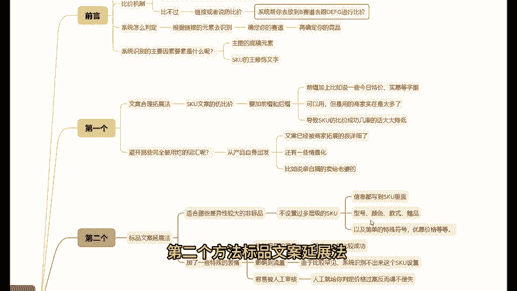

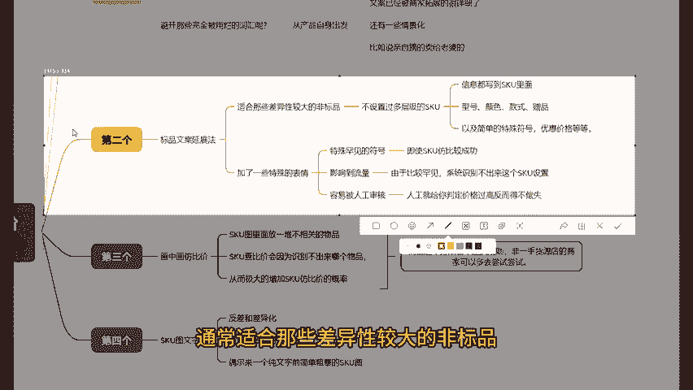

到时候这个人工就给你判定价格过高，反而得不偿失。标屏的SKU防比价操作应该是这样来操作的。我设置过多层级的SkuU把能级的信息都写到SkuU里面。

其中呢包括但不限于型号颜色款式赠品以及简单的特殊符号优惠价格等等。第三个方法，画中画仿比价之前说过系统除了通过SKU文案去识别之外，图片的底稿元素也是要去做仿比价的。

最近比较流行好用的方法就是SKU图里面放一堆不相关的物品，SKU查比价会因为识别不出来哪个物品，从而极大的增加SKU防比价的概率，类似下面的这张SkuU图系统识别出来显示有3个物品。

一旦系统在审核SkuU防比价的时候，识别出来的是镜子里面的手机，或者说是另一个镜子那么它就是成功了。而且这个方法也不违反规则，非易手货源店的商家可以多去尝试尝试。第四个方法，SKU图文字化。

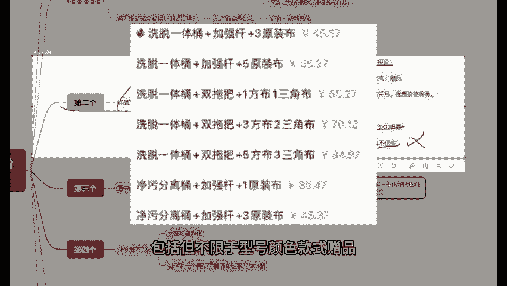

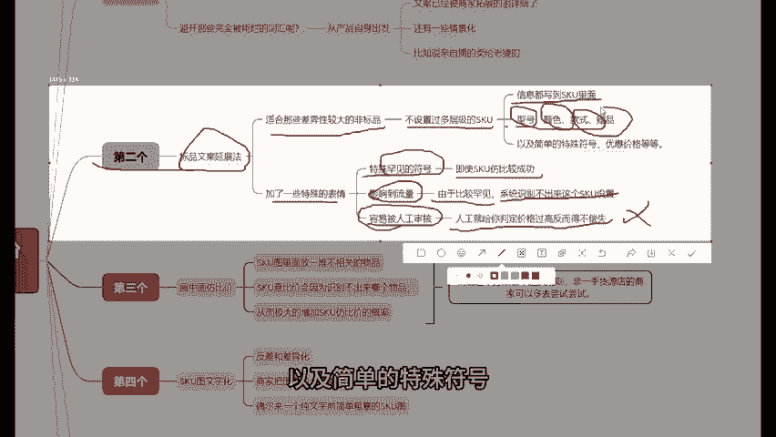

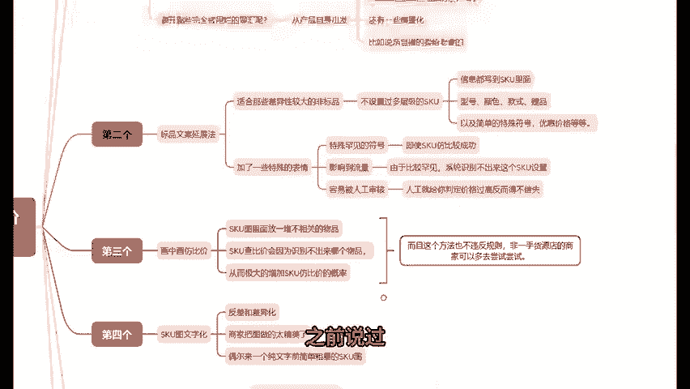

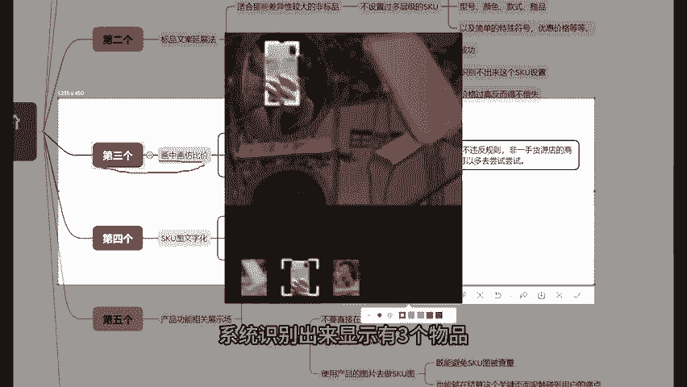

就是除了非常完美的仿比价之外的话，这个方法主打的就是一个反差和差异化。现在用的话效果是很不错的。毕竟现在的商家把图做的太精美了。偶尔来一个纯文字前简单粗暴的SkuU图。

这个产品和店铺就会给人一种没有什么心眼的感觉。第五个方法就是产品功能相关展示场除了很直观的在SkuU里面能够展示产品之外，还有一个比较少的人做的方法，那就是不要直接在产品里面展示，而是通过功能功效。

使用产品的图片去做SkuU图，那这样子的话，既能避免SkuU图被查中，也能够在结算这个关键页面呢触碰到用户的痛点，从而增加转化率。第六个方法就是直接进行降价。你链接被比价失败了。降价不就不比价失败。

那这里的话注意是否有用优惠券，它是按照券钱价格进行比价的，你实际的价格再低也没有用。所以说实际上如果说真的要降价，就用长期资源位大促活动。😡。

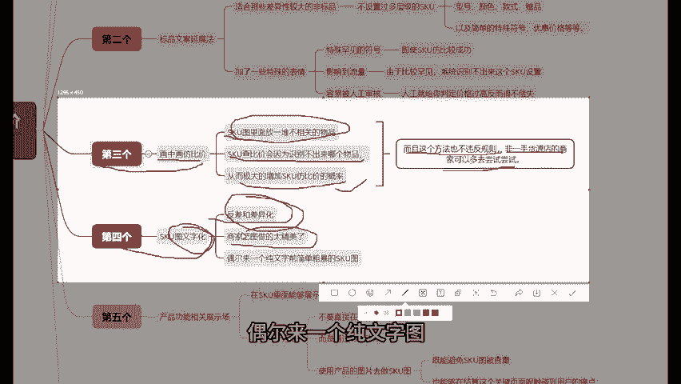

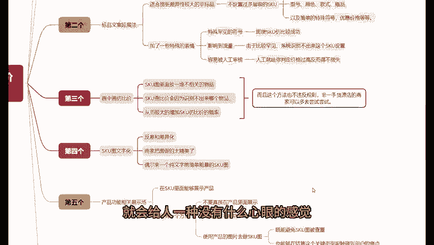

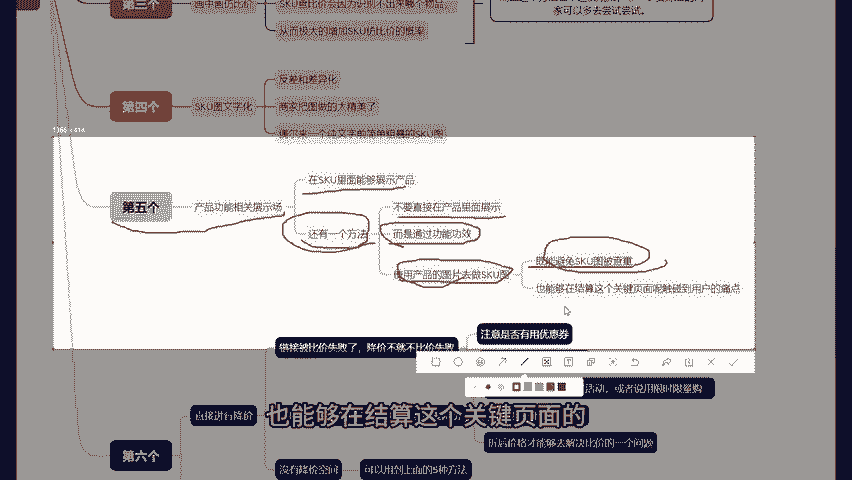

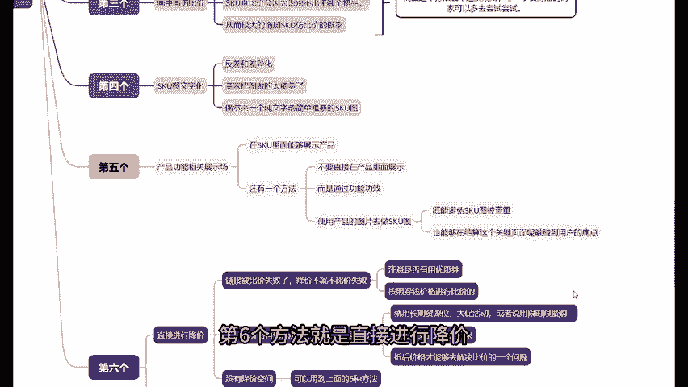

或者说用限时限量购把它真正意义的给它折下来，折后价格才能够去解决比价的一个问题。那如果说你没有降价空间，你就可以用到上面的5种方法。因为比价失败的核心就是先有识别后有赛道。而我们只要能够把识别改掉。

就能够真正意义上的去除，把链接的防比价以上6个1字或比较好用的仿比较的方法。如果说你看完视频还不知道怎么操作。我也可以提供免费的一些运营的建议指导以及店铺诊断同时呢我还整理了拼多多全套的运营笔记。

包括选品选款基础类功、付费直通车的玩法、平台营销活动玩法、流量拉升起盘玩法以及更多的高阶爆款打造玩法等时超案例文档教程呢，放在了评论区啊，希望对咱们的小伙伴们有所帮助。😡。

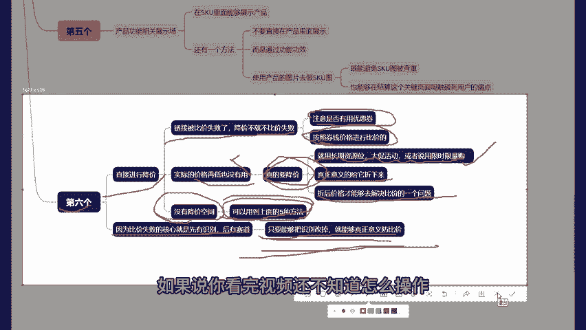

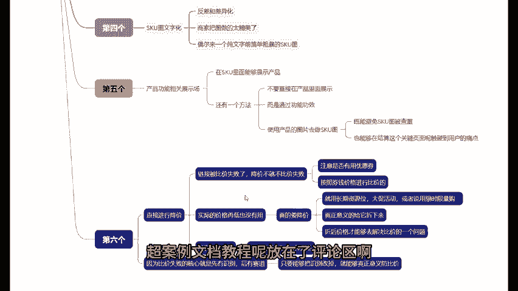

